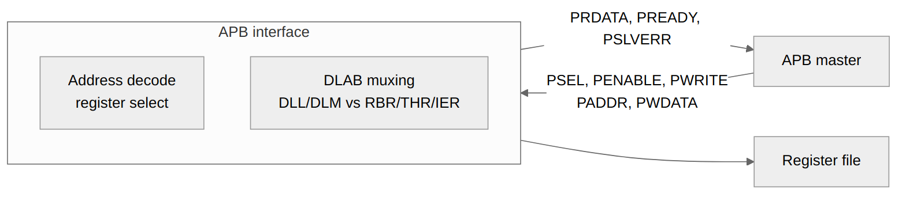

<!-- RTL Design Sherpa Documentation Header -->
<table>
<tr>
<td width="80">
  
</td>
<td>
  <strong>RTL Design Sherpa</strong> · <em>Learning Hardware Design Through Practice</em> 
  
    <a href="https://github.com/sean-galloway/RTLDesignSherpa">GitHub</a> ·
    <a href="https://github.com/sean-galloway/RTLDesignSherpa/blob/main/docs/DOCUMENTATION_INDEX.md">Documentation Index</a> ·
    <a href="https://github.com/sean-galloway/RTLDesignSherpa/blob/main/LICENSE">MIT License</a>
  
</td>
</tr>
</table>

---

<!-- End Header -->

# APB UART 16550 — APB Interface Block

## Overview

The APB interface is the front door: it sits between the system APB bus and the UART register file, turning APB phases into register reads and writes. Everything software does to this block comes through here.

## Ports

### APB Slave Interface

| Signal | Width | Direction | Description |
|--------|-------|-----------|-------------|
| s_apb_PSEL | 1 | Input | Slave select |
| s_apb_PENABLE | 1 | Input | Enable phase |
| s_apb_PWRITE | 1 | Input | Write operation |
| s_apb_PADDR | 12 | Input | Address bus |
| s_apb_PWDATA | 32 | Input | Write data |
| s_apb_PSTRB | 4 | Input | Byte strobes |
| s_apb_PPROT | 3 | Input | Protection attributes (accepted, unused) |
| s_apb_PRDATA | 32 | Output | Read data |
| s_apb_PREADY | 1 | Output | Ready response |
| s_apb_PSLVERR | 1 | Output | Error response |

## Functional Description

### Figure 2.1: APB Interface Block

### Address Decoding

#### UART Register Addresses

Flat, DLAB-independent decode - each register has a unique offset. Only `paddr[5:0]` is decoded.

| Offset | Read | Write |
|--------|------|-------|
| 0x00 | RBR | THR |
| 0x04 | IER | IER |
| 0x08 | IIR | - |
| 0x0C | FCR | FCR |
| 0x10 | LCR | LCR |
| 0x14 | MCR | MCR |
| 0x18 | LSR | LSR (clear on read) |
| 0x1C | MSR | MSR (clear on read) |
| 0x20 | SCR | SCR |
| 0x24 | DLL | DLL |
| 0x28 | DLM | DLM |

#### DLAB (Divisor Latch Access Bit)

LCR[7] is a stored bit only. It plays **no** role in address decoding - DLL and DLM are always accessible at their own offsets 0x24 and 0x28. The classic 16550 DLAB remapping of addresses 0x00/0x04 is **not** implemented.

### Operation

#### Read Transaction
1. Master asserts `psel` and `paddr`
2. Master asserts `penable` on next cycle
3. Slave returns `prdata` with `pready`
4. Only RBR has a read side effect (the read pops the RX FIFO); IIR reads are side-effect-free

#### Write Transaction
1. Master asserts `psel`, `paddr`, `pwdata`, `pwrite`
2. Master asserts `penable` on next cycle
3. Slave samples data with `pready`
4. THR write pushes the TX FIFO; FCR writes take effect (FCR is also readable)

## Design Notes

### Implementation Notes

- PREADY-gated: the apb4_slave bridge FSM adds a few wait states per
  access (no stalls originate in the register block itself)
- 32-bit data width with 8-bit register access
- Byte strobes select which byte to access
- LSR/MSR are read-mostly: writes perform write-1-to-clear on the error/delta bits (not ignored)

---

## Navigation

**Next:** [02_register_file.md](02_register_file.md) - Register File
