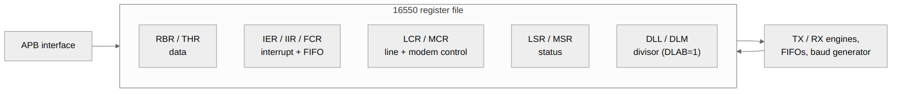

<!-- RTL Design Sherpa Documentation Header -->
<table>
<tr>
<td width="80">
  
</td>
<td>
  <strong>RTL Design Sherpa</strong> · <em>Learning Hardware Design Through Practice</em> 
  
    <a href="https://github.com/sean-galloway/RTLDesignSherpa">GitHub</a> ·
    <a href="https://github.com/sean-galloway/RTLDesignSherpa/blob/main/docs/DOCUMENTATION_INDEX.md">Documentation Index</a> ·
    <a href="https://github.com/sean-galloway/RTLDesignSherpa/blob/main/LICENSE">MIT License</a>
  
</td>
</tr>
</table>

---

<!-- End Header -->

# APB UART 16550 — Register File Block

## Overview

The register file implements the standard 16550 register set, generated with PeakRDL for APB compatibility. All registers occupy unique offsets; the DLAB bit does not remap any address — if you've written 16550 drivers before, unlearn the DLAB dance at the door.

## Ports

The register block's connection to the rest of the UART core is the PeakRDL hardware interface (HWIF). These are internal signals, not module pins, but they define what the register file exposes to the TX/RX engines and what it consumes.

### Software-to-Hardware (reg2hw)

| Signal | Description |
|--------|-------------|
| thr_data | Data to transmit |
| thr_we | THR write enable |
| ier | Interrupt enables; each of the four sources is gated by its own bit |
| fcr | FIFO control |
| lcr | Line control |
| mcr | Modem control |
| dll | Divisor LSB |
| dlm | Divisor MSB |

### Hardware-to-Software (hw2reg)

| Signal | Description |
|--------|-------------|
| rbr_data | Received data |
| iir | Interrupt status |
| lsr | Line status |
| msr | Modem status |

## Functional Description

### Figure 2.2: Register File Block

### Register Organization

#### Address 0x00 (RBR/THR)

| Access | Register |
|--------|----------|
| Read | RBR - Receiver Buffer (received byte in bits [7:0]) |
| Write | THR - Transmitter Holding |

#### Address 0x04 (IER)

Read/Write - Interrupt Enable. Each bit gates its own interrupt source.

#### Address 0x08 (IIR)

Read-only - Interrupt Identification. Reading it clears the THR-empty interrupt when THR empty is the source it reported.

#### Addresses 0x0C-0x28

Fixed registers, not affected by DLAB:
- 0x0C: FCR - FIFO Control (R/W, readable)
- 0x10: LCR - Line Control
- 0x14: MCR - Modem Control
- 0x18: LSR - Line Status (RO, clear on read error bits)
- 0x1C: MSR - Modem Status (RO, clear on read delta bits)
- 0x20: SCR - Scratch
- 0x24: DLL - Divisor Latch LSB
- 0x28: DLM - Divisor Latch MSB

### Register Access Types

| Type | Description |
|------|-------------|
| RO | Read-only, hardware updates |
| WO | Write-only |
| RW | Read-write |
| Read-clear | Cleared by reading the register (LSR error bits, MSR delta bits) |

## Design Notes

### Implementation Notes

- DLAB is a stored bit only; it does not remap any address
- THR write pushes to TX FIFO
- RBR read pops from RX FIFO (received byte returned in bits [7:0])
- Reading IIR clears the THR-empty interrupt when that is the source it reported

---

## Navigation

**Next:** [03_tx_engine.md](03_tx_engine.md) - TX Engine
