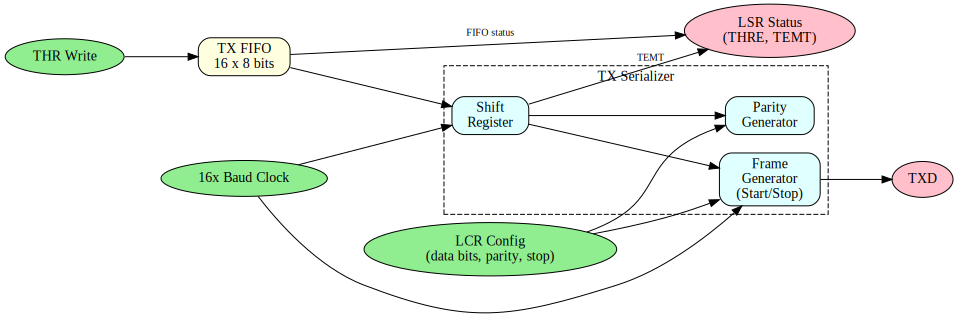
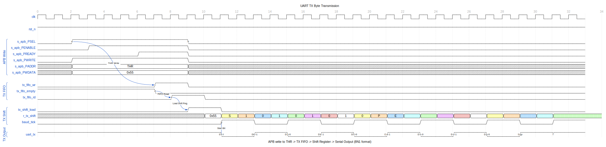
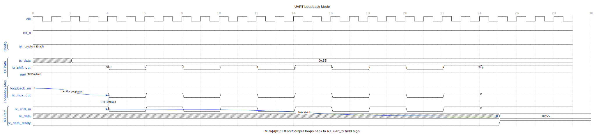

<!-- RTL Design Sherpa Documentation Header -->
<table>
<tr>
<td width="80">
  <a href="https://github.com/sean-galloway/RTLDesignSherpa">
    
  </a>
</td>
<td>
  <strong>RTL Design Sherpa</strong> · <em>Learning Hardware Design Through Practice</em><br>
  <sub>
    <a href="https://github.com/sean-galloway/RTLDesignSherpa">GitHub</a> ·
    <a href="https://github.com/sean-galloway/RTLDesignSherpa/blob/main/docs/DOCUMENTATION_INDEX.md">Documentation Index</a> ·
    <a href="https://github.com/sean-galloway/RTLDesignSherpa/blob/main/LICENSE">MIT License</a>
  </sub>
</td>
</tr>
</table>

---

<!-- End Header -->

# APB UART 16550 - TX Engine Block

## Overview

The TX engine handles transmit data buffering, serialization, and TXD signal generation.

## Block Diagram



## Data Path

```
THR Write --> TX FIFO --> TX Shift Register --> TXD
                |
                v
            LSR Status (THRE, TEMT)
```

## TX FIFO

### Characteristics

| Parameter | Value |
|-----------|-------|
| Depth | 16 bytes |
| Width | 8 bits |
| Write | THR register write |
| Read | TX shift register ready |

### Status Signals

- **THRE (THR Empty)**: TX FIFO has space
- **TEMT (Transmitter Empty)**: TX FIFO and shift register both empty

## TX Serializer

### Frame Format

```
   Start  Data Bits       Parity  Stop
   |      (5-8 bits)      (opt)   (1-2)
   v      v               v       v
   _______________________________
TXD  |0| D0 D1 D2 D3 D4 [D5 D6 D7] [P] |1|1|
     |<-------- Bit Time --------->|
```

### Configuration (from LCR)

| LCR Bits | Setting |
|----------|---------|
| [1:0] | Data bits: 00=5, 01=6, 10=7, 11=8 |
| [2] | Stop bits: 0=1, 1=1.5/2 |
| [3] | Parity enable |
| [4] | Parity type: 0=odd, 1=even |
| [5] | Stick parity |
| [6] | Break control |

## State Machine

```
    +-------+
    | IDLE  |<----------------+
    +---+---+                 |
        |                     |
   FIFO not empty             |
        |                     |
        v                     |
    +-------+                 |
    | START |--- 1 bit -------+
    +---+---+                 |
        |                     |
        v                     |
    +-------+                 |
    | DATA  |--- 5-8 bits ----+
    +---+---+                 |
        |                     |
        v                     |
    +-------+                 |
    | PARITY|--- 0/1 bit -----+ (if enabled)
    +---+---+                 |
        |                     |
        v                     |
    +-------+                 |
    | STOP  |--- 1-2 bits ----+
    +-------+
```

## Timing

### TX Byte Transmission

The following diagram shows the complete TX path from APB write to serial output.



The transmission sequence:
1. APB write to THR (Transmit Holding Register)
2. Data pushed to TX FIFO (`tx_fifo_wr`)
3. When shift register ready, data loaded from FIFO (`tx_fifo_rd`, `tx_shift_load`)
4. Baud tick shifts out bits: Start (0), Data (LSB first), Stop (1)
5. TXD changes at each baud tick

### Baud Rate Generation

The baud generator divides the system clock to produce bit timing.


Key timing relationships:
- `cfg_divisor` sets the baud rate (clock_freq / (16 * baud_rate))
- `baud_tick` pulses once per bit period for TX
- 16x oversampling counter provides mid-bit sampling for RX

### Loopback Mode

MCR[4] enables internal loopback for diagnostics.



In loopback mode:
- TX shift register output routes to RX input
- External TXD held high (idle)
- Allows self-test without external connection

### Bit Timing

Each bit takes 16 clocks of 16x baud clock:
- Sample point at clock 8 (mid-bit)
- Transition at clock 0

### Frame Timing Example (8N1 at 115200)

| Component | Bits | Time |
|-----------|------|------|
| Start | 1 | 8.68 us |
| Data | 8 | 69.44 us |
| Stop | 1 | 8.68 us |
| **Total** | 10 | 86.8 us |

## Flow Control

### Hardware (CTS)

When MCR.AFE=1:
- CTS_N low: Transmission allowed
- CTS_N high: Pause after current character

### Software (THRE interrupt)

- THRE interrupt when TX FIFO not full
- Software writes more data

## Break Generation

When LCR.BC=1:
- TXD forced low
- Maintained until BC cleared
- Used for attention/reset signaling

---

**Next:** [04_rx_engine.md](04_rx_engine.md) - RX Engine
