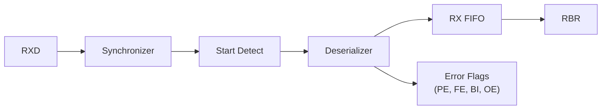
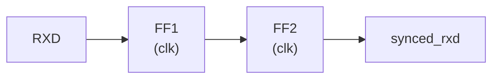
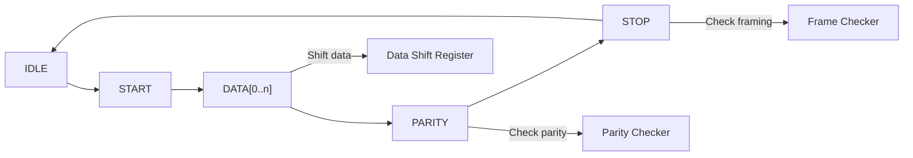

<!-- RTL Design Sherpa Documentation Header -->
<table>
<tr>
<td width="80">
  
</td>
<td>
  <strong>RTL Design Sherpa</strong> · <em>Learning Hardware Design Through Practice</em> 
  
    <a href="https://github.com/sean-galloway/RTLDesignSherpa">GitHub</a> ·
    <a href="https://github.com/sean-galloway/RTLDesignSherpa/blob/main/docs/DOCUMENTATION_INDEX.md">Documentation Index</a> ·
    <a href="https://github.com/sean-galloway/RTLDesignSherpa/blob/main/LICENSE">MIT License</a>
  
</td>
</tr>
</table>

---

<!-- End Header -->

# APB UART 16550 - RX Engine Block

## Overview

The RX engine handles input synchronization, start bit detection, deserialization, error detection, and receive FIFO buffering.

## Block Diagram

### Figure 2.4: RX Engine Block

## Data Path

## Input Synchronizer

### Metastability Prevention

- Two-stage synchronizer
- Prevents metastability from asynchronous input
- Adds 2 clock cycles latency

### Waveform 2.4: RX Byte Reception

The following diagram shows the complete RX path from serial input to FIFO.

The reception sequence:
1. Start bit detected (falling edge on `rx_sync`)
2. 16x oversampling locates bit center
3. Data sampled at mid-bit on each baud tick
4. After stop bit, byte written to RX FIFO
5. `rx_data_ready` signals data available

## Start Bit Detection

### Detection Algorithm

1. Monitor for falling edge (1 -> 0)
2. Wait 8 clocks (half bit time)
3. Sample mid-bit
4. If still 0, valid start bit
5. If 1, false start, return to idle

### Glitch Rejection

Short pulses (< 4 clocks) rejected as noise.

## RX Deserializer

### Sampling

- Sample each bit at mid-point (clock 8 of 16)
- 16x oversampling provides noise immunity
- Majority voting optional for higher reliability

### Frame Reception

## RX FIFO

### Characteristics

| Parameter | Value |
|-----------|-------|
| Depth | 16 entries |
| Width | 11 bits (8 data + 3 error) |
| Write | Deserializer complete |
| Read | RBR register read |

### FIFO Entry Format

| Bits | Content |
|------|---------|
| [7:0] | Received data |
| [8] | Parity Error (PE) |
| [9] | Framing Error (FE) |
| [10] | Break Indicator (BI) |

### Trigger Levels (FCR)

| FCR[7:6] | Trigger Level |
|----------|---------------|
| 00 | 1 byte |
| 01 | 4 bytes |
| 10 | 8 bytes |
| 11 | 14 bytes |

## Error Detection

### Parity Error (PE)

- Calculated parity vs received parity
- Set in LSR when error character read from FIFO

### Framing Error (FE)

- Stop bit not at expected logic 1
- Indicates baud rate mismatch or noise

### Break Indicator (BI)

- RXD low for entire character time
- Start + data + parity + stop all zero
- Used for attention signaling

### Overrun Error (OE)

- RX FIFO full when new character arrives
- Previous data preserved, new data lost
- Set immediately in LSR (not FIFO-based)

## Timeout Detection

### Character Timeout

When FCR.FE=1 (FIFOs enabled):
- Timer starts when FIFO not empty
- Resets on each new character or RBR read
- Timeout = 4 character times
- Generates interrupt to flush partial data

---

**Next:** [05_baud_generator.md](05_baud_generator.md) - Baud Generator
