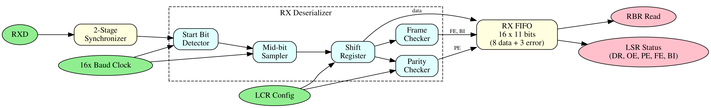
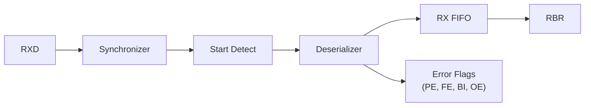
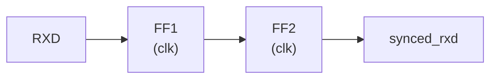
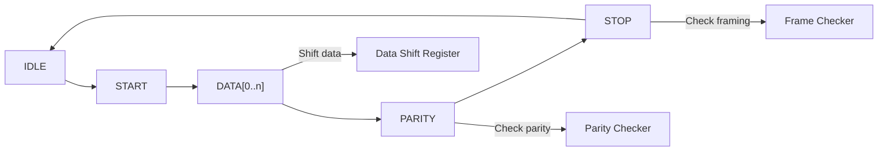
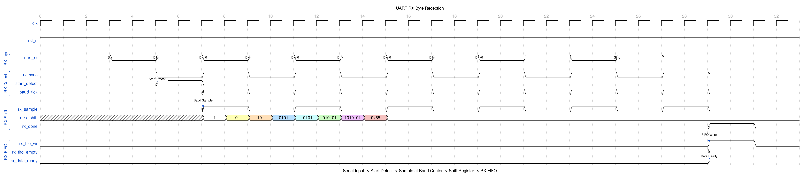

<!-- RTL Design Sherpa Documentation Header -->
<table>
<tr>
<td width="80">
  
</td>
<td>
  <strong>RTL Design Sherpa</strong> · <em>Learning Hardware Design Through Practice</em> 
  
    <a href="https://github.com/sean-galloway/RTLDesignSherpa">GitHub</a> ·
    <a href="https://github.com/sean-galloway/RTLDesignSherpa/blob/main/docs/DOCUMENTATION_INDEX.md">Documentation Index</a> ·
    <a href="https://github.com/sean-galloway/RTLDesignSherpa/blob/main/LICENSE">MIT License</a>
  
</td>
</tr>
</table>

---

<!-- End Header -->

# APB UART 16550 — RX Engine Block

## Overview

The RX engine is where the asynchronous outside world meets your clean synchronous design: input synchronization, start bit detection, deserialization, error detection, and receive FIFO buffering all live here. It's also where the ugliest known RTL deviation lives (issue #60), so read the error-detection section before you trust LSR.

## Functional Description

### Figure 2.4: RX Engine Block

### Data Path

```mermaid
flowchart LR
    A["RXD"] --> B["Synchronizer"]
    B --> C["Start Detect"]
    C --> D["Deserializer"]
    D --> E["RX FIFO"]
    E --> F["RBR"]
    D --> G["Error Flags<br/>(PE, FE, BI, OE)"]
```

### Input Synchronizer

#### Metastability Prevention

```mermaid
flowchart LR
    A["RXD"] --> B["FF1<br/>(clk)"]
    B --> C["FF2<br/>(clk)"]
    C --> D["synced_rxd"]
```

- Two-stage synchronizer
- Prevents metastability from asynchronous input
- Adds 2 clock cycles latency

### Start Bit Detection

#### Detection Algorithm

1. Monitor for falling edge (1 -> 0)
2. Wait 8 clocks (half bit time)
3. Sample mid-bit
4. If still 0, valid start bit
5. If 1, false start, return to idle

#### Start-Bit Validation

The start bit is revalidated at the mid-bit sample (clock 8 of 16); if it is no
longer 0, the start is treated as false and the receiver returns to idle. There
is no dedicated "reject pulses < 4 clocks" glitch filter.

### RX Deserializer

#### Sampling

- Sample each bit at mid-point (clock 8 of 16)
- Single mid-bit sample per bit (no majority voting is implemented)

#### Frame Reception

```mermaid
flowchart LR
    A["IDLE"] --> B["START"]
    B --> C["DATA[0..n]"]
    C --> D["PARITY"]
    D --> E["STOP"]
    E --> A
    C -->|"Shift data"| F["Data Shift Register"]
    D -->|"Check parity"| G["Parity Checker"]
    E -->|"Check framing"| H["Frame Checker"]
```

### RX FIFO

#### Characteristics

| Parameter | Value |
|-----------|-------|
| Depth | 16 entries |
| Width | 11 bits (8 data + 3 error) |
| Write | Deserializer complete |
| Read | RBR register read |

#### FIFO Entry Format

| Bits | Content |
|------|---------|
| [7:0] | Received data |
| [8] | Parity Error (PE) |
| [9] | Framing Error (FE) |
| [10] | Break Indicator (BI) |

#### Trigger Levels (FCR)

| FCR[7:6] | Trigger Level |
|----------|---------------|
| 00 | 1 byte |
| 01 | 4 bytes |
| 10 | 8 bytes |
| 11 | 14 bytes |

### Error Detection

#### Parity Error (PE)

- Calculated parity vs received parity
- Set in LSR when the errored character is **received** (written into the RX
  FIFO), not when it is later read out

#### Framing Error (FE)

- Stop bit not at expected logic 1
- Indicates baud rate mismatch or noise

#### Break Indicator (BI)

- RXD low for entire character time
- Start + data + parity + stop all zero
- Used for attention signaling

FE and BI are computed as combinational nets sampled at the stop bit, so
they are stable when the FIFO entry is written and when the sticky flags
are set. Both reach LSR and both tag the FIFO entry in bits [10:9], and
the line-status interrupt fires from any of overrun, parity, framing or
break. (Until the #60 fix they could never assert: the computed values
were overwritten by same-cycle cleanup assignments and the FIFO write
sampled the pre-edge, already-cleared flags.)

Received data is right-justified and zero-filled at every word length,
so a 5-bit character reads in bits [4:0] with [7:5] clear, matching what
the transmitter sends.

#### Overrun Error (OE)

- RX FIFO full when new character arrives
- Previous data preserved, new data lost
- Set immediately in LSR (not FIFO-based)

### Timeout Detection

#### Character Timeout

A counter in the baud-tick domain runs whenever the RX FIFO is non-empty and
restarts on any activity: a character arriving, a character read out, or a
FIFO reset. Four character times without any of those sets the timeout, IIR
reads 0x0C, and the flag clears on the next activity. FIFO mode only.

## Waveforms

### Waveform 2.4: RX Byte Reception

The following diagram shows the complete RX path from serial input to FIFO.

The reception sequence:
1. Start bit detected (falling edge on `rx_sync`)
2. 16x oversampling locates bit center
3. Data sampled at mid-bit on each baud tick
4. After stop bit, byte written to RX FIFO
5. `rx_data_ready` signals data available

---

## Navigation

**Next:** [05_baud_generator.md](05_baud_generator.md) - Baud Generator
