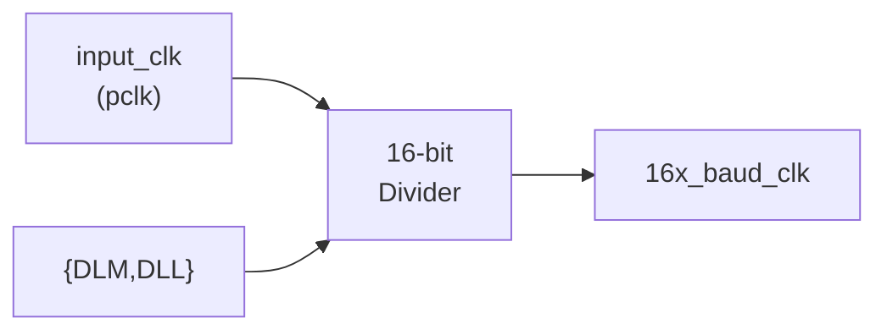

<!-- RTL Design Sherpa Documentation Header -->
<table>
<tr>
<td width="80">
  <a href="https://github.com/sean-galloway/RTLDesignSherpa">
    
  </a>
</td>
<td>
  <strong>RTL Design Sherpa</strong> · <em>Learning Hardware Design Through Practice</em><br>
  <sub>
    <a href="https://github.com/sean-galloway/RTLDesignSherpa">GitHub</a> ·
    <a href="https://github.com/sean-galloway/RTLDesignSherpa/blob/main/docs/DOCUMENTATION_INDEX.md">Documentation Index</a> ·
    <a href="https://github.com/sean-galloway/RTLDesignSherpa/blob/main/LICENSE">MIT License</a>
  </sub>
</td>
</tr>
</table>

---

<!-- End Header -->

# APB UART 16550 - Baud Generator Block

## Overview

The baud generator creates the 16x oversampled clock used by TX and RX engines from a programmable divisor.

## Block Diagram

### Figure 2.5: Baud Generator Block



## Operation

### Clock Division



### Formula

```
16x_baud_clk = input_clk / divisor

where divisor = (DLM << 8) | DLL

Actual baud rate = 16x_baud_clk / 16 = input_clk / (16 * divisor)
```

## Divisor Calculation

### Standard Formula

```
Divisor = Input_Clock / (16 * Desired_Baud_Rate)
```

### Rounding

For best accuracy, round to nearest integer:
```
Divisor = (Input_Clock + 8 * Baud_Rate) / (16 * Baud_Rate)
```

### Example Tables

**48 MHz Input Clock:**

| Baud Rate | Divisor | DLM | DLL | Actual Rate | Error |
|-----------|---------|-----|-----|-------------|-------|
| 9600 | 312 | 0x01 | 0x38 | 9615.4 | +0.16% |
| 19200 | 156 | 0x00 | 0x9C | 19230.8 | +0.16% |
| 38400 | 78 | 0x00 | 0x4E | 38461.5 | +0.16% |
| 57600 | 52 | 0x00 | 0x34 | 57692.3 | +0.16% |
| 115200 | 26 | 0x00 | 0x1A | 115384.6 | +0.16% |

**50 MHz Input Clock:**

| Baud Rate | Divisor | DLM | DLL | Actual Rate | Error |
|-----------|---------|-----|-----|-------------|-------|
| 9600 | 326 | 0x01 | 0x46 | 9585.9 | -0.15% |
| 19200 | 163 | 0x00 | 0xA3 | 19171.8 | -0.15% |
| 38400 | 81 | 0x00 | 0x51 | 38580.2 | +0.47% |
| 57600 | 54 | 0x00 | 0x36 | 57870.4 | +0.47% |
| 115200 | 27 | 0x00 | 0x1B | 115740.7 | +0.47% |

## Divisor Latch Registers

### DLL (Divisor Latch LSB)

| Address | 0x24 |
|---------|------|
| Bits | [7:0] |
| Access | RW |
| Reset | 0x01 |

### DLM (Divisor Latch MSB)

| Address | 0x28 |
|---------|------|
| Bits | [7:0] |
| Access | RW |
| Reset | 0x00 |

## Programming Sequence

DLL/DLM have dedicated offsets (0x24/0x28); the DLAB bit does not remap any
address, so no DLAB toggle is required.

1. Write DLL at 0x24 (divisor low byte)
2. Write DLM at 0x28 (divisor high byte)

```c
void set_baud_rate(uint16_t divisor) {
    DLL = divisor & 0xFF;     // Low byte  (0x24)
    DLM = divisor >> 8;       // High byte (0x28)
}
```

## Special Cases

### Divisor = 0

- Invalid configuration; should be avoided
- In this RTL there is no divisor=0 guard: the baud tick asserts every clock
  (as if dividing by 1), so bit timing runs at the input clock rate

Note: DLL resets to 0x01, so the power-on divisor is 1 (not 0).

### Divisor = 1

- Maximum baud rate
- Rate = input_clk / 16
- 48 MHz -> 3 Mbps

## Clock Enable

The baud counter free-runs; there is no divisor!=0 or TX/RX-active gating in
this RTL. The generated baud tick is used by the TX/RX engines when they are
active.

---

**Next:** [06_fifo.md](06_fifo.md) - FIFO Subsystem
