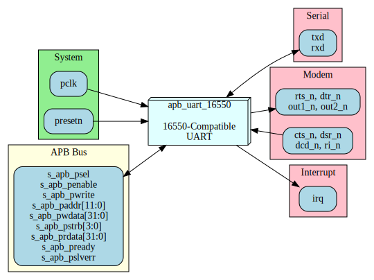

<!-- RTL Design Sherpa Documentation Header -->
<table>
<tr>
<td width="80">
  
</td>
<td>
  <strong>RTL Design Sherpa</strong> · <em>Learning Hardware Design Through Practice</em> 
  
    <a href="https://github.com/sean-galloway/RTLDesignSherpa">GitHub</a> ·
    <a href="https://github.com/sean-galloway/RTLDesignSherpa/blob/main/docs/DOCUMENTATION_INDEX.md">Documentation Index</a> ·
    <a href="https://github.com/sean-galloway/RTLDesignSherpa/blob/main/LICENSE">MIT License</a>
  
</td>
</tr>
</table>

---

<!-- End Header -->

# APB UART 16550 - Interfaces Overview

## External Interfaces

The APB UART 16550 module has the following external interfaces:

| Interface | Type | Description |
|-----------|------|-------------|
| APB Slave | Bus | Configuration and data access |
| Serial | I/O | TXD/RXD serial data |
| Modem | I/O | CTS, RTS, DTR, DSR, DCD, RI |
| Interrupt | Signal | IRQ output |
| Clocks/Reset | System | Clock and reset inputs |

## Interface Summary Diagram

### Figure 3.1: UART Interface Summary

## Chapter Contents

### APB Slave Interface
Complete APB protocol interface for register access.

**See:** [01_apb_slave.md](01_apb_slave.md)

### Serial Interface
TXD and RXD serial data connections.

**See:** [02_serial.md](02_serial.md)

### Modem Interface
Hardware flow control and modem signals.

**See:** [03_modem.md](03_modem.md)

### Interrupt Interface
Interrupt request output signal.

**See:** [04_interrupt.md](04_interrupt.md)

### System Interface
Clock and reset signal requirements.

**See:** [05_system.md](05_system.md)

---

**Next:** [01_apb_slave.md](01_apb_slave.md) - APB Slave Interface
