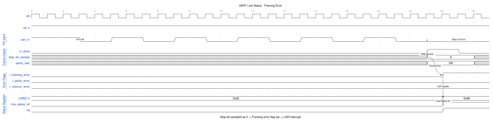

<!-- RTL Design Sherpa Documentation Header -->
<table>
<tr>
<td width="80">
  <a href="https://github.com/sean-galloway/RTLDesignSherpa">
    
  </a>
</td>
<td>
  <strong>RTL Design Sherpa</strong> · <em>Learning Hardware Design Through Practice</em><br>
  <sub>
    <a href="https://github.com/sean-galloway/RTLDesignSherpa">GitHub</a> ·
    <a href="https://github.com/sean-galloway/RTLDesignSherpa/blob/main/docs/DOCUMENTATION_INDEX.md">Documentation Index</a> ·
    <a href="https://github.com/sean-galloway/RTLDesignSherpa/blob/main/LICENSE">MIT License</a>
  </sub>
</td>
</tr>
</table>

---

<!-- End Header -->

# APB UART 16550 — Serial Interface

## Overview

Two pins, `uart_tx` and `uart_rx`, carry everything. This page defines what those pins do electrically and logically — frame formats, sampling behavior, break handling — including the places where this RTL falls short of what the waveform diagrams were drawn to show.

## Ports

### Signal Description

| Signal | Width | Dir | Description |
|--------|-------|-----|-------------|
| uart_tx | 1 | O | Serial transmit data |
| uart_rx | 1 | I | Serial receive data |

### Electrical Interface

#### TTL Level

| State | Voltage |
|-------|---------|
| Logic 0 (Space) | 0V |
| Logic 1 (Mark) | VCC (3.3V/5V) |

#### RS-232 Level (External Transceiver)

| State | Voltage |
|-------|---------|
| Logic 0 (Space) | +3V to +15V |
| Logic 1 (Mark) | -3V to -15V |

## Functional Description

### TXD (Transmit Data)

#### Characteristics

| Parameter | Value |
|-----------|-------|
| Idle State | Logic 1 (Mark) |
| Start Bit | Logic 0 (Space) |
| Stop Bit | Logic 1 (Mark) |
| Bit Order | LSB first |

#### Frame Format

```
IDLE  START  D0  D1  D2  D3  D4  D5  D6  D7  PAR  STOP  IDLE
  1     0    |<-------- Data Bits -------->|  P    1     1
             |<-------- LSB first -------->|
```

#### Output Timing

| Event | Timing |
|-------|--------|
| Bit transition | On baud clock edge |
| Bit duration | 16 x (16x_clk period) |
| Start to first data | 1 bit time |

### RXD (Receive Data)

#### Characteristics

| Parameter | Value |
|-----------|-------|
| Idle State | Logic 1 (Mark) |
| Break | Extended Logic 0 |
| Sampling | Mid-bit (8th of 16 clocks) |

#### Input Synchronization

```
RXD --> FF1 --> FF2 --> Synchronized RXD
       (clk)   (clk)
```

- Two-stage synchronizer
- Prevents metastability
- 2 clock cycle latency

#### Start Bit Detection

1. Detect falling edge (1 to 0)
2. Wait 8 clocks (half bit)
3. Verify still 0
4. Begin data sampling

### Data Formats

#### Configurable Parameters (LCR)

| Parameter | Options |
|-----------|---------|
| Data bits | 5, 6, 7, or 8 |
| Stop bits | 1 or 2 (no 1.5; and STB=1 with a 5-bit word still sends ONE stop bit) |
| Parity | None, Even, Odd, Mark, Space |

#### Frame Examples

**8N1 (8 data, No parity, 1 stop):**
```
START | D0 D1 D2 D3 D4 D5 D6 D7 | STOP
  0   |<------ 8 bits -------->|  1
```

**7E1 (7 data, Even parity, 1 stop):**
```
START | D0 D1 D2 D3 D4 D5 D6 | EP | STOP
  0   |<---- 7 bits ------->|  P |  1
```

**5N1 (5 data, No parity, 1 stop)** -- note 5N2 does not exist in this
RTL (a 5-bit word always gets one stop bit regardless of STB):
```
START | D0 D1 D2 D3 D4 | STOP
  0   |<-- 5 bits --->|  1
```

### Break Condition

#### Transmit Break

When LCR.BC=1:
- TXD forced to Logic 0
- Maintained until BC cleared
- Minimum duration: 1 frame time

#### Receive Break

Detected when:
- RXD = 0 for entire frame
- Start + all data + parity + stop = 0
- Sets the BI bit in LSR and tags the FIFO entry. Exactly one zero
  character is loaded per break; the receiver then stays off until the
  line returns to marking and a genuine new start bit arrives

## Waveforms

### Waveform 3.1: Line Status Error Detection

The following diagram shows framing error detection when a stop bit is sampled as 0.



Error detection sequence:
1. RX frame received normally (start, data bits)
2. Stop bit expected to be 1, but sampled as 0
3. Framing error flag set, and the character's FIFO entry tagged
4. LSR[3] (FE) reads 1 on the read that returns that character
5. Line status interrupt asserts, if enabled in IER[2]

Error types:
- **Framing Error (FE)**: Stop bit not 1 - indicates baud rate mismatch or noise
- **Parity Error (PE)**: Calculated vs received parity mismatch
- **Overrun Error (OE)**: RX FIFO full when new character arrives
- **Break Indicator (BI)**: All bits including stop are 0

---

## Navigation

**Next:** [03_modem.md](03_modem.md) - Modem Interface
