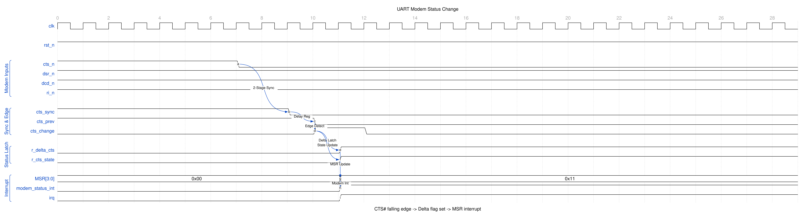

<!-- RTL Design Sherpa Documentation Header -->
<table>
<tr>
<td width="80">
  <a href="https://github.com/sean-galloway/RTLDesignSherpa">
    
  </a>
</td>
<td>
  <strong>RTL Design Sherpa</strong> · <em>Learning Hardware Design Through Practice</em><br>
  <sub>
    <a href="https://github.com/sean-galloway/RTLDesignSherpa">GitHub</a> ·
    <a href="https://github.com/sean-galloway/RTLDesignSherpa/blob/main/docs/DOCUMENTATION_INDEX.md">Documentation Index</a> ·
    <a href="https://github.com/sean-galloway/RTLDesignSherpa/blob/main/LICENSE">MIT License</a>
  </sub>
</td>
</tr>
</table>

---

<!-- End Header -->

# APB UART 16550 - Modem Interface

## Signal Description

### Modem Control Outputs (Active Low)

| Signal | Width | Dir | Description |
|--------|-------|-----|-------------|
| rts_n | 1 | O | Request To Send |
| dtr_n | 1 | O | Data Terminal Ready |
| out1_n | 1 | O | User output 1 |
| out2_n | 1 | O | User output 2 |

### Modem Status Inputs (Active Low)

| Signal | Width | Dir | Description |
|--------|-------|-----|-------------|
| cts_n | 1 | I | Clear To Send |
| dsr_n | 1 | I | Data Set Ready |
| dcd_n | 1 | I | Data Carrier Detect |
| ri_n | 1 | I | Ring Indicator |

## Modem Control Register (MCR)

### Output Control

| Bit | Name | Signal | Active When |
|-----|------|--------|-------------|
| 0 | DTR | dtr_n | MCR[0] = 1 |
| 1 | RTS | rts_n | MCR[1] = 1 |
| 2 | OUT1 | out1_n | MCR[2] = 1 |
| 3 | OUT2 | out2_n | MCR[3] = 1 (also gates the irq pin) |
| 4 | LOOP | - | Loopback mode |

MCR is only 5 bits wide in this RTL (bit 5/AFE does not exist). OUT2 additionally
gates the `irq` output: the pin can assert only when MCR.OUT2 = 1.

### Auto Flow Control (AFE) - not implemented

Auto Flow Control is **not implemented** in this RTL. MCR[5] does not exist
(writes are dropped), RTS is not auto-driven by RX FIFO level, and CTS does not
gate the transmitter. Use manual flow control (drive MCR.RTS and monitor
MSR.CTS in software).

## Modem Status Register (MSR)

### Current State (Read-Only)

| Bit | Name | Source | Meaning |
|-----|------|--------|---------|
| 4 | CTS | cts_n | Current CTS state |
| 5 | DSR | dsr_n | Current DSR state |
| 6 | RI | ri_n | Current RI state |
| 7 | DCD | dcd_n | Current DCD state |

### Delta Bits (Write-1-to-Clear)

These bits are W1C (write 1 to clear), not clear-on-read. Note: the current RTL
does not assert the internal clear strobes, so once set a delta bit persists
until full reset (known RTL issue).

| Bit | Name | Meaning |
|-----|------|---------|
| 0 | DCTS | CTS changed since last cleared |
| 1 | DDSR | DSR changed since last cleared |
| 2 | TERI | RI changed from low to high |
| 3 | DDCD | DCD changed since last cleared |

## Hardware Flow Control

### RTS/CTS Flow Control

```
TX Device                    RX Device
    |                            |
    |-------- TXD ------------->|
    |                            |
    |<------- CTS_N ------------|
    |                            |
    |-------- RTS_N ----------->|
    |                            |
    |<------- RXD --------------|
```

RTS/CTS flow control must be handled in software (AFE is not implemented):
1. Software asserts MCR.RTS when ready to receive
2. Software checks MSR.CTS before sending
3. Hardware does not auto-pause TX on CTS

### Manual Flow Control

Software controls RTS directly:
```c
// Ready to receive
MCR |= 0x02;   // Assert RTS

// Stop receiving
MCR &= ~0x02;  // Deassert RTS
```

## Loopback Mode

When MCR.LOOP = 1:
- TXD internally connected to RXD
- Modem outputs connected to inputs:
  - DTR -> DSR
  - RTS -> CTS
  - OUT1 -> RI
  - OUT2 -> DCD
- External signals disconnected

Used for:
- Self-test
- UART verification
- Driver testing

## Input Synchronization

All modem inputs pass through 2-stage synchronizer:
```
cts_n --> FF1 --> FF2 --> synced_cts_n
         (clk)   (clk)
```

### Waveform 3.2: Modem Status Change Detection

The following diagram shows how modem input changes are detected and reported.



The detection sequence:
1. External CTS# falls (device ready to receive)
2. 2-stage synchronizer captures the change
3. Edge detector compares current vs. previous state
4. Delta flag (`r_delta_cts`) latched
5. Current state (`r_cts_state`) updated
6. MSR updated, modem status interrupt asserted

## Interrupt Generation

MSR delta bits can generate the modem-status interrupt:
- Any delta bit set generates the interrupt (IER[3] is stored but unimplemented,
  so it does not actually mask this interrupt)
- The `irq` pin is gated by MCR.OUT2
- Delta bits are cleared by W1C (not by reading MSR)

---

**Next:** [04_interrupt.md](04_interrupt.md) - Interrupt Interface
