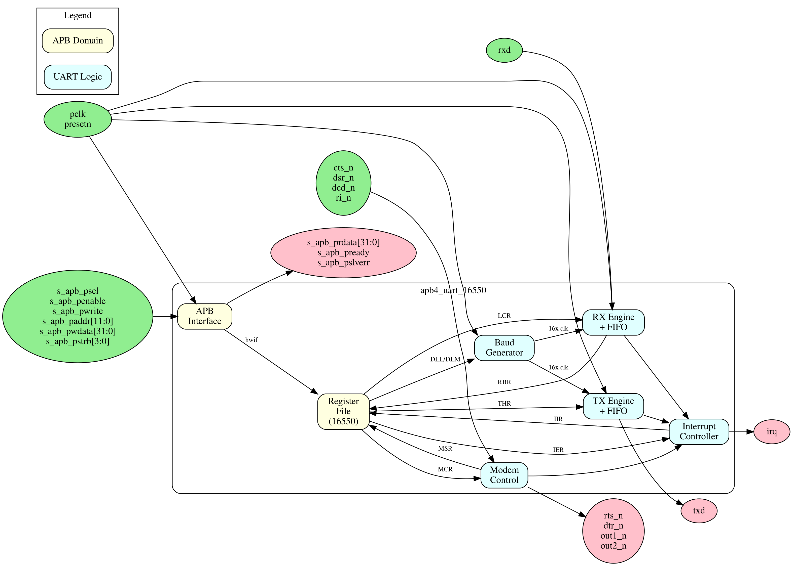

<!-- RTL Design Sherpa Documentation Header -->
<table>
<tr>
<td width="80">
  
</td>
<td>
  <strong>RTL Design Sherpa</strong> · <em>Learning Hardware Design Through Practice</em> 
  
    <a href="https://github.com/sean-galloway/RTLDesignSherpa">GitHub</a> ·
    <a href="https://github.com/sean-galloway/RTLDesignSherpa/blob/main/docs/DOCUMENTATION_INDEX.md">Documentation Index</a> ·
    <a href="https://github.com/sean-galloway/RTLDesignSherpa/blob/main/LICENSE">MIT License</a>
  
</td>
</tr>
</table>

---

<!-- End Header -->

# APB UART 16550 Specification — Table of Contents

**Component:** APB UART 16550 Compatible Serial Controller
**Version:** 1.2
**Last Updated:** 2026-09-10
**Status:** RTL complete; issue #60 fixed and covered by the regression suite
(37 tests per configuration, standard and CDC), and the five RLB-013 features
(character timeout, auto flow control, 1.5 stop bits, DLAB remapping, DMA
mode select) are built. What remains are integration constraints, not missing
function: no reset synchronizer is instantiated, and parameter guards fail at
simulation time zero rather than at elaboration.

---

## Overview

This specification is organized into five chapters covering all aspects of the APB UART 16550 component. Read the status line above before you trust anything in these pages — the register interface and basic 8-bit TX/RX are validated, and the chapters that follow are honest about what is not. I'd rather tell you here that FE/BI are dead than have you find out in the lab.

### Block Diagram

---

## Design Notes

### Document Conventions

#### Signal Naming
- `pclk` - APB clock
- `uart_tx` - Serial transmit data output
- `uart_rx` - Serial receive data input
- `cts_n`, `rts_n` - Hardware flow control
- `dtr_n`, `dsr_n`, `dcd_n`, `ri_n` - Modem signals
- `irq` - Interrupt output

#### Register Notation
- `RBR` - Receiver Buffer Register, 0x00 (R)
- `THR` - Transmitter Holding Register, 0x00 (W)
- `IER` - Interrupt Enable Register, 0x04 (RW)
- `IIR` - Interrupt Identification Register, 0x08 (RO)
- `FCR` - FIFO Control Register, 0x0C (RW)
- `LCR` - Line Control Register, 0x10 (RW)
- `MCR` - Modem Control Register, 0x14 (RW)
- `LSR` - Line Status Register, 0x18 (RO, clear on read)
- `MSR` - Modem Status Register, 0x1C (RO, clear on read)
- `SCR` - Scratch Register, 0x20 (RW)
- `DLL` - Divisor Latch LSB, 0x24 (RW; no DLAB toggle)
- `DLM` - Divisor Latch MSB, 0x28 (RW; no DLAB toggle)

### Version History

| Version | Date | Author | Changes |
|---------|------|--------|---------|
| 1.0 | 2025-12-01 | RTL Design Sherpa | Initial specification |
| 1.1 | 2026-09-10 | RTL Design Sherpa | Issue #60 fixed and the book reconciled to the RTL: RBR returns the received byte in [7:0] and THR is write-only with no readback; LSR[4:1] and MSR[3:0] clear on a read of their own register and the line-status and modem-status interrupts deassert with them; LSR[2:4] are the tags of the character being handed over and LSR[7] aggregates over the whole FIFO; framing errors and breaks assert and tag the FIFO entry, with exactly one zero character loaded per break; received data is right-justified and zero-filled at every word length; each of the four interrupt sources is gated by its own IER bit and reading IIR clears THR-empty when it is the reported source; only the eleven mapped offsets decode and everything else in the window answers with PSLVERR; FCR[0] selects character mode, FCR[2] no longer truncates the character in flight, and a THR write with the data lane masked transmits nothing; the block is now five modules with the interrupt and modem logic split out |
| 1.2 | 2026-09-10 | RTL Design Sherpa | RLB-013 features implemented: the character-timeout interrupt (four character times, IIR 0x0C, sharing the received-data slot and gated by IER[0]); auto flow control on MCR[5], with CTS gating the start of a character and RTS driven from the RX FIFO level; 1.5 stop bits for a 5-bit word; DLAB remapping of 0x00 and 0x04 to the divisor latches, additive to the flat offsets; and DMA mode select on FCR[3] driving the new rxrdy_n and txrdy_n pins |

---

## References

**Related Documentation:**
- [PRD.md](../../PRD.md) - Product Requirements Document
- [IMPLEMENTATION_STATUS.md](../IMPLEMENTATION_STATUS.md) - test/validation
  status file (currently HPET-only; no UART validation status is recorded)

---

## Navigation

### Document Organization

#### Chapter 1: Overview
**Location:** `ch01_overview/`

- [01_overview.md](ch01_overview/01_overview.md) - Component overview, features, applications
- [02_architecture.md](ch01_overview/02_architecture.md) - High-level architecture and block hierarchy
- [03_clocks_and_reset.md](ch01_overview/03_clocks_and_reset.md) - Clock domains and reset behavior
- [04_acronyms.md](ch01_overview/04_acronyms.md) - Acronyms and terminology
- [05_references.md](ch01_overview/05_references.md) - External references and standards

#### Chapter 2: Blocks
**Location:** `ch02_blocks/`

- [00_overview.md](ch02_blocks/00_overview.md) - Block hierarchy overview
- [01_apb_interface.md](ch02_blocks/01_apb_interface.md) - APB interface block
- [02_register_file.md](ch02_blocks/02_register_file.md) - Register file
- [03_tx_engine.md](ch02_blocks/03_tx_engine.md) - Transmit data path
- [04_rx_engine.md](ch02_blocks/04_rx_engine.md) - Receive data path
- [05_baud_generator.md](ch02_blocks/05_baud_generator.md) - Baud rate generation
- [06_fifo.md](ch02_blocks/06_fifo.md) - TX/RX FIFOs

#### Chapter 3: Interfaces
**Location:** `ch03_interfaces/`

- [00_overview.md](ch03_interfaces/00_overview.md) - Interface summary
- [01_apb4_slave.md](ch03_interfaces/01_apb4_slave.md) - APB protocol specification
- [02_serial.md](ch03_interfaces/02_serial.md) - Serial TX/RX interface
- [03_modem.md](ch03_interfaces/03_modem.md) - Modem control signals
- [04_interrupt.md](ch03_interfaces/04_interrupt.md) - Interrupt output
- [05_system.md](ch03_interfaces/05_system.md) - Clock and reset interface

#### Chapter 4: Programming Model
**Location:** `ch04_programming/`

- [00_overview.md](ch04_programming/00_overview.md) - Programming overview
- [01_initialization.md](ch04_programming/01_initialization.md) - UART initialization
- [02_data_transfer.md](ch04_programming/02_data_transfer.md) - Sending and receiving data
- [03_interrupts.md](ch04_programming/03_interrupts.md) - Interrupt handling
- [04_examples.md](ch04_programming/04_examples.md) - Programming examples

#### Chapter 5: Registers
**Location:** `ch05_registers/`

- [01_register_map.md](ch05_registers/01_register_map.md) - Complete register address map and field descriptions

### Quick Navigation

#### For Software Developers
- Start with [Chapter 4: Programming Model](ch04_programming/00_overview.md)
- Reference [Chapter 5: Registers](ch05_registers/01_register_map.md)

#### For Hardware Integrators
- Start with [Chapter 1: Overview](ch01_overview/01_overview.md)
- Reference [Chapter 3: Interfaces](ch03_interfaces/00_overview.md)

#### For Verification Engineers
- Start with [Chapter 2: Blocks](ch02_blocks/00_overview.md)
- Reference [Register Map](ch05_registers/01_register_map.md)
