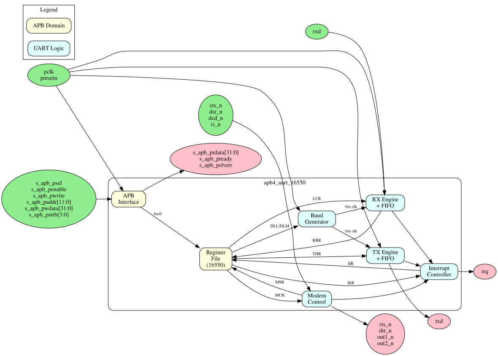

<!-- RTL Design Sherpa Documentation Header -->
<table>
<tr>
<td width="80">
  
</td>
<td>
  <strong>RTL Design Sherpa</strong> · <em>Learning Hardware Design Through Practice</em> 
  
    <a href="https://github.com/sean-galloway/RTLDesignSherpa">GitHub</a> ·
    <a href="https://github.com/sean-galloway/RTLDesignSherpa/blob/main/docs/DOCUMENTATION_INDEX.md">Documentation Index</a> ·
    <a href="https://github.com/sean-galloway/RTLDesignSherpa/blob/main/LICENSE">MIT License</a>
  
</td>
</tr>
</table>

---

<!-- End Header -->

# APB UART 16550 Specification - Table of Contents

**Component:** APB UART 16550 Compatible Serial Controller
**Version:** 1.0
**Last Updated:** 2025-12-01
**Status:** Production Ready

---

## Document Organization

This specification is organized into five chapters covering all aspects of the APB UART 16550 component:

### Chapter 1: Overview
**Location:** `ch01_overview/`

- [01_overview.md](ch01_overview/01_overview.md) - Component overview, features, applications
- [02_architecture.md](ch01_overview/02_architecture.md) - High-level architecture and block hierarchy
- [03_clocks_and_reset.md](ch01_overview/03_clocks_and_reset.md) - Clock domains and reset behavior
- [04_acronyms.md](ch01_overview/04_acronyms.md) - Acronyms and terminology
- [05_references.md](ch01_overview/05_references.md) - External references and standards

### Chapter 2: Blocks
**Location:** `ch02_blocks/`

- [00_overview.md](ch02_blocks/00_overview.md) - Block hierarchy overview
- [01_apb_interface.md](ch02_blocks/01_apb_interface.md) - APB interface block
- [02_register_file.md](ch02_blocks/02_register_file.md) - Register file
- [03_tx_engine.md](ch02_blocks/03_tx_engine.md) - Transmit data path
- [04_rx_engine.md](ch02_blocks/04_rx_engine.md) - Receive data path
- [05_baud_generator.md](ch02_blocks/05_baud_generator.md) - Baud rate generation
- [06_fifo.md](ch02_blocks/06_fifo.md) - TX/RX FIFOs

### Chapter 3: Interfaces
**Location:** `ch03_interfaces/`

- [00_overview.md](ch03_interfaces/00_overview.md) - Interface summary
- [01_apb_slave.md](ch03_interfaces/01_apb_slave.md) - APB protocol specification
- [02_serial.md](ch03_interfaces/02_serial.md) - Serial TX/RX interface
- [03_modem.md](ch03_interfaces/03_modem.md) - Modem control signals
- [04_interrupt.md](ch03_interfaces/04_interrupt.md) - Interrupt output
- [05_system.md](ch03_interfaces/05_system.md) - Clock and reset interface

### Chapter 4: Programming Model
**Location:** `ch04_programming/`

- [00_overview.md](ch04_programming/00_overview.md) - Programming overview
- [01_initialization.md](ch04_programming/01_initialization.md) - UART initialization
- [02_data_transfer.md](ch04_programming/02_data_transfer.md) - Sending and receiving data
- [03_interrupts.md](ch04_programming/03_interrupts.md) - Interrupt handling
- [04_examples.md](ch04_programming/04_examples.md) - Programming examples

### Chapter 5: Registers
**Location:** `ch05_registers/`

- [01_register_map.md](ch05_registers/01_register_map.md) - Complete register address map and field descriptions

---

## Block Diagram

---

## Quick Navigation

### For Software Developers
- Start with [Chapter 4: Programming Model](ch04_programming/00_overview.md)
- Reference [Chapter 5: Registers](ch05_registers/01_register_map.md)

### For Hardware Integrators
- Start with [Chapter 1: Overview](ch01_overview/01_overview.md)
- Reference [Chapter 3: Interfaces](ch03_interfaces/00_overview.md)

### For Verification Engineers
- Start with [Chapter 2: Blocks](ch02_blocks/00_overview.md)
- Reference [Register Map](ch05_registers/01_register_map.md)

---

## Document Conventions

### Signal Naming
- `pclk` - APB clock
- `txd` - Serial transmit data output
- `rxd` - Serial receive data input
- `cts_n`, `rts_n` - Hardware flow control
- `dtr_n`, `dsr_n`, `dcd_n`, `ri_n` - Modem signals
- `irq` - Interrupt output

### Register Notation
- `RBR` - Receiver Buffer Register, 0x00 (R)
- `THR` - Transmitter Holding Register, 0x00 (W)
- `IER` - Interrupt Enable Register, 0x04 (RW)
- `IIR` - Interrupt Identification Register, 0x08 (RO)
- `FCR` - FIFO Control Register, 0x0C (RW)
- `LCR` - Line Control Register, 0x10 (RW)
- `MCR` - Modem Control Register, 0x14 (RW)
- `LSR` - Line Status Register, 0x18 (RO/W1C)
- `MSR` - Modem Status Register, 0x1C (RO/W1C)
- `SCR` - Scratch Register, 0x20 (RW)
- `DLL` - Divisor Latch LSB, 0x24 (RW; no DLAB toggle)
- `DLM` - Divisor Latch MSB, 0x28 (RW; no DLAB toggle)

---

## Version History

| Version | Date | Author | Changes |
|---------|------|--------|---------|
| 1.0 | 2025-12-01 | RTL Design Sherpa | Initial specification |

---

**Related Documentation:**
- [PRD.md](../../PRD.md) - Product Requirements Document
- [IMPLEMENTATION_STATUS.md](../IMPLEMENTATION_STATUS.md) - Test results and validation status
