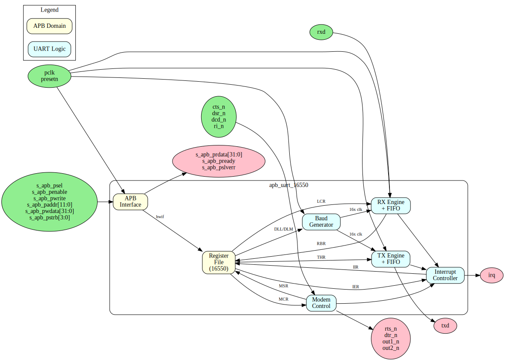

# APB UART 16550 - Overview

## Introduction

The APB UART 16550 is a 16550-compatible Universal Asynchronous Receiver/Transmitter with an APB slave interface. It provides standard serial communication with configurable baud rates, data formats, and FIFO buffering.

## Key Features

### Serial Communication
- Full-duplex asynchronous serial operation
- Configurable baud rates (up to 3 Mbps at 48 MHz clock)
- 5, 6, 7, or 8 data bits
- 1, 1.5, or 2 stop bits
- Even, odd, mark, space, or no parity

### FIFO Buffering
- 16-byte transmit FIFO
- 16-byte receive FIFO
- Configurable trigger levels (1, 4, 8, 14 bytes)
- Optional FIFO disable for 8250 compatibility

### Interrupt System
- Prioritized interrupts
- Receive data available
- Transmitter holding register empty
- Receiver line status (errors)
- Modem status changes

### Modem Control
- Hardware flow control (CTS/RTS)
- Full modem signals (DTR, DSR, DCD, RI)
- Programmable outputs (OUT1, OUT2)
- Loopback mode for testing

## Applications

- Debug consoles
- System management interfaces
- Legacy device communication
- Embedded system UART
- Modem interfaces

## Block Diagram

## Compatibility

The design is register-compatible with:
- National Semiconductor PC16550D
- TI TL16C550C
- Standard 16550 UART cores

### Differences from Original 16550
- APB interface instead of ISA/parallel bus
- Configurable clock domain crossing support
- PeakRDL-generated register file

## Register Summary

| Offset | Name | Access | Description |
|--------|------|--------|-------------|
| 0x00 | RBR/THR/DLL | RO/WO/RW | Receive/Transmit/Divisor LSB |
| 0x04 | IER/DLM | RW | Interrupt Enable/Divisor MSB |
| 0x08 | IIR/FCR | RO/WO | Interrupt ID/FIFO Control |
| 0x0C | LCR | RW | Line Control |
| 0x10 | MCR | RW | Modem Control |
| 0x14 | LSR | RO | Line Status |
| 0x18 | MSR | RO | Modem Status |
| 0x1C | SCR | RW | Scratch Register |

## Parameters

| Parameter | Default | Description |
|-----------|---------|-------------|
| FIFO_DEPTH | 16 | TX/RX FIFO depth |
| CDC_ENABLE | 0 | Clock domain crossing |

---

**Next:** [02_architecture.md](02_architecture.md) - Architecture details
