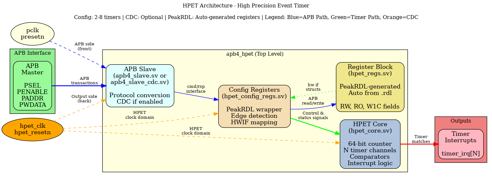

<!-- RTL Design Sherpa Documentation Header -->
<table>
<tr>
<td width="80">
  <a href="https://github.com/sean-galloway/RTLDesignSherpa">
    
  </a>
</td>
<td>
  <strong>RTL Design Sherpa</strong> · <em>Learning Hardware Design Through Practice</em><br>
  <sub>
    <a href="https://github.com/sean-galloway/RTLDesignSherpa">GitHub</a> ·
    <a href="https://github.com/sean-galloway/RTLDesignSherpa/blob/main/docs/DOCUMENTATION_INDEX.md">Documentation Index</a> ·
    <a href="https://github.com/sean-galloway/RTLDesignSherpa/blob/main/LICENSE">MIT License</a>
  </sub>
</td>
</tr>
</table>

---

<!-- End Header -->

# HPET (High Precision Event Timer) Module

## Overview

The HPET module is a fully parameterized, scalable timer peripheral with APB interface, supporting 2-8 independent timer channels. The implementation features **PeakRDL-generated register blocks** for automated register map generation from SystemRDL specifications, optional **clock domain crossing (CDC)** for dual-clock operation, and comprehensive interrupt handling.

**Status**: ✅ **Production Ready** - All configurations tested and passing (4/4 basic tests across all variants)

## Key Features

### Core Functionality
- **Scalable Design**: 2, 3, or 8 timer channels (configurable via `NUM_TIMERS` parameter)
- **64-bit Main Counter**: High-precision incrementing counter
- **Per-Timer Features**:
  - One-shot and periodic modes
  - 32-bit or 64-bit comparator values
  - Independent interrupt generation
  - Flexible interrupt enable/disable

### Advanced Features
- **PeakRDL Integration**: Register blocks auto-generated from SystemRDL specification
- **Optional CDC**: Selectable clock domain crossing for async operation
- **Dual Clock Domains**: APB (low frequency) and HPET timer (high frequency)
- **Live Counter Readback**: Software can read incrementing counter in real-time
- **Sticky Interrupts**: per-bit W1C (Write-1-to-Clear), owned by `hpet_core`
- **Parameter Validation**: Runtime reporting of actual timer count via HPET_ID register

## Architecture



*(Diagram source: `docs/assets/graphviz/hpet_architecture.gv`; render the PNG with the Makefile in that directory if it is not present.)*

*Figure 1: HPET module architecture showing APB interface, PeakRDL-generated registers, and timer core with optional CDC.*

### Module Hierarchy

1. **`apb4_hpet.sv`** (Top Level)
   - Instantiates APB slave (CDC or non-CDC via generate block)
   - Instantiates configuration registers
   - Instantiates HPET core
   - Manages clock domain selection based on `CDC_ENABLE`

2. **`apb4_slave.sv` / `apb4_slave_cdc.sv`** (APB Interface)
   - Converts APB protocol to cmd/rsp interface
   - CDC version handles async clock crossing

3. **`hpet_config_regs.sv`** (Register Wrapper)
   - Wraps PeakRDL-generated register block
   - Maps hwif signals to HPET core interface
   - Handles edge detection for interrupts and counter writes

4. **`hpet_regs.sv` + `hpet_regs_pkg.sv`** (Auto-Generated)
   - Generated by PeakRDL from `hpet_regs.rdl`
   - Contains all register logic and hardware interfaces

5. **`hpet_core.sv`** (Timer Logic)
   - Main 64-bit counter
   - Per-timer comparators and interrupt logic

## PeakRDL Integration

### What is PeakRDL?

PeakRDL is an open-source toolchain that generates SystemVerilog register blocks from SystemRDL specifications. This provides:

- **Single Source of Truth**: Register map defined once in `hpet_regs.rdl`
- **Automatic Generation**: RTL, packages, and documentation auto-generated
- **Verified Semantics**: Field access rights (RW, RO, W1C, etc.) handled correctly
- **Hardware Interface**: Clean `hwif` structs for connecting to custom logic

### Register Generation Flow

```
hpet_regs.rdl (SystemRDL)
        │
        ├──▶ peakrdl regblock hpet_regs.rdl
        │
        ├──▶ hpet_regs.sv         (Register block RTL)
        ├──▶ hpet_regs_pkg.sv     (Type definitions)
        └──▶ generated/docs/*.md  (Documentation)
```

### Key PeakRDL Features Used

1. **Hardware Interfaces (`hwif_in`/`hwif_out`)**:
   ```systemverilog
   // PeakRDL generates these structs
   hpet_regs__in_t  hwif_in;   // Hardware → Registers
   hpet_regs__out_t hwif_out;  // Registers → Hardware
   ```

2. **Live Counter Readback**:
   ```systemrdl
   field {
       sw = rw;           // Software can read/write
       hw = rw;           // HW writes the live value in, reads it back out
       precedence = sw;   // SW write takes priority
       swmod;             // Write STROBE into hpet_core
   } counter_lo[31:0];
   ```

3. **Interrupt Status Mirror with per-bit W1C**:
   ```systemrdl
   field {
       sw = rw;
       hw = w;            // Mirror of hpet_core's live status level
       precedence = sw;
       onwrite = woclr;   // Write-1-to-clear
       swmod;             // Drift guard for the wrapper's mirrored decode
   } timer_int_status[NUM_TIMERS-1:0] = 0;
   ```
   `sticky`/`hwset` are deliberately absent: PeakRDL renders a multi-bit
   sticky field as "load `next` only while the register reads all-zero,
   otherwise set ALL bits on hwset", which sets every bit whenever a second
   timer fires with an earlier one still pending. `hpet_core` owns the
   sticky state instead, and this register mirrors it.

4. **Runtime Parameters**:
   ```systemrdl
   field {
       sw = r;
       hw = w;            // Hardware drives actual value
       reset = NUM_TIMERS - 1;
   } num_tim_cap[12:8];
   ```

### Regenerating Registers

To modify the register map:

1. Edit `projects/components/retro_legacy_blocks/rdl/hpet/hpet_regs.rdl`
2. Regenerate:
   ```bash
   cd projects/components/retro_legacy_blocks/rtl/hpet/peakrdl
   python ../../../../../../bin/peakrdl_generate.py hpet_regs.rdl --copy-rtl ..
   ```
3. Generated files:
   - `../hpet_regs.sv` (register block)
   - `../hpet_regs_pkg.sv` (package)
   - `generated/docs/` (HTML/Markdown documentation, regenerated on demand)

**Note**: `hpet_config_regs.sv` wrapper adapts PeakRDL hwif to HPET core interface.

## Parameters

### Top-Level Parameters (`apb4_hpet`)

| Parameter | Type | Default | Description |
|-----------|------|---------|-------------|
| `VENDOR_ID` | int | 1 | Drives HPET_ID[31:24]. The field is 8 bits, so only the low byte of a wider value is visible |
| `REVISION_ID` | int | 1 | Drives HPET_ID[23:16] (8-bit field, low byte only) |
| `NUM_TIMERS` | int | 2 | Number of timer channels (2-8) |
| `CDC_ENABLE` | int | 0 | Clock domain crossing enable (0=same clock, 1=async clocks) |

### CDC_ENABLE Behavior

#### CDC_ENABLE = 0 (Default - Same Clock Domain)
- **APB Interface**: Uses `pclk` and `presetn`
- **Config Registers**: Uses `pclk` and `presetn`
- **HPET Core**: Uses `pclk` and `presetn`
- **APB Slave**: Instantiates `apb4_slave` (no CDC)
- **Use Case**: Simple single-clock systems, minimal latency

#### CDC_ENABLE = 1 (Dual Clock Domain)
- **APB Interface**: Uses `pclk` and `presetn` (low frequency)
- **Config Registers**: Uses `hpet_clk` and `hpet_resetn` (high frequency)
- **HPET Core**: Uses `hpet_clk` and `hpet_resetn` (high frequency)
- **APB Slave**: Instantiates `apb4_slave_cdc` (with handshake-based CDC)
- **Use Case**: High-precision timing with slow APB bus

### Configuration Examples

Note: `VENDOR_ID`/`REVISION_ID` are driven into HPET_ID through the hardware
interface (the generated register block is built once for the maximum
configuration, so nothing about it is per-instance), and both fields are 8
bits wide. HPET_ID[5] (legacy replacement capable) reads 0 because
HPET_CONFIG[1] is storage with no routing behind it.

**Intel-like (2 timers, no CDC):**
```systemverilog
apb4_hpet #(
    .NUM_TIMERS(2),
    .CDC_ENABLE(0)
) u_hpet (...);
```

**AMD-like (3 timers, with CDC):**
```systemverilog
apb4_hpet #(
    .NUM_TIMERS(3),
    .CDC_ENABLE(1)
) u_hpet (...);
```

**Custom (8 timers, high-speed with CDC):**
```systemverilog
apb4_hpet #(
    .NUM_TIMERS(8),
    .CDC_ENABLE(1)
) u_hpet (...);
```

## Register Map

**Base Address**: Configurable (module uses relative addressing)
**Address Width**: 12 bits (4KB address space)
**Data Width**: 32 bits

### Global Registers (0x000-0x0FF)

| Offset | Name | Access | Description |
|--------|------|--------|-------------|
| 0x000 | HPET_ID | RO | Capabilities and identification |
| 0x004 | HPET_CONFIG | RW | Global configuration |
| 0x008 | HPET_STATUS | RW/W1C | Interrupt status (W1C) |
| 0x00C | RESERVED | - | Reserved |
| 0x010 | HPET_COUNTER_LO | RW | Main counter low 32 bits |
| 0x014 | HPET_COUNTER_HI | RW | Main counter high 32 bits |

### Timer Registers (0x100-0x1FF)

Each timer occupies 32 bytes (0x20) starting at 0x100:

| Offset | Register | Access | Description |
|--------|----------|--------|-------------|
| +0x00 | TIMER_CONFIG | RW | Timer configuration |
| +0x04 | TIMER_COMPARATOR_LO | RW | Comparator low 32 bits |
| +0x08 | TIMER_COMPARATOR_HI | RW | Comparator high 32 bits |
| +0x0C | RESERVED | - | Reserved for expansion |

**Timer Base Addresses**:
- Timer 0: 0x100-0x11F
- Timer 1: 0x120-0x13F
- Timer 2: 0x140-0x15F (if NUM_TIMERS ≥ 3)
- Timer 3: 0x160-0x17F (if NUM_TIMERS ≥ 4)
- Timer 4: 0x180-0x19F (if NUM_TIMERS ≥ 5)
- Timer 5: 0x1A0-0x1BF (if NUM_TIMERS ≥ 6)
- Timer 6: 0x1C0-0x1DF (if NUM_TIMERS ≥ 7)
- Timer 7: 0x1E0-0x1FF (if NUM_TIMERS = 8)

### Register Bit Fields

#### HPET_ID (0x000) - Read Only
```
[31:24] VENDOR_ID     - Low 8 bits of the VENDOR_ID parameter (hardware-driven)
[23:16] REV_ID        - Low 8 bits of the REVISION_ID parameter (hardware-driven)
[15:13] Reserved
[12:8]  NUM_TIM_CAP   - Number of timers - 1 (hardware-driven)
[7]     COUNT_SIZE_CAP - 1 = 64-bit counter capable
[6]     Reserved
[5]     LEG_RT_CAP    - Reads 0: legacy replacement is NOT implemented, so
                        the capability is not advertised (the HPET_CONFIG
                        bit stores and dead-ends)
[4:0]   Reserved
```

**Note**: `NUM_TIM_CAP`, `VENDOR_ID` and `REV_ID` are all **hardware-written**
from the module parameters, so one generated register block serves every
instantiation.

#### HPET_CONFIG (0x004) - Read/Write
```
[31:2] Reserved
[1]    LEGACY_REPLACEMENT - Storage only, no hardware effect (HPET_ID[5] = 0)
[0]    HPET_ENABLE        - Enable main counter
```

#### HPET_STATUS (0x008) - Read/Write (W1C)
```
[31:NUM_TIMERS] Reserved
[NUM_TIMERS-1:0] TIMER_INT_STATUS - Interrupt status (write 1 to clear)
```

**Semantics**:
- **Owned by `hpet_core`**: the register is a mirror of the core's
  `r_interrupt_status`, driven from its live level every cycle. The core
  holds the sticky state; the register block does not.
- **W1C, per bit**: writing 1 to bit N clears only timer N. Writing 0 to a
  bit leaves it alone, and writing 0x00000000 is a complete no-op.
- **Fire beats clear**: a timer firing in the same cycle as a clear of its
  own bit wins - a new event is never dropped in favour of a clear that
  software can simply repeat.
- **Reset**: reads 0x00000000 out of reset.

#### TIMER_CONFIG (+0x00) - Read/Write
```
[31:7] Reserved
[6]    TIMER_VALUE_SET    - Stored, no hardware effect (unconsumed)
[5]    TIMER_SIZE         - 0=32-bit, 1=64-bit comparator
[4]    TIMER_TYPE         - 0=one-shot, 1=periodic
[3]    TIMER_INT_ENABLE   - Interrupt enable
[2]    TIMER_ENABLE       - Timer enable
[1:0]  Reserved
```

## Programming Requirements

Four rules that the hardware does not (and on a real HPET, cannot) enforce
for you. Each one is a case where the register interface is 32 bits wide, or
the compare is, and the thing behind it is not.

### Partial (byte-strobed) counter writes require a halted counter

Writing `HPET_COUNTER_LO` / `HPET_COUNTER_HI` with `PSTRB != 4'hF` is only
defined while the counter is halted (`HPET_CONFIG[0] = 0`).

The register block merges the bytes software did not write from its own
mirror of the field, and on a running counter that mirror is a cycle behind
the live value while the write-strobe alignment costs another - so the
un-written bytes come back **two counts behind** the counter they were
supposed to preserve. Halt the counter and the mirror is stable, making the
merge exact. Full-word writes never read the mirror and are unaffected.

This is a stricter rule than the "write the halves with the counter halted"
convention below it: a full-word LO/HI pair on a running counter is merely
non-atomic, while a partial write on a running counter is wrong.

### Reprogramming a running comparator requires disabling the timer

To change a comparator without a spurious or a missed interrupt, clear
`TIMER_CONFIG.TIMER_ENABLE` (or `HPET_CONFIG[0]`) first, write both halves,
then re-enable. The real HPET has the same requirement.

The comparator is written as two 32-bit halves, so between the two writes it
holds the torn value `{old HI, new LO}` - a value software never programmed.
`hpet_core` therefore re-arms on a comparator write only while the timer is
STOPPED. A write to a running timer still loads the half it targets, but does
not re-arm; the timer re-arms naturally once the completed value is ahead of
the counter. Programming a running timer FORWARD (the usual "next deadline =
now + interval" one-shot restart) therefore works unchanged - it is
programming it to an already-passed value that needs the timer disabled.

**A comparator write while the timer is STOPPED always re-arms it**, whatever
value it writes. If the written value is at or below the counter, the timer
fires as soon as it is enabled - deliberately, and consistently with the `>=`
match used everywhere else in this block. That is the mechanism that lets
software arm to an already-passed target (a zero comparator, or restarting a
periodic phase after a counter reset). There is no wait-for-wrap.

Two consequences of reprogramming a RUNNING timer anyway are **outside the
contract, not bugs**:

- A torn 64-bit value that lands ABOVE the counter re-arms the timer through
  the natural path (the match falls, so the timer re-arms), and the timer then
  fires at the final value once the second half is written. The tear is not
  what fires it; the completed value is.
- A same-value rewrite on a running PERIODIC timer drags the comparator back
  from its auto-advanced position to the originally programmed value, and can
  add one off-lattice fire.

### Periodic timers skip missed periods, they do not burst

If a periodic comparator is left more than one period behind the counter -
programmed late, or the counter written forward - the core advances the
comparator by one period per cycle **without firing** until it is ahead of
the counter again, and then fires at that boundary. Software sees one
interrupt for the whole missed batch, not one per missed period.

Two degenerate periods are worth knowing:

- **Period 0** is treated as one-shot. A zero period can never get ahead of
  the counter, so the timer fires once and then stays quiescent.
- **Period 1** delivers on every other tick - the fastest cadence the one-cycle
  fire/re-arm loop allows - rather than going silent, and it does so at ANY
  deficit. At period 1 the comparator gains nothing on the counter per cycle
  (both step by 1), so "advance by a period until you are ahead" can never
  close a gap; the catch-up therefore jumps the comparator straight to
  `counter + 1`, which is a legal boundary because every integer is on the
  period-1 lattice. A live counter write that opens a gap recovers on the next
  catch-up cycle.

#### How long the catch-up takes

The catch-up is bounded, but the bound is proportional to the deficit, not
constant. It does at most **one advance per cycle**, and each advance closes
**`period - 1`** counts of deficit - the comparator gains `period` while the
counter gains 1 in the same cycle. So a deficit of `D` counts costs roughly

```
cycles = ceil(D / (period - 1))     for period >= 2
cycles = 1                          for period 1 (the lattice jump to counter+1)
```

and no interrupt is delivered during any of them; one lands at the end.

At small periods that is a long time. Writing `HPET_COUNTER_HI` on a RUNNING
period-2 timer can open a deficit of 2^52 counts, which then closes at 1 count
per cycle: about 4.5e15 cycles, roughly **520 days at 100 MHz**, silent
throughout. Nothing is hung and nothing is lost - the core is doing exactly the
arithmetic it was asked for - but this is precisely why the HPET specification
requires the **main counter to be halted before it is written**. Halt it, write
both halves, reprogram the comparators, then re-enable.

A third case is invisible to software unless it looks closely: an advance that
carries out of the **compare width** (past bit 31 in 32-bit mode, past bit 63
in 64-bit mode) leaves the comparator in the counter's NEXT epoch. The core
records that in a per-timer hold bit, keeps only the wrapped low bits (bits
[63:32] of a 32-bit-mode comparator are never disturbed), and holds the match
at 0 - no fire and no further advance - until one of four things happens:

- **E1** the counter itself wraps at that width;
- **E2** software writes a comparator half **that the compare width reads**;
- **E3** software writes a counter half **that the compare width reads** - a
  counter write re-bases the epoch, so afterwards the ordinary
  `counter >= comparator` rule applies immediately;
- **E4** `TIMER_SIZE` changes, because the carry was taken at a width that no
  longer applies.

E2 and E3 are evaluated at the compare width, like every other term in the
core. In **64-bit** mode either half of the comparator, or either half of the
counter, clears the hold. In **32-bit** mode only the **LO** half does: a
HI-half write moves no bit that a 32-bit comparison reads, so treating it as a
re-base would restart the comparison with operands identical to the ones that
carried, and the timer would fire a whole epoch early on a write that changed
nothing it can see. (This is separate from the comparator write beating the
advance for the cycle - software owns the register in a write cycle, so ANY
half write suppresses the advance. "Did the comparison move" and "who owns the
register this cycle" are different questions with different answers.)

In 64-bit mode the hold is effectively permanent once taken. A 64-bit counter
wrap is up to 2^64 = 1.8e19 counts away - about 5800 years at 100 MHz, and even
a quarter of an epoch is around 1460 years - so such a timer fires once and
then never again until software reprograms it. That is 64-bit register
arithmetic behaving as 64-bit register arithmetic does, not a defect; without
the hold bit the wrapped comparator would sit BELOW the counter and re-fire
every single cycle.

### Changing TIMER_SIZE requires a stopped timer and a comparator rewrite

Change `TIMER_CONFIG.TIMER_SIZE` only while that timer is stopped
(`TIMER_ENABLE = 0`), and **rewrite the comparator afterwards** - which also
rewrites the period, since they share the register.

E4 clears a stale epoch hold when `TIMER_SIZE` changes, but clearing the hold
is all it can do: the old width's lattice is not the new width's, and the core
has no way to translate a target from one to the other. Switching **0 -> 1** on
a live timer exposes `comparator[63:32]` and `period[63:32]` - bits the 32-bit
comparison never read and never maintained - to a comparison that now does read
them, so the comparator can land up to 2^32 counts behind the counter and catch
up for ~2^32 cycles (about 43 seconds at 100 MHz) before it fires again.
Switching **1 -> 0** truncates the target to its low half, which usually turns
a future comparator into an already-due one.

## Usage Examples

### Example 1: Basic Timer Setup (No CDC)

```systemverilog
module my_system (
    input  logic        clk,
    input  logic        rst_n,
    // APB interface
    output logic [1:0]  timer_irq
);

    // Instantiate HPET with 2 timers, no CDC
    apb4_hpet #(
        .NUM_TIMERS(2),
        .CDC_ENABLE(0)  // Same clock domain
    ) u_hpet (
        // Clocks - both use same clock
        .pclk           (clk),
        .presetn        (rst_n),
        .hpet_clk       (clk),      // Not used when CDC_ENABLE=0
        .hpet_resetn    (rst_n),    // Not used when CDC_ENABLE=0

        // APB interface
        .s_apb_PSEL     (apb_psel),
        .s_apb_PENABLE  (apb_penable),
        .s_apb_PREADY   (apb_pready),
        .s_apb_PADDR    (apb_paddr),
        .s_apb_PWRITE   (apb_pwrite),
        .s_apb_PWDATA   (apb_pwdata),
        .s_apb_PSTRB    (apb_pstrb),
        .s_apb_PPROT    (apb_pprot),
        .s_apb_PRDATA   (apb_prdata),
        .s_apb_PSLVERR  (apb_pslverr),

        // Interrupts
        .timer_irq      (timer_irq)
    );
endmodule
```

### Example 2: High-Precision Timer with CDC

```systemverilog
module high_precision_system (
    input  logic        apb_clk,        // 50 MHz APB clock
    input  logic        apb_rst_n,
    input  logic        hpet_clk,       // 100 MHz timer clock
    input  logic        hpet_rst_n,
    output logic [7:0]  timer_irq
);

    // Instantiate HPET with 8 timers and CDC
    apb4_hpet #(
        .NUM_TIMERS(8),
        .CDC_ENABLE(1)  // Enable CDC for async clocks
    ) u_hpet (
        // APB clock domain (slow)
        .pclk           (apb_clk),
        .presetn        (apb_rst_n),

        // HPET clock domain (fast, for precise timing)
        .hpet_clk       (hpet_clk),
        .hpet_resetn    (hpet_rst_n),

        // APB interface (apb_clk domain)
        .s_apb_PSEL     (apb_psel),
        // ... other APB signals

        // Interrupts (hpet_clk domain when CDC_ENABLE=1)
        .timer_irq      (timer_irq)
    );
endmodule
```

### Example 3: Software Usage

```c
// Register definitions
#define HPET_BASE        0x10000000
#define HPET_ID          (HPET_BASE + 0x000)
#define HPET_CONFIG      (HPET_BASE + 0x004)
#define HPET_STATUS      (HPET_BASE + 0x008)
#define HPET_COUNTER_LO  (HPET_BASE + 0x010)
#define HPET_COUNTER_HI  (HPET_BASE + 0x014)
#define TIMER0_CONFIG    (HPET_BASE + 0x100)
#define TIMER0_COMP_LO   (HPET_BASE + 0x104)
#define TIMER0_COMP_HI   (HPET_BASE + 0x108)

// Initialize HPET
void hpet_init(void) {
    // Read capabilities
    uint32_t id = READ_REG(HPET_ID);
    uint32_t num_timers = ((id >> 8) & 0x1F) + 1;

    // Enable HPET
    WRITE_REG(HPET_CONFIG, 0x1);  // HPET_ENABLE
}

// Configure timer 0 for one-shot
void timer0_oneshot(uint32_t ticks) {
    // Disable timer
    WRITE_REG(TIMER0_CONFIG, 0x00);

    // Set comparator (32-bit mode)
    WRITE_REG(TIMER0_COMP_LO, ticks);

    // Enable timer: one-shot, 32-bit, interrupt enabled
    WRITE_REG(TIMER0_CONFIG, 0x0C);  // INT_EN | ENABLE
}

// Clear interrupt
void timer0_clear_irq(void) {
    WRITE_REG(HPET_STATUS, 0x1);  // W1C bit 0
}

// Read live counter
uint64_t hpet_read_counter(void) {
    uint32_t lo, hi1, hi2;

    // Handle potential rollover
    do {
        hi1 = READ_REG(HPET_COUNTER_HI);
        lo  = READ_REG(HPET_COUNTER_LO);
        hi2 = READ_REG(HPET_COUNTER_HI);
    } while (hi1 != hi2);

    return ((uint64_t)hi2 << 32) | lo;
}
```

## Testing

### Test Configurations

The test suite validates all parameter combinations:

| Config | Timers | Vendor | Rev | CDC | Description |
|--------|--------|--------|-----|-----|-------------|
| 1 | 2 | 0x8086 | 0x01 | 0 | Intel-like, no CDC |
| 2 | 3 | 0x1022 | 0x02 | 0 | AMD-like, no CDC |
| 3 | 8 | 0xABCD | 0x10 | 0 | Custom, no CDC |
| 4 | 2 | 0x8086 | 0x01 | 1 | Intel-like, CDC |
| 5 | 3 | 0x1022 | 0x02 | 1 | AMD-like, CDC |
| 6 | 8 | 0xABCD | 0x10 | 1 | Custom, CDC |

### Running Tests

```bash
# Run all HPET tests
pytest projects/components/retro_legacy_blocks/dv/tests/test_apb4_hpet.py -v

# Run specific configuration
pytest 'projects/components/retro_legacy_blocks/dv/tests/test_apb4_hpet.py::test_hpet[2-32902-1-0-full-2-timer Intel-like]' -v

# Run CDC tests only
pytest -k "CDC" projects/components/retro_legacy_blocks/dv/tests/test_apb4_hpet.py -v
```

### Test Coverage

All configurations pass **4/4 basic tests**:
1. ✅ **Register Access**: Read/write all registers
2. ✅ **Counter Functionality**: Counter increment, SW write, live readback
3. ✅ **Timer One-Shot**: Configure and trigger timer interrupt
4. ✅ **Interrupt Clearing**: W1C semantics and edge detection

## File Structure

```
projects/components/retro_legacy_blocks/rtl/hpet/
├── README.md                          (This file)
├── apb4_hpet.sv                        (Top-level module)
├── hpet_core.sv                       (Timer core logic)
├── hpet_config_regs.sv                (PeakRDL wrapper)
├── hpet_regs.sv                       (Auto-generated register block)
├── hpet_regs_pkg.sv                   (Auto-generated package)
│   ├── README.md                      (PeakRDL usage guide)
│   ├── hpet_regs.rdl                  (SystemRDL specification)
│   └── generated/
│       └── docs/
│           └── hpet_regs.md           (Auto-generated documentation)
└── filelists/
    └── *.f                            (Simulation file lists)

val/integ_amba/
└── test_apb4_hpet.py                   (Pytest test runner)
```

## Design Decisions

### Why PeakRDL?

1. **Single Source of Truth**: Register map defined once in SystemRDL
2. **Verified Semantics**: Field access (RW, RO, W1C) guaranteed correct
3. **Maintainability**: Changes to register map automatically propagate
4. **Documentation**: Auto-generated register documentation
5. **Industry Standard**: SystemRDL is IP-XACT successor

### Why Optional CDC?

1. **Flexibility**: Support both simple (same clock) and complex (dual clock) systems
2. **Performance**: No CDC overhead when not needed
3. **Precision**: High-speed timer clock independent of slow APB bus
4. **Resource**: CDC components only instantiated when enabled

### Why Hardware-Writable num_tim_cap?

Allows single PeakRDL generation (NUM_TIMERS=8) to correctly report timer count when instantiated with different parameters (2, 3, or 8 timers).

## Known Limitations

1. **Timer Spacing**: Timer registers use 32-byte spacing (only 12 bytes used per timer)
   - **Reason**: Allows future expansion without address map changes

2. **PeakRDL Generation**: Requires manual regeneration when modifying `hpet_regs.rdl`
   - **Mitigation**: the RDL is the single source of truth; regeneration is `bin/peakrdl_generate.py`

3. **CDC Latency**: CDC version adds ~2-4 cycles latency for APB transactions
   - **Expected**: Handshake-based CDC requires round-trip synchronization

## Version History

- **v2.0** (2025-10-16): PeakRDL integration complete
  - Auto-generated register blocks from SystemRDL
  - Added CDC_ENABLE parameter for optional clock domain crossing
  - Hardware-writable HPET_ID.num_tim_cap for runtime reporting
  - Live counter readback with hw=w, precedence=sw
  - Sticky interrupt semantics with hwset + swmod
  - All 6 test configurations passing (4/4 basic tests each)

- **v2.1** (2026-09-08): issue #46 RTL fixes
  - HPET_STATUS is a per-bit W1C mirror of `hpet_core`'s status; the
    `sticky`/`hwset` rendering that set all 8 bits is gone, and the field
    now has a reset value
  - Counter and comparator halves load from WRITE STROBES, each half
    independently, so "write LO then HI" lands both and rewriting the same
    comparator value re-arms the timer
  - A per-timer armed latch replaces the match edge detect, so re-enabling
    a completed one-shot no longer re-fires it
  - HPET_ID vendor/revision driven from the parameters; `leg_rt_cap` reports
    0; dead `timer_comp_rdata` and `r_timer_enable_int` removed

- **v2.2** (2026-09-09): issue #46 review fixes
  - Periodic catch-up: a periodic timer whose auto-advanced comparator is
    still at or behind the counter keeps advancing (one period per cycle,
    no interrupt) until it is ahead, so it no longer fires once and goes
    silent; missed periods are skipped rather than burst
  - A comparator write re-arms only while the timer is STOPPED, so a
    half-written 64-bit comparator cannot fire on the torn `{old HI, new
    LO}` value (see Programming Requirements)
  - Documented the halted-counter requirement for partial, byte-strobed
    counter writes
  - Elaboration-time `NUM_TIMERS` range check in `hpet_config_regs`;
    `hpet_core`'s check promoted from `$warning` to `$error`

- **v1.0**: Hand-coded register blocks (deprecated)

## References

- **PeakRDL**: https://github.com/SystemRDL/PeakRDL-regblock
- **SystemRDL**: https://github.com/SystemRDL/systemrdl-compiler
- **HPET Spec**: Intel IA-PC HPET Specification (for reference, not strictly compliant)
- **Test Documentation**: `projects/components/retro_legacy_blocks/dv/tests/test_apb4_hpet.py` docstrings

## Contributing

When modifying the HPET module:

1. **Register Changes**: Edit `../../rdl/hpet/hpet_regs.rdl`, then regenerate
2. **RTL Changes**: Update `apb4_hpet.sv`, `hpet_core.sv`, or wrapper
3. **Testing**: Run full test suite (all 6 configurations)
4. **Documentation**: Update this README and inline comments

---

**Maintained by**: RTL Design Sherpa Project
**Last Updated**: 2025-10-16
**Status**: Production Ready ✅
