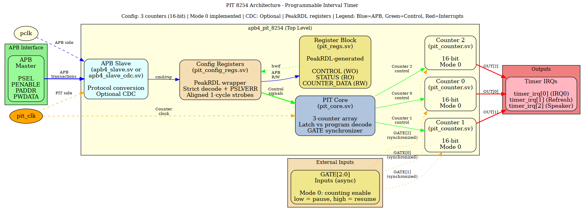

<!-- RTL Design Sherpa Documentation Header -->
<table>
<tr>
<td width="80">
  <a href="https://github.com/sean-galloway/RTLDesignSherpa">
    
  </a>
</td>
<td>
  <strong>RTL Design Sherpa</strong> · <em>Learning Hardware Design Through Practice</em><br>
  <sub>
    <a href="https://github.com/sean-galloway/RTLDesignSherpa">GitHub</a> ·
    <a href="https://github.com/sean-galloway/RTLDesignSherpa/blob/main/docs/DOCUMENTATION_INDEX.md">Documentation Index</a> ·
    <a href="https://github.com/sean-galloway/RTLDesignSherpa/blob/main/LICENSE">MIT License</a>
  </sub>
</td>
</tr>
</table>

---

<!-- End Header -->

# Intel 8254 PIT (Programmable Interval Timer) - APB Implementation

**Status:** Mode 0 complete and defect-clean against GitHub #52
**Priority:** High
**Address:** `0x4000_2000 - 0x4000_2FFF` (4KB window)

**Test status:** 31/32 in all six configurations (CDC_ENABLE 0/1 x
gate/func/full, 2026-09-09). The one failure,
`test_gh52_latch_cleared_by_reprogram`, is a measurement taken through an APB
read whose own round trip exceeds the window it asserts - see "Measuring a
counter through the bus" below. `test_gh52_gate_pause_resume` had the same
problem in its first draft and was resolved by sampling the counter white-box
around the GATE edge.

---

## Overview

APB-based implementation of Intel 8254-compatible Programmable Interval Timer with 3 independent 16-bit counters.

Follows HPET 3-layer architecture pattern with PeakRDL-generated registers.

## Features

- Intel 8254-compatible register interface
- 3 independent 16-bit counters
- Mode 0: interrupt on terminal count, with GATE pause/resume
- Modes 1-5: NOT implemented - the mode field is stored and reported by
  read-back, but every mode counts like mode 0
- Binary and BCD counting; a count of 0 means 65536 (BCD: 10000)
- Counter latch COMMAND (control word RW = 00): freezes the count, the next
  data read returns it and releases the latch
- LSB / MSB / 16-bit load lanes, byte-strobe (PSTRB) correct
- Strict address decode: only the seven mapped registers are visible, every
  other address in the 4 KB window is dropped with PSLVERR
- Interrupt output array: `timer_irq[2:0]`
- APB4 slave interface
- Optional CDC (clock domain crossing)
- `gate_in` input synchronizer (SYNC_STAGES, default 2), unconditional

### GATE (mode 0)

| GATE | Effect |
|------|--------|
| low  | counting SUSPENDS; the count holds its value |
| high | counting RESUMES from that value - no reload, no restart |
| any  | a counter LOAD is unaffected; only the decrement is gated |

### Counting-block priority

    control word  >  counter load  >  count tick

A control word ABORTS the count it targets - OUT low, NULL COUNT set, and no
tick in that cycle, so the count freezes at the value the abort caught. A load
starts a new count. Only when neither happened does the counter decrement.
These are one if/else-if chain on purpose: as separate statements a control word
landing on the terminal tick had its OUT clear overwritten by the tick, raising
a spurious interrupt with NULL COUNT set.

### Counter latch

A control word with RW = 00 is the latch COMMAND, not a read/write mode. It
freezes the selected counter's current count while the counter keeps running.
A second latch before the read is ignored (the first snapshot survives), and a
DATA write never latches - out of reset (RW = 00) a data write is a 16-bit load.

The latch is held until one of:

- the counter's data register is READ - that read returns the frozen value and
  releases the latch, and reads after it see the live count again;
- the counter is REPROGRAMMED by a control word;
- a new count is LOADED.

The last two matter: the snapshot describes a count that no longer exists after
a reprogram, and a latch that survived one would hand software a stale value on
its next read, indistinguishable from a live count.

### Byte-strobed loads

COUNTERx_DATA is `hw = rw` and its hardware input is the live count, so the
register field MIRRORS the counter rather than shadowing the last value
written. A byte-strobed (partial PSTRB) write merges the new byte with the
counter's value as of the write cycle. A partial load is therefore deterministic
only when the counter is stopped (PIT disabled); a full 16-bit write is
deterministic always, because no lane comes from the mirror.

## Architecture



*(Diagram source: `docs/assets/graphviz/pit_architecture.gv`; render the PNG with the Makefile in that directory if it is not present.)*

*Figure 1: PIT 8254 module architecture showing APB interface, PeakRDL-generated registers, and 3 independent counter channels with Mode 0 implementation.*

### Module Hierarchy

```
apb4_pit_8254.sv         → APB wrapper, CDC select
  ├── pit_config_regs.sv → Strict decode + PSLVERR, aligned command strobes
  │     └── pit_regs.sv  → PeakRDL generated registers
  └── pit_core.sv        → 3-counter array, control decode, GATE synchronizer
        └── pit_counter.sv → Single counter (mode 0)
```

### Parameters

| Parameter | Default | Meaning |
|-----------|---------|---------|
| `NUM_COUNTERS` | 3 | Fixed at 3 - the register map is generated for three counters |
| `CDC_ENABLE` | 0 | 1 = registers and counters run on `pit_clk`, the cmd/rsp stream crosses in `apb4_slave_cdc` |
| `USE_JOHNSON` | 0 | Async-FIFO pointer encoding for the CDC block |
| `SYNC_STAGES` | 2 | `gate_in` synchronizer depth, >= 2 |

## Register Map

| Address | Register        | Access | Description                           |
|---------|-----------------|--------|---------------------------------------|
| 0x000   | PIT_CONFIG      | RW     | Global config (enable, clock select)  |
| 0x004   | PIT_CONTROL     | WO     | Control word (8254-compatible)        |
| 0x008   | PIT_STATUS      | RO     | Read-back status (3×8-bit)            |
| 0x00C   | RESERVED        | RO     | Reserved                              |
| 0x010   | COUNTER0_DATA   | RW     | Counter 0 value (16-bit)              |
| 0x014   | COUNTER1_DATA   | RW     | Counter 1 value (16-bit)              |
| 0x018   | COUNTER2_DATA   | RW     | Counter 2 value (16-bit)              |

Nothing else in the 4 KB window is decoded. Any other address is dropped -
write ignored, read returns zero - and answers with PSLVERR.

Counter data lanes follow the control word's RW field:

| RW | Write | Read |
|----|-------|------|
| 00 | 16-bit load (latch is the CONTROL-word command, not a data write) | 16-bit |
| 01 | low byte from PWDATA[7:0] | `{8'h00, count[7:0]}` |
| 10 | high byte from PWDATA[15:8] | `{count[15:8], 8'h00}` - the same lane both ways; low byte reads 0 |
| 11 | 16-bit load | 16-bit |

## Counter Modes

| Mode | Name                          | Status       |
|------|-------------------------------|--------------|
| 0    | Interrupt on terminal count   | ✅ Complete  |
| 1    | Hardware retriggerable one-shot | ⏳ TODO     |
| 2    | Rate generator                | ⏳ TODO      |
| 3    | Square wave generator         | ⏳ TODO      |
| 4    | Software triggered strobe     | ⏳ TODO      |
| 5    | Hardware triggered strobe     | ⏳ TODO      |

## Interrupt Outputs

Following HPET pattern:
- `timer_irq[0]` = Counter 0 OUT (system timer, IRQ0)
- `timer_irq[1]` = Counter 1 OUT (DRAM refresh or general)
- `timer_irq[2]` = Counter 2 OUT (PC speaker or general)

## Example Instantiation

```systemverilog
apb4_pit_8254 #(
    .NUM_COUNTERS (3),
    .CDC_ENABLE   (0),
    .SYNC_STAGES  (2)
) u_pit (
    .pclk          (apb_clk),
    .presetn       (apb_rst_n),
    .pit_clk       (timer_clk),
    .pit_resetn    (timer_rst_n),
    .s_apb_PSEL    (psel_pit),
    .s_apb_PENABLE (penable),
    .s_apb_PREADY  (pready_pit),
    .s_apb_PADDR   (paddr),
    .s_apb_PWRITE  (pwrite),
    .s_apb_PWDATA  (pwdata),
    .s_apb_PSTRB   (pstrb),
    .s_apb_PPROT   (pprot),
    .s_apb_PRDATA  (prdata_pit),
    .s_apb_PSLVERR (pslverr_pit),
    .gate_in       (gate[2:0]),
    .timer_irq     (pit_irq[2:0])
);
```

(The port list above is the real one. The example here used to name `paddr`,
`psel`, `pit_rst` and friends, none of which exist on this module.)

## Files

- ✅ `apb4_pit_8254.sv` - Top-level APB wrapper
- ✅ `pit_config_regs.sv` - Register wrapper with edge detection
- ✅ `pit_core.sv` - 3-counter array
- ✅ `pit_counter.sv` - Single counter (mode 0)
- ✅ `pit_regs.sv` - PeakRDL generated registers
- ✅ `pit_regs_pkg.sv` - PeakRDL generated package
- ✅ `peakrdl/pit_regs.rdl` - SystemRDL specification

## Development Status

- [x] SystemRDL register specification
- [x] PeakRDL register generation
- [x] Counter mode 0 logic implementation
- [x] Core PIT logic (3-counter array)
- [x] APB wrapper
- [x] Basic testbench (gate level, 6 tests)
- [x] Medium testbench (GitHub #52 defect regression, 13 tests)
- [x] Full testbench (13 further tests)
- [ ] Modes 1-5 implementation
- [ ] Read-back command support (control word SC = 11)

## Stated deviations from the Intel 8254

1. **Modes 1-5 do not exist.** The mode field is stored and reported; the
   counting logic has no `case (cfg_mode)`.
2. **The counter parks at terminal count.** A real 8254 keeps decrementing past
   0 and wraps with OUT high. Here `r_counting` clears, the count stays at 0 and
   OUT stays high until a new load. This is the fix for the post-terminal
   `r_counting` oscillation in #52; the steady state is
   `r_counting = 0, r_count = 0, r_out = 1`.
3. **RW = 10 uses bits [15:8] in both directions.** The 8254 presents the
   selected byte on its 8-bit bus; on this 16-bit register the high byte is
   written and read on the high lane, so a write of 0xAB00 reads back 0xAB00.
4. **Read-back command (SC = 11) is not implemented** - PIT_STATUS carries the
   same information as a register instead.
5. **`PIT_CONFIG.clock_select` is storage with no hardware effect** - there is
   one counting clock and no prescaler to select between.

## Compliance

- ✅ Reset macros (`ALWAYS_FF_RST`)
- ✅ HPET architecture pattern
- ✅ APB4 standard interface
- ✅ PeakRDL register generation

---

**Last Updated:** 2026-09-09
**Status:** Mode 0 complete; GitHub #52 RTL defects fixed
