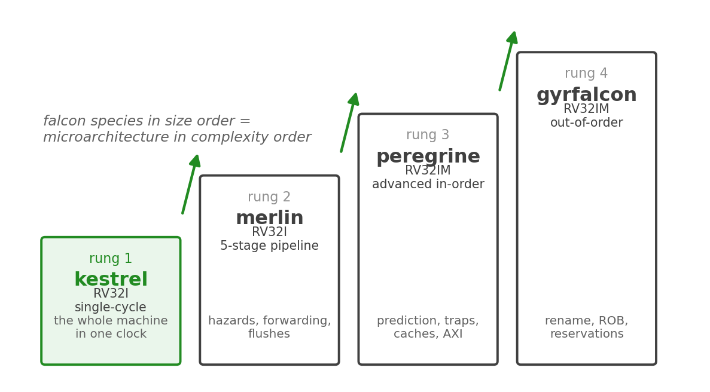

<!-- RTL Design Sherpa Documentation Header -->
<table>
<tr>
<td width="80">
  
</td>
<td>
  <strong>RTL Design Sherpa</strong> · <em>Learning Hardware Design Through Practice</em> 
  
    <a href="https://github.com/sean-galloway/RTLDesignSherpa">GitHub</a> ·
    <a href="https://github.com/sean-galloway/RTLDesignSherpa/blob/main/docs/DOCUMENTATION_INDEX.md">Documentation Index</a> ·
    <a href="https://github.com/sean-galloway/RTLDesignSherpa/blob/main/LICENSE">MIT License</a>
  
</td>
</tr>
</table>

---

<!-- End Header -->

# Purpose and Scope

## Document Purpose

This Hardware Architecture Specification is the integration contract for the kestrel-rv32i core. It specifies:

1. **System architecture** - what the core is, what surrounds it, and how the pieces connect
2. **ISA scope** - exactly which instructions and instruction classes the core implements, and how it treats the classes it does not
3. **External interfaces** - complete port specifications for `kestrel_core` and the optional `kestrel_mem_loader`, including the AXIL programming interface
4. **Boundary behavior** - the memory contract, the halt contract, and the retirement-report (RVFI) contract
5. **Performance characteristics** - cycles per instruction and what limits the clock
6. **Integration requirements** - embedding recipes, filelists, verification hooks, and known limitations

---

## What kestrel Is

kestrel-rv32i ("kestrel") is a single-cycle RV32I processor core: one instruction retires per clock, and the entire machine — fetch, decode, register read, execute, memory access, writeback — completes inside that clock. It is rung 1 of the RISC-V falcon suite, the suite's deliberately simplest machine, and its role is to exhibit everything the ISA promises and nothing the microarchitecture adds.

### Figure 1.1: The falcon ladder, smallest to largest

Each falcon-suite rung teaches exactly one layer of computer-architecture machinery, and each rung reuses the rung below it. kestrel's decode truth table becomes rung 2's per-stage control; rung 3 replaces kestrel's halt-with-cause stub with real trap delivery; rung 4 adds out-of-order execution. kestrel documents its simplifications honestly because the later rungs are where those simplifications are replaced.

---

## Scope

### In Scope

- RV32I base integer instruction set: all 37 instructions (unpriv §2.1)
- Documented, bounded behavior for the FENCE/FENCE.I and SYSTEM opcode classes
- Hardware misaligned load/store handling, including the two-cycle cross-word retry
- The halt contract: four halt causes, trap-beat retirement, post-halt hold
- The RVFI retirement-report channel
- The optional `kestrel_mem_loader` board glue: AXIL slave, on-chip memories, load-then-run control

### Explicit Non-Goals

The following are **not** provided, and integrators must not rely on them:

| Non-goal | What kestrel does instead |
|----------|---------------------------|
| M extension (multiply/divide) | Illegal instruction (halt cause `0xF`) |
| C extension (compressed instructions) | IALIGN=32 only; C encodings are illegal instructions |
| Real CSR support | Bounded CSR stub: reads return zero, writes drop, retired as a documented stub (not CSR support) |
| Real trap/exception handling | Halt: the core stops with a cause code; no trap vector, no `mepc`/`mtvec`, no privilege transfer |
| Interrupts (M/S/U) | Nothing; no interrupt inputs exist |
| MMU / virtual memory / paging | None; all addresses are physical, memory protection does not exist |
| PMP, counters, debug mode | None |
| Misaligned instruction fetch | Never executed; a taken control transfer to a non-4-aligned target halts (cause `0x3`) |

: Explicit non-goals of kestrel-rv32i

The suite's rung 3 (peregrine) is where real trap handling, a machine-mode CSR file, and caches enter. kestrel keeps the seam visible on purpose.

---

## Intended Audience

| Audience | Primary use of this document |
|----------|------------------------------|
| System architects | Decide whether kestrel fits the system; understand the contracts |
| Hardware engineers | Embed the core; wire the loader; close timing against the memory contract |
| Software/firmware engineers | Link images for the core; understand halt semantics and the CSR stub boundary |
| Verification engineers | Plan core-level and system-level coverage against the testplans |

: Intended audience

---

## Specification Conventions

- Signal and parameter names appear in code font exactly as in the RTL (`dmem_wstrb`, `RESET_ADDR`) so every claim can be grepped.
- Hexadecimal values use `0x` or SystemVerilog sizing (`32'hFFFF_FFFE`); encodings use sized binary (`7'b0110011`).
- Instruction mnemonics are uppercase (ADD, JALR); assembly in prose is lowercase.
- The RISC-V specification is cited by chapter and section (`unpriv §2.1.6`), never by page; the pinned PDF at `projects/components/riscv-ip/references/riscv-spec.pdf` is the authority.
- **Halt versus trap** is used the way the core uses its ports: a *trap* is a control transfer to a handler (kestrel never traps); a *halt* is kestrel's stop condition — PC frozen, writeback suppressed, cause code on `halt_cause`.

---

**Last Updated:** 2026-10-07
