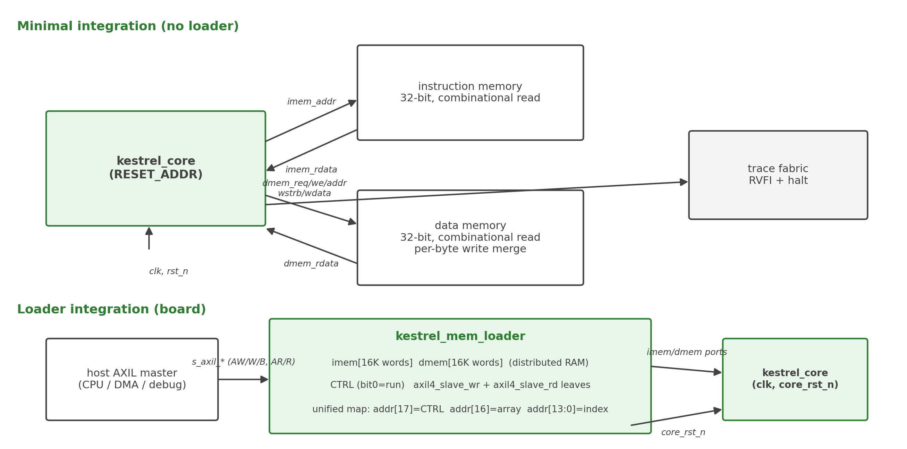

<!-- RTL Design Sherpa Documentation Header -->
<table>
<tr>
<td width="80">
  
</td>
<td>
  <strong>RTL Design Sherpa</strong> · <em>Learning Hardware Design Through Practice</em> 
  
    <a href="https://github.com/sean-galloway/RTLDesignSherpa">GitHub</a> ·
    <a href="https://github.com/sean-galloway/RTLDesignSherpa/blob/main/docs/DOCUMENTATION_INDEX.md">Documentation Index</a> ·
    <a href="https://github.com/sean-galloway/RTLDesignSherpa/blob/main/LICENSE">MIT License</a>
  
</td>
</tr>
</table>

---

<!-- End Header -->

# System Overview

## Top-Level Description

kestrel is delivered as two synthesizable modules and a shared package:

| Deliverable | File | Role |
|-------------|------|------|
| `kestrel_pkg` | `rtl/includes/kestrel_pkg.sv` | Shared enums and the halt-cause encodings (single source of truth) |
| `kestrel_core` | `rtl/top/kestrel_core.sv` | The RV32I core: fetch port, data port, halt outputs, RVFI retire port |
| `kestrel_mem_loader` | `rtl/fub/kestrel_mem_loader.sv` | Optional board glue: two 64 KB on-chip memories behind an AXIL slave, with load-then-run control of the core |

: kestrel deliverables

The core has no memory inside it. Integration therefore always means: core + instruction memory + data memory, where both memories must honor the combinational-read contract of Chapter 4. The loader exists for boards: it implements both memories as distributed-RAM arrays and lets a host load a program over AXIL before releasing the core from reset.

---

## System Context

### Figure 2.1: kestrel in a minimal system and in a loader-based SoC

The left side shows the minimal integration: `kestrel_core` with two independently provided memories. The right side shows the loader integration: `kestrel_mem_loader` supplies both memories and a run-control register; a host agent on the SoC interconnect (a CPU, a DMA engine, or a debug port) drives the loader's AXIL slave to load the image and start the core.

### Minimal Integration (No Loader)

Provide:
- A 32-bit-wide instruction memory with combinational read (`imem_addr` in, `imem_rdata` out, same cycle)
- A 32-bit-wide data memory with combinational read and a per-byte write merge honoring `dmem_wstrb` (word write `dmem_wdata`)

This is the integration used by the simulation testbench `dv/tb/kestrel_tb_top.sv` (with a unified 64 Ki-word array serving both ports so self-modifying code works with no coherence path — a testbench choice, not a core feature).

### Loader Integration (Boards)

Provide:
- One clock (`aclk`) and one active-low reset (`aresetn`)
- An AXIL master able to write the loader's address map (AW/W/B and AR/R channels)
- Optionally, observation of `core_rst_n` and the two `o_dbg_busy_*` taps

The loader holds the core in reset while `CTRL.run == 0`, takes the program image over AXIL, and releases the core when software writes `CTRL.run = 1`. See Chapter 4 for the address map and programming sequence.

---

## Key Features

| Feature | Value |
|---------|-------|
| ISA | RV32I base integer, all 37 instructions (unpriv §2.1) |
| Microarchitecture | Single-cycle; no pipeline, no FSM in the datapath |
| Memory interface | Harvard: separate 32-bit fetch and data ports, combinational reads |
| Misaligned data | Handled in hardware; cross-word accesses take a 2-cycle retry |
| Exceptions | None delivered; four halt causes on `halt`/`halt_cause` ports |
| Observability | First-class RVFI retire channel (17 signals) plus halt ports |
| Board support | Optional AXIL loader with 64 KB imem + 64 KB dmem and run control |
| Configuration | One core parameter (`RESET_ADDR`); eight loader parameters |

: Key features

---

**Last Updated:** 2026-10-07
