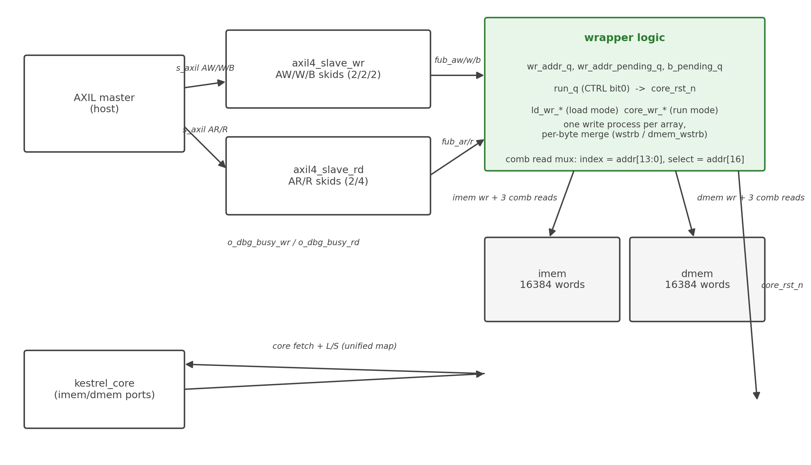

<!-- RTL Design Sherpa Documentation Header -->
<table>
<tr>
<td width="80">
  <a href="https://github.com/sean-galloway/RTLDesignSherpa">
    
  </a>
</td>
<td>
  <strong>RTL Design Sherpa</strong> · <em>Learning Hardware Design Through Practice</em><br>
  <sub>
    <a href="https://github.com/sean-galloway/RTLDesignSherpa">GitHub</a> ·
    <a href="https://github.com/sean-galloway/RTLDesignSherpa/blob/main/docs/DOCUMENTATION_INDEX.md">Documentation Index</a> ·
    <a href="https://github.com/sean-galloway/RTLDesignSherpa/blob/main/LICENSE">MIT License</a>
  </sub>
</td>
</tr>
</table>

---

<!-- End Header -->

# kestrel_mem_loader

## Purpose

`kestrel_mem_loader` is the optional board glue (HAS Ch. 4 specifies its external contract; this section covers how it is built). It contains: two 16384-word distributed-RAM arrays (`imem`, `dmem`), a CTRL/run register, and the write-port merge logic — wrapped in the repo's skid-buffered AXIL leaf slaves, composed exactly as `rtl/amba/shared/sdpram_slave_axil_axil.sv` composes them. Mutual exclusion between loader and core is by protocol; there is no contention arbiter and no FSM in the datapath.

### Figure 2.1: Loader composition



## Memory Arrays

- `(* ram_style = "distributed" *) logic [31:0] imem [0:MEM_WORDS-1]` (and `dmem`) — the attribute keeps reads combinational, which the single-cycle contract requires; a block RAM's synchronous read would break it.
- One write port each, merging two clients per byte lane in a single clocked process: the loader (`ld_wr_*`, gated by `!run_q`) and the core (`core_wr_*`, gated by `run_q && dmem_req && dmem_wstrb != 0`). Both are additionally fenced during reset assertion.
- Under the unified map each array carries up to three combinational read ports (core fetch, core L/S, AXIL readback); distributed-RAM read replication absorbs that in synthesis.
- Power-up content is undefined in hardware; the simulation model zero-initializes so pre-load reads are deterministic. An image is always loaded before run.

## CTRL / Run Register and Reset Sequencing

`run_q` is a sticky bit (set by a CTRL write with `wstrb[0] & wdata[0]`, cleared only by reset). `core_rst_n` is literally `run_q`: low in load mode (the core is held, parks its fetch at `RESET_ADDR`, retires nothing), high from the commit cycle of the run write. Power-on default is load mode.

## Write Side: Leaf Slave plus Two Holding Bits

The `axil4_slave_wr` leaf terminates the AW/W/B protocol into FUB nets. The wrapper's entire write-side state is two holding bits plus the run register:

- `wr_addr_q` / `wr_addr_pending_q`: the AW address holds until its W beat fires (`fub_awready = !wr_addr_pending_q || w_fire`; a same-cycle swap lets a new AW in as the old W fires).
- `b_pending_q`: at most one B outstanding (`fub_wready = wr_addr_pending_q && !b_pending_q`); B returns OKAY one holding bit deep and the leaf's B skid buffers it against the master.

Loader-write qualification: `ld_wr_fire = w_fire && !wr_addr_q[CTRL_BIT] && !run_q` — memory writes land only in load mode; CTRL writes never touch the arrays. Run-mode loader writes are dropped in logic with B still OKAY (testplan scenario ML-09).

## Read Side: Combinational Beat through the AR Skid

The `axil4_slave_rd` leaf supplies the AR/R handshake; the wrapper's response is a single-cycle combinational beat: `fub_arready = fub_rready` (AR accepted exactly when the R skid can take the beat), `fub_rvalid = fub_arvalid`, `fub_rresp = OKAY`. The read mux is:

```
fub_rdata = fub_araddr[CTRL_BIT] ? {31'b0, run_q}
          : fub_araddr[DMEM_BIT] ? dmem[fub_araddr[WORD_IDX_W-1:0]]
          :                        imem[fub_araddr[WORD_IDX_W-1:0]];
```

Core-side reads select the array the same way: `imem_rdata = imem_addr[DMEM_BIT] ? dmem[imem_addr[13:0]] : imem[imem_addr[13:0]]` (and likewise for `dmem_rdata`), which is what makes one flat image coherent across fetch, L/S, and AXIL readback.

## Address Map, as Implemented

| Item | Implementation |
|------|----------------|
| Array word index | `addr[13:0]` of the presenting port's byte address (`WORD_IDX_W = $clog2(MEM_WORDS) = 14`), AXIL and core alike |
| Array select | `addr[16]`: 0 = imem, 1 = dmem, on every port (unified map) |
| CTRL decode | `addr[17] = 1` → CTRL register at `0x0002_0000` |

: Loader map implementation facts

Two consequences the maintainer must not "tidy" without a plan-level decision: byte-address bits [15:14] are not decoded, so each region's 64 KB byte window aliases onto its array every `0x4000` bytes; and because the core presents only word-aligned addresses, its window is the 4096 word-aligned slots (16 KB of image) per array — the delivery testbench streams word *k* to AXIL byte address `4*k`, which is the convention that keeps loader and core views identical. The module header's `addr[15:2]` wording describes intent; the implemented `addr[13:0]` slice above is the as-built truth this specification documents.

## Debug Taps

`o_dbg_busy_wr` / `o_dbg_busy_rd` are the leaf slaves' busy outputs, exposed for the AXIL backpressure checks (scenario ML-08).

---

**Last Updated:** 2026-10-07
