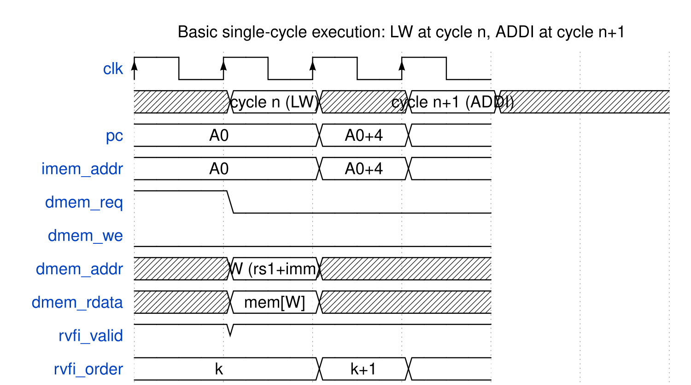

<!-- RTL Design Sherpa Documentation Header -->
<table>
<tr>
<td width="80">
  
</td>
<td>
  <strong>RTL Design Sherpa</strong> · <em>Learning Hardware Design Through Practice</em> 
  
    <a href="https://github.com/sean-galloway/RTLDesignSherpa">GitHub</a> ·
    <a href="https://github.com/sean-galloway/RTLDesignSherpa/blob/main/docs/DOCUMENTATION_INDEX.md">Documentation Index</a> ·
    <a href="https://github.com/sean-galloway/RTLDesignSherpa/blob/main/LICENSE">MIT License</a>
  
</td>
</tr>
</table>

---

<!-- End Header -->

# The Single Cycle, Step by Step

## The Clock in One Sentence

On every rising edge, kestrel writes one register-file entry (maybe), updates the PC (unless held), and moves its bookkeeping flops — while a combinational cloud standing between `pc` and the next edge computes everything the next cycle needs: the fetched instruction, its decode, the operands, the result, the memory access, the next PC, and the RVFI record for whatever retires this cycle.

The sections below follow the data in dependency order through a fully general cycle.

## 1. Fetch and Decode

`imem_addr = pc` and `insn = imem_rdata` — the instruction memory answers in the same cycle. Decode is the truth table of the kestrel_decode chapter, producing the thirteen-field control bundle plus defaults of "no operation, no halt."

## 2. Operands and Immediates

The register file reads `rs1 = insn[19:15]` and `rs2 = insn[24:20]` combinationally; x0 reads zero because the file ties it. The immediate generator builds one of the five format immediates under `imm_sel`. Two muxes select the ALU inputs: `alu_src_a` is the PC (for AUIPC and branch targets) or `rs1_data`; `alu_src_b` is the immediate or `rs2_data`.

## 3. Execute

The ALU computes one of ten operations. For branches, the dedicated comparator evaluates `cmp_eq/cmp_lt/cmp_ltu` on `rs1_data`/`rs2_data` in parallel, with funct3 selecting the condition in a `unique case`. Both the ALU's target (`pc + imm`, since `alu_src_a = pc` on branch rows) and the taken decision are ready when the next PC is chosen — taken and not-taken branches cost the same cycle.

## 4. Memory Access

For loads and stores, `dmem_addr` is the word-aligned ALU result (`{alu_y[31:2], 2'b00}` — or the next word on a retry beat), `dmem_wdata`/`dmem_wstrb` are the rotated store data and byte enables, and read data is rotated back before size/sign selection implements LB/LBU/LH/LHU/LW. Aligned and in-word-misaligned accesses complete in this one cycle; a cross-word access holds the PC for a retry cycle and issues a second beat (next section).

## 5. Writeback

`rd_wdata` is selected by the five-row priority mux (CSR stub zero → LUI immediate → load data → link `pc+4` → ALU result); `rd_wen_eff = rd_wen & ~ls_first & ~halt` qualifies it; the write commits on the edge.

## 6. Next-PC Selection and the Edge

The next-PC mux selects among JAL/JALR target, taken-branch target, and `pc + 4`. The PC register loads `next_pc` on the edge — unless `halt` (frozen) or `ls_first` (held for the retry beat). `rvfi_pc_wdata = next_pc` reports the architecturally next PC on the retire beat.

## The Basic Cycle on the Pins

### Waveform 4.1: Basic single-cycle execution — an aligned load followed by an ALU op

Two back-to-back retiring instructions. During cycle *n* the LW's full path — imem read, decode, register read, ALU address, dmem read, rotate/sign-extend, writeback mux — completes between the same two edges, and the beat retires (`rvfi_valid=1`) with the load's memory fields. The ADDI in cycle *n+1* retires just the same: CPI 1 with no bubbles, because the whole machine is combinational between the PC and the edge.

## Branch and Jump Resolution

| Transfer | Target computation | Decision source | Cost |
|----------|--------------------|-----------------|------|
| BEQ/BNE/BLT/BGE/BLTU/BGEU | `pc + imm(B)` — ALU row `alu_src_a_pc=1` | dedicated comparator, funct3-selected | 1 cycle, taken or not |
| JAL | `pc + imm(J)` | unconditional (`jump=1`) | 1 cycle |
| JALR | `(rs1_data + imm) & 32'hFFFF_FFFE` | unconditional (`jalr=1`) | 1 cycle |
| Taken transfer to `next_pc[1:0] != 00` | computed but not committed | `misalign_target` → halt cause `0x3` | halts (next section) |

: Control-transfer resolution

---

**Last Updated:** 2026-10-07
