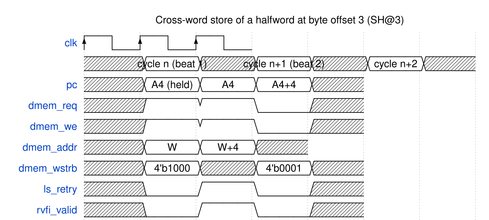

<!-- RTL Design Sherpa Documentation Header -->
<table>
<tr>
<td width="80">
  
</td>
<td>
  <strong>RTL Design Sherpa</strong> · <em>Learning Hardware Design Through Practice</em> 
  
    <a href="https://github.com/sean-galloway/RTLDesignSherpa">GitHub</a> ·
    <a href="https://github.com/sean-galloway/RTLDesignSherpa/blob/main/docs/DOCUMENTATION_INDEX.md">Documentation Index</a> ·
    <a href="https://github.com/sean-galloway/RTLDesignSherpa/blob/main/LICENSE">MIT License</a>
  
</td>
</tr>
</table>

---

<!-- End Header -->

# Cross-Word Misaligned Retry

## When the Retry Fires

The L/S datapath completes any access with `addr[1:0] + size <= 4` in the single cycle — every aligned access and every misaligned access that stays inside one word. When `addr[1:0] + size > 4` the access straddles two words, one 32-bit beat cannot carry it, and the retry machinery engages:

- `ls_crossing = ls_active & ((ls_offset + ls_size_bytes) > 4)`
- `ls_first = ls_crossing & ~ls_retry` — the first beat is in flight
- `ls_second = ls_retry` — the retry beat
- `ls_retry <= ls_first` — one bit of control state; no FSM

## Beat-by-Beat Behavior

| Aspect | Beat 1 (`ls_first`) | Beat 2 (`ls_second`) |
|--------|---------------------|----------------------|
| `dmem_addr` | `{alu_y[31:2], 2'b00}` — word containing the start | `{alu_y[31:2] + 1, 2'b00}` — the next word |
| Store data | `rs2_data << (8*o)` | `rs2_data >> (8*(4-o))` |
| Store strobe | `size_mask << o` (tail bytes) | `ls_head_strobe` (head bytes only) |
| Load path | `ls_rdata_lo <= dmem_rdata >> (8*o)` | `ls_raw_rdata = (dmem_rdata & head_mask) << (8*(4-o)) \| (ls_rdata_lo & tail_mask)` |
| PC | held (`pc <= ls_first ? pc : next_pc`) | advances on the edge |
| `rvfi_valid` | low — no partial beat leaks | high — the access retires once, with assembled data |

: The two beats of a cross-word access (o = `addr[1:0]`)

Everything else in the core is unaware the retry happened: `dmem_req` (and `dmem_we` for stores) simply stays high across both beats while the address steps by one word.

## The Waveform

### Waveform 4.2: Cross-word store retry — SH at byte offset 3

A store-halfword at byte offset 3 (the SH@3 case): beat 1 writes the tail byte of word W with strobe `4'b1000`; beat 2 writes the head byte of word W+4 with strobe `4'b0001`, data right-rotated by the tail size. `dmem_req`/`dmem_we` stay high across both beats, `ls_retry` marks the retry cycle, the PC holds for one extra cycle, and the instruction retires exactly once — `rvfi_valid` high only on the final cycle.

## Worked Example: a Halfword Across the Boundary

`lh x2, 7(x10)` with x10 = 0x1000 reads the halfword at 0x1007 — one byte at offset 3 of word 0x1000 and one at offset 0 of word 0x1004.

- Beat 1: `dmem_addr = 0x1000`, read data `>> 24`, captured into `ls_rdata_lo` — the tail byte.
- Beat 2: `dmem_addr = 0x1004`, head byte merged at bits [15:8]; the halfword is sign-extended from bit 15 into x2.
- RVFI: one beat, `mem_addr = 0x1007`, `rmask = 0011` packed from the addressed address, `mem_rdata` holding the assembled halfword in bits [15:0].

A directed test with distinct nonzero bytes on both sides of the boundary (`ls_misaligned`) pins this end to end; a first-cut implementation that silently truncated bytes rotating past bit 31 reported `0x00FE` where the architectural answer was `0xCAFE` — caught because the golden interpreter models the full two-word semantics and the lockstep diff tolerates no slop.

## Why Hardware, Why Two Cycles

Trapping to software emulation needs the trap machinery kestrel deliberately does not have, and emulating in a trap stub would make the misaligned case a hundred cycles instead of two. Hardware handling keeps every access at fixed cost — one cycle in-word, two crossing — which is the only cost model a single-cycle core can afford to reason about. The price is integration: a misaligned word access performs two word reads/writes and is not atomic, which the spec never promised anyway (unpriv §2.1.6). Instruction-side misalignment is not permitted this latitude — the next section covers the halt.

---

**Last Updated:** 2026-10-07
