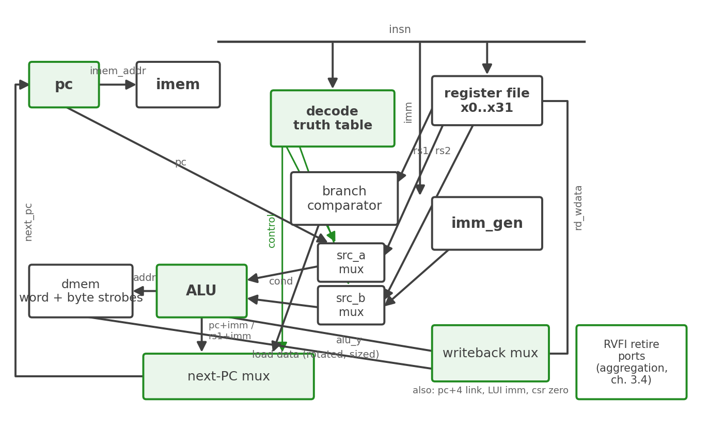

# Datapath Overview

## The machine in one picture

kestrel is six SystemVerilog modules and one package. Fetch is a wire:
`imem_addr` is driven directly by the PC register and `imem_rdata` is
the instruction. Everything else — decode, immediate generation,
register read, execute, memory access, writeback, next-PC selection,
retirement reporting — is combinational logic wrapped around a handful
of state elements.

### Figure 3.1: kestrel block diagram

The diagram is drawn to match the RTL: the blocks are the module
instances in `kestrel_core.sv`, and every named wire is a real signal in
the source.

## The module list

| Module | Role | State |
| --- | --- | --- |
| `kestrel_pkg` | Shared enums (`alu_op_e`, `imm_sel_e`) and the halt-cause encodings | none |
| `kestrel_regfile` | 32 x 32-bit registers, two combinational read ports, one synchronous write, x0 tied to zero | 32 words |
| `kestrel_imm_gen` | Builds the 32-bit immediate for the five formats | none |
| `kestrel_alu` | Ten operations: ADD SUB AND OR XOR SLL SRL SRA SLT SLTU | none |
| `kestrel_decode` | Combinational truth table from `{opcode, funct3, funct7}` to a thirteen-field control bundle | none |
| `kestrel_core` | Wires the leaves together: source muxes, branch comparator, next-PC mux, writeback mux, load/store rotation, halt, RVFI | 5 flops + counters |

: kestrel's six modules

## The state inventory

Everything kestrel remembers, outside the register file:

| Element | Width | Purpose |
| --- | --- | --- |
| `pc` | 32 | Program counter; resets to `RESET_ADDR` (default 0) |
| `retire_count` | 64 | RVFI retirement order: 0, 1, 2, ... |
| `halt_q` | 1 | Halt holding register; latches any halt cause |
| `ls_retry` | 1 | Cross-word load/store retry-cycle flag (control state) |
| `ls_rdata_lo` | 32 | First-word read data captured for the retry-cycle merge |

: The complete kestrel state inventory, register file aside

That is the whole machine. Five flops plus a 32-word register file is
the entire sequential content of a core that passes the rv32ui battery
and the riscv-formal ISA proofs — the single-cycle discipline buys its
simplicity honestly, and this table is the receipt. There is no FSM
anywhere: the retry bit and the halt bit are plain holding flops, and
Chapter 4 shows why no more control state exists.

## Reading the chapters that follow

Chapter 3's remaining sections trace one cycle end to end (section 2),
catalog the state and its gating (section 3), and specify the RVFI
retire interface (section 4). Chapter 4 opens the decode truth table
itself.

**Source:** `rtl/kestrel_core.sv`, `rtl/kestrel_regfile.sv`,
`rtl/kestrel_decode.sv`, `rtl/kestrel_alu.sv`, `rtl/kestrel_imm_gen.sv`,
`rtl/kestrel_pkg.sv`
