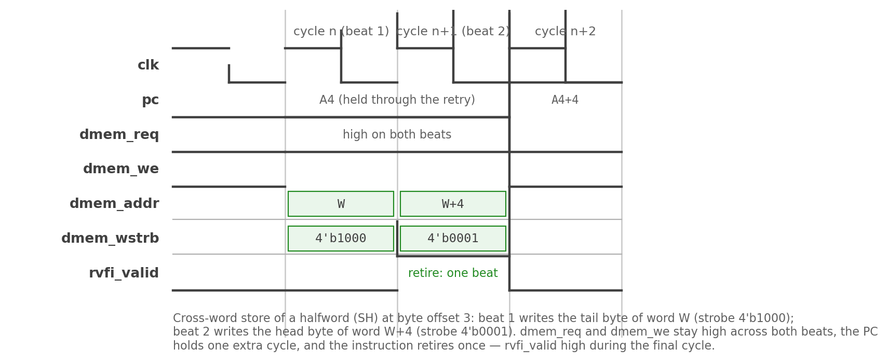

# Misaligned Data Accesses

## What the spec permits

RV32I does not require misaligned load/store support, but it explicitly
permits it: an execution environment may handle misaligned accesses in
hardware, invisibly trap and emulate them, or trap and refuse, and it
may treat accesses to side-effecting regions differently (spec Volume I,
section 2.1.6). Naturally aligned accesses are guaranteed atomic;
misaligned accesses are explicitly *not* required to be atomic. The
design space is open, and kestrel's plan records the decision: **handle
misaligned loads and stores in hardware.** No trap, no emulation, no
slow-path ABI — the byte lanes absorb the misalignment, and
rv32ui-p-ma_data passes on the datapath alone.

This is a *data*-only policy. Instruction-side misalignment is not
permitted to be handled in hardware by anything, and section 3 of this
chapter covers how kestrel honors that asymmetry.

## The rotation model

Sub-word accesses are implemented by byte-lane rotation. For an access
at byte offset `o = addr[1:0]` with size bytes `s`:

- **Store:** `dmem_wdata = rs2_data << (8*o)` — the value slides into
  the addressed lanes; `dmem_wstrb = size_mask << o` — the byte enables
  slide with it. The testbench memory merges enabled bytes into the
  word.
- **Load:** `rdata_shifted = dmem_rdata >> (8*o)` — the addressed bytes
  slide down to bit 0; a size mask keeps exactly `s` bytes, and a final
  case implements LB (sign-extend from bit 7), LBU/LHU (zero-extend),
  LH, LW.

When the access fits in one word (`o + s <= 4`) — which includes every
*aligned* access and every misaligned access that does not cross a word
boundary — this rotation is the entire mechanism and the access
completes in the single cycle, exactly like an aligned one.

## Crossing a word: the retry cycle

When `o + s > 4`, the access straddles two words and one 32-bit beat
cannot carry it. kestrel splits the access across two beats with one
retry bit of control state (Chapter 3):

1. **First beat (`ls_first`).** Address is the aligned word containing
   the access start. For stores, the tail bytes (`4 - o` of them) are
   written with the original left-rotated strobe. For loads, the shifted
   first word is captured into `ls_rdata_lo`. The PC holds; no
   retirement (`rvfi_valid` low).
2. **Second beat (`ls_second`).** Address is the next word (`word + 1`).
   For stores, the remaining head bytes are written with a head-only
   strobe, data right-rotated by the tail size. For loads, the second
   word's head is read, shifted up, and merged with the captured tail:
   `assembled = (second & head_mask) << (8*(4-o)) | (first & tail_mask)`.
   The instruction retires now, on this final cycle, with one RVFI beat.

### Figure 5.1: The two-beat cross-word access

The retry is visible on the memory pins and RVFI: `dmem_addr` steps
by one word, `dmem_req` (and `dmem_we` for stores) stays high across
both beats, the PC freezes for the retry cycle, and `rvfi_valid` marks
only the final cycle. Everything else in the core is unaware the retry
happened.

## Worked example: a halfword across the boundary

`lh x2, 7(x10)` with x10 = 0x1000 reads the halfword at 0x1007 — one
byte at offset 3 of word 0x1000 and one at offset 0 of word 0x1004.

- Beat 1: `dmem_addr = 0x1000`, read data `>> 24`, captured into
  `ls_rdata_lo` — the tail byte.
- Beat 2: `dmem_addr = 0x1004`, head byte merged at bits [15:8]; the
  halfword is sign-extended from bit 15 into x2.
- RVFI: one beat, `mem_addr = 0x1007`, `rmask = 0011` packed from the
  addressed address, `mem_rdata` holding the assembled halfword in bits
  [15:0].

A directed test with distinct nonzero bytes on both sides of the
boundary (`ls_misaligned`) pins this end to end; a first-cut
implementation that silently truncated bytes rotating past bit 31
reported `0x00FE` where the architectural answer was `0xCAFE` — caught
because the golden interpreter models the full two-word semantics and
the lockstep diff tolerates no slop.

## Why not trap?

Trapping to software emulation needs the trap machinery kestrel
deliberately does not have (Chapter 2), and emulating in a trap stub
would make the misaligned case a hundred cycles instead of two. Hardware
handling keeps every access at fixed cost — one cycle in-word, two
crossing — which is the only cost model a single-cycle core can afford
to reason about. The price is integration: a misaligned word access
performs two word reads/writes and is not atomic, which the spec never
promised anyway.

**Source:** RISC-V Instruction Set Manual, Volume I, section 2.1.6;
`rtl/kestrel_core.sv` (L/S rotation and retry);
`dv/tests/programs/ls_misaligned.s`, `ls_chain.s`;
task-7 report (cross-word fix round)
