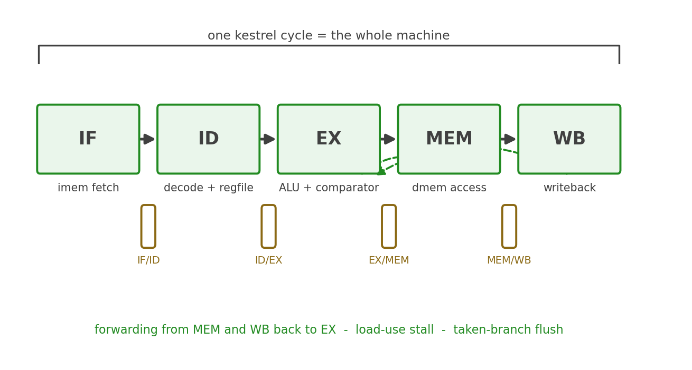

# The Next Rung: merlin

## The five-stage answer

merlin, rung 2 of the falcon suite, keeps kestrel's ISA bit-for-bit and
changes the time dimension: instead of one cycle per instruction, an
instruction flows through five stages — IF, ID, EX, MEM, WB — with
pipeline registers between them, so five instructions are in flight at
once and the clock only has to span one stage. The same ADD that paid
for the load's path in kestrel pays for the ALU's alone in merlin; that
is the entire economic argument for pipelining, and it is also where
every new problem comes from.

### Figure 7.1: kestrel's cycle, cut into merlin's stages

The figure draws the correspondence explicitly: kestrel's combinational
cloud between two PC edges is merlin's five stage boundaries. Nothing
new is *computed* at rung 2; the computation is the same — it is
*overlapped*.

## What appears when the cycle is cut

Each new mechanism is the direct consequence of one cut:

- **Pipeline registers (IF/ID, ID/EX, EX/MEM, MEM/WB).** The boundary
  between stages becomes state, which is the first real state kestrel's
  control has ever had.
- **RAW hazards and forwarding.** An instruction in EX may need the
  result of the instruction ahead of it, still in MEM or WB. merlin
  forwards EX/MEM and MEM/WB results back into EX with an explicit
  priority — the forwarding matrix is Chapter 1 of merlin's book.
- **Load-use interlock.** A load's data isn't available until the end of
  MEM, one cycle too late for the dependent instruction in EX. The
  interlock stalls one cycle — the first stall the suite has ever had.
- **Control hazards.** Branches resolve in EX under merlin's
  predict-not-taken policy; a taken branch flushes the two fetched
  instructions behind it. Kestrel's taken-branch timing freedom
  (one cycle either way) becomes a two-instruction penalty and a
  flush path.
- **The same verification, adapted.** The RVFI aggregation that kestrel
  drives combinationally per cycle becomes merlin's retirement logic,
  and the riscv-formal checks are adapted to a retire interface; the
  battery, the lockstep harness, and the golden interpreter carry over
  because the ISA does not change.

## What carries over unchanged

The investment kestrel already made transfers directly: the decode truth
table (Chapter 4) is still the complete specification of what each
instruction does — merlin just evaluates it in different stages; the
register file and ALU leaves are reused as-is; the memory contract's
word-wide, byte-strobed data port is unchanged; the halt causes survive
as the core's stop contract; and the documentation style — decisions
stated plainly, spec citations by chapter — is the suite's doctrine, not
kestrel's habit. Even the CSR stub carries forward unchanged: merlin has
no more CSR state than kestrel.

## Why the ladder stops here first

kestrel is complete on its own terms — a verified RV32I core with a
documented contract and a proof-backed verification record. What it is
not is fast, and it cannot be made fast without becoming something
else. The suite's argument is that "something else" is best understood
as a sequence of one-concept-at-a-time changes, each motivated by a
cost the previous rung made visible. Chapter 7's cost accounting is the
motivation; merlin is the first payment. When its book exists, it will
cite this one the same way this one cites the specification — by
chapter, with the seams labeled.

**Source:** falcon-suite design spec, "Rung 2 — merlin"; Hennessy et
al., "MIPS" (papers, entry 3) for the stage partition; Flynn (papers,
entry 2) for throughput versus latency
