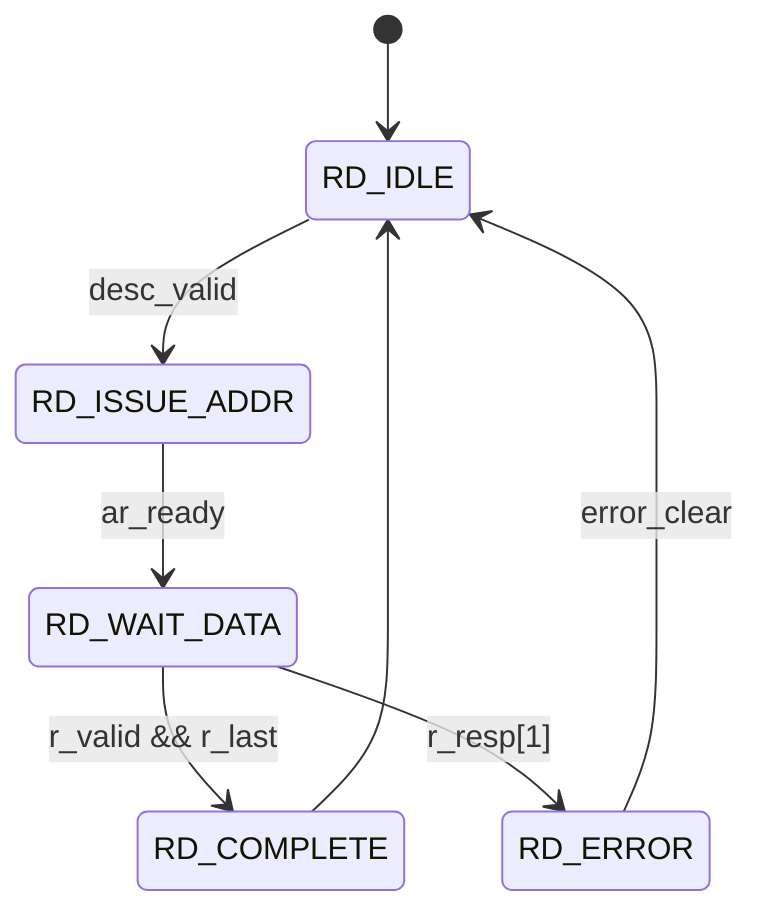

# STREAM Subsystem Diagram Generation Plan

**Date:** November 22, 2025
**Status:** READY FOR IMPLEMENTATION
**Scope:** FSM and Block Diagrams for STREAM Documentation

---

## Executive Summary

The STREAM subsystem documentation already has comprehensive Mermaid diagrams for architecture and data flow. This plan provides a detailed guide for:

1. Verifying all existing diagrams are correctly referenced
2. Understanding the FSM states across all modules
3. Generating any missing or updated diagrams as RTL evolves
4. Maintaining the diagram naming convention and asset organization

**Current Status:** 14 Mermaid source files exist, supporting all documented blocks.

---

## Quick Facts

- **Total Existing Diagrams:** 14
- **Missing FSM Diagrams:** 1 (descriptor engine)
- **Block Diagrams Complete:** Yes (all major blocks covered)
- **Location:** `projects/components/stream/docs/stream_spec/assets/mermaid/`
- **Naming Convention:** `{module}_{line_number}.mmd`

---

## Section 1: Diagram Inventory

### Existing Diagrams (14 Total)

| File | Doc | Type | Status |
|------|-----|------|--------|
| `02_apbtodescr_L020.mmd` | 13_apbtodescr.md | Block Diagram | VERIFIED |
| `02_apbtodescr_L120.mmd` | 13_apbtodescr.md | FSM Diagram | EXISTS |
| `02_scheduler_L035.mmd` | 04_scheduler.md | Block Diagram | VERIFIED |
| `02_scheduler_L301.mmd` | 04_scheduler.md | FSM Diagram | VERIFIED |
| `05_sram_controller_L038.mmd` | 08_sram_controller.md | Block Diagram | VERIFIED |
| `06_sram_controller_unit_L043.mmd` | 09_sram_controller_unit.md | Block Diagram | VERIFIED |
| `06_stream_latency_bridge_L030.mmd` | 10_stream_latency_bridge.md | Block Diagram | VERIFIED |
| `07_stream_alloc_ctrl_L073.mmd` | 07_stream_alloc_ctrl.md | Block Diagram | VERIFIED |
| `08_axi_read_engine_L034.mmd` | 06_axi_read_engine.md | Block Diagram | VERIFIED |
| `09_sram_controller_L030.mmd` | 08_sram_controller.md | Block Diagram | VERIFIED |
| `09_stream_drain_ctrl_L073.mmd` | 11_stream_drain_ctrl.md | Block Diagram | VERIFIED |
| `10_axi_write_engine_L051.mmd` | 12_axi_write_engine.md | Block Diagram | VERIFIED |
| `11_scheduler_group_L037.mmd` | 03_scheduler_group.md | Block Diagram | VERIFIED |
| `12_scheduler_group_array_L038.mmd` | 02_scheduler_group_array.md | Block Diagram | VERIFIED |

---

## Section 2: State Machines in STREAM

### FSM Overview

**Three primary FSMs exist in STREAM:**

#### 1. Scheduler FSM (7 States - ONE-HOT)
- **Module:** `scheduler.sv`
- **Package:** `stream_pkg.sv` (lines 82-90)
- **Diagram Status:** EXISTS ✓ (`02_scheduler_L301.mmd`)

**States:**
1. CH_IDLE - Waiting for descriptor
2. CH_FETCH_DESC - Fetching descriptor from memory
3. CH_XFER_DATA - Concurrent read AND write (critical concurrent design!)
4. CH_COMPLETE - Transfer finished
5. CH_NEXT_DESC - Descriptor chaining
6. CH_ERROR - Error handling
7. CH_RESERVED - Future extension

**Key Feature:** CH_XFER_DATA runs both read and write engines simultaneously to prevent deadlock when SRAM buffer < transfer size.

---

#### 2. Descriptor Engine FSM (5 States - BINARY)
- **Module:** `descriptor_engine.sv`
- **Package:** `stream_pkg.sv` (lines 97-103)
- **Diagram Status:** MISSING ❌

**States:**
1. RD_IDLE - Waiting for descriptor address
2. RD_ISSUE_ADDR - Issue AXI AR command
3. RD_WAIT_DATA - Wait for AXI R response
4. RD_COMPLETE - Descriptor fetched successfully
5. RD_ERROR - AXI error response

**Action Required:** Create FSM diagram and add to `05_descriptor_engine.md`

---

#### 3. APB-to-Descriptor Router FSM
- **Module:** `apbtodescr.sv`
- **Diagram Status:** EXISTS ✓ (`02_apbtodescr_L120.mmd`)

---

### Data Path Modules (NO FSM by Design)

These use streaming pipelines for throughput:
- `axi_read_engine.sv`
- `axi_write_engine.sv`
- `sram_controller.sv`
- `sram_controller_unit.sv`
- `stream_latency_bridge.sv`
- `stream_alloc_ctrl.sv`
- `stream_drain_ctrl.sv`

---

## Section 3: Diagram Locations and Naming

### Directory Structure
```
projects/components/stream/docs/stream_spec/
├── assets/mermaid/
│   ├── {name}_{line}.mmd        ← Editable source
│   ├── {name}_{line}.png        ← Generated PNG
│   └── README.md                ← Diagram guide
└── ch02_blocks/
    └── *.md                     ← Documentation files
```

### Naming Convention: `{module}_{line}.mmd`

Examples:
- `02_scheduler_L301.mmd` - Scheduler FSM at line 301 of scheduler.md
- `08_axi_read_engine_L034.mmd` - AXI read block at line 34
- `05_descriptor_engine_FSM.mmd` - NEW: Descriptor engine FSM

---

## Section 4: Missing Diagrams

### HIGH PRIORITY

#### Descriptor Engine FSM ❌
- **Location:** `05_descriptor_engine.md` (around line 50)
- **Effort:** 15 minutes
- **Complexity:** 5 states, linear flow
- **File:** Create `05_descriptor_engine_FSM.mmd`

**RTL Flow:**
```
RD_IDLE → RD_ISSUE_ADDR → RD_WAIT_DATA → RD_COMPLETE/RD_ERROR
```

---

### MEDIUM PRIORITY (Enhancement)

#### Data Flow Architecture Overview
- **Location:** `01_stream_core.md`
- **Current:** ASCII art only
- **Proposed:** Mermaid flowchart for end-to-end flow
- **Effort:** 30 minutes

#### SRAM Layout Visualization
- **Location:** `08_sram_controller.md`
- **Purpose:** Show per-channel partitioning
- **Effort:** 20 minutes

---

### LOW PRIORITY (Future)

- Arbitration flow diagram (complex)
- Timeout/error recovery flow
- Timing diagrams for critical paths

---

## Section 5: Implementation Workflow

### For Each New Diagram

#### Step 1: Analyze RTL Source
Read the state machine implementation from RTL file.

#### Step 2: Create .mmd File
**Example - State Machine:**


#### Step 3: Generate PNG
```bash
cd projects/components/stream/docs/stream_spec/assets/mermaid/
mmdc -i 05_descriptor_engine_FSM.mmd -o 05_descriptor_engine_FSM.png -w 1200 -b white --quiet
```

#### Step 4: Update Markdown
Add to `ch02_blocks/05_descriptor_engine.md`:
```markdown
### State Machine


**Source:** [05_descriptor_engine_FSM.mmd](../assets/mermaid/05_descriptor_engine_FSM.mmd)

#### State Descriptions
- **RD_IDLE:** Waiting for descriptor address from scheduler
- **RD_ISSUE_ADDR:** Asserting AXI AR command to fetch descriptor
- ...
```

#### Step 5: Commit
```bash
git add projects/components/stream/docs/stream_spec/assets/mermaid/05_descriptor_engine_FSM.*
git add projects/components/stream/docs/stream_spec/ch02_blocks/05_descriptor_engine.md
git commit -m "Add descriptor engine FSM diagram"
```

---

## Section 6: Files to Review and Edit

### RTL Files (For Understanding)
1. **Scheduler FSM:**
   - `/mnt/data/github/rtldesignsherpa/projects/components/stream/rtl/fub/scheduler.sv` (lines 256-400)
   - Already documented in diagram

2. **Descriptor Engine FSM:**
   - `/mnt/data/github/rtldesignsherpa/projects/components/stream/rtl/fub/descriptor_engine.sv` (lines 150-250)
   - NEEDS NEW DIAGRAM

3. **State Definitions:**
   - `/mnt/data/github/rtldesignsherpa/projects/components/stream/rtl/includes/stream_pkg.sv` (lines 78-103)
   - Source of truth for state names and encoding

### Documentation Files (For Updates)
1. `projects/components/stream/docs/stream_spec/ch02_blocks/05_descriptor_engine.md`
   - Add "### State Machine" section with new diagram

2. `projects/components/stream/docs/stream_spec/assets/mermaid/README.md`
   - Update diagram inventory table

3. `projects/components/stream/docs/stream_spec/stream_index.md`
   - Add descriptor engine FSM reference (optional)

---

## Section 7: Verification Checklist

For each new diagram:
- [ ] Source RTL file reviewed
- [ ] FSM states extracted accurately
- [ ] Mermaid syntax valid (test at mermaid.live)
- [ ] PNG generated with mmdc
- [ ] Both .mmd and .png committed
- [ ] Markdown reference added
- [ ] Line numbers match file
- [ ] File in `assets/mermaid/`
- [ ] README.md table updated

---

## Section 8: Quick Reference Commands

### View Existing Diagrams
```bash
ls -lh /mnt/data/github/rtldesignsherpa/projects/components/stream/docs/stream_spec/assets/mermaid/*.mmd
```

### Check References
```bash
grep -r "!\[.*\](.*mermaid" /mnt/data/github/rtldesignsherpa/projects/components/stream/docs/stream_spec/ch02_blocks/
```

### Generate All PNGs
```bash
cd /mnt/data/github/rtldesignsherpa/projects/components/stream/docs/stream_spec/assets/mermaid
for mmd in *.mmd; do
    base="${mmd%.mmd}"
    mmdc -i "$mmd" -o "${base}.png" -w 1200 -b white --quiet
    echo "Generated ${base}.png"
done
```

### Validate Syntax
Test at: https://mermaid.live/

---

## Section 9: Module-by-Module Summary

| Module | Lines | States | FSM Diagram | Block Diagram |
|--------|-------|--------|-------------|---------------|
| scheduler.sv | 600+ | 7 | EXISTS ✓ | EXISTS ✓ |
| descriptor_engine.sv | 300+ | 5 | MISSING ❌ | - |
| axi_read_engine.sv | 350+ | None | - | EXISTS ✓ |
| axi_write_engine.sv | 400+ | None | - | EXISTS ✓ |
| sram_controller.sv | 300+ | None | - | EXISTS ✓ |
| stream_core.sv | 500+ | None | - | ASCII art |
| apbtodescr.sv | 400+ | N/A | EXISTS ✓ | EXISTS ✓ |

---

## Section 10: Timeline

### Phase 1: IMMEDIATE (Next 30 minutes)
- Create descriptor engine FSM diagram (15 mins)
- Generate PNG with mmdc (5 mins)
- Update 05_descriptor_engine.md (5 mins)
- Test and commit (5 mins)

### Phase 2: SHORT-TERM (This week)
- Add data flow overview diagram
- Enhance stream_core.md with Mermaid block diagram
- Verify all existing diagrams render correctly

### Phase 3: FUTURE (Next sprint)
- Create SRAM layout visualization
- Add timing diagrams
- Create configuration flowcharts

---

## Related Resources

**Key Files:**
- State definitions: `projects/components/stream/rtl/includes/stream_pkg.sv`
- Workflow guide: `projects/components/stream/docs/stream_spec/assets/mermaid/README.md`
- RTL Design Guide: `projects/components/stream/CLAUDE.md`

**Mermaid Resources:**
- Live Editor: https://mermaid.live/
- Syntax Guide: https://mermaid.js.org/syntax/stateDiagram.html

---

**Last Updated:** November 22, 2025
**Status:** READY FOR IMPLEMENTATION
**Maintainer:** STREAM Documentation Team
