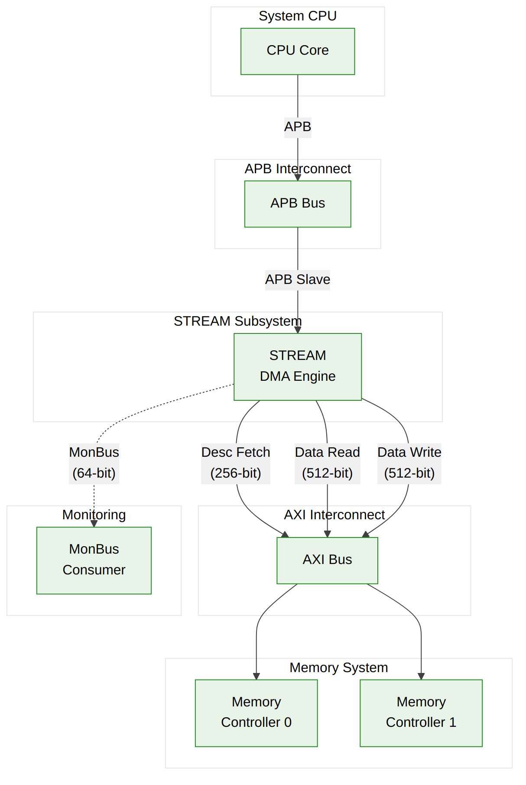

<!-- RTL Design Sherpa Documentation Header -->
<table>
<tr>
<td width="80">
  
</td>
<td>
  <strong>RTL Design Sherpa</strong> · <em>Learning Hardware Design Through Practice</em> 
  
    <a href="https://github.com/sean-galloway/RTLDesignSherpa">GitHub</a> ·
    <a href="https://github.com/sean-galloway/RTLDesignSherpa/blob/main/docs/DOCUMENTATION_INDEX.md">Documentation Index</a> ·
    <a href="https://github.com/sean-galloway/RTLDesignSherpa/blob/main/LICENSE">MIT License</a>
  
</td>
</tr>
</table>

---

<!-- End Header -->

# System Context

## System Integration Overview

STREAM integrates into a typical SoC as a peripheral subsystem with the following connections:

**Source:** [01_system_context.mmd](../assets/mermaid/01_system_context.mmd)

---

## External Connections

### Configuration Path

| Connection | Protocol | Description |
|------------|----------|-------------|
| APB Slave | APB3/APB4 | Configuration and control interface |

**Functions:**
- Channel kick-off (write descriptor address)
- Status monitoring
- Interrupt control
- Error handling

### Data Paths

| Connection | Protocol | Width | Description |
|------------|----------|-------|-------------|
| Descriptor Master | AXI4 | 256-bit | Fetch descriptors from memory |
| Read Data Master | AXI4 | Param | Read source data from memory |
| Write Data Master | AXI4 | Param | Write destination data to memory |

### Monitoring Path

| Connection | Protocol | Width | Description |
|------------|----------|-------|-------------|
| MonBus Master | MonBus | 64-bit | Debug/trace packet output |

---

## Clock and Reset

### Clock Domain

STREAM operates in a single clock domain:

| Signal | Description |
|--------|-------------|
| `aclk` | Primary system clock, all interfaces synchronous |
| `aresetn` | Active-low asynchronous reset |

**[INTEG-1]** All external interfaces must be synchronous to `aclk`.

### Reset Requirements

- Asynchronous assertion, synchronous de-assertion
- Minimum reset pulse width: 2 clock cycles
- All state machines return to idle on reset
- SRAM contents undefined after reset

---

## Memory Map Requirements

### Descriptor Memory

Descriptors must be placed in memory accessible via the descriptor fetch AXI master:

- **Alignment:** 32-byte aligned (256-bit descriptor size)
- **Accessibility:** Read access required
- **Coherency:** Software must ensure descriptors are coherent before kick-off

### Data Memory

Source and destination regions must be accessible via the appropriate AXI master:

- **Source:** Read access via read data master
- **Destination:** Write access via write data master
- **Alignment:** Per data width (see Key Features)

---

## Interrupt Integration

### Interrupt Signals

| Signal | Description |
|--------|-------------|
| `irq[7:0]` | Per-channel completion/error interrupt |
| `irq_combined` | OR of all channel interrupts |

### Interrupt Conditions

- Descriptor with `interrupt` flag completes successfully
- Channel encounters error condition
- Software-triggered interrupt (via control register)

---

## Power Considerations

### Clock Gating

STREAM supports clock gating when all channels are idle:

- Monitor `all_channels_idle` status bit
- External clock gate can disable `aclk` when idle
- Re-enable clock before writing kick-off register

### Power States

| State | Channels | Clock | Power |
|-------|----------|-------|-------|
| Active | >= 1 busy | Running | Full |
| Idle | All idle | Running | Reduced (no switching) |
| Gated | All idle | Stopped | Minimal (leakage only) |

---

**Last Updated:** 2026-01-03
