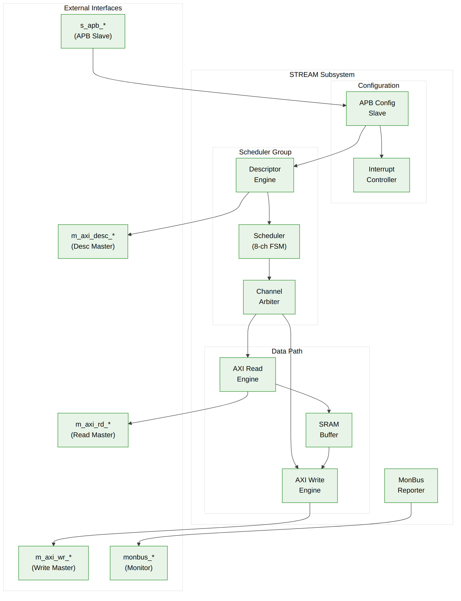

<!-- RTL Design Sherpa Documentation Header -->
<table>
<tr>
<td width="80">
  
</td>
<td>
  <strong>RTL Design Sherpa</strong> · <em>Learning Hardware Design Through Practice</em> 
  
    <a href="https://github.com/sean-galloway/RTLDesignSherpa">GitHub</a> ·
    <a href="https://github.com/sean-galloway/RTLDesignSherpa/blob/main/docs/DOCUMENTATION_INDEX.md">Documentation Index</a> ·
    <a href="https://github.com/sean-galloway/RTLDesignSherpa/blob/main/LICENSE">MIT License</a>
  
</td>
</tr>
</table>

---

<!-- End Header -->

# Block Diagram

## Top-Level Architecture

**Source:** [02_block_diagram.mmd](../assets/mermaid/02_block_diagram.mmd)

---

## Functional Block Summary

| Block | Function | Key Interfaces |
|-------|----------|----------------|
| **APB Config Slave** | Channel control registers, status | APB slave, kick-off signals |
| **Descriptor Engine** | Fetch and parse descriptors | AXI read, descriptor output |
| **Scheduler** | Coordinate transfer phases | Control signals to all blocks |
| **Channel Arbiter** | Multi-channel priority arbitration | Grant signals |
| **AXI Read Engine** | Read source data to SRAM | AXI read master |
| **SRAM Buffer** | Temporary data storage | Read/write ports |
| **AXI Write Engine** | Write SRAM data to destination | AXI write master |
| **MonBus Reporter** | Generate monitoring packets | MonBus output |

---

## Block Interactions

### Control Flow

APB Write -> APB Config -> Descriptor Engine -> Scheduler -> Data Path, with AXI Desc Master fetching descriptors.

### Data Flow

Memory -> AXI Read Engine -> SRAM Buffer -> AXI Write Engine -> Memory

### Monitoring Flow

All Blocks -> Event Signals -> MonBus Reporter -> MonBus Output

---

## Parameterization

| Parameter | Description | Default | Range |
|-----------|-------------|---------|-------|
| `NUM_CHANNELS` | Number of DMA channels | 8 | 1-8 |
| `DATA_WIDTH` | AXI data bus width | 512 | 128, 256, 512 |
| `ADDR_WIDTH` | Address width | 64 | 32, 64 |
| `SRAM_DEPTH` | Buffer depth in entries | 4096 | 256-8192 |
| `DESC_FIFO_DEPTH` | Descriptor FIFO depth | 4 | 2-8 |

---

**Last Updated:** 2026-01-03
