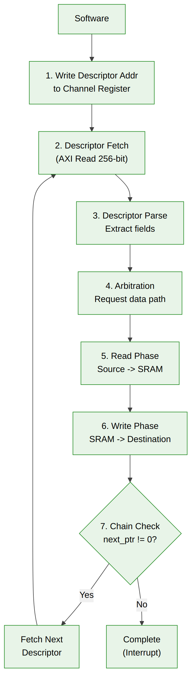

<!-- RTL Design Sherpa Documentation Header -->
<table>
<tr>
<td width="80">
  
</td>
<td>
  <strong>RTL Design Sherpa</strong> · <em>Learning Hardware Design Through Practice</em> 
  
    <a href="https://github.com/sean-galloway/RTLDesignSherpa">GitHub</a> ·
    <a href="https://github.com/sean-galloway/RTLDesignSherpa/blob/main/docs/DOCUMENTATION_INDEX.md">Documentation Index</a> ·
    <a href="https://github.com/sean-galloway/RTLDesignSherpa/blob/main/LICENSE">MIT License</a>
  
</td>
</tr>
</table>

---

<!-- End Header -->

# Data Flow

## Transfer Sequence Overview

A complete STREAM transfer follows this sequence:

**Source:** [03_data_flow.mmd](../assets/mermaid/03_data_flow.mmd)

---

## Phase Details

### Phase 1: Kick-off

Software writes the first descriptor address to the channel control register:

- APB write triggers channel state transition from IDLE to ACTIVE
- Descriptor address stored in channel's descriptor pointer register
- Kick-off signal sent to Descriptor Engine

### Phase 2: Descriptor Fetch

Descriptor Engine issues AXI read transaction:

- Address: From kick-off or `next_descriptor_ptr`
- Size: 256 bits (single beat or 2-beat depending on bus width)
- Response: Descriptor data captured on valid read data

### Phase 3: Descriptor Parse

Descriptor fields extracted and validated:

| Field | Validation |
|-------|------------|
| `valid` | Must be 1 |
| `src_addr` | Alignment check, range check |
| `dst_addr` | Alignment check, range check |
| `length` | Non-zero, within limits |

### Phase 4: Arbitration

Channel requests access to shared data path:

- Multiple channels may be active simultaneously
- Arbiter grants based on priority and fairness
- Granted channel proceeds to read phase

### Phase 5: Read Phase

AXI Read Engine fetches source data:

- Issues AXI read bursts to source address
- Data written to SRAM buffer
- Continues until `length` beats transferred
- Read/write to SRAM can overlap (ping-pong or streaming)

### Phase 6: Write Phase

AXI Write Engine sends data to destination:

- Reads data from SRAM buffer
- Issues AXI write bursts to destination address
- Awaits write responses
- Continues until all data written

### Phase 7: Chain Check

Scheduler determines next action:

- If `last == 1` or `next_descriptor_ptr == 0`: Chain complete
- Otherwise: Fetch next descriptor (return to Phase 2)

---

## Concurrent Operation

### Multi-Channel Concurrency

Multiple channels can be at different phases simultaneously. For example:
- Ch0: Kick -> Fetch -> Read -> Write -> Complete
- Ch1: (offset) Kick -> Fetch -> Arb Wait -> Read -> Write
- Ch2: (offset) Kick -> Fetch -> Arb Wait -> Read

### Pipeline Overlap

Within a single channel, read and write phases can overlap. As read beats 0-63 complete, write beats 0-63 can begin while read continues with beats 64-127.

The SRAM buffer enables this overlap by storing in-flight data.

---

## Data Path Bandwidth

### Theoretical Maximum

With 512-bit data width at 200 MHz:

- Per-direction: 512 bits x 200 MHz = 102.4 Gbps = 12.8 GB/s
- Bidirectional: 25.6 GB/s (simultaneous read + write)

### Practical Considerations

Actual throughput affected by:

- AXI arbitration latency
- Memory access latency
- SRAM buffer depth (limits outstanding data)
- Channel arbitration overhead

---

**Last Updated:** 2026-01-03
