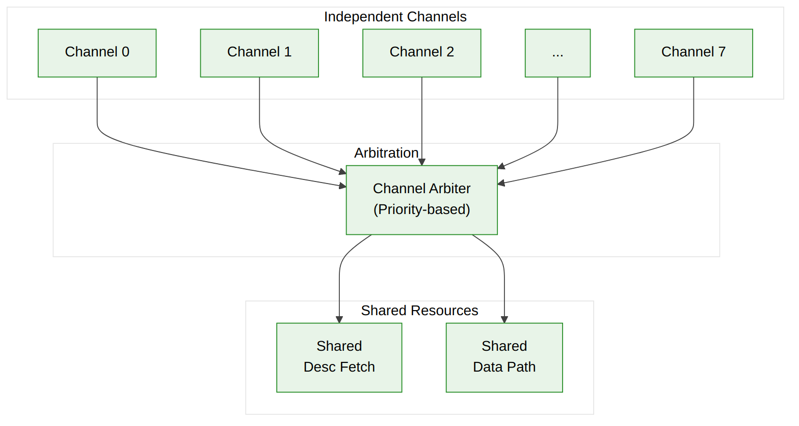
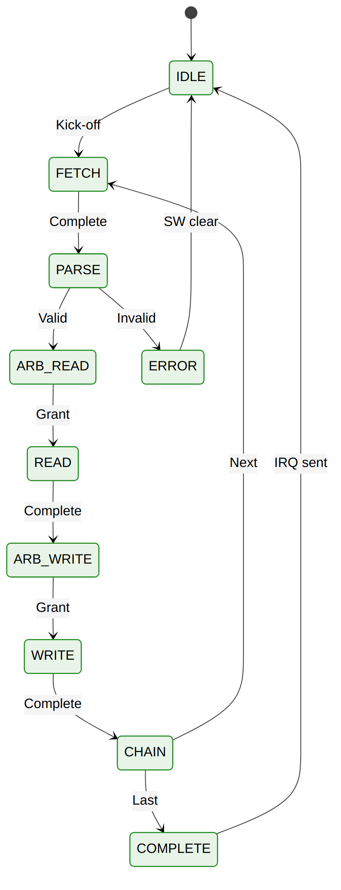

<!-- RTL Design Sherpa Documentation Header -->
<table>
<tr>
<td width="80">
  
</td>
<td>
  <strong>RTL Design Sherpa</strong> · <em>Learning Hardware Design Through Practice</em> 
  
    <a href="https://github.com/sean-galloway/RTLDesignSherpa">GitHub</a> ·
    <a href="https://github.com/sean-galloway/RTLDesignSherpa/blob/main/docs/DOCUMENTATION_INDEX.md">Documentation Index</a> ·
    <a href="https://github.com/sean-galloway/RTLDesignSherpa/blob/main/LICENSE">MIT License</a>
  
</td>
</tr>
</table>

---

<!-- End Header -->

# Multi-Channel Architecture

## Channel Organization

STREAM supports 8 independent DMA channels, each capable of processing its own descriptor chain:

**Source:** [04_channel_architecture.mmd](../assets/mermaid/04_channel_architecture.mmd)

---

## Per-Channel Resources

Each channel maintains independent state:

| Resource | Description | Size |
|----------|-------------|------|
| **FSM State** | Current operation phase | 4 bits |
| **Descriptor Pointer** | Current/next descriptor address | 64 bits |
| **Transfer Counter** | Beats remaining in current transfer | 32 bits |
| **Error Status** | Error flags and codes | 8 bits |
| **Priority** | Current descriptor priority | 8 bits |

---

## Shared Resources

All channels share the following resources:

| Resource | Arbitration | Capacity |
|----------|-------------|----------|
| **Descriptor AXI Master** | Round-robin | 1 outstanding transaction |
| **Data Read AXI Master** | Priority-based | Configurable outstanding |
| **Data Write AXI Master** | Priority-based | Configurable outstanding |
| **SRAM Buffer** | Partitioned by channel | SRAM_DEPTH entries |
| **MonBus Reporter** | FIFO-based | 64-entry FIFO |

---

## Arbitration Scheme

### Priority-Based Arbitration

Descriptor priority field (8 bits) determines service order:

- **Priority 255:** Highest priority
- **Priority 0:** Lowest priority
- **Same Priority:** Round-robin among equal priority

### Fairness Mechanism

To prevent starvation:

- Maximum service time per grant (configurable)
- Anti-starvation counter promotes low-priority after timeout
- Emergency preemption for high-priority arrivals (optional)

### Arbitration Points

Arbitration occurs at:

1. **Descriptor Fetch:** When channel needs to fetch descriptor
2. **Read Phase Start:** When channel ready to read source data
3. **Write Phase Start:** When channel ready to write destination

---

## Channel States

Each channel FSM traverses these states:

**Source:** [05_channel_fsm.mmd](../assets/mermaid/05_channel_fsm.mmd)

| State | Description | Transitions |
|-------|-------------|-------------|
| **IDLE** | No active transfer | Kick-off -> FETCH |
| **FETCH** | Fetching descriptor | Complete -> PARSE |
| **PARSE** | Validating descriptor | Valid -> ARB_READ, Invalid -> ERROR |
| **ARB_READ** | Awaiting read grant | Grant -> READ |
| **READ** | Reading source data | Complete -> ARB_WRITE |
| **ARB_WRITE** | Awaiting write grant | Grant -> WRITE |
| **WRITE** | Writing destination | Complete -> CHAIN |
| **CHAIN** | Checking for next | Next -> FETCH, Last -> COMPLETE |
| **COMPLETE** | Transfer done | IRQ sent -> IDLE |
| **ERROR** | Error condition | SW clear -> IDLE |

---

## SRAM Partitioning

The shared SRAM buffer is partitioned among active channels:

### Static Partitioning (Default)

SRAM Buffer (4096 entries) is divided equally among 8 channels:

| Partition | Entries |
|-----------|---------|
| Channel 0 | 512 |
| Channel 1 | 512 |
| Channel 2 | 512 |
| Channel 3 | 512 |
| Channel 4 | 512 |
| Channel 5 | 512 |
| Channel 6 | 512 |
| Channel 7 | 512 |

### Dynamic Allocation (Optional)

When fewer than 8 channels are active, partitions can be expanded:

| Active Channels | Entries Per Channel |
|-----------------|---------------------|
| 1 | 4096 |
| 2 | 2048 |
| 4 | 1024 |
| 8 | 512 |

---

## Error Isolation

Errors are isolated to the affected channel:

- Error in Channel N does not affect Channels 0..(N-1), (N+1)..7
- Shared resource errors logged but don't block other channels
- Software must clear error and re-kick to resume

---

**Last Updated:** 2026-01-03
