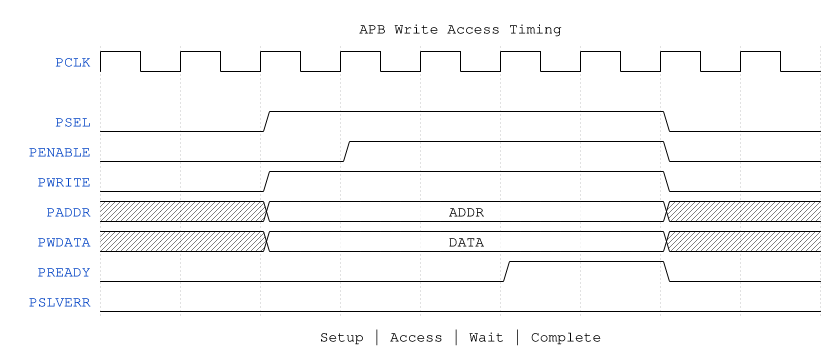
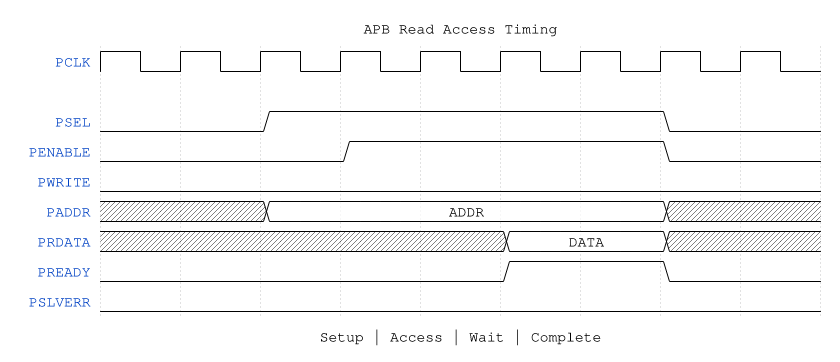

<!-- RTL Design Sherpa Documentation Header -->
<table>
<tr>
<td width="80">
  
</td>
<td>
  <strong>RTL Design Sherpa</strong> · <em>Learning Hardware Design Through Practice</em> 
  
    <a href="https://github.com/sean-galloway/RTLDesignSherpa">GitHub</a> ·
    <a href="https://github.com/sean-galloway/RTLDesignSherpa/blob/main/docs/DOCUMENTATION_INDEX.md">Documentation Index</a> ·
    <a href="https://github.com/sean-galloway/RTLDesignSherpa/blob/main/LICENSE">MIT License</a>
  
</td>
</tr>
</table>

---

<!-- End Header -->

# APB Configuration Interface

## Overview

STREAM provides an APB slave interface for software configuration and control. The interface supports:

- Channel kick-off (write descriptor address to start transfer)
- Status monitoring
- Interrupt control
- Error handling

---

## Signal Summary

| Signal | Direction | Width | Description |
|--------|-----------|-------|-------------|
| `s_apb_paddr` | Input | 12 | Address bus |
| `s_apb_psel` | Input | 1 | Peripheral select |
| `s_apb_penable` | Input | 1 | Enable phase |
| `s_apb_pwrite` | Input | 1 | Write enable |
| `s_apb_pwdata` | Input | 32 | Write data |
| `s_apb_pstrb` | Input | 4 | Byte strobes |
| `s_apb_pready` | Output | 1 | Ready signal |
| `s_apb_prdata` | Output | 32 | Read data |
| `s_apb_pslverr` | Output | 1 | Slave error |

---

## Register Map Overview

| Offset | Register | Access | Description |
|--------|----------|--------|-------------|
| 0x000 | `CTRL` | RW | Global control register |
| 0x004 | `STATUS` | RO | Global status register |
| 0x008 | `IRQ_EN` | RW | Interrupt enable mask |
| 0x00C | `IRQ_STATUS` | RW1C | Interrupt status |
| 0x010 | `ERR_STATUS` | RO | Error status |
| 0x014 | `ERR_ADDR` | RO | Error address capture |
| 0x020-0x03C | Reserved | - | Reserved |
| 0x040 | `CH0_CTRL` | RW | Channel 0 control |
| 0x044 | `CH0_STATUS` | RO | Channel 0 status |
| 0x048 | `CH0_DESC_PTR` | RO | Channel 0 current descriptor |
| 0x04C | Reserved | - | Reserved |
| 0x050 | `CH1_CTRL` | RW | Channel 1 control |
| ... | ... | ... | ... |
| 0x0B0 | `CH7_CTRL` | RW | Channel 7 control |
| 0x0B4 | `CH7_STATUS` | RO | Channel 7 status |
| 0x0B8 | `CH7_DESC_PTR` | RO | Channel 7 current descriptor |

---

## Key Registers

### Global Control (CTRL) - 0x000

| Bits | Field | Access | Description |
|------|-------|--------|-------------|
| [0] | `ENABLE` | RW | Global enable |
| [1] | `SOFT_RESET` | RW | Soft reset (self-clearing) |
| [31:2] | Reserved | - | Reserved |

### Global Status (STATUS) - 0x004

| Bits | Field | Access | Description |
|------|-------|--------|-------------|
| [0] | `BUSY` | RO | Any channel active |
| [7:1] | Reserved | - | Reserved |
| [15:8] | `CH_ACTIVE` | RO | Per-channel active mask |
| [23:16] | `CH_ERROR` | RO | Per-channel error mask |
| [31:24] | Reserved | - | Reserved |

### Channel Control (CHn_CTRL) - 0x040 + n*0x10

| Bits | Field | Access | Description |
|------|-------|--------|-------------|
| [31:0] | `DESC_ADDR` | RW | Descriptor address (kick-off on write) |

Writing to `CHn_CTRL` initiates a transfer:
1. Descriptor address stored
2. Channel transitions from IDLE to FETCH
3. `PREADY` de-asserted until channel accepts kick-off

### Channel Status (CHn_STATUS) - 0x044 + n*0x10

| Bits | Field | Access | Description |
|------|-------|--------|-------------|
| [3:0] | `STATE` | RO | Channel FSM state |
| [4] | `IDLE` | RO | Channel is idle |
| [5] | `BUSY` | RO | Channel is processing |
| [6] | `ERROR` | RO | Error condition |
| [7] | `COMPLETE` | RO | Last transfer complete |
| [15:8] | `DESC_COUNT` | RO | Descriptors processed |
| [23:16] | `ERR_CODE` | RO | Error code if ERROR set |
| [31:24] | Reserved | - | Reserved |

---

## Access Timing

### Write Access

**Source:** [apb_write_access.json](../assets/wavedrom/apb_write_access.json)

### Read Access

**Source:** [apb_read_access.json](../assets/wavedrom/apb_read_access.json)

---

## Kick-off Blocking

When software writes to `CHn_CTRL`:

- If channel is IDLE: Immediate accept, `PREADY` asserted
- If channel is BUSY: `PREADY` held low until channel completes
- Prevents descriptor pointer corruption during active transfer

---

**Last Updated:** 2026-01-03
