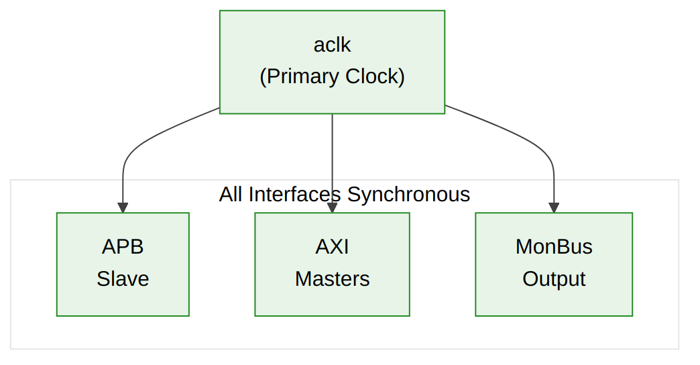

<!-- RTL Design Sherpa Documentation Header -->
<table>
<tr>
<td width="80">
  <a href="https://github.com/sean-galloway/RTLDesignSherpa">
    
  </a>
</td>
<td>
  <strong>RTL Design Sherpa</strong> · <em>Learning Hardware Design Through Practice</em><br>
  <sub>
    <a href="https://github.com/sean-galloway/RTLDesignSherpa">GitHub</a> ·
    <a href="https://github.com/sean-galloway/RTLDesignSherpa/blob/main/docs/DOCUMENTATION_INDEX.md">Documentation Index</a> ·
    <a href="https://github.com/sean-galloway/RTLDesignSherpa/blob/main/LICENSE">MIT License</a>
  </sub>
</td>
</tr>
</table>

---

<!-- End Header -->

# Clocking and Reset

## Clock Requirements

### Primary Clock (aclk)

| Parameter | Requirement |
|-----------|-------------|
| **Frequency** | 100 - 400 MHz (target dependent) |
| **Duty Cycle** | 40% - 60% |
| **Jitter** | <100 ps peak-to-peak |
| **Domain** | Single clock domain for all interfaces |

### Clock Relationship

All STREAM interfaces are synchronous to `aclk`:



**Source:** [06_clock_distribution.mmd](../assets/mermaid/06_clock_distribution.mmd)

**[INTEG-1]** External interfaces must be synchronous to `aclk`. Clock domain crossing is the system integrator's responsibility.

---

## Reset Requirements

### Reset Signal (aresetn)

| Parameter | Requirement |
|-----------|-------------|
| **Polarity** | Active-low |
| **Type** | Asynchronous assert, synchronous deassert |
| **Minimum Pulse** | 2 clock cycles |
| **Glitch Filter** | Not required (external synchronizer assumed) |

### Reset Sequence

Reset is asserted asynchronously and de-asserted synchronously:

1. `aresetn` goes low (asynchronous assertion)
2. Reset remains active for minimum 2 clock cycles
3. `aresetn` goes high on rising edge of `aclk` (synchronous release)
4. All blocks begin normal operation

### Reset Behavior

| Block | Reset State |
|-------|-------------|
| APB Config | All registers to default |
| Scheduler | All channels IDLE |
| Descriptor Engine | FSM to IDLE, FIFOs empty |
| AXI Engines | No outstanding transactions |
| SRAM | Contents undefined |
| MonBus | FIFO empty, no output |

---

## Power Management

### Clock Gating Support

STREAM supports external clock gating when idle:

| Signal | Purpose |
|--------|---------|
| `all_channels_idle` | Indicates safe to gate clock |

**Clock Gating Sequence:**
1. Check `STATUS.BUSY = 0`
2. Disable clock via external gate
3. Re-enable clock before any APB access

### Low Power Recommendations

| Technique | Implementation |
|-----------|----------------|
| Clock gating | Gate `aclk` when `all_channels_idle` |
| Power gating | Not recommended (state loss) |
| Voltage scaling | Supported if timing met |

---

## Timing Constraints

### Clock Period Constraints

```tcl
# Example Vivado XDC constraints
create_clock -period 5.000 -name aclk [get_ports aclk]

# APB interface (same clock)
set_input_delay -clock aclk 1.0 [get_ports s_apb_*]
set_output_delay -clock aclk 1.0 [get_ports s_apb_pready]
set_output_delay -clock aclk 1.0 [get_ports s_apb_prdata*]
set_output_delay -clock aclk 1.0 [get_ports s_apb_pslverr]

# AXI interfaces (same clock)
set_input_delay -clock aclk 1.0 [get_ports m_axi_*ready]
set_input_delay -clock aclk 1.0 [get_ports m_axi_*rdata*]
set_input_delay -clock aclk 1.0 [get_ports m_axi_*rresp*]
set_input_delay -clock aclk 1.0 [get_ports m_axi_*bresp*]
set_output_delay -clock aclk 1.0 [get_ports m_axi_*valid]
set_output_delay -clock aclk 1.0 [get_ports m_axi_*addr*]
set_output_delay -clock aclk 1.0 [get_ports m_axi_*data*]
```

### False Path Constraints

```tcl
# Reset is asynchronous
set_false_path -from [get_ports aresetn]

# Configuration registers to datapath (multi-cycle)
set_multicycle_path 2 -setup -from [get_cells *cfg_*]
set_multicycle_path 1 -hold -from [get_cells *cfg_*]
```

---

## CDC Considerations

### Single Clock Domain

STREAM operates in a single clock domain. All clock domain crossing must be handled externally:

| Interface | CDC Responsibility |
|-----------|-------------------|
| APB Slave | External if APB on different clock |
| AXI Masters | External if AXI interconnect on different clock |
| MonBus | External if consumer on different clock |

### CDC Recommendations

For systems requiring CDC:

1. Use async FIFO for MonBus output
2. Use AXI clock converter IP for AXI interfaces
3. Use APB bridge with clock crossing for APB

---

**Last Updated:** 2026-01-03
