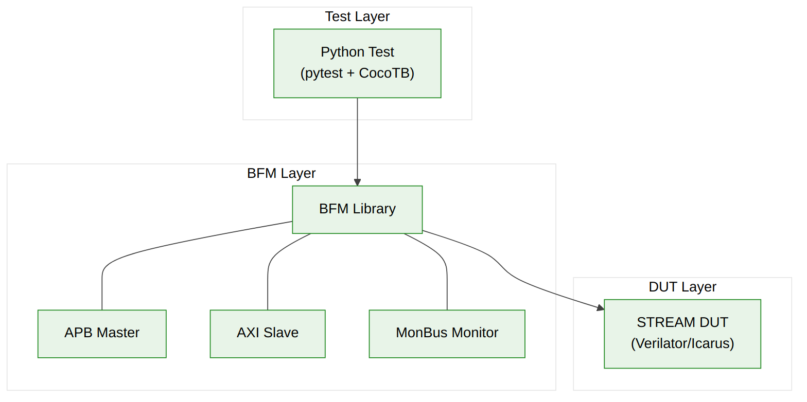

<!-- RTL Design Sherpa Documentation Header -->
<table>
<tr>
<td width="80">
  <a href="https://github.com/sean-galloway/RTLDesignSherpa">
    
  </a>
</td>
<td>
  <strong>RTL Design Sherpa</strong> · <em>Learning Hardware Design Through Practice</em><br>
  <sub>
    <a href="https://github.com/sean-galloway/RTLDesignSherpa">GitHub</a> ·
    <a href="https://github.com/sean-galloway/RTLDesignSherpa/blob/main/docs/DOCUMENTATION_INDEX.md">Documentation Index</a> ·
    <a href="https://github.com/sean-galloway/RTLDesignSherpa/blob/main/LICENSE">MIT License</a>
  </sub>
</td>
</tr>
</table>

---

<!-- End Header -->

# Verification Strategy

## Verification Approach

### Multi-Level Verification

STREAM verification follows a hierarchical approach:

| Level | Focus | Coverage Target |
|-------|-------|-----------------|
| **Block** | Individual module function | 100% line/toggle |
| **Integration** | Block-to-block interfaces | 95% functional |
| **System** | End-to-end operation | 90% use cases |

---

## Block-Level Verification

### Test Categories

| Block | Key Test Scenarios |
|-------|-------------------|
| **APB Config** | Register access, kick-off timing, error response |
| **Descriptor Engine** | Fetch, parse, chain, error handling |
| **Scheduler** | State transitions, multi-channel coordination |
| **Channel Arbiter** | Priority, fairness, starvation prevention |
| **AXI Read Engine** | Burst generation, error handling, backpressure |
| **AXI Write Engine** | Burst generation, response handling |
| **SRAM Buffer** | Read/write concurrent, full/empty |
| **MonBus Reporter** | Event generation, backpressure, overflow |

### Coverage Metrics

| Metric | Target |
|--------|--------|
| Line coverage | 100% |
| Toggle coverage | 95% |
| FSM state coverage | 100% |
| FSM transition coverage | 100% |
| Parameter coverage | All supported values |

---

## Integration-Level Verification

### Interface Verification

| Interface | Test Focus |
|-----------|------------|
| APB to Descriptor Engine | Kick-off handshake, blocking behavior |
| Descriptor Engine to Scheduler | Descriptor passing, backpressure |
| Scheduler to AXI Engines | Grant/request, data flow |
| AXI Engines to SRAM | Concurrent access, pointer management |
| All blocks to MonBus | Event generation, arbitration |

### Multi-Channel Scenarios

| Scenario | Description |
|----------|-------------|
| Sequential | Channels operate one at a time |
| Concurrent | All 8 channels active simultaneously |
| Priority | High priority preempts low priority |
| Fairness | Equal priority channels share fairly |
| Error isolation | Error in one channel, others continue |

---

## System-Level Verification

### End-to-End Test Cases

| Test Case | Description |
|-----------|-------------|
| **Basic Transfer** | Single descriptor, single channel |
| **Chained Transfer** | Multiple descriptors, single channel |
| **Multi-Channel** | Multiple channels, independent transfers |
| **Scatter** | Single source to multiple destinations |
| **Gather** | Multiple sources to single destination |
| **Maximum Throughput** | Sustained bandwidth test |
| **Error Injection** | AXI errors, invalid descriptors |
| **Stress** | Random traffic, long duration |

### Performance Verification

| Metric | Verification Method |
|--------|---------------------|
| Throughput | Measure bytes/cycle over large transfer |
| Latency | Measure kick-off to completion cycles |
| Efficiency | Compare actual vs theoretical maximum |

---

## Testbench Architecture

### CocoTB-Based Verification



**Source:** [07_testbench_stack.mmd](../assets/mermaid/07_testbench_stack.mmd)

### Key Testbench Components

| Component | Purpose |
|-----------|---------|
| **APB Master BFM** | Drive configuration interface |
| **AXI Slave BFM** | Model memory system |
| **MonBus Monitor** | Capture and verify events |
| **Scoreboard** | Verify data integrity |
| **Coverage Collector** | Track functional coverage |

---

## Verification Environment

### Simulator Support

| Simulator | Status |
|-----------|--------|
| Verilator | Primary (open-source) |
| Icarus Verilog | Secondary |
| Commercial (VCS, Questa) | Supported |

### Test Execution

```bash
# Run all STREAM tests
pytest projects/components/stream/dv/tests/ -v

# Run specific test category
pytest projects/components/stream/dv/tests/fub_tests/ -v
pytest projects/components/stream/dv/tests/integration_tests/ -v

# Generate coverage report
pytest projects/components/stream/dv/tests/ --cov-report=html
```

---

## Formal Verification

### Properties for Formal

| Category | Properties |
|----------|------------|
| **Protocol** | AXI handshake rules, APB timing |
| **Liveness** | No deadlock in arbitration |
| **Safety** | No data corruption, proper error handling |
| **Functional** | Descriptor chaining correctness |

### Formal Tool Usage

Recommended for:
- AXI protocol compliance
- Arbiter deadlock freedom
- FSM reachability analysis

---

## Sign-Off Criteria

### Block-Level Sign-Off

- [ ] 100% line coverage
- [ ] 95% toggle coverage
- [ ] All FSM states exercised
- [ ] All FSM transitions exercised
- [ ] No simulation errors
- [ ] No lint warnings

### Integration Sign-Off

- [ ] All interface scenarios passed
- [ ] Multi-channel concurrency verified
- [ ] Error handling verified
- [ ] Performance targets met

### System Sign-Off

- [ ] All end-to-end test cases passed
- [ ] Throughput targets achieved
- [ ] Latency targets achieved
- [ ] 72-hour stress test passed

---

**Last Updated:** 2026-01-03
