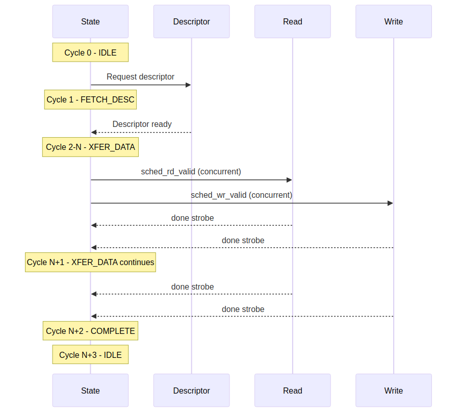

<!-- RTL Design Sherpa Documentation Header -->
<table>
<tr>
<td width="80">
  <a href="https://github.com/sean-galloway/RTLDesignSherpa">
    
  </a>
</td>
<td>
  <strong>RTL Design Sherpa</strong> · <em>Learning Hardware Design Through Practice</em><br>
  <sub>
    <a href="https://github.com/sean-galloway/RTLDesignSherpa">GitHub</a> ·
    <a href="https://github.com/sean-galloway/RTLDesignSherpa/blob/main/docs/DOCUMENTATION_INDEX.md">Documentation Index</a> ·
    <a href="https://github.com/sean-galloway/RTLDesignSherpa/blob/main/LICENSE">MIT License</a>
  </sub>
</td>
</tr>
</table>

---

<!-- End Header -->

# Scheduler Specification

**Module:** `scheduler.sv`
**Location:** `projects/components/stream/rtl/fub/`
**Status:** Implemented
**Last Updated:** 2025-11-30

---

## Overview

The Scheduler coordinates descriptor-based memory-to-memory DMA transfers for a single channel. It receives descriptors, manages concurrent read/write operations, and handles descriptor chaining.

### Key Features

- **Concurrent read/write:** Read and write engines run simultaneously (prevents deadlock)
- **Beat-based tracking:** Length in data width units (STREAM simplification)
- **Aligned addresses:** No alignment fixup logic (must be pre-aligned)
- **Descriptor chaining:** Follows next_descriptor_ptr for multi-buffer transfers
- **Interrupt generation:** MonBus IRQ event when gen_irq flag set
- **Error handling:** Timeout detection, error aggregation from engines
- **MonBus integration:** State transition and IRQ event reporting

### Block Diagram

### Figure 2.4.1: Scheduler Block Diagram


**Source:** [02_scheduler_block.mmd](../assets/mermaid/02_scheduler_block.mmd)

---

## CRITICAL: Concurrent Read/Write Design

**Why Concurrent Operation is Essential:**

The scheduler runs read and write engines **CONCURRENTLY** in CH_XFER_DATA state. This prevents deadlock when transfer size exceeds SRAM buffer capacity:

```
Example: 100MB transfer with 2KB SRAM buffer

Sequential operation (WRONG):
1. Read 100MB → DEADLOCK at 2KB (SRAM full, can't complete read)

Concurrent operation (CORRECT):
1. Read starts filling SRAM → SRAM becomes full (2KB)
2. Read pauses (natural backpressure)
3. Write drains SRAM → SRAM has free space
4. Read resumes → Both continue until 100MB complete
```

**Implementation:**
- Both `sched_rd_valid` and `sched_wr_valid` asserted in CH_XFER_DATA
- Independent beat counters: `r_read_beats_remaining`, `r_write_beats_remaining`
- Exit when **BOTH** counters reach zero

---

## Parameters

```systemverilog
parameter int CHANNEL_ID = 0;                    // Channel identifier
parameter int NUM_CHANNELS = 8;                  // Total channels in system
parameter int CHAN_WIDTH = $clog2(NUM_CHANNELS); // Channel ID width
parameter int ADDR_WIDTH = 64;                   // Address bus width
parameter int DATA_WIDTH = 512;                  // Data bus width (beats)

// Monitor Bus Parameters
parameter logic [7:0] MON_AGENT_ID = 8'h40;      // STREAM Scheduler Agent ID
parameter logic [3:0] MON_UNIT_ID = 4'h1;        // Unit identifier
parameter logic [5:0] MON_CHANNEL_ID = 6'h0;     // Base channel ID

// Descriptor Width (FIXED at 256-bit for STREAM)
parameter int DESC_WIDTH = 256;
```

**Validation:**
```systemverilog
// Scheduler only supports 256-bit STREAM descriptors
if (DESC_WIDTH != 256)
    $fatal("DESC_WIDTH must be 256 for STREAM scheduler");
```

---

## Port List

### Clock and Reset

| Signal | Direction | Width | Description |
|--------|-----------|-------|-------------|
| `clk` | input | 1 | System clock |
| `rst_n` | input | 1 | Active-low asynchronous reset |

: Clock and Reset

### Configuration Interface

| Signal | Direction | Width | Description |
|--------|-----------|-------|-------------|
| `cfg_channel_enable` | input | 1 | Enable this channel |
| `cfg_channel_reset` | input | 1 | Channel soft reset (FSM → IDLE) |
| `cfg_sched_timeout_cycles` | input | 16 | Timeout threshold in clock cycles (runtime config) |
| `cfg_sched_timeout_enable` | input | 1 | Enable timeout detection |

: Configuration Interface

### Status Interface

| Signal | Direction | Width | Description |
|--------|-----------|-------|-------------|
| `scheduler_idle` | output | 1 | Scheduler idle flag |
| `scheduler_state` | output | 7 | Current FSM state (one-hot encoding) |

: Status Interface

### Descriptor Engine Interface

| Signal | Direction | Width | Description |
|--------|-----------|-------|-------------|
| `descriptor_valid` | input | 1 | Descriptor valid from descriptor engine |
| `descriptor_ready` | output | 1 | Scheduler ready to accept descriptor |
| `descriptor_packet` | input | 256 | 256-bit STREAM descriptor (see format below) |
| `descriptor_error` | input | 1 | Error signal from descriptor engine |

: Descriptor Engine Interface

### Data Read Interface

**To AXI Read Engine:**

| Signal | Direction | Width | Description |
|--------|-----------|-------|-------------|
| `sched_rd_valid` | output | 1 | Channel requests read |
| `sched_rd_addr` | output | ADDR_WIDTH | Source address (aligned, static during burst) |
| `sched_rd_beats` | output | 32 | Beats remaining to read |

: Data Read Interface

**Completion from Read Engine:**

| Signal | Direction | Width | Description |
|--------|-----------|-------|-------------|
| `sched_rd_done_strobe` | input | 1 | Read burst completed (1-cycle pulse) |
| `sched_rd_beats_done` | input | 32 | Number of beats completed in burst |
| `sched_rd_error` | input | 1 | Read engine error (sticky) |

: Data Read Interface

### Data Write Interface

**To AXI Write Engine:**

| Signal | Direction | Width | Description |
|--------|-----------|-------|-------------|
| `sched_wr_valid` | output | 1 | Channel requests write |
| `sched_wr_ready` | input | 1 | Engine ready for channel (completion handshake) |
| `sched_wr_addr` | output | ADDR_WIDTH | Destination address (aligned, static during burst) |
| `sched_wr_beats` | output | 32 | Beats remaining to write |

: Data Write Interface

**Completion from Write Engine:**

| Signal | Direction | Width | Description |
|--------|-----------|-------|-------------|
| `sched_wr_done_strobe` | input | 1 | Write burst completed (1-cycle pulse) |
| `sched_wr_beats_done` | input | 32 | Number of beats completed in burst |
| `sched_wr_error` | input | 1 | Write engine error (sticky) |

: Data Write Interface

### Error Signals

| Signal | Direction | Width | Description |
|--------|-----------|-------|-------------|
| `sched_error` | output | 1 | Scheduler error output (aggregates rd/wr errors, sticky) |

: Error Signals

### Monitor Bus Interface

| Signal | Direction | Width | Description |
|--------|-----------|-------|-------------|
| `mon_valid` | output | 1 | Monitor packet valid |
| `mon_ready` | input | 1 | Monitor bus ready |
| `mon_packet` | output | 64 | 64-bit monitor bus packet |

: Monitor Bus Interface

---

## Interface

### Clock and Reset

```systemverilog
input  logic                        clk;
input  logic                        rst_n;      // Active-low asynchronous reset
```

### Configuration Interface

```systemverilog
input  logic                        cfg_channel_enable;       // Enable this channel
input  logic                        cfg_channel_reset;        // Channel reset (soft reset)
input  logic [15:0]                 cfg_sched_timeout_cycles; // Timeout threshold (runtime config)
input  logic                        cfg_sched_timeout_enable; // Enable timeout detection
```

**Channel Reset Behavior:**
- `cfg_channel_reset` forces FSM to CH_IDLE immediately
- Clears descriptor_loaded flag
- Resets beat counters
- Independent of global `rst_n`

**Timeout Configuration:**
- Runtime configurable via `cfg_sched_timeout_cycles` (replaces compile-time TIMEOUT_CYCLES parameter)
- Can be disabled/enabled dynamically via `cfg_sched_timeout_enable`

### Status Interface

```systemverilog
output logic                        scheduler_idle;         // Scheduler in CH_IDLE
output logic [6:0]                  scheduler_state;        // Current state (ONE-HOT)
```

**State Encoding (ONE-HOT):**
- `[0]` = CH_IDLE
- `[1]` = CH_FETCH_DESC
- `[2]` = CH_XFER_DATA
- `[3]` = CH_COMPLETE
- `[4]` = CH_NEXT_DESC
- `[5]` = CH_ERROR
- `[6]` = Reserved

### Descriptor Engine Interface

```systemverilog
input  logic                        descriptor_valid;
output logic                        descriptor_ready;
input  logic [DESC_WIDTH-1:0]       descriptor_packet;     // 256-bit STREAM descriptor
input  logic                        descriptor_error;       // Error from descriptor engine
```

**Descriptor Handshake:**
- `descriptor_ready` asserted in CH_IDLE or CH_NEXT_DESC
- Descriptor captured when `valid && ready`
- Supports descriptor chaining (next_descriptor_ptr)

### Data Read Interface (to AXI Read Engine)

**Request:**
```systemverilog
output logic                        sched_rd_valid;         // Request read access
output logic [ADDR_WIDTH-1:0]       sched_rd_addr;          // Source address (static base)
output logic [31:0]                 sched_rd_beats;         // Total beats to read
```

**Completion:**
```systemverilog
input  logic                        sched_rd_done_strobe;   // Read engine completed beats
input  logic [31:0]                 sched_rd_beats_done;    // Number of beats completed
```

**Error:**
```systemverilog
input  logic                        sched_rd_error;         // Read engine error
```

**Address Management:**
- Scheduler provides **static base address** in `sched_rd_addr`
- Read engine handles address increment internally
- Scheduler does NOT update `sched_rd_addr` after each burst

**Interface Timing Notes (November 2025 Updates):**
- Scheduler holds `sched_rd_valid` high while `sched_rd_beats > 0`
- Engine reports completion via `sched_rd_done_strobe` (pulsed)
- Scheduler decrements `r_read_beats_remaining` by `sched_rd_beats_done`
- Process repeats until `r_read_beats_remaining == 0`

### Data Write Interface (to AXI Write Engine)

**Request:**
```systemverilog
output logic                        sched_wr_valid;         // Request write access
input  logic                        sched_wr_ready;         // Engine grants access
output logic [ADDR_WIDTH-1:0]       sched_wr_addr;          // Destination address (static base)
output logic [31:0]                 sched_wr_beats;         // Total beats to write
```

**Completion:**
```systemverilog
input  logic                        sched_wr_done_strobe;   // Write engine completed beats
input  logic [31:0]                 sched_wr_beats_done;    // Number of beats completed
```

**Error:**
```systemverilog
input  logic                        sched_wr_error;         // Write engine error
```

**Interface Timing Notes (November 2025 Updates):**

**sched_wr_ready Timing:**
- **REGISTERED OUTPUT** from write engine - Not combinatorial from completion signals
- Asserts 1 cycle after channel becomes ready to accept new request
- Cleared 1 cycle after handshake (valid && ready)
- **Do not expect immediate deassertion on handshake** - takes 1 cycle

**Example Timing:**
```
Cycle  sched_wr_valid  sched_wr_ready  sched_wr_done_strobe  Notes
-----  --------------  --------------  --------------------  -----
  0    0               0               0                     Idle
  1    1               0               0                     Request (not ready yet)
  2    1               1               0                     Handshake!
  3    1               0               0                     Ready cleared (registered)
 ...   (W-phase executes)
 50    1               0               1                     B response, done strobe
 51    1               1               0                     Ready re-asserts (next cycle)
```

### Monitor Bus Interface

```systemverilog
output logic                        mon_valid;
input  logic                        mon_ready;
output logic [63:0]                 mon_packet;
```

**MonBus Events Generated:**
- State transitions (IDLE → FETCH_DESC, etc.)
- IRQ event (when descriptor.gen_irq set)
- Error events

---

## Descriptor Format

### STREAM Descriptor (256-bit)

```systemverilog
typedef struct packed {
    logic [47:0]  reserved;              // [255:208] Reserved
    logic [7:0]   desc_priority;         // [207:200] Transfer priority
    logic [3:0]   channel_id;            // [199:196] Channel ID (informational)
    logic         error;                 // [195] Error flag
    logic         last;                  // [194] Last in chain flag
    logic         gen_irq;               // [193] Generate interrupt on completion
    logic         valid;                 // [192] Valid descriptor
    logic [31:0]  next_descriptor_ptr;   // [191:160] Next descriptor address (0 = last)
    logic [31:0]  length;                // [159:128] Length in BEATS
    logic [63:0]  dst_addr;              // [127:64] Destination address (aligned)
    logic [63:0]  src_addr;              // [63:0] Source address (aligned)
} descriptor_t;
```

**Field Constraints:**
- `src_addr` / `dst_addr`: Must be aligned to DATA_WIDTH (e.g., 64-byte aligned for 512-bit data)
- `length`: Transfer size in **BEATS** (not bytes or chunks)
- `next_descriptor_ptr`: 0 or address of next descriptor
- `valid`: Must be 1 for descriptor to be accepted
- `last`: Terminates chain (overrides next_descriptor_ptr)
- `gen_irq`: Generates STREAM_EVENT_IRQ via MonBus when transfer completes

**Descriptor Bit Positions:**
```systemverilog
DESC_SRC_ADDR:  [63:0]
DESC_DST_ADDR:  [127:64]
DESC_LENGTH:    [159:128]
DESC_NEXT_PTR:  [191:160]
DESC_VALID_BIT: [192]
DESC_GEN_IRQ:   [193]
DESC_LAST:      [194]
```

---

## FSM Operation

### State Machine

**States (ONE-HOT encoded):**
```
CH_IDLE        - Waiting for descriptor
CH_FETCH_DESC  - Latch and validate descriptor
CH_XFER_DATA   - Concurrent read/write transfer
CH_COMPLETE    - Transfer done, check chaining
CH_NEXT_DESC   - Fetch next chained descriptor
CH_ERROR       - Error condition
```

**FSM Flow:**

### Figure 2.4.2: Scheduler FSM


**Source:** [02_scheduler_block.mmd](../assets/mermaid/02_scheduler_block.mmd)

### State Transitions

**CH_IDLE:**
- **Wait for:** `descriptor_valid && cfg_channel_enable`
- **Action:** Assert `descriptor_ready`
- **Next:** CH_FETCH_DESC (when handshake occurs)

**CH_FETCH_DESC:**
- **Action:**
  - Latch descriptor fields into `r_descriptor`
  - Initialize working registers (`r_src_addr`, `r_dst_addr`, `r_*_beats_remaining`)
  - Validate `descriptor.valid` bit
- **Next:**
  - CH_XFER_DATA (if valid)
  - CH_ERROR (if invalid)

**CH_XFER_DATA:**
- **Action:**
  - Assert **BOTH** `sched_rd_valid` and `sched_wr_valid` (concurrent operation!)
  - Decrement `r_read_beats_remaining` on `sched_rd_done_strobe`
  - Decrement `r_write_beats_remaining` on `sched_wr_done_strobe`
  - Monitor timeout counter
- **Exit When:** `r_read_beats_remaining == 0 && r_write_beats_remaining == 0`
- **Next:** CH_COMPLETE

**CH_COMPLETE:**
- **Action:**
  - Generate MonBus IRQ event (if `gen_irq` set)
  - Check `next_descriptor_ptr` and `last` flag
  - Clear `descriptor_loaded` flag
- **Next:**
  - CH_NEXT_DESC (if chaining)
  - CH_IDLE (if last or no chain)

**CH_NEXT_DESC:**
- **Wait for:** `descriptor_valid` (descriptor engine fetches next)
- **Action:** Assert `descriptor_ready`
- **Next:** CH_FETCH_DESC

**CH_ERROR:**
- **STICKY STATE:** Once in error, stays here until channel reset
- **Action:** Report error via MonBus
- **Recovery:** Requires `cfg_channel_reset` assertion (or global reset)
- **Note:** `scheduler_idle` asserts in this state (allows external monitoring)

---

## Beat Tracking

### Independent Counters

**Initialization (CH_FETCH_DESC):**
```systemverilog
r_read_beats_remaining  <= r_descriptor.length;
r_write_beats_remaining <= r_descriptor.length;
```

**Decrement (CH_XFER_DATA):**
```systemverilog
// Read progress (independent)
if (sched_rd_done_strobe) begin
    r_read_beats_remaining <= (r_read_beats_remaining >= sched_rd_beats_done) ?
                             (r_read_beats_remaining - sched_rd_beats_done) : 32'h0;
end

// Write progress (independent)
if (sched_wr_done_strobe) begin
    r_write_beats_remaining <= (r_write_beats_remaining >= sched_wr_beats_done) ?
                              (r_write_beats_remaining - sched_wr_beats_done) : 32'h0;
end
```

**Saturation:**
- Counters saturate at 0 (prevent underflow)
- Safety check for engine misbehavior

### Completion Detection

**Combinational Flags:**
```systemverilog
w_read_complete     = (r_read_beats_remaining == 0);
w_write_complete    = (r_write_beats_remaining == 0);
w_transfer_complete = w_read_complete && w_write_complete;
```

**State Exit:**
```systemverilog
// In CH_XFER_DATA:
if (w_transfer_complete) begin
    w_next_state = CH_COMPLETE;
end
```

### Multiple Requests per Descriptor

For large transfers, scheduler issues multiple requests as engines complete work:

```
Descriptor: length = 256 beats (16KB @ 512-bit data)
Engine burst size: 16 beats (configured via cfg_axi_wr_xfer_beats)

Request sequence:
  Request 1: sched_wr_valid=1, sched_wr_beats=256, ready → handshake
             Engine executes 16-beat burst
             sched_wr_done_strobe=1, sched_wr_beats_done=16
             Scheduler updates: 256 - 16 = 240 beats remaining

  Request 2: sched_wr_valid=1, sched_wr_beats=240, ready → handshake
             Engine executes 16-beat burst
             sched_wr_done_strobe=1, sched_wr_beats_done=16
             Scheduler updates: 240 - 16 = 224 beats remaining

  ... (continues for 16 requests total)

  Request 16: sched_wr_valid=1, sched_wr_beats=16, ready → handshake
              Engine executes 16-beat burst
              sched_wr_done_strobe=1, sched_wr_beats_done=16
              Scheduler updates: 16 - 16 = 0 beats remaining → COMPLETE
```

**Key Point:** Scheduler holds `sched_wr_valid` high and keeps reissuing requests as long as `sched_wr_beats > 0`. Engines handle each request independently.

---

## Address Management

### Static Base Address

**Scheduler Provides:**
```systemverilog
assign sched_rd_addr = r_src_addr;  // Static base, set in CH_FETCH_DESC
assign sched_wr_addr = r_dst_addr;  // Static base, set in CH_FETCH_DESC
```

**Scheduler Does NOT:**
- Increment addresses after each burst
- Calculate byte offsets
- Handle alignment

**Engine Responsibility:**
- Read engine: `m_axi_araddr = sched_rd_addr + (beats_issued << AXSIZE)`
- Write engine: `m_axi_awaddr = sched_wr_addr + (beats_issued << AXSIZE)`

---

## Timeout Detection

### Timeout Counter

**Configuration:**
- Runtime configurable via `cfg_sched_timeout_cycles` (16-bit)
- Can be enabled/disabled via `cfg_sched_timeout_enable`
- Replaces compile-time TIMEOUT_CYCLES parameter

**Increment:**
```systemverilog
// In CH_XFER_DATA when waiting for engines
if (cfg_sched_timeout_enable && (!sched_rd_ready || !sched_wr_ready)) begin
    r_timeout_counter <= r_timeout_counter + 1;
end
```

**Timeout Flag:**
```systemverilog
assign w_timeout_expired = (r_timeout_counter >= cfg_sched_timeout_cycles);
```

**Reset:**
```systemverilog
// Clear when state changes or engines respond
if (state_change || (sched_rd_ready && sched_wr_ready)) begin
    r_timeout_counter <= 0;
end
```

**Action on Timeout:**
- FSM transitions to CH_ERROR
- MonBus timeout event generated
- Channel must be reset to recover

---

## Error Handling

### Error Sources

**External:**
- `descriptor_error` - Descriptor engine reports error
- `sched_rd_error` - Read engine error (AXI RRESP != OKAY, etc.)
- `sched_wr_error` - Write engine error (AXI BRESP != OKAY, etc.)

**Internal:**
- `w_timeout_expired` - Timeout counter exceeded threshold
- `!r_descriptor.valid` - Invalid descriptor in CH_FETCH_DESC

### Sticky Error Flags

```systemverilog
logic r_read_error_sticky;   // Set on sched_rd_error, cleared in CH_IDLE
logic r_write_error_sticky;  // Set on sched_wr_error, cleared in CH_IDLE
logic r_descriptor_error;    // Set on descriptor_error or validation failure
```

**Set Condition:**
```systemverilog
if (sched_rd_error)
    r_read_error_sticky <= 1'b1;

if (sched_wr_error)
    r_write_error_sticky <= 1'b1;
```

**Clear Condition:**
```systemverilog
if (r_current_state == CH_IDLE)
    r_*_error_sticky <= 1'b0;
```

### Error Recovery

**Error Transition:**
```systemverilog
// Any state with error condition
if (descriptor_error || sched_rd_error || sched_wr_error ||
    r_read_error_sticky || r_write_error_sticky || w_timeout_expired) begin
    w_next_state = CH_ERROR;
end
```

**CH_ERROR is STICKY:**
```systemverilog
CH_ERROR: begin
    // Error state - STICKY, stay here until reset
    // Once in error, only way out is through reset
    w_next_state = CH_ERROR;
end
```

**Recovery:**
- CH_ERROR is a **sticky state** - does NOT auto-recover
- Software **must** assert `cfg_channel_reset` (or global `rst_n`)
- On channel reset: FSM → CH_IDLE, sticky flags cleared

---

## Interrupt Generation

### IRQ via MonBus

**Trigger:**
- Descriptor completes (CH_COMPLETE state)
- `r_descriptor.gen_irq` flag set

**MonBus Event:**
```systemverilog
// In CH_COMPLETE state with gen_irq set
mon_packet = {
    MON_AGENT_ID,           // [63:56] Agent ID (0x40 = STREAM Scheduler)
    MON_UNIT_ID,            // [55:52] Unit ID
    MON_CHANNEL_ID,         // [51:46] Channel ID
    STREAM_EVENT_IRQ,       // [45:40] Event code (IRQ)
    descriptor_fields       // [39:0]  Descriptor info
};
```

**No Separate IRQ Signal:**
- IRQ communicated via MonBus only
- Software monitors MonBus for IRQ events
- Event includes channel ID for routing

---

## Descriptor Chaining

### Chain Detection

**In CH_COMPLETE:**
```systemverilog
if (r_descriptor.next_descriptor_ptr != 32'h0 && !r_descriptor.last) begin
    w_next_state = CH_NEXT_DESC;  // Chain to next descriptor
end else begin
    w_next_state = CH_IDLE;       // Complete (last or no chain)
end
```

### Chain Termination

**Explicit Termination:**
- `next_descriptor_ptr == 0` → Stop
- `last == 1` → Stop (overrides next_descriptor_ptr)

**Example Chain:**
```
Descriptor 0 @ 0x1000:
  src_addr = 0x2000, dst_addr = 0x3000, length = 64
  next_descriptor_ptr = 0x1040, last = 0
  → Chains to next

Descriptor 1 @ 0x1040:
  src_addr = 0x2100, dst_addr = 0x3100, length = 32
  next_descriptor_ptr = 0x0000, last = 1
  → Last in chain
```

---

## MonBus Integration

### Event Types

**State Transitions:**
- IDLE → FETCH_DESC: Descriptor fetch start
- FETCH_DESC → XFER_DATA: Transfer start
- XFER_DATA → COMPLETE: Transfer complete
- COMPLETE → NEXT_DESC: Chain fetch
- Any → ERROR: Error occurred

**Special Events:**
- STREAM_EVENT_IRQ: Interrupt generation (gen_irq flag)
- STREAM_EVENT_TIMEOUT: Timeout expired
- STREAM_EVENT_ERROR: Error condition

### MonBus Packet Format

**Generic Event:**
```
[63:56] - MON_AGENT_ID (0x40)
[55:52] - MON_UNIT_ID
[51:46] - MON_CHANNEL_ID + CHANNEL_ID
[45:40] - Event code
[39:0]  - Event-specific data
```

---

## Timing Diagrams

### Normal Transfer (No Chaining)

### Figure 2.4.3: Scheduler Normal Transfer Timing



**Source:** [04_scheduler_normal_transfer.mmd](../assets/mermaid/04_scheduler_normal_transfer.mmd)

**Notes:**
- Both read and write run concurrently in XFER state
- Independent done strobes decrement separate counters

### Descriptor Chaining

### Figure 2.4.4: Scheduler Descriptor Chaining Timing


**Source:** [04_scheduler_chaining.mmd](../assets/mermaid/04_scheduler_chaining.mmd)

### Single-Descriptor Transfer (Detailed)

```
Cycle  State        sched_wr_valid  sched_wr_ready  sched_wr_beats  Notes
-----  -----------  --------------  --------------  --------------  -----
  0    IDLE         0               0               0               Waiting
  1    FETCH_DESC   0               0               0               Request descriptor
  2    FETCH_DESC   0               0               0               (fetch latency)
  3    XFER_DATA    0               0               0               Descriptor received
 ...   (read phase)
 50    XFER_DATA    1               0               256             Assert write request
 51    XFER_DATA    1               1               256             Engine ready, handshake!
 52    XFER_DATA    1               0               256             Ready cleared (registered)
 ...   (engine executes burst)
100    XFER_DATA    1               0               256             done_strobe=1, beats_done=16
101    XFER_DATA    1               1               240             Ready re-asserts, new beats_remaining
102    XFER_DATA    1               0               240             Handshake again
...    (continues until beats_remaining == 0)
```

### Chained Descriptors (Detailed)

```
Descriptor chain:
  Desc 0: length=128, next_ptr=0x1000_0100
  Desc 1: length=64,  next_ptr=0

Cycle  State        Descriptor  sched_wr_beats  Notes
-----  -----------  ----------  --------------  -----
  0    IDLE         -           0               Start
  1    FETCH_DESC   Req @0x1000 0               Fetch first
  3    XFER_DATA    Desc 0      128             Transfer desc 0
 ...   (8 bursts × 16 beats)
200    COMPLETE     Desc 0      0               Transfer done
201    NEXT_DESC    Check ptr   0               next_ptr = 0x1000_0100
202    FETCH_DESC   Req @0x1100 0               Fetch second
204    XFER_DATA    Desc 1      64              Transfer desc 1
 ...   (4 bursts × 16 beats)
400    COMPLETE     Desc 1      0               Transfer done
401    NEXT_DESC    Check ptr   0               next_ptr = 0 → terminate
402    IDLE         -           0               Chain complete
```

---

## Testing

**Test Location:** `projects/components/stream/dv/tests/fub_tests/scheduler/`

**Key Test Scenarios:**

1. **Single descriptor transfer** - Basic operation
2. **Descriptor chaining** - 2-4 descriptors linked
3. **Concurrent read/write** - Verify no deadlock with small SRAM
4. **Large transfer (> SRAM)** - 100MB transfer with 2KB SRAM
5. **IRQ generation** - gen_irq flag set
6. **Error handling** - Descriptor, read, write errors
7. **Timeout detection** - Engine stall scenarios
8. **Channel reset** - cfg_channel_reset during transfer
9. **Runtime timeout config** - Change cfg_sched_timeout_cycles dynamically
10. **sched_rd_ready / sched_wr_ready timing validation** - Verify registered ready behavior

---

## Performance Considerations

### Concurrent Operation Benefit

**Without Concurrency (Sequential):**
- Max transfer size = SRAM buffer size
- Deadlock when transfer > buffer
- Throughput = min(read_bw, write_bw)

**With Concurrency:**
- No transfer size limit
- Natural flow control via SRAM full/empty
- Throughput = max(read_bw, write_bw) (pipeline overlap)

### Example Performance

**Configuration:**
- DATA_WIDTH = 512 bits (64 bytes/beat)
- SRAM = 2KB (32 beats)
- Transfer = 100MB (1,562,500 beats)

**Sequential (hypothetical):**
- DEADLOCK at 2KB (can't complete read)

**Concurrent:**
- Read fills SRAM (32 beats)
- Write drains SRAM concurrently
- Both engines sustain ~0.9 beats/cycle
- Total time: ~1.7M cycles

---

## Related Documentation

- **Descriptor Engine:** `05_descriptor_engine.md` - Descriptor fetch
- **AXI Read Engine:** `06_axi_read_engine.md` - Source data read
- **AXI Write Engine:** `12_axi_write_engine.md` - Destination data write
- **SRAM Controller:** `08_sram_controller.md` - Buffer management
- **Scheduler Group:** `03_scheduler_group.md` - Single-channel integration
- **Scheduler Group Array:** `02_scheduler_group_array.md` - Multi-channel integration

---

## Revision History

| Date | Version | Changes |
|------|---------|---------|
| 2025-10-17 | 1.0 | Initial documentation with old signal names (datard_, datawr_) |
| 2025-11-16 | 1.5 | Enhanced documentation with detailed sections |
| 2025-11-21 | 2.0 | **Merged documentation:**<br>- Updated all signal names (sched_rd_*, sched_wr_*)<br>- Added runtime timeout configuration (cfg_sched_timeout_cycles/enable)<br>- Registered ready signal timing clarification<br>- Added multiple requests per descriptor section<br>- Enhanced beat tracking and error handling details<br>- Updated all code examples and timing diagrams<br>- Added timing examples for chained descriptors<br>- Combined best content from multiple documentation sources |
| 2025-11-30 | 2.1 | **RTL Sync Update:**<br>- CH_ERROR is now STICKY (requires reset to recover)<br>- scheduler_idle asserts in CH_ERROR state<br>- Updated related documentation references |

: Revision History

---

**Last Updated:** 2025-11-30 (matched to current RTL implementation)
