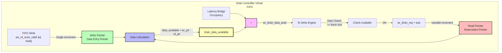

<!-- RTL Design Sherpa Documentation Header -->
<table>
<tr>
<td width="80">
  <a href="https://github.com/sean-galloway/RTLDesignSherpa">
    
  </a>
</td>
<td>
  <strong>RTL Design Sherpa</strong> · <em>Learning Hardware Design Through Practice</em><br>
  <sub>
    <a href="https://github.com/sean-galloway/RTLDesignSherpa">GitHub</a> ·
    <a href="https://github.com/sean-galloway/RTLDesignSherpa/blob/main/docs/DOCUMENTATION_INDEX.md">Documentation Index</a> ·
    <a href="https://github.com/sean-galloway/RTLDesignSherpa/blob/main/LICENSE">MIT License</a>
  </sub>
</td>
</tr>
</table>

---

<!-- End Header -->

# Stream Drain Controller

**Module:** `stream_drain_ctrl.sv`
**Location:** `projects/components/stream/rtl/fub/`
**Category:** FUB (Functional Unit Block)
**Parent:** `sram_controller_unit.sv`
**Status:** Implemented
**Last Updated:** 2025-11-30

---

## Overview

The `stream_drain_ctrl` module is a virtual FIFO for write engine flow control. It tracks data availability using FIFO pointer logic without storing any data. This allows the write engine to pre-reserve data before issuing AXI write commands.

### Key Features

- **Virtual FIFO Pattern:** Pointer arithmetic only, no data storage
- **Pre-Reservation:** Write engine reserves data before AXI AW command
- **Variable Size Drains:** Supports burst-sized reservations (not single beat)
- **Registered Outputs:** Optional output registration for timing
- **Underflow Prevention:** Ensures data exists before write engine commits

---

## Architecture

### Block Diagram

### Figure 1: Stream Drain Controller Block Diagram



**Source:** [09_stream_drain_ctrl_block.mmd](../assets/mermaid/09_stream_drain_ctrl_block.mmd)

### Virtual FIFO Concept

Unlike a real FIFO that stores data, the drain controller only tracks pointers:

```
Real FIFO:           Virtual FIFO (Drain Controller):
      
 Data[0]            wr_ptr: 5     � Tracks entries written
 Data[1]            rd_ptr: 2     � Tracks entries drained
 Data[2]            available:3   � Difference
 ...               


Actual data stored in gaxi_fifo_sync (separate component)
```

### Pointer Operations

**Write Side (Data Entry):**
```
When FIFO receives data:
  wr_ptr += 1
  data_available += 1
```

**Read Side (Drain Request):**
```
When write engine requests drain:
  rd_ptr += rd_size  (variable burst size!)
  data_available -= rd_size
```

---

## Parameters

| Parameter | Type | Default | Description |
|-----------|------|---------|-------------|
| `DEPTH` | int | 512 | Virtual FIFO depth |
| `ALMOST_WR_MARGIN` | int | 1 | Almost full margin |
| `ALMOST_RD_MARGIN` | int | 1 | Almost empty margin |
| `REGISTERED` | int | 1 | Registered outputs |

: Parameters

### Derived Parameters

| Parameter | Derivation | Description |
|-----------|------------|-------------|
| `D` | DEPTH | Short alias |
| `AW` | $clog2(D) | Address width |

: Derived Parameters

---

## Port List

### Clock and Reset

| Signal | Direction | Width | Description |
|--------|-----------|-------|-------------|
| `axi_aclk` | input | 1 | System clock |
| `axi_aresetn` | input | 1 | Active-low asynchronous reset |

: Clock and Reset

### Write Interface (Data Entry)

| Signal | Direction | Width | Description |
|--------|-----------|-------|-------------|
| `wr_valid` | input | 1 | Data written to FIFO |
| `wr_ready` | output | 1 | Not full (can accept) |

: Write Interface

### Read Interface (Drain Requests)

| Signal | Direction | Width | Description |
|--------|-----------|-------|-------------|
| `rd_valid` | input | 1 | Request to drain data |
| `rd_size` | input | 8 | Number of entries to drain |
| `rd_ready` | output | 1 | Data available (not empty) |

: Read Interface

### Status Outputs

| Signal | Direction | Width | Description |
|--------|-----------|-------|-------------|
| `data_available` | output | AW+1 | Available data count |
| `wr_full` | output | 1 | Full (no space) |
| `wr_almost_full` | output | 1 | Almost full |
| `rd_empty` | output | 1 | Empty (no data) |
| `rd_almost_empty` | output | 1 | Almost empty |

: Status Outputs

---

## Operation

### Data Entry (Write Side)

Data entry is single-beat increments, tracking each beat written to the physical FIFO:

```systemverilog
// Write pointer uses counter_bin for single-beat increments
counter_bin #(
    .WIDTH (AW + 1),
    .MAX   (D)
) write_pointer_inst (
    .clk              (axi_aclk),
    .rst_n            (axi_aresetn),
    .enable           (w_write && !r_wr_full),
    .counter_bin_curr (r_wr_ptr_bin),
    .counter_bin_next (w_wr_ptr_bin_next)
);
```

### Drain Requests (Read Side)

Drain requests support variable-size bursts:

```systemverilog
// Read pointer advances by rd_size on each drain request
always_ff @(posedge axi_aclk or negedge axi_aresetn) begin
    if (!axi_aresetn) begin
        r_rd_ptr_bin <= '0;
    end else begin
        if (w_read && !r_rd_empty) begin
            r_rd_ptr_bin <= r_rd_ptr_bin + (AW+1)'(rd_size);
        end
    end
end
```

### Status Generation

Uses `fifo_control` block for full/empty/almost flags:

```systemverilog
fifo_control #(
    .DEPTH             (D),
    .ADDR_WIDTH        (AW),
    .ALMOST_RD_MARGIN  (ALMOST_RD_MARGIN),
    .ALMOST_WR_MARGIN  (ALMOST_WR_MARGIN),
    .REGISTERED        (REGISTERED)
) fifo_control_inst (
    // ... pointer inputs
    .count            (w_count),
    .wr_full          (r_wr_full),
    .wr_almost_full   (r_wr_almost_full),
    .rd_empty         (r_rd_empty),
    .rd_almost_empty  (r_rd_almost_empty)
);
```

---

## Comparison with stream_alloc_ctrl

| Aspect | stream_alloc_ctrl | stream_drain_ctrl |
|--------|-------------------|-------------------|
| **Purpose** | Track space for reads | Track data for writes |
| **Write Side** | Reservation (burst) | Data entry (single beat) |
| **Read Side** | Fulfillment (single beat) | Drain request (burst) |
| **Consumer** | AXI Read Engine | AXI Write Engine |

: Comparison with stream_alloc_ctrl

Both use virtual FIFO pattern but with opposite semantics for read/write operations.

---

## Integration Example

```systemverilog
stream_drain_ctrl #(
    .DEPTH            (512),
    .REGISTERED       (1)
) u_drain_ctrl (
    .axi_aclk         (clk),
    .axi_aresetn      (rst_n),

    // Write interface: Connected to FIFO write handshake
    .wr_valid         (fifo_wr_valid && fifo_wr_ready),
    .wr_ready         (),  // Not used (tracks, doesn't control)

    // Read interface: Connected to write engine drain requests
    .rd_valid         (axi_wr_drain_req),
    .rd_size          (axi_wr_drain_size),
    .rd_ready         (),  // Not used (polling interface)

    // Status
    .data_available   (drain_data_available),
    .wr_full          (),
    .wr_almost_full   (),
    .rd_empty         (),
    .rd_almost_empty  ()
);
```

---

## Common Issues

### Issue 1: Data Available Undercount

**Symptom:** Write engine sees 0 available when FIFO has data

**Root Causes:**
1. `wr_valid` not connected to FIFO write handshake
2. Bridge occupancy not added to data_available

**Solution:** Ensure connection: `wr_valid = fifo_wr_valid && fifo_wr_ready`

### Issue 2: Drain Request Overflow

**Symptom:** rd_ptr advances past wr_ptr

**Root Causes:**
1. Write engine requesting more than available
2. Multiple simultaneous drain requests

**Solution:** Write engine must check `data_available >= requested_size` before draining.

---

## Bug Fixes (v0.92)

### Stale-View Race Closure (Commit a82627af)

The drain controller was sampling a registered signal one cycle stale, producing `wvalid` before SRAM data had settled. This occurred because:

1. SRAM read data changes on clock edge
2. Drain controller samples that data combinationally in the same cycle
3. Data fed to write engine, wvalid asserted → write engine consumes stale data

**Fix:** A post-flop register is inserted after the drain mux (SRAM data path), and `wvalid` is only asserted after this register. This guarantees that data has settled before wvalid assertion.

**Matching half:** Write engine (`12_axi_write_engine.md`) implements the post-flop gating on wvalid in coordination with this fix.

---

## Related Documentation

- **Parent:** `09_sram_controller_unit.md` - Integration context
- **Counterpart:** `07_stream_alloc_ctrl.md` - Space tracking (read side)
- **Consumer:** `12_axi_write_engine.md` - Uses drain interface
- **Control Block:** See `fifo_control` in rtl/amba/gaxi/
---

## Revision History

| Version | Date | Author | Description |
|---------|------|--------|-------------|
| 0.90 | 2025-11-22 | seang | Initial block specification |
| 0.91 | 2026-01-02 | seang | Added table captions and figure numbers |

: Stream Drain Controller Revision History

---

**Last Updated:** 2026-01-02
