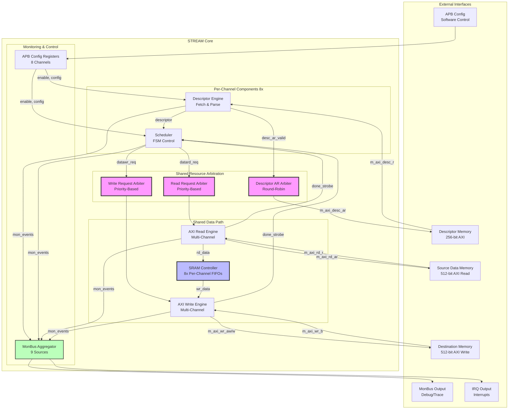
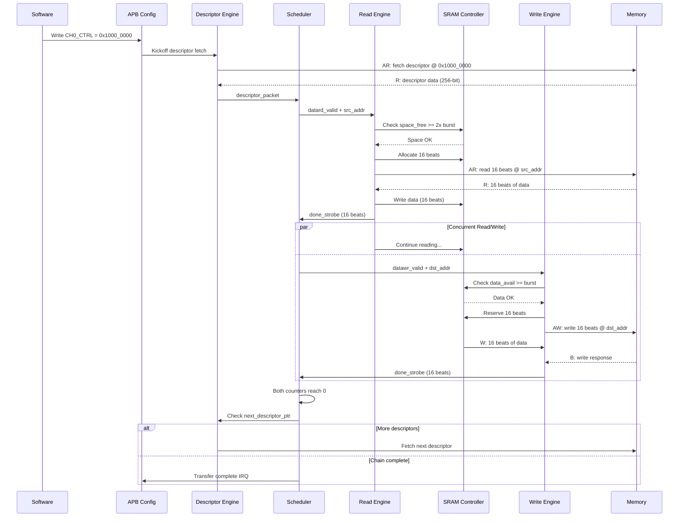
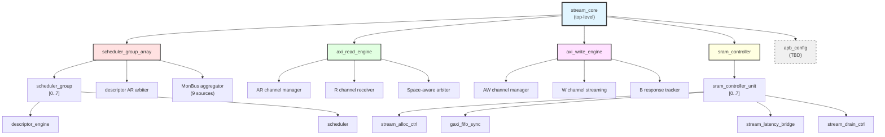

# STREAM Architecture Overview

**Component:** STREAM (Scatter-gather Transfer Rapid Engine for AXI Memory)
**Version:** 0.90
**Status:** Pre-release

---

## Introduction

STREAM is a high-performance, multi-channel descriptor-based DMA engine designed for memory-to-memory scatter-gather transfers. It provides an educational yet production-capable architecture demonstrating key DMA concepts while maintaining professional design practices.

### Design Philosophy

1. **Tutorial Focus** - Intentional simplifications for learning
2. **Production Quality** - Industry-standard interfaces and verification
3. **Scalability** - 8 independent channels with shared resource arbitration
4. **Modularity** - Clear separation of concerns across functional blocks

---

## System Architecture

### High-Level Block Diagram


<!--
Original Mermaid diagram (for editing):


-->

---

## Key Architectural Concepts

### 1. Multi-Channel Design

**8 Independent Channels:**
- Each channel operates autonomously
- Separate descriptor chains per channel
- Independent FSM state per channel
- Concurrent transfers across all channels

**Resource Sharing:**
- Descriptor AXI master (shared via round-robin arbiter)
- Data read AXI master (shared via priority arbiter)
- Data write AXI master (shared via priority arbiter)
- SRAM buffer (per-channel FIFOs, no arbitration)

### 2. Descriptor-Based Operation

**Descriptor Format (256-bit):**
```
[255:192] Reserved
[191:160] Next Descriptor Pointer
[159:128] Length (in beats)
[127:64]  Destination Address
[63:0]    Source Address
```

**Descriptor Chain:**
- Single APB write kicks off chain
- Automatic chaining via next_descriptor_ptr
- Explicit termination (ptr = 0 or last flag)

### 3. Concurrent Read/Write

**CRITICAL Design Pattern:**

STREAM uses concurrent read and write operations to handle transfers larger than the SRAM buffer:

```
Example: 100MB transfer with 64KB SRAM buffer

Sequential (WRONG):
  Read 100MB → DEADLOCK at 64KB (SRAM full)

Concurrent (CORRECT):
  Read fills SRAM → SRAM full → Read pauses
  Write drains SRAM → SRAM space freed → Read resumes
  Both continue until 100MB complete
```

**Implementation:**
- Scheduler runs read and write FSMs concurrently in XFER_DATA state
- Independent beat counters for read vs write
- Transfer completes when BOTH counters reach zero

### 4. Space-Aware Flow Control

**Allocation Controller (Read Path):**
- Reserves SRAM space BEFORE issuing AXI AR
- Prevents overflow due to AR/R latency gap
- 2x space margin (accounts for in-flight allocations)

**Drain Controller (Write Path):**
- Reserves SRAM data BEFORE issuing AXI AW
- Prevents underflow due to AW/W latency gap
- Includes latency bridge occupancy in count

### 5. Priority-Based Arbitration

**Descriptor Fetch:**
- Round-robin arbitration (fair access)
- All channels equal priority

**Data Read/Write:**
- Priority-based arbitration
- Priority from descriptor
- Round-robin within same priority tier
- Timeout prevention for low-priority channels

---

## Data Flow Example

### Single Channel Transfer


<!--
Original Mermaid diagram (for editing):


-->

---

## Component Hierarchy



---

## Interface Summary

### External Interfaces

| Interface | Type | Width | Purpose |
|-----------|------|-------|---------|
| APB | Slave | 32-bit | Configuration, control, status |
| Descriptor AXI | Master | 256-bit | Fetch descriptors from memory |
| Data Read AXI | Master | 512-bit | Read source data |
| Data Write AXI | Master | 512-bit | Write destination data |
| MonBus | Output | 64-bit | Debug/trace event stream |
| IRQ | Output | 1-bit | Transfer completion interrupts |

### Configuration Registers (APB)

**Global Registers:**
- STREAM_CTRL - Global enable/disable
- STREAM_STATUS - Overall status
- STREAM_IRQ_STATUS - Interrupt status (per-channel)
- STREAM_IRQ_ENABLE - Interrupt enable mask

**Per-Channel Registers (CH0-CH7):**
- CHx_CTRL - Channel enable, kickoff descriptor address
- CHx_STATUS - Channel state, error flags
- CHx_CONFIG - Burst sizes, timeouts, priority
- CHx_CURRENT_DESC - Current descriptor address (RO)
- CHx_BEATS_READ - Read beat counter (RO)
- CHx_BEATS_WRITE - Write beat counter (RO)

---

## Resource Utilization

### Area Breakdown (Typical 512-bit Data Width)

| Component | Quantity | Logic (LUTs) | Memory |
|-----------|----------|--------------|--------|
| Descriptor Engine | 8 | ~300 each | Minimal |
| Scheduler | 8 | ~400 each | Minimal |
| AXI Read Engine | 1 | ~800 | Minimal |
| AXI Write Engine | 1 | ~800 | Minimal |
| SRAM Controller | 1 | ~600 | 8 × 64KB = 512KB |
| Arbiters | 3 | ~150 each | Minimal |
| APB Config | 1 | ~400 | Register file |
| MonBus Aggregator | 1 | ~200 | Small FIFO |
| **Total** | - | **~10K LUTs** | **~512KB RAM** |

**Notes:**
- SRAM depth configurable (typical: 512 entries × 512 bits × 8 channels = 512KB)
- Logic utilization scales with NUM_CHANNELS
- Memory utilization scales with SRAM_DEPTH

---

## Performance Characteristics

### Throughput

**Theoretical Maximum (512-bit @ 250MHz):**
- Single channel: 16 GB/s (512 bits × 250 MHz)
- 8 channels concurrent: Limited by memory bandwidth, not DMA

**Practical Performance:**
- Dependent on:
  - Memory controller latency
  - Burst sizes (larger = better efficiency)
  - Transfer alignment
  - Channel contention

**Typical Real-World:**
- 8-12 GB/s sustained (single channel)
- 50-75% of theoretical maximum

### Latency

**Descriptor Fetch Latency:**
- AR issue to R data: ~10-50 cycles (memory dependent)
- Descriptor parsing: 1 cycle
- **Total:** ~11-51 cycles per descriptor

**Transfer Initiation:**
- APB write to first AR: ~5-10 cycles
- AR to first R data: ~10-50 cycles
- **Total:** ~15-60 cycles from kickoff to first data

**Transfer Completion:**
- Last W beat to B response: ~5-20 cycles
- B response to IRQ: 1 cycle
- **Total:** ~6-21 cycles from last data to interrupt

---

## Design Decisions

### Why These Simplifications?

1. **Aligned Addresses Only:**
   - Eliminates complex alignment fixup logic
   - Clear data path with no byte shifting
   - Focus: Core DMA operation, not edge cases

2. **Length in Beats:**
   - Direct mapping to AXI burst length
   - No unit conversion overhead
   - Focus: AXI protocol understanding

3. **No Credit Management:**
   - Simpler resource arbitration
   - Transaction limits via configuration
   - Focus: Arbitration basics, not complex flow control

4. **No Circular Buffers:**
   - Explicit chain termination
   - Clear end-of-transfer detection
   - Focus: Descriptor chaining, not circular logic

### Production Enhancements (Future)

If extending STREAM for production use, consider:
- [ ] Alignment fixup (byte-level granularity)
- [ ] Length in bytes/chunks
- [ ] Credit-based flow control
- [ ] Circular buffer support
- [ ] Advanced error recovery
- [ ] Power management
- [ ] Multiple SRAM segments

---

## Testing Strategy

### Verification Layers

**1. Unit Tests (FUB Level):**
- Descriptor engine: Fetch, parse, chain
- Scheduler: FSM states, concurrent read/write
- AXI engines: AR/R and AW/W/B channels
- SRAM controller: Allocation, drain, FIFO
- Individual tests per module

**2. Integration Tests (Multi-Block):**
- Scheduler + engines: Data flow
- Descriptor + scheduler: Descriptor chaining
- Full path: APB → Descriptor → Transfer → IRQ

**3. System Tests (Full Core):**
- Single channel end-to-end
- Multi-channel concurrent
- Error injection and recovery
- Performance validation
- Long-duration stress tests

### Coverage Targets

- **Code Coverage:** >95%
- **Functional Coverage:** >90%
- **Corner Cases:** 100% tested
- **Error Paths:** 100% tested

---

## Related Documentation

**Chapter 2 - Block Specifications:**
- [Scheduler](../ch02_blocks/02_scheduler.md) - Core FSM controller
- [Descriptor Engine](../ch02_blocks/03_descriptor_engine.md) - Descriptor fetch/parse
- [AXI Read Engine](../ch02_blocks/08_axi_read_engine.md) - Source data read
- [AXI Write Engine](../ch02_blocks/10_axi_write_engine.md) - Destination data write
- [SRAM Controller](../ch02_blocks/05_sram_controller.md) - Buffering and flow control
- [Scheduler Group](../ch02_blocks/11_scheduler_group.md) - Per-channel wrapper
- [Scheduler Group Array](../ch02_blocks/12_scheduler_group_array.md) - 8-channel array

**Other Resources:**
- [STREAM PRD](../../PRD.md) - Product requirements
- [Test Plan](../ch03_testing/test_plan.md) - Verification strategy

---

**Last Updated:** 2025-11-22
**Document Version:** 0.90
