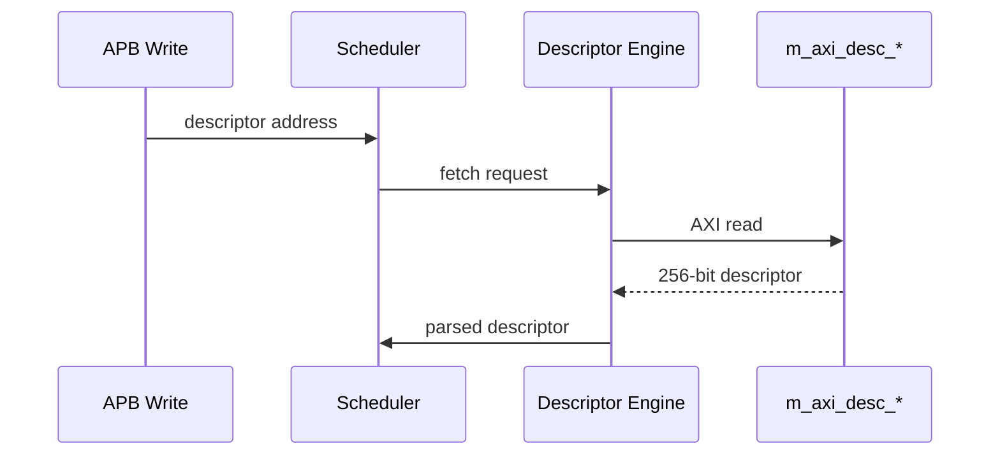
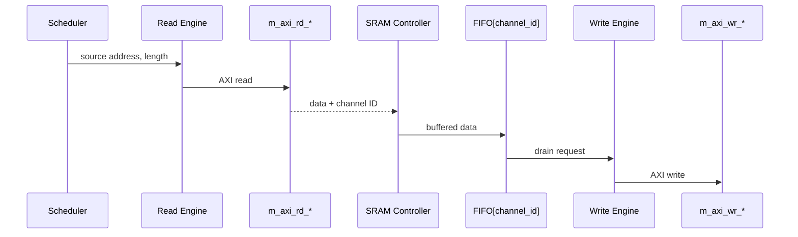

# STREAM Core Specification

**Module:** `stream_core.sv`
**Location:** `projects/components/stream/rtl/macro/`
**Status:** Implemented
**Last Updated:** 2025-11-30

---

## Overview

The STREAM Core is the top-level integration module that combines all STREAM components into a complete scatter-gather DMA engine. It provides 8 independent channels with descriptor-based memory-to-memory transfers.

### Key Features

- **8 Independent Channels:** Concurrent descriptor-based transfers
- **Shared AXI Masters:** Three shared AXI4 masters for efficiency
  - Descriptor fetch (256-bit fixed)
  - Data read (parameterizable, default 512-bit)
  - Data write (parameterizable, default 512-bit)
- **Per-Channel Buffering:** Independent FIFO per channel (512 entries default)
- **Performance Monitoring:** Integrated profiler with FIFO readout
- **AXI Skid Buffers:** Timing closure on all external interfaces
- **Unified MonBus:** Single monitor bus output for all events

### Block Diagram

The STREAM Core integrates the following major components:


**Source:** [01_stream_core_block.mmd](../assets/mermaid/01_stream_core_block.mmd)

---

## Architecture

### Component Hierarchy

1. **scheduler_group_array** - Top scheduler layer
   - 8 × scheduler_group instances
   - Shared descriptor engine
   - Descriptor fetch arbitration

2. **sram_controller** - Buffering layer
   - 8 × independent FIFOs (gaxi_fifo_sync)
   - Per-channel allocation controllers
   - Per-channel drain controllers

3. **axi_read_engine** - Read datapath
   - Shared AXI master for all channels
   - ID-based routing to SRAM
   - Space allocation flow control

4. **axi_write_engine** - Write datapath
   - Shared AXI master for all channels
   - ID-based routing from SRAM
   - Drain reservation flow control

5. **perf_profiler** - Performance monitoring
   - Transaction counting
   - Bandwidth tracking
   - FIFO readout interface

6. **AXI Skid Buffers** - Timing closure
   - Descriptor AXI (AR/R)
   - Read AXI (AR/R)
   - Write AXI (AW/W/B)

### Data Flow

**Descriptor Fetch Flow:**



**Data Transfer Flow:**



---

## Parameters

### Primary Configuration

| Parameter | Type | Default | Description |
|-----------|------|---------|-------------|
| `NUM_CHANNELS` | int | 8 | Number of independent DMA channels |
| `CHAN_WIDTH` | int | $clog2(NUM_CHANNELS) | Channel ID width (3 for 8 channels) |
| `ADDR_WIDTH` | int | 64 | Address bus width |
| `DATA_WIDTH` | int | 512 | Data bus width (must match memory interface) |
| `AXI_ID_WIDTH` | int | 8 | AXI transaction ID width |
| `FIFO_DEPTH` | int | 512 | Per-channel FIFO depth |

### Monitor Control

| Parameter | Type | Default | Description |
|-----------|------|---------|-------------|
| `USE_AXI_MONITORS` | int | 1 | Enable (1) or disable (0) AXI transaction monitors |

**Note:** When `USE_AXI_MONITORS = 0`:
- All monitor configuration inputs are tied off internally
- MonBus output remains present but inactive (no packets generated)
- Reduces resource usage for production systems

### Outstanding Transaction Limits

| Parameter | Default | Description |
|-----------|---------|-------------|
| `AR_MAX_OUTSTANDING` | 8 | Maximum concurrent read address requests |
| `AW_MAX_OUTSTANDING` | 8 | Maximum concurrent write address requests |

### AXI Skid Buffer Depths

| Parameter | Default | Purpose |
|-----------|---------|---------|
| `SKID_DEPTH_AR` | 2 | AR channel timing closure |
| `SKID_DEPTH_R` | 4 | R channel timing closure |
| `SKID_DEPTH_AW` | 2 | AW channel timing closure |
| `SKID_DEPTH_W` | 4 | W channel timing closure |
| `SKID_DEPTH_B` | 2 | B channel timing closure |

**Note:** Deeper buffers on data channels (R/W) improve throughput.

### MonBus Agent IDs

| Parameter | Default | Description |
|-----------|---------|-------------|
| `DESC_MON_BASE_AGENT_ID` | 16 (0x10) | Descriptor engines base (16-23) |
| `SCHED_MON_BASE_AGENT_ID` | 48 (0x30) | Schedulers base (48-55) |
| `DESC_AXI_MON_AGENT_ID` | 8 (0x08) | Descriptor AXI master monitor |
| `MON_UNIT_ID` | 1 (0x1) | Unit ID for all STREAM events |

---

## Port List

### Clock and Reset

| Signal | Direction | Width | Description |
|--------|-----------|-------|-------------|
| `clk` | input | 1 | System clock |
| `rst_n` | input | 1 | Active-low asynchronous reset |

### APB Programming Interface

Per-channel descriptor kick-off interface:

| Signal | Direction | Width | Description |
|--------|-----------|-------|-------------|
| `apb_valid[ch]` | input | NUM_CHANNELS | Channel descriptor address valid |
| `apb_ready[ch]` | output | NUM_CHANNELS | Channel ready to accept descriptor address |
| `apb_addr[ch]` | input | NUM_CHANNELS × ADDR_WIDTH | Descriptor address per channel |

**Usage:**
```systemverilog
// Kick off channel 0 with descriptor at 0x1000_0000
apb_valid[0] = 1'b1;
apb_addr[0] = 64'h0000_0000_1000_0000;
// Wait for handshake
wait (apb_ready[0]);
apb_valid[0] = 1'b0;
```

### Configuration Interface

**Per-Channel Configuration:**

| Signal | Direction | Width | Description |
|--------|-----------|-------|-------------|
| `cfg_channel_enable[ch]` | input | NUM_CHANNELS | Enable channel |
| `cfg_channel_reset[ch]` | input | NUM_CHANNELS | Soft reset channel (FSM → IDLE) |

**Global Scheduler Configuration:**

| Signal | Direction | Width | Description |
|--------|-----------|-------|-------------|
| `cfg_sched_enable` | input | 1 | Global scheduler enable |
| `cfg_sched_timeout_cycles` | input | 16 | Timeout threshold (cycles) |
| `cfg_sched_timeout_enable` | input | 1 | Enable timeout detection |
| `cfg_sched_err_enable` | input | 1 | Enable error event reporting |
| `cfg_sched_compl_enable` | input | 1 | Enable completion event reporting |
| `cfg_sched_perf_enable` | input | 1 | Enable performance event reporting |

**Descriptor Engine Configuration:**

| Signal | Direction | Width | Description |
|--------|-----------|-------|-------------|
| `cfg_desceng_enable` | input | 1 | Enable descriptor engine |
| `cfg_desceng_prefetch` | input | 1 | Enable descriptor prefetch |
| `cfg_desceng_fifo_thresh` | input | 4 | FIFO threshold for prefetch |
| `cfg_desceng_addr0_base` | input | ADDR_WIDTH | Base address limit 0 |
| `cfg_desceng_addr0_limit` | input | ADDR_WIDTH | Limit address limit 0 |
| `cfg_desceng_addr1_base` | input | ADDR_WIDTH | Base address limit 1 |
| `cfg_desceng_addr1_limit` | input | ADDR_WIDTH | Limit address limit 1 |

**AXI Monitor Configuration:**

Three identical sets of monitor config signals (descriptor, read, write):

| Signal Prefix | Applies To | Description |
|---------------|------------|-------------|
| `cfg_desc_mon_*` | Descriptor AXI | Descriptor fetch monitoring |
| `cfg_rdeng_mon_*` | Read AXI | Data read monitoring |
| `cfg_wreng_mon_*` | Write AXI | Data write monitoring |

Each monitor has:

| Signal Suffix | Width | Description |
|---------------|-------|-------------|
| `_enable` | 1 | Enable monitor |
| `_err_enable` | 1 | Enable error reporting |
| `_perf_enable` | 1 | Enable performance reporting |
| `_timeout_enable` | 1 | Enable timeout detection |
| `_timeout_cycles` | 32 | Timeout threshold |
| `_latency_thresh` | 32 | Latency threshold for events |
| `_pkt_mask` | 16 | Packet type mask |
| `_err_select` | 4 | Error type selector |
| `_err_mask` | 8 | Error event mask |
| `_timeout_mask` | 8 | Timeout event mask |
| `_compl_mask` | 8 | Completion event mask |
| `_thresh_mask` | 8 | Threshold event mask |
| `_perf_mask` | 8 | Performance event mask |
| `_addr_mask` | 8 | Address event mask |
| `_debug_mask` | 8 | Debug event mask |

**AXI Transfer Configuration:**

| Signal | Direction | Width | Description |
|--------|-----------|-------|-------------|
| `cfg_axi_rd_xfer_beats` | input | 8 | Read burst size (beats) |
| `cfg_axi_wr_xfer_beats` | input | 8 | Write burst size (beats) |

**Performance Profiler Configuration:**

| Signal | Direction | Width | Description |
|--------|-----------|-------|-------------|
| `cfg_perf_enable` | input | 1 | Enable profiler |
| `cfg_perf_mode` | input | 1 | Profiler mode (0=count, 1=latency) |
| `cfg_perf_clear` | input | 1 | Clear profiler counters |

### Status Interface

**System-Level Status:**

| Signal | Direction | Width | Description |
|--------|-----------|-------|-------------|
| `system_idle` | output | 1 | All channels idle (AND of all scheduler_idle) |

**Per-Channel Status:**

| Signal | Direction | Width | Description |
|--------|-----------|-------|-------------|
| `descriptor_engine_idle[ch]` | output | NUM_CHANNELS | Descriptor engine idle |
| `scheduler_idle[ch]` | output | NUM_CHANNELS | Scheduler in IDLE state |
| `scheduler_state[ch]` | output | NUM_CHANNELS × 7 | Scheduler FSM state (ONE-HOT) |
| `sched_error[ch]` | output | NUM_CHANNELS | Scheduler error (sticky) |
| `axi_rd_all_complete[ch]` | output | NUM_CHANNELS | All read transactions complete |
| `axi_wr_all_complete[ch]` | output | NUM_CHANNELS | All write transactions complete |

**Performance Profiler Status:**

| Signal | Direction | Width | Description |
|--------|-----------|-------|-------------|
| `perf_fifo_empty` | output | 1 | Profiler FIFO empty |
| `perf_fifo_full` | output | 1 | Profiler FIFO full |
| `perf_fifo_count` | output | 16 | Profiler FIFO occupancy |
| `perf_fifo_rd` | input | 1 | Read profiler entry |
| `perf_fifo_data_low` | output | 32 | Profiler data [31:0] |
| `perf_fifo_data_high` | output | 32 | Profiler data [63:32] |

### AXI4 Master - Descriptor Fetch (256-bit)

**AR Channel:**

| Signal | Direction | Width | Description |
|--------|-----------|-------|-------------|
| `m_axi_desc_arid` | output | AXI_ID_WIDTH | Transaction ID |
| `m_axi_desc_araddr` | output | ADDR_WIDTH | Address |
| `m_axi_desc_arlen` | output | 8 | Burst length - 1 |
| `m_axi_desc_arsize` | output | 3 | Burst size (log2 bytes) |
| `m_axi_desc_arburst` | output | 2 | Burst type (INCR) |
| `m_axi_desc_arlock` | output | 1 | Lock type |
| `m_axi_desc_arcache` | output | 4 | Cache attributes |
| `m_axi_desc_arprot` | output | 3 | Protection attributes |
| `m_axi_desc_arqos` | output | 4 | QoS value |
| `m_axi_desc_arregion` | output | 4 | Region identifier |
| `m_axi_desc_aruser` | output | CHAN_WIDTH | User signal (channel ID) |
| `m_axi_desc_arvalid` | output | 1 | Address valid |
| `m_axi_desc_arready` | input | 1 | Address ready |

**R Channel:**

| Signal | Direction | Width | Description |
|--------|-----------|-------|-------------|
| `m_axi_desc_rid` | input | AXI_ID_WIDTH | Transaction ID |
| `m_axi_desc_rdata` | input | 256 | Read data (FIXED 256-bit) |
| `m_axi_desc_rresp` | input | 2 | Response (OKAY/EXOKAY/SLVERR/DECERR) |
| `m_axi_desc_rlast` | input | 1 | Last beat of burst |
| `m_axi_desc_ruser` | input | CHAN_WIDTH | User signal (channel ID) |
| `m_axi_desc_rvalid` | input | 1 | Read data valid |
| `m_axi_desc_rready` | output | 1 | Read data ready |

### AXI4 Master - Data Read (Parameterizable Width)

**AR Channel:**

| Signal | Direction | Width | Description |
|--------|-----------|-------|-------------|
| `m_axi_rd_arid` | output | AXI_ID_WIDTH | Transaction ID |
| `m_axi_rd_araddr` | output | ADDR_WIDTH | Address |
| `m_axi_rd_arlen` | output | 8 | Burst length - 1 |
| `m_axi_rd_arsize` | output | 3 | Burst size (log2 bytes) |
| `m_axi_rd_arburst` | output | 2 | Burst type (INCR) |
| `m_axi_rd_arlock` | output | 1 | Lock type |
| `m_axi_rd_arcache` | output | 4 | Cache attributes |
| `m_axi_rd_arprot` | output | 3 | Protection attributes |
| `m_axi_rd_arqos` | output | 4 | QoS value |
| `m_axi_rd_arregion` | output | 4 | Region identifier |
| `m_axi_rd_aruser` | output | CHAN_WIDTH | User signal (channel ID) |
| `m_axi_rd_arvalid` | output | 1 | Address valid |
| `m_axi_rd_arready` | input | 1 | Address ready |

**R Channel:**

| Signal | Direction | Width | Description |
|--------|-----------|-------|-------------|
| `m_axi_rd_rid` | input | AXI_ID_WIDTH | Transaction ID |
| `m_axi_rd_rdata` | input | DATA_WIDTH | Read data (default 512-bit) |
| `m_axi_rd_rresp` | input | 2 | Response |
| `m_axi_rd_rlast` | input | 1 | Last beat of burst |
| `m_axi_rd_ruser` | input | CHAN_WIDTH | User signal (channel ID) |
| `m_axi_rd_rvalid` | input | 1 | Read data valid |
| `m_axi_rd_rready` | output | 1 | Read data ready |

### AXI4 Master - Data Write (Parameterizable Width)

**AW Channel:**

| Signal | Direction | Width | Description |
|--------|-----------|-------|-------------|
| `m_axi_wr_awid` | output | AXI_ID_WIDTH | Transaction ID |
| `m_axi_wr_awaddr` | output | ADDR_WIDTH | Address |
| `m_axi_wr_awlen` | output | 8 | Burst length - 1 |
| `m_axi_wr_awsize` | output | 3 | Burst size (log2 bytes) |
| `m_axi_wr_awburst` | output | 2 | Burst type (INCR) |
| `m_axi_wr_awlock` | output | 1 | Lock type |
| `m_axi_wr_awcache` | output | 4 | Cache attributes |
| `m_axi_wr_awprot` | output | 3 | Protection attributes |
| `m_axi_wr_awqos` | output | 4 | QoS value |
| `m_axi_wr_awregion` | output | 4 | Region identifier |
| `m_axi_wr_awuser` | output | CHAN_WIDTH | User signal (channel ID) |
| `m_axi_wr_awvalid` | output | 1 | Address valid |
| `m_axi_wr_awready` | input | 1 | Address ready |

**W Channel:**

| Signal | Direction | Width | Description |
|--------|-----------|-------|-------------|
| `m_axi_wr_wdata` | output | DATA_WIDTH | Write data (default 512-bit) |
| `m_axi_wr_wstrb` | output | DATA_WIDTH/8 | Write strobes (byte enables) |
| `m_axi_wr_wlast` | output | 1 | Last beat of burst |
| `m_axi_wr_wuser` | output | CHAN_WIDTH | User signal (channel ID) |
| `m_axi_wr_wvalid` | output | 1 | Write data valid |
| `m_axi_wr_wready` | input | 1 | Write data ready |

**B Channel:**

| Signal | Direction | Width | Description |
|--------|-----------|-------|-------------|
| `m_axi_wr_bid` | input | AXI_ID_WIDTH | Transaction ID |
| `m_axi_wr_bresp` | input | 2 | Response |
| `m_axi_wr_buser` | input | CHAN_WIDTH | User signal (channel ID) |
| `m_axi_wr_bvalid` | input | 1 | Response valid |
| `m_axi_wr_bready` | output | 1 | Response ready |

### Status/Debug Outputs

**Descriptor AXI Monitor:**

| Signal | Direction | Width | Description |
|--------|-----------|-------|-------------|
| `cfg_sts_desc_mon_busy` | output | 1 | Monitor busy |
| `cfg_sts_desc_mon_active_txns` | output | 8 | Active transaction count |
| `cfg_sts_desc_mon_error_count` | output | 16 | Error count |
| `cfg_sts_desc_mon_txn_count` | output | 32 | Total transaction count |
| `cfg_sts_desc_mon_conflict_error` | output | 1 | ID conflict detected |

**Read Engine AXI Monitor:**

| Signal | Direction | Width | Description |
|--------|-----------|-------|-------------|
| `cfg_sts_rdeng_skid_busy` | output | 1 | Skid buffer busy |
| `cfg_sts_rdeng_mon_active_txns` | output | 8 | Active transaction count |
| `cfg_sts_rdeng_mon_error_count` | output | 16 | Error count |
| `cfg_sts_rdeng_mon_txn_count` | output | 32 | Total transaction count |
| `cfg_sts_rdeng_mon_conflict_error` | output | 1 | ID conflict detected |

**Write Engine AXI Monitor:**

| Signal | Direction | Width | Description |
|--------|-----------|-------|-------------|
| `cfg_sts_wreng_skid_busy` | output | 1 | Skid buffer busy |
| `cfg_sts_wreng_mon_active_txns` | output | 8 | Active transaction count |
| `cfg_sts_wreng_mon_error_count` | output | 16 | Error count |
| `cfg_sts_wreng_mon_txn_count` | output | 32 | Total transaction count |
| `cfg_sts_wreng_mon_conflict_error` | output | 1 | ID conflict detected |

### Unified Monitor Bus Interface

| Signal | Direction | Width | Description |
|--------|-----------|-------|-------------|
| `mon_valid` | output | 1 | Monitor packet valid |
| `mon_ready` | input | 1 | Monitor packet ready |
| `mon_packet` | output | 64 | Monitor packet data |

**MonBus Sources:**
- Descriptor engines (8 sources, agent IDs 16-23)
- Schedulers (8 sources, agent IDs 48-55)
- Descriptor AXI monitor (agent ID 8)
- Read AXI monitor (configurable)
- Write AXI monitor (configurable)

---

## Operation

### Transfer Initialization

**Step 1: Configuration**
```
1. Configure global settings (timeouts, monitors, transfer sizes)
2. Enable descriptor engine (cfg_desceng_enable = 1)
3. Enable scheduler (cfg_sched_enable = 1)
4. Enable target channel (cfg_channel_enable[ch] = 1)
```

**Step 2: Descriptor Kick-off**
```
1. Assert apb_valid[ch] = 1
2. Provide descriptor address on apb_addr[ch]
3. Wait for apb_ready[ch] handshake
4. Deassert apb_valid[ch]
```

**Step 3: Automatic Transfer**
```
1. Descriptor engine fetches descriptor via m_axi_desc_*
2. Scheduler receives descriptor, starts transfer
3. Read engine: memory → SRAM (via m_axi_rd_*)
4. Write engine: SRAM → memory (via m_axi_wr_*)
5. Scheduler reports completion via MonBus
```

### Monitoring Transfer Progress

**Check Scheduler State:**
```systemverilog
// Monitor scheduler state
case (scheduler_state[ch])
    7'b0000001: // CH_IDLE - waiting for descriptor
    7'b0000010: // CH_FETCH_DESC - fetching descriptor
    7'b0000100: // CH_XFER_DATA - transfer in progress
    7'b0001000: // CH_COMPLETE - transfer complete
    7'b0010000: // CH_NEXT_DESC - chaining to next
    7'b0100000: // CH_ERROR - error occurred
endcase
```

**Check Completion:**
```systemverilog
// All complete when:
complete = scheduler_idle[ch] &&
           axi_rd_all_complete[ch] &&
           axi_wr_all_complete[ch];
```

---

## Testing

**Test Location:** `projects/components/stream/dv/tests/top/`

**Key Test Scenarios:**

1. **Single channel transfer** - Basic end-to-end operation
2. **Multi-channel concurrent** - 2-8 channels simultaneously
3. **Descriptor chaining** - 2-5 descriptors linked
4. **FIFO overflow prevention** - Large transfer with small FIFO
5. **Error handling** - AXI errors, timeouts
6. **Performance profiling** - Bandwidth measurements
7. **MonBus event checking** - Verify all events reported

**Test Configuration:**
```python
# Basic configuration
NUM_CHANNELS = 4
DATA_WIDTH = 128
FIFO_DEPTH = 512
cfg_axi_rd_xfer_beats = 16
cfg_axi_wr_xfer_beats = 16
```

---

## Resource Utilization

**Estimated Resources (8 channels, 512-bit data, 512-deep FIFOs):**

| Component | Quantity | Est. Size |
|-----------|----------|-----------|
| Schedulers | 8 | 8 × ~500 FFs |
| Descriptor Engine | 1 | ~1000 FFs |
| SRAM FIFOs | 8 | 8 × 512 × 512-bit = 256KB |
| AXI Engines | 2 | 2 × ~2000 FFs |
| Skid Buffers | 3 sets | ~2000 FFs |
| Monitors | 3 | 3 × ~1000 FFs |
| **Total** | | ~20K FFs + 256KB SRAM |

**Critical Paths:**
- AXI handshake paths (improved by skid buffers)
- SRAM address decode
- MonBus arbiter

---

## Integration Example

```systemverilog
stream_core #(
    .NUM_CHANNELS(8),
    .DATA_WIDTH(512),
    .FIFO_DEPTH(512)
) u_stream (
    .clk                    (system_clk),
    .rst_n                  (system_rst_n),

    // APB kick-off
    .apb_valid              (stream_apb_valid),
    .apb_ready              (stream_apb_ready),
    .apb_addr               (stream_apb_addr),

    // Configuration
    .cfg_channel_enable     (stream_ch_enable),
    .cfg_sched_enable       (1'b1),
    .cfg_axi_rd_xfer_beats  (8'd16),
    .cfg_axi_wr_xfer_beats  (8'd16),
    // ... other config

    // AXI Descriptor Master
    .m_axi_desc_arid        (desc_arid),
    .m_axi_desc_araddr      (desc_araddr),
    // ... full AXI AR/R

    // AXI Read Master
    .m_axi_rd_arid          (rd_arid),
    .m_axi_rd_araddr        (rd_araddr),
    // ... full AXI AR/R

    // AXI Write Master
    .m_axi_wr_awid          (wr_awid),
    .m_axi_wr_awaddr        (wr_awaddr),
    // ... full AXI AW/W/B

    // MonBus
    .mon_valid              (stream_mon_valid),
    .mon_ready              (stream_mon_ready),
    .mon_packet             (stream_mon_packet)
);
```

---

## Related Documentation

- **Scheduler Group Array:** `02_scheduler_group_array.md` - Multi-channel scheduler integration
- **Scheduler Group:** `03_scheduler_group.md` - Single channel scheduler + descriptor engine
- **Scheduler:** `04_scheduler.md` - Channel state machine and transfer coordination
- **Descriptor Engine:** `05_descriptor_engine.md` - Descriptor fetch and parsing
- **AXI Read Engine:** `06_axi_read_engine.md` - Read datapath
- **Stream Alloc Ctrl:** `07_stream_alloc_ctrl.md` - Space allocation controller
- **SRAM Controller:** `08_sram_controller.md` - Per-channel buffering
- **SRAM Controller Unit:** `09_sram_controller_unit.md` - Single channel SRAM unit
- **Stream Latency Bridge:** `10_stream_latency_bridge.md` - Timing bridge
- **Stream Drain Ctrl:** `11_stream_drain_ctrl.md` - Drain flow controller
- **AXI Write Engine:** `12_axi_write_engine.md` - Write datapath
- **APB to Descriptor:** `13_apbtodescr.md` - APB configuration interface
- **Performance Profiler:** `15_perf_profiler.md` - Performance monitoring
- **MonBus AXI-Lite Group:** `16_monbus_axil_group.md` - Monitor bus arbitration

---

**Last Updated:** 2025-11-30 (verified against RTL implementation)
