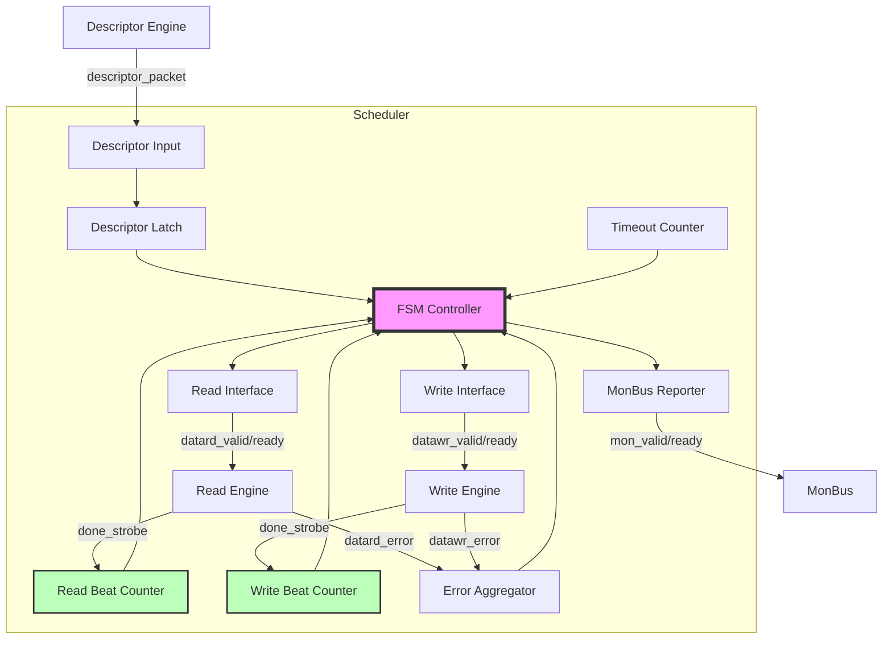
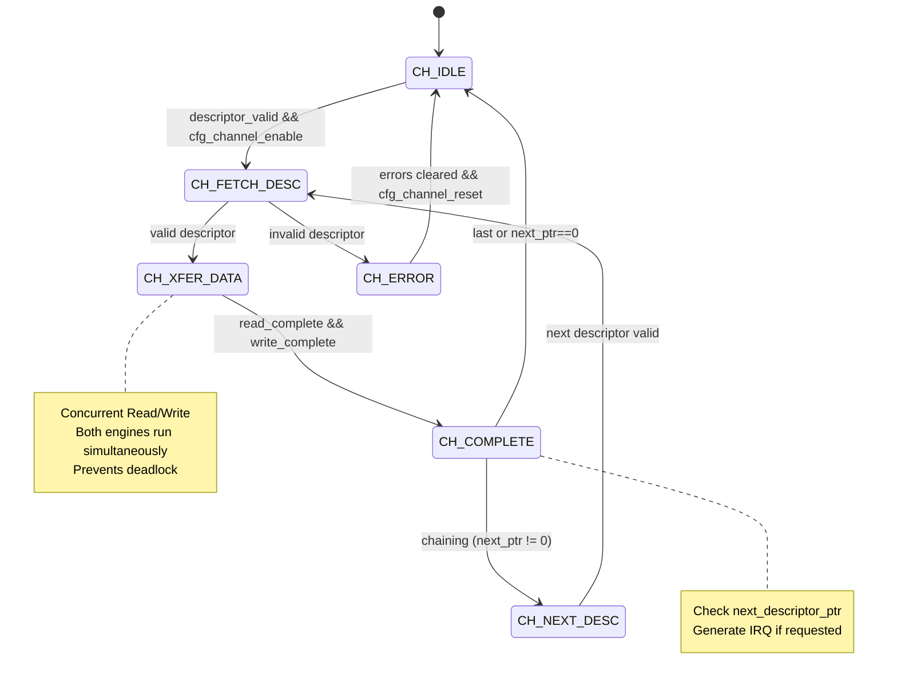

# Scheduler Specification

**Module:** `scheduler.sv`
**Location:** `projects/components/stream/rtl/fub/`
**Status:** Implemented

---

## Overview

The Scheduler coordinates descriptor-based memory-to-memory DMA transfers for a single channel. It receives descriptors, manages concurrent read/write operations, and handles descriptor chaining.

### Key Features

- **Concurrent read/write:** Read and write engines run simultaneously (prevents deadlock)
- **Beat-based tracking:** Length in data width units (STREAM simplification)
- **Aligned addresses:** No alignment fixup logic (must be pre-aligned)
- **Descriptor chaining:** Follows next_descriptor_ptr for multi-buffer transfers
- **Interrupt generation:** MonBus IRQ event when gen_irq flag set
- **Error handling:** Timeout detection, error aggregation from engines
- **MonBus integration:** State transition and IRQ event reporting

### Block Diagram


<!--
Original Mermaid diagram (for editing):


<!--
Original Mermaid diagram (for editing):


-->
-->

---

## CRITICAL: Concurrent Read/Write Design

**Why Concurrent Operation is Essential:**

The scheduler runs read and write engines **CONCURRENTLY** in CH_XFER_DATA state. This prevents deadlock when transfer size exceeds SRAM buffer capacity:

```
Example: 100MB transfer with 2KB SRAM buffer

Sequential operation (WRONG):
1. Read 100MB → DEADLOCK at 2KB (SRAM full, can't complete read)

Concurrent operation (CORRECT):
1. Read starts filling SRAM → SRAM becomes full (2KB)
2. Read pauses (natural backpressure)
3. Write drains SRAM → SRAM has free space
4. Read resumes → Both continue until 100MB complete
```

**Implementation:**
- Both `datard_valid` and `datawr_valid` asserted in CH_XFER_DATA
- Independent beat counters: `r_read_beats_remaining`, `r_write_beats_remaining`
- Exit when **BOTH** counters reach zero

---

## Parameters

```systemverilog
parameter int CHANNEL_ID = 0;                    // Channel identifier
parameter int NUM_CHANNELS = 8;                  // Total channels in system
parameter int CHAN_WIDTH = $clog2(NUM_CHANNELS); // Channel ID width
parameter int ADDR_WIDTH = 64;                   // Address bus width
parameter int DATA_WIDTH = 512;                  // Data bus width (beats)
parameter int TIMEOUT_CYCLES = 1000;             // Timeout threshold

// Monitor Bus Parameters
parameter logic [7:0] MON_AGENT_ID = 8'h40;      // STREAM Scheduler Agent ID
parameter logic [3:0] MON_UNIT_ID = 4'h1;        // Unit identifier
parameter logic [5:0] MON_CHANNEL_ID = 6'h0;     // Base channel ID

// Descriptor Width (FIXED at 256-bit for STREAM)
parameter int DESC_WIDTH = 256;
```

**Validation:**
```systemverilog
// Scheduler only supports 256-bit STREAM descriptors
if (DESC_WIDTH != 256)
    $fatal("DESC_WIDTH must be 256 for STREAM scheduler");
```

---

## Interface

### Clock and Reset

```systemverilog
input  logic                        clk;
input  logic                        rst_n;      // Active-low asynchronous reset
```

### Configuration Interface

```systemverilog
input  logic                        cfg_channel_enable;     // Enable this channel
input  logic                        cfg_channel_reset;      // Channel reset (soft reset)
```

**Channel Reset Behavior:**
- `cfg_channel_reset` forces FSM to CH_IDLE immediately
- Clears descriptor_loaded flag
- Resets beat counters
- Independent of global `rst_n`

### Status Interface

```systemverilog
output logic                        scheduler_idle;         // Scheduler in CH_IDLE
output logic [6:0]                  scheduler_state;        // Current state (ONE-HOT)
```

**State Encoding (ONE-HOT):**
- `[0]` = CH_IDLE
- `[1]` = CH_FETCH_DESC
- `[2]` = CH_XFER_DATA
- `[3]` = CH_COMPLETE
- `[4]` = CH_NEXT_DESC
- `[5]` = CH_ERROR
- `[6]` = Reserved

### Descriptor Engine Interface

```systemverilog
input  logic                        descriptor_valid;
output logic                        descriptor_ready;
input  logic [DESC_WIDTH-1:0]       descriptor_packet;     // 256-bit STREAM descriptor
input  logic                        descriptor_error;       // Error from descriptor engine
```

**Descriptor Handshake:**
- `descriptor_ready` asserted in CH_IDLE or CH_NEXT_DESC
- Descriptor captured when `valid && ready`
- Supports descriptor chaining (next_descriptor_ptr)

### Data Read Interface (to AXI Read Engine)

**Request:**
```systemverilog
output logic                        datard_valid;           // Request read access
input  logic                        datard_ready;           // Engine granted access
output logic [ADDR_WIDTH-1:0]       datard_addr;            // Source address (static base)
output logic [31:0]                 datard_beats_remaining; // Total beats left to read
output logic [3:0]                  datard_channel_id;      // Channel ID
```

**Completion:**
```systemverilog
input  logic                        datard_done_strobe;     // Read engine completed beats
input  logic [31:0]                 datard_beats_done;      // Number of beats completed
```

**Error:**
```systemverilog
input  logic                        datard_error;           // Read engine error
```

**Address Management:**
- Scheduler provides **static base address** in `datard_addr`
- Read engine handles address increment internally
- Scheduler does NOT update `datard_addr` after each burst

### Data Write Interface (to AXI Write Engine)

**Request:**
```systemverilog
output logic                        datawr_valid;           // Request write access
input  logic                        datawr_ready;           // Engine granted access
output logic [ADDR_WIDTH-1:0]       datawr_addr;            // Destination address (static base)
output logic [31:0]                 datawr_beats_remaining; // Total beats left to write
output logic [3:0]                  datawr_channel_id;      // Channel ID
```

**Completion:**
```systemverilog
input  logic                        datawr_done_strobe;     // Write engine completed beats
input  logic [31:0]                 datawr_beats_done;      // Number of beats completed
```

**Error:**
```systemverilog
input  logic                        datawr_error;           // Write engine error
```

### Monitor Bus Interface

```systemverilog
output logic                        mon_valid;
input  logic                        mon_ready;
output logic [63:0]                 mon_packet;
```

**MonBus Events Generated:**
- State transitions (IDLE → FETCH_DESC, etc.)
- IRQ event (when descriptor.gen_irq set)
- Error events

---

## Descriptor Format

### STREAM Descriptor (256-bit)

```systemverilog
typedef struct packed {
    logic [47:0]  reserved;              // [255:208] Reserved
    logic [7:0]   desc_priority;         // [207:200] Transfer priority
    logic [3:0]   channel_id;            // [199:196] Channel ID (informational)
    logic         error;                 // [195] Error flag
    logic         last;                  // [194] Last in chain flag
    logic         gen_irq;               // [193] Generate interrupt on completion
    logic         valid;                 // [192] Valid descriptor
    logic [31:0]  next_descriptor_ptr;   // [191:160] Next descriptor address (0 = last)
    logic [31:0]  length;                // [159:128] Length in BEATS
    logic [63:0]  dst_addr;              // [127:64] Destination address (aligned)
    logic [63:0]  src_addr;              // [63:0] Source address (aligned)
} descriptor_t;
```

**Field Constraints:**
- `src_addr` / `dst_addr`: Must be aligned to DATA_WIDTH (e.g., 64-byte aligned for 512-bit data)
- `length`: Transfer size in **BEATS** (not bytes or chunks)
- `next_descriptor_ptr`: 0 or address of next descriptor
- `valid`: Must be 1 for descriptor to be accepted
- `last`: Terminates chain (overrides next_descriptor_ptr)
- `gen_irq`: Generates STREAM_EVENT_IRQ via MonBus when transfer completes

**Descriptor Bit Positions:**
```systemverilog
DESC_SRC_ADDR:  [63:0]
DESC_DST_ADDR:  [127:64]
DESC_LENGTH:    [159:128]
DESC_NEXT_PTR:  [191:160]
DESC_VALID_BIT: [192]
DESC_GEN_IRQ:   [193]
DESC_LAST:      [194]
```

---

## FSM Operation

### State Machine

**States (ONE-HOT encoded):**
```
CH_IDLE        - Waiting for descriptor
CH_FETCH_DESC  - Latch and validate descriptor
CH_XFER_DATA   - Concurrent read/write transfer
CH_COMPLETE    - Transfer done, check chaining
CH_NEXT_DESC   - Fetch next chained descriptor
CH_ERROR       - Error condition
```

**FSM Flow:**


<!--
Original Mermaid diagram (for editing):


-->

### State Transitions

**CH_IDLE:**
- **Wait for:** `descriptor_valid && cfg_channel_enable`
- **Action:** Assert `descriptor_ready`
- **Next:** CH_FETCH_DESC (when handshake occurs)

**CH_FETCH_DESC:**
- **Action:**
  - Latch descriptor fields into `r_descriptor`
  - Initialize working registers (`r_src_addr`, `r_dst_addr`, `r_*_beats_remaining`)
  - Validate `descriptor.valid` bit
- **Next:**
  - CH_XFER_DATA (if valid)
  - CH_ERROR (if invalid)

**CH_XFER_DATA:**
- **Action:**
  - Assert **BOTH** `datard_valid` and `datawr_valid` (concurrent operation!)
  - Decrement `r_read_beats_remaining` on `datard_done_strobe`
  - Decrement `r_write_beats_remaining` on `datawr_done_strobe`
  - Monitor timeout counter
- **Exit When:** `r_read_beats_remaining == 0 && r_write_beats_remaining == 0`
- **Next:** CH_COMPLETE

**CH_COMPLETE:**
- **Action:**
  - Generate MonBus IRQ event (if `gen_irq` set)
  - Check `next_descriptor_ptr` and `last` flag
  - Clear `descriptor_loaded` flag
- **Next:**
  - CH_NEXT_DESC (if chaining)
  - CH_IDLE (if last or no chain)

**CH_NEXT_DESC:**
- **Wait for:** `descriptor_valid` (descriptor engine fetches next)
- **Action:** Assert `descriptor_ready`
- **Next:** CH_FETCH_DESC

**CH_ERROR:**
- **Wait for:** All error flags cleared
- **Action:** Report error via MonBus
- **Next:** CH_IDLE

---

## Beat Tracking

### Independent Counters

**Initialization (CH_FETCH_DESC):**
```systemverilog
r_read_beats_remaining  <= r_descriptor.length;
r_write_beats_remaining <= r_descriptor.length;
```

**Decrement (CH_XFER_DATA):**
```systemverilog
// Read progress (independent)
if (datard_done_strobe) begin
    r_read_beats_remaining <= (r_read_beats_remaining >= datard_beats_done) ?
                             (r_read_beats_remaining - datard_beats_done) : 32'h0;
end

// Write progress (independent)
if (datawr_done_strobe) begin
    r_write_beats_remaining <= (r_write_beats_remaining >= datawr_beats_done) ?
                              (r_write_beats_remaining - datawr_beats_done) : 32'h0;
end
```

**Saturation:**
- Counters saturate at 0 (prevent underflow)
- Safety check for engine misbehavior

### Completion Detection

**Combinational Flags:**
```systemverilog
w_read_complete     = (r_read_beats_remaining == 0);
w_write_complete    = (r_write_beats_remaining == 0);
w_transfer_complete = w_read_complete && w_write_complete;
```

**State Exit:**
```systemverilog
// In CH_XFER_DATA:
if (w_transfer_complete) begin
    w_next_state = CH_COMPLETE;
end
```

---

## Address Management

### Static Base Address

**Scheduler Provides:**
```systemverilog
assign datard_addr = r_src_addr;  // Static base, set in CH_FETCH_DESC
assign datawr_addr = r_dst_addr;  // Static base, set in CH_FETCH_DESC
```

**Scheduler Does NOT:**
- Increment addresses after each burst
- Calculate byte offsets
- Handle alignment

**Engine Responsibility:**
- Read engine: `m_axi_araddr = datard_addr + (beats_issued << AXSIZE)`
- Write engine: `m_axi_awaddr = datawr_addr + (beats_issued << AXSIZE)`

---

## Timeout Detection

### Timeout Counter

**Increment:**
```systemverilog
// In CH_XFER_DATA when waiting for engines
if (!datard_ready || !datawr_ready) begin
    r_timeout_counter <= r_timeout_counter + 1;
end
```

**Timeout Flag:**
```systemverilog
assign w_timeout_expired = (r_timeout_counter >= TIMEOUT_CYCLES);
```

**Reset:**
```systemverilog
// Clear when state changes or engines respond
if (state_change || (datard_ready && datawr_ready)) begin
    r_timeout_counter <= 0;
end
```

**Action on Timeout:**
- FSM transitions to CH_ERROR
- MonBus timeout event generated
- Channel must be reset to recover

---

## Error Handling

### Error Sources

**External:**
- `descriptor_error` - Descriptor engine reports error
- `datard_error` - Read engine error (AXI RRESP != OKAY, etc.)
- `datawr_error` - Write engine error (AXI BRESP != OKAY, etc.)

**Internal:**
- `w_timeout_expired` - Timeout counter exceeded threshold
- `!r_descriptor.valid` - Invalid descriptor in CH_FETCH_DESC

### Sticky Error Flags

```systemverilog
logic r_read_error_sticky;   // Set on datard_error, cleared in CH_IDLE
logic r_write_error_sticky;  // Set on datawr_error, cleared in CH_IDLE
logic r_descriptor_error;    // Set on descriptor_error or validation failure
```

**Set Condition:**
```systemverilog
if (datard_error)
    r_read_error_sticky <= 1'b1;

if (datawr_error)
    r_write_error_sticky <= 1'b1;
```

**Clear Condition:**
```systemverilog
if (r_current_state == CH_IDLE)
    r_*_error_sticky <= 1'b0;
```

### Error Recovery

**Error Transition:**
```systemverilog
// Any state with error condition
if (descriptor_error || datard_error || datawr_error ||
    r_read_error_sticky || r_write_error_sticky || w_timeout_expired) begin
    w_next_state = CH_ERROR;
end
```

**Recovery:**
- CH_ERROR → CH_IDLE (when all errors cleared)
- Software must reset channel (`cfg_channel_reset`)

---

## Interrupt Generation

### IRQ via MonBus

**Trigger:**
- Descriptor completes (CH_COMPLETE state)
- `r_descriptor.gen_irq` flag set

**MonBus Event:**
```systemverilog
// In CH_COMPLETE state with gen_irq set
mon_packet = {
    MON_AGENT_ID,           // [63:56] Agent ID (0x40 = STREAM Scheduler)
    MON_UNIT_ID,            // [55:52] Unit ID
    MON_CHANNEL_ID,         // [51:46] Channel ID
    STREAM_EVENT_IRQ,       // [45:40] Event code (IRQ)
    descriptor_fields       // [39:0]  Descriptor info
};
```

**No Separate IRQ Signal:**
- IRQ communicated via MonBus only
- Software monitors MonBus for IRQ events
- Event includes channel ID for routing

---

## Descriptor Chaining

### Chain Detection

**In CH_COMPLETE:**
```systemverilog
if (r_descriptor.next_descriptor_ptr != 32'h0 && !r_descriptor.last) begin
    w_next_state = CH_NEXT_DESC;  // Chain to next descriptor
end else begin
    w_next_state = CH_IDLE;       // Complete (last or no chain)
end
```

### Chain Termination

**Explicit Termination:**
- `next_descriptor_ptr == 0` → Stop
- `last == 1` → Stop (overrides next_descriptor_ptr)

**Example Chain:**
```
Descriptor 0 @ 0x1000:
  src_addr = 0x2000, dst_addr = 0x3000, length = 64
  next_descriptor_ptr = 0x1040, last = 0
  → Chains to next

Descriptor 1 @ 0x1040:
  src_addr = 0x2100, dst_addr = 0x3100, length = 32
  next_descriptor_ptr = 0x0000, last = 1
  → Last in chain
```

---

## MonBus Integration

### Event Types

**State Transitions:**
- IDLE → FETCH_DESC: Descriptor fetch start
- FETCH_DESC → XFER_DATA: Transfer start
- XFER_DATA → COMPLETE: Transfer complete
- COMPLETE → NEXT_DESC: Chain fetch
- Any → ERROR: Error occurred

**Special Events:**
- STREAM_EVENT_IRQ: Interrupt generation (gen_irq flag)
- STREAM_EVENT_TIMEOUT: Timeout expired
- STREAM_EVENT_ERROR: Error condition

### MonBus Packet Format

**Generic Event:**
```
[63:56] - MON_AGENT_ID (0x40)
[55:52] - MON_UNIT_ID
[51:46] - MON_CHANNEL_ID + CHANNEL_ID
[45:40] - Event code
[39:0]  - Event-specific data
```

---

## Timing Diagrams

### Normal Transfer (No Chaining)

```
Cycle:  0    1    2    3    ...  N    N+1  N+2  N+3
        |    |    |    |         |    |    |    |
State:  IDLE [FET][===XFER===]  [===XFER===][CPL] IDLE
        |    |    |              |           |
Desc:   [V][R]
        |    |
Read:        [====datard_valid====][done]   [done]
Write:       [====datawr_valid====][done]   [done]

Notes:
- Both read and write run concurrently in XFER state
- Independent done strobes decrement separate counters
```

### Descriptor Chaining

```
Cycle:  0    1    2    ...  N    N+1  N+2  N+3  N+4  ...
        |    |    |         |    |    |    |    |
State:  IDLE [FET][XFER]   [CPL][NXT][FET][XFER] ...
                            |    |    |
Chain:                      [Check ptr != 0]
Desc Eng:                        [Fetch next]
                                      [V][R]
```

---

## Testing

**Test Location:** `projects/components/stream/dv/tests/fub_tests/scheduler/`

**Key Test Scenarios:**

1. **Single descriptor transfer** - Basic operation
2. **Descriptor chaining** - 2-4 descriptors linked
3. **Concurrent read/write** - Verify no deadlock with small SRAM
4. **Large transfer (> SRAM)** - 100MB transfer with 2KB SRAM
5. **IRQ generation** - gen_irq flag set
6. **Error handling** - Descriptor, read, write errors
7. **Timeout detection** - Engine stall scenarios
8. **Channel reset** - cfg_channel_reset during transfer

---

## Performance Considerations

### Concurrent Operation Benefit

**Without Concurrency (Sequential):**
- Max transfer size = SRAM buffer size
- Deadlock when transfer > buffer
- Throughput = min(read_bw, write_bw)

**With Concurrency:**
- No transfer size limit
- Natural flow control via SRAM full/empty
- Throughput = max(read_bw, write_bw) (pipeline overlap)

### Example Performance

**Configuration:**
- DATA_WIDTH = 512 bits (64 bytes/beat)
- SRAM = 2KB (32 beats)
- Transfer = 100MB (1,562,500 beats)

**Sequential (hypothetical):**
- DEADLOCK at 2KB (can't complete read)

**Concurrent:**
- Read fills SRAM (32 beats)
- Write drains SRAM concurrently
- Both engines sustain ~0.9 beats/cycle
- Total time: ~1.7M cycles

---

## Related Documentation

- **Descriptor Engine:** `01_descriptor_engine.md` - Descriptor fetch
- **AXI Read Engine:** `08_axi_read_engine.md` - Source data read
- **AXI Write Engine:** `10_axi_write_engine.md` - Destination data write
- **SRAM Controller:** `05_sram_controller.md` - Buffer management
- **Scheduler Group:** `11_scheduler_group.md` - Multi-channel integration

---

**Last Updated:** 2025-11-16
