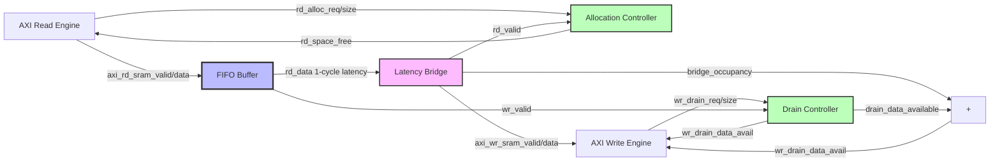

# SRAM Controller Unit

**Module:** `sram_controller_unit.sv`
**Category:** FUB (Functional Unit Block)
**Parent:** `sram_controller.sv`

## Overview

The `sram_controller_unit` module is a **per-channel data buffering pipeline** combining three components to provide flow-controlled data storage between the AXI read engine and AXI write engine. Each channel instantiates its own `sram_controller_unit`.

### What Makes This Different from Other Approaches

**Previous Approach (Documented but Not Implemented):**
- Monolithic SRAM buffer divided into segments per channel
- Complex pointer arithmetic to manage segment boundaries
- Shared read/write ports requiring arbitration

**Current Approach (Actual Implementation):**
- **Independent FIFO per channel** - No segment management, FIFO handles internally
- **No pointer arithmetic** - FIFO pointer logic is self-contained
- **No arbitration** - Each channel has dedicated FIFO

**Why This Architecture:**
1. **Simplicity** - FIFO manages address generation internally
2. **Independence** - Channels operate without coordination
3. **Predictability** - No arbitration contention
4. **Scalability** - Easy to parameterize depth per channel

## Three-Component Architecture

The `sram_controller_unit` combines three blocks:


<!--
Original Mermaid diagram (for editing):


<!--
Original Mermaid diagram (for editing):


-->
-->

### 1. Allocation Controller (`stream_alloc_ctrl`)

**Purpose:** Track reserved vs. committed FIFO space

**Why Needed:**
- AXI read engine requests bursts BEFORE data arrives
- FIFO space must be reserved to prevent overflow
- Separate tracking of allocation (request) vs. fulfillment (data arrival)

**Operation:**
```systemverilog
// Reserve space (burst request)
rd_alloc_req = 1'b1;
rd_alloc_size = 8'd16;  // Reserve 16 beats

// Later: Data arrives, fulfills reservation
fifo_wr_valid = 1'b1;   // Advance FIFO write pointer (one beat)

// Space tracking
rd_space_free updates to show available UNRESERVED space
```

**Key Insight:** Allocation controller is a "virtual FIFO" without data - just pointer tracking.

### 2. FIFO Buffer (`gaxi_fifo_sync`)

**Purpose:** Physical data storage

**Configuration:**
```systemverilog
gaxi_fifo_sync #(
    .MEM_STYLE(FIFO_AUTO),   // Let synthesis tool choose RAM type
    .REGISTERED(1),          // 1-cycle read latency (mimics SRAM behavior)
    .DATA_WIDTH(DW),
    .DEPTH(SD)
)
```

**Why REGISTERED=1:**
- Mimics true SRAM behavior (read latency)
- Improves timing closure
- Enables use of block RAM resources

**Data Path:**
- Write: Direct from AXI read engine
- Read: To latency bridge (internal connection)

### 3. Latency Bridge (`stream_latency_bridge`)

**Purpose:** Compensate for FIFO 1-cycle read latency

**Problem Without Bridge:**
```
Cycle 0: rd_ready asserted → rd_valid asserted
Cycle 1: rd_data appears (1-cycle latency)
Result: valid and data misaligned!
```

**Solution:**
- Bridge buffers read data
- Aligns valid/ready/data on output
- Provides backpressure to FIFO read port

**Output:** Clean valid/ready/data interface to AXI write engine

## Flow Control Architecture

### Allocation Controller Naming (CONFUSING!)

**CRITICAL:** Allocation controller uses OPPOSITE naming from normal FIFO:

**Normal FIFO:**
- `wr_*` = Write data (consumes space)
- `rd_*` = Read data (frees space)

**Allocation Controller:**
- `wr_*` = ALLOCATE space (reserve, decreases space_free)
- `rd_*` = RELEASE allocation (data exits controller, increases space_free)

**Why This Matters:**
```systemverilog
// Allocation controller connections (COUNTERINTUITIVE!)

// "Write" side = ALLOCATE (reserve space for upcoming burst)
.wr_valid (rd_alloc_req),        // Read engine says "I need 16 beats"
.wr_size  (rd_alloc_size),       // Number of beats to reserve

// "Read" side = RELEASE (data exits controller, free space)
.rd_valid (axi_wr_sram_valid && axi_wr_sram_ready),  // Output handshake!
```

**Key Insight:** Allocation controller tracks OUTPUT side (after latency bridge), not FIFO input!

### Drain Controller Naming (NORMAL!)

**Drain controller uses STANDARD FIFO naming:**

**Drain Controller:**
- `wr_*` = Data written to FIFO (increment occupancy)
- `rd_*` = Drain request from write engine (reserve data)

```systemverilog
// Drain controller connections (STANDARD!)

// Write side = Data written to FIFO
.wr_valid (axi_rd_sram_valid && axi_rd_sram_ready),  // FIFO write handshake

// Read side = Drain request (reserve data for upcoming write burst)
.rd_valid (wr_drain_req),
.rd_size  (wr_drain_size)
```

### Data Available Calculation

**Total data available = FIFO data + Latency bridge buffered data**

```systemverilog
assign wr_drain_data_avail = drain_data_available + bridge_occupancy;
```

**Why Add Bridge Occupancy:**
- Drain controller tracks FIFO only (doesn't see latency bridge)
- Bridge can hold up to 5 beats (1 in-flight + 4 in skid buffer)
- Write engine needs total available data count

**Example:**
```
FIFO count: 100 beats
Bridge occupancy: 3 beats
wr_drain_data_avail = 100 + 3 = 103 beats available to write engine
```

## Parameters

| Parameter | Type | Default | Description |
|-----------|------|---------|-------------|
| `DATA_WIDTH` | int | 512 | Data width in bits |
| `SRAM_DEPTH` | int | 512 | FIFO depth in entries |
| `SEG_COUNT_WIDTH` | int | $clog2(SRAM_DEPTH) + 1 | Width for count signals |

**Note:** `SEG_COUNT_WIDTH` has +1 bit to distinguish full (count=DEPTH) from empty (count=0).

## Interfaces

### Write Interface (AXI Read Engine → FIFO)

| Signal | Direction | Width | Description |
|--------|-----------|-------|-------------|
| `axi_rd_sram_valid` | Input | 1 | Data valid from read engine |
| `axi_rd_sram_ready` | Output | 1 | Ready to accept data (FIFO not full) |
| `axi_rd_sram_data` | Input | DW | Data from read engine |

**Connection:** Direct to FIFO write port

### Read Interface (Latency Bridge → AXI Write Engine)

| Signal | Direction | Width | Description |
|--------|-----------|-------|-------------|
| `axi_wr_sram_valid` | Output | 1 | Data valid to write engine |
| `axi_wr_sram_ready` | Input | 1 | Write engine ready |
| `axi_wr_sram_data` | Output | DW | Data to write engine |

**Connection:** From latency bridge output

### Allocation Interface (Read Engine Flow Control)

| Signal | Direction | Width | Description |
|--------|-----------|-------|-------------|
| `rd_alloc_req` | Input | 1 | Allocate space request |
| `rd_alloc_size` | Input | 8 | Number of beats to allocate |
| `rd_space_free` | Output | SCW | Available unreserved space |

**Usage:**
```systemverilog
// Read engine checks space before issuing AR
if (rd_space_free >= (cfg_axi_rd_xfer_beats << 1)) begin  // 2x margin
    rd_alloc_req = 1'b1;
    rd_alloc_size = cfg_axi_rd_xfer_beats;
end
```

### Drain Interface (Write Engine Flow Control)

| Signal | Direction | Width | Description |
|--------|-----------|-------|-------------|
| `wr_drain_req` | Input | 1 | Reserve data request |
| `wr_drain_size` | Input | 8 | Number of beats to reserve |
| `wr_drain_data_avail` | Output | SCW | Available data (FIFO + bridge) |

**Usage:**
```systemverilog
// Write engine checks data before issuing AW
if (wr_drain_data_avail >= cfg_axi_wr_xfer_beats) begin
    wr_drain_req = 1'b1;
    wr_drain_size = cfg_axi_wr_xfer_beats;
end
```

## Operation

### Normal Data Flow

**Step 1: Read Engine Allocates Space**
```
rd_alloc_req = 1, rd_alloc_size = 16
→ Allocation wr_ptr += 16
→ rd_space_free decreases by 16
```

**Step 2: Read Engine Issues AXI AR**
```
m_axi_arvalid = 1, m_axi_arlen = 15 (16 beats)
→ AXI read starts
```

**Step 3: AXI Read Data Arrives**
```
For each beat:
  axi_rd_sram_valid = 1
  → FIFO write (data enters)
  → Drain wr_ptr += 1 (data available increases)
```

**Step 4: Write Engine Checks Data Available**
```
if (wr_drain_data_avail >= 16) → Can issue AXI write
```

**Step 5: Write Engine Drains Data**
```
wr_drain_req = 1, wr_drain_size = 16
→ Drain rd_ptr += 16 (reserve data)
→ wr_drain_data_avail decreases by 16

For each beat:
  axi_wr_sram_ready = 1
  → FIFO read → Latency bridge → Output
  → Allocation rd_ptr += 1 (release space)
  → rd_space_free increases by 1
```

### Concurrent Read/Write

**CRITICAL:** Read and write can occur simultaneously!

```
Cycle N:
  axi_rd_sram_valid = 1  (read engine writing to FIFO)
  axi_wr_sram_valid = 1, axi_wr_sram_ready = 1  (write engine draining)

Result:
  FIFO count remains constant (1 write + 1 read = no net change)
  Allocation rd_ptr += 1 (space released)
  Drain wr_ptr += 1, rd_ptr += 0 (data added faster than reserved)
```

**Why This Matters:**
- Enables streaming operation
- Prevents deadlock when transfer size > FIFO depth
- Maximizes throughput

## Debug Signals

| Signal | Width | Description |
|--------|-------|-------------|
| `dbg_bridge_pending` | 1 | Latency bridge has pending read |
| `dbg_bridge_out_valid` | 1 | Latency bridge output valid |

**Use Case:** Diagnose bridge backpressure issues

## Timing

### Critical Paths

**Space Free Output:**
- COMBINATIONAL path from allocation controller
- **Registered output** to break long paths to read engine
- 1-cycle latency in space reporting (acceptable, conservative)

```systemverilog
`ALWAYS_FF_RST(clk, rst_n,
    if (`RST_ASSERTED(rst_n)) begin
        rd_space_free <= SCW'(SD);  // Full space on reset
    end else begin
        rd_space_free <= alloc_space_free;
    end
)
```

**Data Available Output:**
- COMBINATIONAL from drain controller + bridge occupancy
- Immediate update (no registration)

```systemverilog
assign wr_drain_data_avail = drain_data_available + SCW'(bridge_occupancy);
```

## Resource Utilization

**Per Channel:**
- 1 × FIFO (SRAM_DEPTH × DATA_WIDTH bits)
- 2 × Virtual FIFOs (allocation + drain controllers) - pointer logic only
- 1 × Latency bridge (5 × DATA_WIDTH bits for skid buffer)

**Example (512-bit data, 512-deep FIFO):**
- FIFO: 512 × 512 = 262,144 bits = 32 KB
- Controllers: ~100 FFs (pointers + control)
- Bridge: 5 × 512 = 2,560 bits = 320 bytes

**Total per channel:** ~32 KB RAM + minimal logic

**For 8 channels:** ~256 KB RAM

## Related Modules

- **Parent:** `sram_controller.sv` - Instantiates 8 units
- **Components:** `stream_alloc_ctrl.sv`, `gaxi_fifo_sync.sv`, `stream_latency_bridge.sv`
- **Users:** `axi_read_engine.sv` (allocation), `axi_write_engine.sv` (drain)

## References

- **Allocation Controller:** `stream_alloc_ctrl.md`
- **Drain Controller:** `stream_drain_ctrl.md`
- **Latency Bridge:** `stream_latency_bridge.md`
- **FIFO:** `gaxi_fifo_sync` from framework
