# Stream Allocation Controller

**Module:** `stream_alloc_ctrl.sv`
**Category:** FUB (Functional Unit Block)
**Parent:** `sram_controller_unit.sv`

## Overview

The `stream_alloc_ctrl` module is a **virtual FIFO without data storage** that tracks space allocation and availability using FIFO pointer logic. It provides pre-allocation support for AXI read engines to prevent race conditions between burst requests and data arrival.

### What Makes This a "Virtual FIFO"

**Virtual FIFO:**
- Has write pointer (allocation pointer)
- Has read pointer (actual write pointer)
- Calculates full/empty/space_free
- **NO data storage** - only pointer arithmetic

**Use Case:** Reserve FIFO space BEFORE AXI read data arrives

## The Allocation Problem

### Without Allocation Controller

**Problem:** Race condition between space check and data arrival

```
Cycle 0: Read engine checks FIFO space
         space_free = 100 beats → OK to issue 16-beat burst

Cycle 5: AR handshake completes, AXI read starts

Cycle 10: Meanwhile, write engine drains 90 beats from FIFO
          space_free = 10 beats (NOT ENOUGH!)

Cycle 15: AXI read data starts arriving (16 beats)
          → OVERFLOW! Only 10 beats of space available
```

### With Allocation Controller

**Solution:** Reserve space when issuing AR, not when data arrives

```
Cycle 0: Read engine checks space_free = 100 beats
         Allocate 16 beats:
           rd_alloc_req = 1, rd_alloc_size = 16
           → space_free = 84 beats (reserved!)

Cycle 5: AR handshake completes

Cycle 10: Write engine checks space_free = 84 beats
          → Sees reduced space, won't overdrain

Cycle 15: AXI read data arrives, enters FIFO
          → Space was reserved, guaranteed to fit
```

## Architecture

### Two-Pointer System



-->

**Write Pointer (Allocation Pointer):**
- Advances when space is **allocated** (burst request)
- Variable-size increment (rd_alloc_size)
- Represents "reserved space"

**Read Pointer (Actual Write Pointer):**
- Advances when data **exits the controller** (output handshake)
- Single-beat increment
- Represents "released space"

**Space Calculation:**
```systemverilog
space_free = DEPTH - (wr_ptr - rd_ptr)
```

### CRITICAL: Confusing Naming Convention

**WARNING:** Allocation controller uses OPPOSITE naming from normal FIFO!

**Normal FIFO:**
| Signal | Meaning |
|--------|---------|
| `wr_*` | Write data → Consumes space → space_free decreases |
| `rd_*` | Read data → Frees space → space_free increases |

**Allocation Controller:**
| Signal | Meaning |
|--------|---------|
| `wr_*` | **ALLOCATE** space → Reserves space → space_free **decreases** |
| `rd_*` | **RELEASE** space → Data exits controller → space_free **increases** |

**Why This Matters:**
```systemverilog
// "Write" side = ALLOCATE (reserve space for upcoming burst)
// Read engine says "I need 16 beats"
.wr_valid (rd_alloc_req),
.wr_size  (rd_alloc_size),  // Variable size (16 in this example)

// "Read" side = RELEASE (data exits controller, free space)
// Must monitor OUTPUT handshake (after latency bridge!)
.rd_valid (axi_wr_sram_valid && axi_wr_sram_ready),  // Output side!
```

**Key Insight:** The "read" side of allocation controller connects to the OUTPUT of the FIFO + latency bridge, NOT the FIFO input!

## Parameters

| Parameter | Type | Default | Description |
|-----------|------|---------|-------------|
| `DEPTH` | int | 512 | Virtual FIFO depth (must match physical FIFO) |
| `ALMOST_WR_MARGIN` | int | 1 | Almost full threshold |
| `ALMOST_RD_MARGIN` | int | 1 | Almost empty threshold |
| `REGISTERED` | int | 1 | Register outputs for timing |

---

## Port List

### Clock and Reset

| Signal | Direction | Width | Description |
|--------|-----------|-------|-------------|
| `axi_aclk` | input | 1 | System clock |
| `axi_aresetn` | input | 1 | Active-low asynchronous reset |

### Write Interface (Allocation Requests)

| Signal | Direction | Width | Description |
|--------|-----------|-------|-------------|
| `wr_valid` | input | 1 | Allocate space request |
| `wr_size` | input | 8 | Number of entries to allocate |
| `wr_ready` | output | 1 | Space available (!wr_full) |

### Read Interface (Actual Data Written)

| Signal | Direction | Width | Description |
|--------|-----------|-------|-------------|
| `rd_valid` | input | 1 | Data exits controller (release space) |
| `rd_ready` | output | 1 | Not empty (!rd_empty) |

### Status Outputs

| Signal | Direction | Width | Description |
|--------|-----------|-------|-------------|
| `space_free` | output | AW+1 | Available space (beats) |
| `wr_full` | output | 1 | Full flag (no space available) |
| `wr_almost_full` | output | 1 | Almost full flag |
| `rd_empty` | output | 1 | Empty flag (no allocations) |
| `rd_almost_empty` | output | 1 | Almost empty flag |

---

## Interfaces

### Write Interface (Allocation Requests)

| Signal | Direction | Width | Description |
|--------|-----------|-------|-------------|
| `wr_valid` | Input | 1 | Allocate space |
| `wr_size` | Input | 8 | Number of entries to allocate |
| `wr_ready` | Output | 1 | Space available (!wr_full) |

**Usage:**
```systemverilog
// Read engine allocates space before issuing AR
rd_alloc_req = (space_check_ok && !ar_pending);
rd_alloc_size = cfg_axi_rd_xfer_beats;
```

### Read Interface (Actual Data Written)

| Signal | Direction | Width | Description |
|--------|-----------|-------|-------------|
| `rd_valid` | Input | 1 | Data exits controller |
| `rd_ready` | Output | 1 | Not empty (!rd_empty) |

**Usage:**
```systemverilog
// Connect to OUTPUT handshake (after latency bridge)
assign rd_valid = (axi_wr_sram_valid && axi_wr_sram_ready);
```

### Status Outputs

| Signal | Direction | Width | Description |
|--------|-----------|-------|-------------|
| `space_free` | Output | AW+1 | Available unreserved space |
| `wr_full` | Output | 1 | No space available |
| `wr_almost_full` | Output | 1 | Almost full |
| `rd_empty` | Output | 1 | No allocations pending |
| `rd_almost_empty` | Output | 1 | Almost empty |

**Note:** `space_free` is the most important output - used by read engine for space checking.

## Operation

### Allocation Flow

**Step 1: Check Space**
```systemverilog
// Read engine checks space availability
if (space_free >= (cfg_axi_rd_xfer_beats << 1)) begin  // 2x margin
    // Space OK, proceed to allocation
end
```

**Step 2: Allocate Space**
```systemverilog
rd_alloc_req = 1'b1;
rd_alloc_size = 8'd16;  // Reserve 16 beats

// Next cycle: wr_ptr advances
r_wr_ptr_bin <= r_wr_ptr_bin + 16;
space_free decreases by 16
```

**Step 3: AXI Read Executes**
```systemverilog
// Some cycles later, AXI AR handshake completes
m_axi_arvalid = 1, m_axi_arready = 1
// AXI read starts
```

**Step 4: Data Arrives at FIFO**
```systemverilog
// Many cycles later, AXI read data arrives
axi_rd_sram_valid = 1, axi_rd_sram_ready = 1
// Data enters FIFO (allocation controller doesn't see this directly)
```

**Step 5: Data Exits Controller (After Latency Bridge)**
```systemverilog
// Eventually, data traverses FIFO + latency bridge
axi_wr_sram_valid = 1, axi_wr_sram_ready = 1

// THIS triggers allocation controller release!
rd_valid = 1
r_rd_ptr_bin <= r_rd_ptr_bin + 1
space_free increases by 1
```

### Pointer Arithmetic

**Write Pointer (Allocation):**
```systemverilog
// Variable-size increment
if (w_write && !r_wr_full) begin
    r_wr_ptr_bin <= r_wr_ptr_bin + (AW+1)'(wr_size);
end
```

**Read Pointer (Release):**
```systemverilog
// Single-beat increment (uses counter_bin utility)
counter_bin #(
    .WIDTH (AW + 1),
    .MAX   (D)
) read_pointer_inst (
    .clk              (axi_aclk),
    .rst_n            (axi_aresetn),
    .enable           (w_read && !r_rd_empty),
    .counter_bin_curr (r_rd_ptr_bin),
    .counter_bin_next (w_rd_ptr_bin_next)
);
```

**Space Calculation:**
```systemverilog
// Occupancy = wr_ptr - rd_ptr
w_count = w_wr_ptr_bin_next - w_rd_ptr_bin_next;

// Space free = total depth - occupancy
space_free = (AW+1)'(D) - w_count;
```

## Timing Behavior

### Allocation Latency

**Allocation is IMMEDIATE (combinational + 1 cycle):**

```
Cycle N:   rd_alloc_req = 1, rd_alloc_size = 16
Cycle N+1: r_wr_ptr_bin = old_value + 16
           space_free = old_value - 16
```

**Read engine sees updated space_free on next cycle.**

### Release Latency

**Release is IMMEDIATE (combinational + 1 cycle):**

```
Cycle N:   axi_wr_sram_valid = 1, axi_wr_sram_ready = 1
           → rd_valid = 1
Cycle N+1: r_rd_ptr_bin = old_value + 1
           space_free = old_value + 1
```

**Write engine sees updated space_free on next cycle.**

## Integration Example

### In sram_controller_unit.sv

```systemverilog
stream_alloc_ctrl #(
    .DEPTH(SD),
    .REGISTERED(1)
) u_alloc_ctrl (
    .axi_aclk           (clk),
    .axi_aresetn        (rst_n),

    // ALLOCATE (reserve space for upcoming burst)
    .wr_valid           (rd_alloc_req),      // From read engine
    .wr_size            (rd_alloc_size),     // Burst size
    .wr_ready           (),                  // Unused (space check uses space_free)

    // RELEASE (data exits controller - OUTPUT handshake!)
    .rd_valid           (axi_wr_sram_valid && axi_wr_sram_ready),  // After latency bridge!
    .rd_ready           (),                  // Unused

    // Space tracking
    .space_free         (alloc_space_free),  // To read engine (via register)

    // Unused status
    .wr_full            (),
    .wr_almost_full     (),
    .rd_empty           (),
    .rd_almost_empty    ()
);

// Register output to break long paths
`ALWAYS_FF_RST(clk, rst_n,
    if (`RST_ASSERTED(rst_n)) begin
        rd_space_free <= SCW'(SD);  // Full space on reset
    end else begin
        rd_space_free <= alloc_space_free;
    end
)
```

## Debug Support

### Display Statements

**Allocation:**
```systemverilog
$display("ALLOC @ %t: allocated %0d beats, wr_ptr: %0d -> %0d, space_free will be %0d",
        $time, wr_size, r_wr_ptr_bin, r_wr_ptr_bin + wr_size,
        D - (r_wr_ptr_bin + wr_size - r_rd_ptr_bin));
```

**Release (Drain):**
```systemverilog
$display("DRAIN @ %t: drained 1 beat, rd_ptr: %0d -> %0d, space_free will be %0d",
        $time, r_rd_ptr_bin, w_rd_ptr_bin_next,
        D - (r_wr_ptr_bin - w_rd_ptr_bin_next));
```

### Waveform Analysis

**Key Signals to Monitor:**
- `r_wr_ptr_bin` - Allocation pointer
- `r_rd_ptr_bin` - Release pointer
- `space_free` - Available space
- `rd_alloc_req`, `rd_alloc_size` - Allocation requests
- `axi_wr_sram_valid`, `axi_wr_sram_ready` - Release handshake

## Common Issues

### Issue 1: Space Not Released

**Symptom:** `space_free` decreases but never increases

**Root Cause:** `rd_valid` not connected to output handshake

**Wrong:**
```systemverilog
.rd_valid (axi_rd_sram_valid && axi_rd_sram_ready)  // FIFO input - WRONG!
```

**Correct:**
```systemverilog
.rd_valid (axi_wr_sram_valid && axi_wr_sram_ready)  // After latency bridge - CORRECT!
```

### Issue 2: Overflow Despite Allocation

**Symptom:** FIFO overflows even with allocation controller

**Root Cause:** Read engine uses wrong space value

**Wrong:**
```systemverilog
if (space_free >= cfg_axi_rd_xfer_beats) begin  // Exact match - WRONG!
    allocate();
end
```

**Correct:**
```systemverilog
if (space_free >= (cfg_axi_rd_xfer_beats << 1)) begin  // 2x margin - CORRECT!
    allocate();
end
```

**Why 2x:** Accounts for in-flight allocations and pipeline delays.

### Issue 3: Allocation Pointer Overflow

**Symptom:** `r_wr_ptr_bin` wraps at unexpected value

**Root Cause:** Pointer width insufficient

**Check:**
```systemverilog
parameter int AW = $clog2(D);  // Address width
logic [AW:0] r_wr_ptr_bin;     // AW+1 bits (for full detection)
```

**Extra bit allows distinguishing full (wr_ptr = rd_ptr + DEPTH) from empty (wr_ptr = rd_ptr).**

## Comparison with Drain Controller

| Aspect | Allocation Controller | Drain Controller |
|--------|----------------------|------------------|
| **Purpose** | Reserve FIFO space | Reserve FIFO data |
| **User** | AXI read engine | AXI write engine |
| **Write side** | Allocation request (reserve) | Data enters FIFO (increment) |
| **Read side** | Data exits controller (release) | Drain request (reserve) |
| **Naming** | OPPOSITE of normal FIFO | SAME as normal FIFO |
| **Output** | `space_free` | `data_available` |

## Resource Utilization

**Per Instance:**
- 2 × (AW+1)-bit counters (wr_ptr, rd_ptr)
- 1 × (AW+1)-bit space_free calculation
- FIFO control block (full/empty logic)
- ~50-100 flip-flops total

**Example (DEPTH=512, AW=9):**
- 2 × 10-bit counters = 20 FFs
- Control logic = ~30 FFs
- **Total:** ~50 FFs

**Very lightweight - pointer logic only, no data storage.**

## Related Modules

- **Counterpart:** `stream_drain_ctrl.sv` - Drain-side flow control
- **Parent:** `sram_controller_unit.sv` - Instantiates allocation controller
- **User:** `axi_read_engine.sv` - Checks `rd_space_free` before issuing AR

## References

- **Drain Controller:** `stream_drain_ctrl.md`
- **SRAM Controller Unit:** `sram_controller_unit.md`
- **AXI Read Engine:** `axi_read_engine.md`
