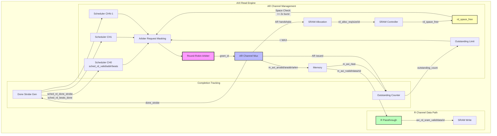

# AXI Read Engine Specification

**Module:** `axi_read_engine.sv`
**Location:** `projects/components/stream/rtl/fub/`
**Status:** Implemented

---

## Overview

The AXI Read Engine autonomously executes AXI read transactions to fetch source data from system memory. It accepts requests from schedulers through a round-robin arbiter, issues AR transactions, and streams data directly to the SRAM controller.

### Key Features

- **Multi-channel arbitration:** Round-robin arbiter across NUM_CHANNELS
- **Space-aware request masking:** Only arbitrate channels with sufficient SRAM space
- **Pipelined operation:** Configurable PIPELINE parameter (0=non-pipelined, 1=pipelined)
- **Streaming data path:** Direct R channel → SRAM (no buffering)
- **Completion feedback:** Reports beats issued via done_strobe to schedulers
- **Outstanding transaction tracking:** Per-channel counters for PIPELINE=1

### Block Diagram


<!--
Original Mermaid diagram (for editing):


<!--
Original Mermaid diagram (for editing):


-->
-->

---

## Parameters

```systemverilog
parameter int NUM_CHANNELS = 8;                 // Number of independent channels
parameter int ADDR_WIDTH = 64;                  // AXI address width
parameter int DATA_WIDTH = 512;                 // AXI data width
parameter int ID_WIDTH = 8;                     // AXI ID width
parameter int SEG_COUNT_WIDTH = 8;              // Width of space/count signals
parameter int PIPELINE = 0;                     // 1: allow multiple outstanding per channel
                                                // 0: wait for R last before next AR
parameter int AR_MAX_OUTSTANDING = 8;           // Maximum outstanding AR per channel (PIPELINE=1)
parameter int STROBE_EVERY_BEAT = 0;            // 0: strobe only on AR handshake (default)
                                                // 1: strobe on every R beat (not implemented)
```

**Short Aliases (internal use):**
```systemverilog
parameter int NC = NUM_CHANNELS;
parameter int AW = ADDR_WIDTH;
parameter int DW = DATA_WIDTH;
parameter int IW = ID_WIDTH;
parameter int SCW = SEG_COUNT_WIDTH;
parameter int CIW = (NC > 1) ? $clog2(NC) : 1;  // Channel ID width
```

---

## Interface

### Clock and Reset

```systemverilog
input  logic                        clk;
input  logic                        rst_n;      // Active-low asynchronous reset
```

### Configuration Interface

```systemverilog
input  logic [7:0]                  cfg_axi_rd_xfer_beats;  // Transfer size in beats (all channels)
```

### Scheduler Interface (Per-Channel Read Requests)

**Request Handshake:**
```systemverilog
input  logic [NC-1:0]               sched_rd_valid;      // Channel requests read
output logic [NC-1:0]               sched_rd_ready;      // Engine ready for channel
input  logic [NC-1:0][AW-1:0]       sched_rd_addr;       // Source addresses (static base)
input  logic [NC-1:0][31:0]         sched_rd_beats;      // Beats remaining to read
```

**Completion Feedback:**
```systemverilog
output logic [NC-1:0]               sched_rd_done_strobe;  // AR issued (pulsed 1 cycle)
output logic [NC-1:0][31:0]         sched_rd_beats_done;   // Beats issued in burst
output logic [NC-1:0]               axi_rd_all_complete;   // All reads complete (sticky)
```

**Address Management:**
- Scheduler provides **static base address** in `sched_rd_addr`
- Engine handles address increment internally: `araddr = base + (beats_issued << AXSIZE)`
- Scheduler does NOT need to update address after each burst

### AXI4 AR Channel (Read Address)

```systemverilog
output logic [IW-1:0]               m_axi_arid;
output logic [AW-1:0]               m_axi_araddr;
output logic [7:0]                  m_axi_arlen;         // Burst length - 1
output logic [2:0]                  m_axi_arsize;        // Burst size (log2(bytes))
output logic [1:0]                  m_axi_arburst;       // Burst type (INCR)
output logic                        m_axi_arvalid;
input  logic                        m_axi_arready;
```

**AXI ID Encoding:**
```systemverilog
// Lower bits = channel ID (from arbiter grant)
assign m_axi_arid = {{(IW-CW){1'b0}}, w_arb_grant_id};
```

### AXI4 R Channel (Read Data)

```systemverilog
input  logic [IW-1:0]               m_axi_rid;
input  logic [DW-1:0]               m_axi_rdata;
input  logic [1:0]                  m_axi_rresp;
input  logic                        m_axi_rlast;
input  logic                        m_axi_rvalid;
output logic                        m_axi_rready;
```

### SRAM Allocation Interface (to SRAM Controller)

**Pre-allocation (before data arrives):**
```systemverilog
output logic                        rd_alloc_req;        // Request space reservation
output logic [7:0]                  rd_alloc_size;       // Beats to reserve
output logic [IW-1:0]               rd_alloc_id;         // Transaction ID → channel
input  logic [NC-1:0][SCW-1:0]      rd_space_free;       // Free space count per channel
```

**Allocation Timing:**
- `rd_alloc_req` asserted when AR transaction issues (`arvalid && arready`)
- `rd_alloc_size` = configured burst size (`cfg_axi_rd_xfer_beats`)
- `rd_alloc_id` = channel ID (lower bits of ARID)

### SRAM Write Interface (to SRAM Controller)

**Data Stream (R → SRAM):**
```systemverilog
output logic                        axi_rd_sram_valid;   // Read data valid
input  logic                        axi_rd_sram_ready;   // Ready to accept data
output logic [IW-1:0]               axi_rd_sram_id;      // Transaction ID → channel
output logic [DW-1:0]               axi_rd_sram_data;    // Read data payload
```

**Direct Passthrough (no buffering):**
```systemverilog
assign axi_rd_sram_valid = m_axi_rvalid;
assign axi_rd_sram_id = m_axi_rid;
assign axi_rd_sram_data = m_axi_rdata;
assign m_axi_rready = axi_rd_sram_ready;
```

### Debug Interface

```systemverilog
output logic [31:0]                 dbg_r_beats_rcvd;    // Total R beats from AXI
output logic [31:0]                 dbg_sram_writes;     // Total writes to SRAM
output logic [NC-1:0]               dbg_arb_request;     // Arbiter request vector
```

**Purpose:**
- `dbg_arb_request` exposed for **bubble vs idle detection**
- When `arb_request == 0`, system is idle (all channels in WRITE phase, no reads needed)
- When `arb_request != 0` but `arvalid == 0`, true bubble (arbiter stalled)

---

## Operation

### Space-Aware Request Masking

**Critical:** Engine only arbitrates channels with sufficient SRAM space.

```systemverilog
// Per-channel checks:
w_space_ok[i] = (rd_space_free[i] >= (cfg_axi_rd_xfer_beats << 1));  // 2x margin

w_below_outstanding_limit[i] = !r_outstanding_limit[i];  // Can issue new AR

w_beats_ok[i] = ({24'h0, cfg_axi_rd_xfer_beats}) <= sched_rd_beats[i];

// Final arbitration request
w_arb_request[i] = sched_rd_valid[i] && w_space_ok[i] &&
                   w_below_outstanding_limit[i] && w_beats_ok[i];
```

**2x Space Margin:**
- Requires `2 × burst_size` free space (not just `burst_size`)
- Accounts for in-flight allocation timing
- Prevents SRAM overflow during pipelined operation

### Round-Robin Arbitration

**Multi-Channel (NC > 1):**
```systemverilog
arbiter_round_robin #(
    .CLIENTS      (NC),
    .WAIT_GNT_ACK (1)              // Use ACK mode (wait for AR handshake)
) u_arbiter (
    .request      (w_arb_request),
    .grant_ack    (w_arb_grant_ack),
    .grant_valid  (w_arb_grant_valid),
    .grant        (w_arb_grant),
    .grant_id     (w_arb_grant_id)
);

assign w_arb_grant_ack = w_arb_grant & {NC{(m_axi_arvalid && m_axi_arready)}};
```

**Single Channel (NC == 1):**
```systemverilog
// Direct passthrough (no arbiter overhead)
assign w_arb_grant_valid = w_arb_request[0];
assign w_arb_grant = w_arb_request;
assign w_arb_grant_id = 1'b0;
```

### AR Channel Management (Combinational)

**Critical:** AR outputs driven **combinationally** from arbiter (not registered).

```systemverilog
// COMBINATIONAL outputs (no flops!)
assign m_axi_arvalid = w_arb_grant_valid;
assign m_axi_arid = {{(IW-CW){1'b0}}, w_arb_grant_id};
assign m_axi_araddr = sched_rd_addr[w_arb_grant_id] +
                      (AW'(r_beats_issued[w_arb_grant_id]) << AXSIZE);
assign m_axi_arlen = cfg_axi_rd_xfer_beats - 8'd1;
assign m_axi_arsize = 3'(AXSIZE);
assign m_axi_arburst = 2'b01;  // INCR
```

**Why Combinational:**
- When `rd_space_free` goes to 0, `arvalid` must drop **same cycle**
- No 1-cycle delay (immediate backpressure response)

### Outstanding Transaction Tracking

**PIPELINE=0 (Non-pipelined):**
```systemverilog
logic [NC-1:0] r_outstanding_limit;  // Binary: 0 or 1 outstanding

// Set when AR issues
if (m_axi_arvalid && m_axi_arready && (w_arb_grant_id == i[CW-1:0]))
    r_outstanding_limit[i] <= 1'b1;

// Clear when R last arrives
if (m_axi_rvalid && m_axi_rready && m_axi_rlast && (m_axi_rid[CW-1:0] == i[CW-1:0]))
    r_outstanding_limit[i] <= 1'b0;
```

**PIPELINE=1 (Pipelined):**
```systemverilog
logic [NC-1:0][MOW-1:0] r_outstanding_count;  // 0 to AR_MAX_OUTSTANDING

// Increment on AR issue, decrement on R last
case ({w_incr[i], w_decr[i]})
    2'b10: r_outstanding_count[i] <= r_outstanding_count[i] + 1'b1;  // AR only
    2'b01: r_outstanding_count[i] <= r_outstanding_count[i] - 1'b1;  // R last only
endcase

// Boolean flag = at or exceeds limit
r_outstanding_limit[i] = (r_outstanding_count[i] >= AR_MAX_OUTSTANDING);
```

### Completion Signal Behavior

**Sticky Completion Flag:**
```systemverilog
// Set when outstanding transactions reach zero
if (r_outstanding_count[i] == '0)
    r_all_complete[i] <= 1'b1;

// Clear on 0-to-nonzero transition (first AR of new descriptor)
else if (r_all_complete_prev[i] && (r_outstanding_count[i] != '0))
    r_all_complete[i] <= 1'b0;
```

**Why Sticky:**
- Prevents false pulses when count temporarily hits 0 between bursts
- Scheduler sees stable completion signal

### Completion Strobe Generation

**Critical:** Strobe asserted on **AR handshake**, not R completion.

```systemverilog
// Pulse when AR transaction accepted (arvalid && arready)
if (m_axi_arvalid && m_axi_arready) begin
    r_done_strobe[w_arb_grant_id] <= 1'b1;
    r_beats_done[w_arb_grant_id] <= {24'd0, cfg_axi_rd_xfer_beats};
end
```

**Rationale:**
- Scheduler needs immediate feedback (doesn't wait for R data)
- Allows scheduler to decrement beats and issue next request
- Pipelined operation hides R latency

### SRAM Pre-Allocation

**Allocation Request:**
```systemverilog
// Assert allocation when AXI AR command issues
if (m_axi_arvalid && m_axi_arready) begin
    r_alloc_req <= 1'b1;
    r_alloc_size <= cfg_axi_rd_xfer_beats;
    r_alloc_id <= {{(IW-CW){1'b0}}, w_arb_grant_id};
end
```

**Single-Cycle Pulse:**
- `rd_alloc_req` asserted for 1 cycle
- SRAM controller reserves space immediately
- Prevents race condition (R data arriving before allocation)

---

## PIPELINE Modes

### PIPELINE=0 (Non-pipelined)

**Behavior:**
- Wait for R last before issuing next AR (per channel)
- Only 1 outstanding transaction per channel
- Simple tracking (binary flag)

**Performance:**
- Latency-limited (each burst waits for previous R last)
- Good for low-latency SRAM (2-3 cycle read latency)
- ~0.40 beats/cycle (FPGA SRAM)

**Area:**
- Minimal logic (~1,250 LUTs)

### PIPELINE=1 (Pipelined)

**Behavior:**
- Issue multiple AR before R last (per channel)
- Up to AR_MAX_OUTSTANDING transactions per channel
- Counter tracking (0 to AR_MAX_OUTSTANDING)

**Performance:**
- Hides memory latency (command pipelining)
- Good for DDR3/DDR4 (50-100 cycle read latency)
- ~0.94 beats/cycle (DDR4)

**Area:**
- Moderate increase (~2,000 LUTs, 1.6x)

---

## Timing Diagrams

### PIPELINE=0 Transaction Flow

```
Cycle:  0    1    2    3    4   ...  N    N+1  N+2  N+3
        |    |    |    |    |         |    |    |    |
AR:     [====VALID====][GRANT]        [====VALID====][GRANT]
                         |                             |
R:                       [----R0--][R1][R2][LAST]     [----R0--]
                                         |
Outstanding:       [1][1][1][1][1][0]   [1][1]

Notes:
- AR waits for previous R last before issuing
- Outstanding flag: 1 = AR issued, 0 = R last received
```

### PIPELINE=1 Transaction Flow

```
Cycle:  0    1    2    3    4    5    6    7    8
        |    |    |    |    |    |    |    |    |
AR:     [V1][V2][V3][V4]                    [V5]
         |   |   |   |                       |
R:                  [R1-0][R1-1][R1-L] [R2-0][R2-1]
                                  |             |
Outstanding:  [1][2][3][4][4][4][3][3][3][2]

Notes:
- AR issues without waiting for R last
- Outstanding counter: 0-4 (AR_MAX_OUTSTANDING=4)
- R data arrives asynchronously
```

---

## Address Management

### Scheduler Provides Static Base

**Scheduler behavior:**
```systemverilog
// Set once at descriptor start
sched_rd_addr[ch] <= descriptor.src_addr;  // Static base address

// DO NOT update after each burst (engine handles increment)
```

### Engine Handles Increment

**Engine behavior:**
```systemverilog
// Track beats issued per channel
r_beats_issued[ch] <= r_beats_issued[ch] + cfg_axi_rd_xfer_beats;  // On AR handshake

// Calculate AXI address
m_axi_araddr = sched_rd_addr[w_arb_grant_id] +    // Base from scheduler
               (r_beats_issued[w_arb_grant_id] << AXSIZE);  // Offset (beats → bytes)

// Reset on new descriptor
if (!sched_rd_valid[i])
    r_beats_issued[i] <= 32'h0;
```

---

## Debug and Verification

### Bubble vs Idle Detection

**System Idle (NOT a bubble):**
```systemverilog
// When all channels in WRITE phase (no READ needed)
dbg_arb_request == 0  &&  m_axi_arvalid == 0
```

**True Bubble (stalled arbiter):**
```systemverilog
// Channels requesting but arbiter not granting
dbg_arb_request != 0  &&  m_axi_arvalid == 0
```

**Example Scenario (4 channels, xb2 bursts):**
- All 4 channels complete READ phase → start WRITE phase
- Brief period: all channels writing, none reading
- `arb_request = 4'b0000` (system idle, not bubble)
- This is **expected behavior**, not performance bug

### Debug Counters

```systemverilog
dbg_r_beats_rcvd    // Total R beats received from AXI
dbg_sram_writes     // Total writes to SRAM controller

// Should match at end of test
assert (dbg_r_beats_rcvd == dbg_sram_writes);
```

---

## Error Handling

### AXI Response Errors

**Detection:**
```systemverilog
if (m_axi_rvalid && m_axi_rready && (m_axi_rresp != 2'b00)) begin
    // Log error (via MonBus or internal register)
    // Continue operation (depending on error policy)
end
```

**Current Implementation:**
- Errors logged but not exposed on interface
- Future enhancement: error output signals

### Space Overflow Protection

**Prevention:**
```systemverilog
// Only arbitrate channels with sufficient space
w_space_ok[i] = (rd_space_free[i] >= (cfg_axi_rd_xfer_beats << 1));

// 2x margin prevents overflow during pipelined operation
```

---

## Testing

**Test Location:** `projects/components/stream/dv/tests/fub_tests/axi_engines/`

**Key Test Scenarios:**

1. **Single burst read** - Basic functionality
2. **Multi-burst transfer** - beats > xfer_beats
3. **SRAM backpressure** - rd_space_free = 0
4. **Multi-channel arbitration** - All channels requesting
5. **PIPELINE=0 mode** - Sequential operation
6. **PIPELINE=1 mode** - Pipelined operation
7. **Outstanding limit** - Hit AR_MAX_OUTSTANDING
8. **Address increment** - Verify correct offset calculation

---

## Performance Characteristics

### PIPELINE=0 Performance

| Memory Type | Latency (cycles) | Throughput (beats/cycle) |
|-------------|------------------|--------------------------|
| FPGA SRAM   | 2-3              | 0.40                     |
| DDR3        | 50-70            | 0.17                     |
| DDR4        | 70-100           | 0.14                     |

### PIPELINE=1 Performance

| Memory Type | Latency (cycles) | Throughput (beats/cycle) | Improvement vs PIPELINE=0 |
|-------------|------------------|--------------------------|---------------------------|
| FPGA SRAM   | 2-3              | 0.85                     | 2.1x                      |
| DDR3        | 50-70            | 0.89                     | 5.2x                      |
| DDR4        | 70-100           | 0.94                     | 6.7x                      |

**Key Insight:** Pipelined mode provides greatest benefit with high-latency memory.

---

## Related Documentation

- **AXI Write Engine:** `10_axi_write_engine.md` - Complementary write path
- **Scheduler:** `02_scheduler.md` - Request interface
- **SRAM Controller:** `05_sram_controller.md` - Data destination
- **Stream Core:** `12_stream_core.md` - Top-level integration

---

**Last Updated:** 2025-11-16
