# SRAM Controller Specification

**Module:** `sram_controller.sv`
**Location:** `projects/components/stream/rtl/fub/`
**Status:** Implemented
**Last Updated:** 2025-11-21

---

## Overview

The SRAM Controller provides per-channel buffering between AXI read and write engines using independent FIFO structures. Each channel has its own FIFO with dedicated allocation controller (write side) and drain controller (read side).

### Key Features

- **Per-channel FIFOs:** Independent gaxi_fifo_sync per channel (no segmentation complexity)
- **ID-based routing:** Transaction ID selects channel for write/read operations
- **Allocation controller:** Reserves space before AXI read data arrives
- **Drain controller:** Manages data availability for AXI write engine
- **Latency bridge:** Aligns FIFO read latency (registered output)
- **Saturating counters:** 8-bit space/count reporting per channel

### Design Rationale

**Why Per-Channel FIFOs Instead of Segmented SRAM?**

The implementation uses **independent FIFOs** rather than a monolithic SRAM divided into segments:

**Advantages of Per-Channel FIFOs:**
- **Simpler logic** - FIFOs are standard, well-tested components
- **Better isolation** - Channel failures don't affect others
- **Easier timing** - No cross-channel paths or arbitration
- **Modular** - Easy to add/remove channels
- **No pointer arithmetic** - FIFO handles internally

**Trade-offs:**
- More SRAM resources (NC × DEPTH vs. shared pool)
- Potential waste if channels idle (unused FIFO space)

**Decision:** Simplicity and isolation outweigh SRAM efficiency for STREAM's tutorial focus.

---

## Architecture

### Block Diagram



**Source:** [05_sram_controller_block.mmd](../assets/mermaid/05_sram_controller_block.mmd)

### Per-Channel Architecture

Each channel contains three components (in `sram_controller_unit`):

1. **Allocation Controller (`stream_alloc_ctrl`):**
   - Receives `rd_alloc_req` from read engine
   - Tracks reserved vs. committed space
   - Provides `rd_space_free` to read engine

2. **FIFO (`gaxi_fifo_sync`):**
   - Stores data between read and write engines
   - Depth = SRAM_DEPTH parameter
   - Standard valid/ready handshaking

3. **Drain Controller + Latency Bridge (`stream_drain_ctrl`):**
   - Receives `wr_drain_req` from write engine
   - Provides `wr_drain_data_avail` to write engine
   - Latency bridge aligns FIFO read latency

---

## Parameters

```systemverilog
parameter int NUM_CHANNELS = 8;                  // Number of independent channels
parameter int DATA_WIDTH = 512;                  // Data width in bits
parameter int SRAM_DEPTH = 512;                  // Depth per channel FIFO
parameter int SEG_COUNT_WIDTH = $clog2(SRAM_DEPTH) + 1;  // Width of count signals

// Short aliases (internal use)
parameter int NC = NUM_CHANNELS;
parameter int DW = DATA_WIDTH;
parameter int SD = SRAM_DEPTH;
parameter int SCW = SEG_COUNT_WIDTH;             // FIFO depth counter width
parameter int CIW = (NC > 1) ? $clog2(NC) : 1;   // Channel ID width (min 1 bit)
```

**Note:** "SEG_COUNT_WIDTH" refers to the FIFO depth counter width (historical name from segmented design consideration).

---

## Port List

### Clock and Reset

| Signal | Direction | Width | Description |
|--------|-----------|-------|-------------|
| `clk` | input | 1 | System clock |
| `rst_n` | input | 1 | Active-low asynchronous reset |

### Allocation Interface

**AXI Read Engine Flow Control (Space Reservation):**

| Signal | Direction | Width | Description |
|--------|-----------|-------|-------------|
| `axi_rd_alloc_req` | input | 1 | Allocation request (single request with ID) |
| `axi_rd_alloc_size` | input | 8 | Number of beats to allocate |
| `axi_rd_alloc_id` | input | CIW | Channel ID for allocation |
| `axi_rd_alloc_space_free[ch]` | output | NUM_CHANNELS × SEG_COUNT_WIDTH | Free space per channel FIFO |

### Write Interface

**AXI Read Engine → FIFO (ID-based routing):**

| Signal | Direction | Width | Description |
|--------|-----------|-------|-------------|
| `axi_rd_sram_valid` | input | 1 | Write data valid (single valid with ID) |
| `axi_rd_sram_ready` | output | 1 | Ready (muxed from selected channel) |
| `axi_rd_sram_id` | input | CIW | Channel ID select for write |
| `axi_rd_sram_data` | input | DATA_WIDTH | Write data (common bus) |

### Drain Interface

**Write Engine Flow Control (Data Availability):**

| Signal | Direction | Width | Description |
|--------|-----------|-------|-------------|
| `axi_wr_drain_data_avail[ch]` | output | NUM_CHANNELS × SEG_COUNT_WIDTH | Available data after reservations per channel |
| `axi_wr_drain_req[ch]` | input | NUM_CHANNELS | Per-channel drain request |
| `axi_wr_drain_size[ch]` | input | NUM_CHANNELS × 8 | Per-channel drain size (beats to reserve) |

### Read Interface

**FIFO → AXI Write Engine (ID-based routing):**

| Signal | Direction | Width | Description |
|--------|-----------|-------|-------------|
| `axi_wr_sram_valid[ch]` | output | NUM_CHANNELS | Per-channel valid (data available) |
| `axi_wr_sram_drain` | input | 1 | Drain request (consumer ready) |
| `axi_wr_sram_id` | input | CIW | Channel ID select for read |
| `axi_wr_sram_data` | output | DATA_WIDTH | Read data from selected channel (muxed) |

### Debug Interface

| Signal | Direction | Width | Description |
|--------|-----------|-------|-------------|
| `dbg_bridge_pending[ch]` | output | NUM_CHANNELS | Latency bridge pending per channel |
| `dbg_bridge_out_valid[ch]` | output | NUM_CHANNELS | Latency bridge output valid per channel |

---

## Interface

### Clock and Reset

```systemverilog
input  logic                    clk;
input  logic                    rst_n;      // Active-low asynchronous reset
```

### Allocation Interface (AXI Read Engine Flow Control)

**Space Reservation:**
```systemverilog
input  logic                                axi_rd_alloc_req;       // Single allocation request
input  logic [7:0]                          axi_rd_alloc_size;      // Beats to allocate
input  logic [CIW-1:0]                      axi_rd_alloc_id;        // Channel ID for allocation
output logic [NC-1:0][SCW-1:0]              axi_rd_alloc_space_free; // Free space per channel
```

**Allocation Protocol:**
1. Read engine issues AR transaction
2. **Before R data arrives:** Engine asserts `axi_rd_alloc_req` with size and ID
3. Allocation controller reserves space in selected channel
4. Engine tracks reserved space, prevents over-issuing AR commands
5. Space commits when actual data arrives (FIFO write)

**Why Allocation is Critical:**

Without pre-allocation, multiple AR commands could be issued before data arrives, causing FIFO overflow:
```
Problem without allocation:
  Cycle 0: Issue AR (16 beats) - FIFO has 32 free
  Cycle 1: Issue AR (16 beats) - FIFO still shows 32 free (data hasn't arrived!)
  Cycle 2: Issue AR (16 beats) - FIFO still shows 32 free
  Cycle 10: R data starts arriving (48 beats total)
  → OVERFLOW! Only 32 beats of space

Solution with allocation:
  Cycle 0: Issue AR (16 beats), allocate 16 - FIFO shows 16 free (reserved)
  Cycle 1: Issue AR (16 beats), allocate 16 - FIFO shows 0 free (reserved)
  Cycle 2: Cannot issue AR - no space available
  Cycle 10: R data arrives - space is guaranteed
```

### Write Interface (AXI Read Engine → FIFO)

**ID-Based Write:**
```systemverilog
input  logic                    axi_rd_sram_valid;      // Single valid for all channels
input  logic [CIW-1:0]          axi_rd_sram_id;         // Channel ID select
output logic                    axi_rd_sram_ready;      // Ready (muxed from selected channel)
input  logic [DW-1:0]           axi_rd_sram_data;       // Shared data bus
```

**Write Protocol:**
1. Read engine asserts `axi_rd_sram_valid` with data
2. `axi_rd_sram_id` selects which channel FIFO receives data
3. Controller decodes ID to per-channel `valid_decoded[id]`
4. Selected channel's FIFO ready muxed to `axi_rd_sram_ready`

### Drain Interface (AXI Write Engine Flow Control)

**Data Availability:**
```systemverilog
input  logic [NC-1:0]                       axi_wr_drain_req;       // Per-channel drain request
input  logic [NC-1:0][7:0]                  axi_wr_drain_size;      // Per-channel drain size
output logic [NC-1:0][SCW-1:0]              axi_wr_drain_data_avail;  // Available data after reservations
```

**Drain Protocol:**
1. Write engine checks `axi_wr_drain_data_avail[ch]` for available data
2. Engine asserts `axi_wr_drain_req[ch]` to reserve data for W burst
3. Drain controller updates available count (subtracts reserved)
4. Data commits when actually read from FIFO

**Why Drain Reservation is Critical:**

Similar to allocation, drain prevents under-reporting data availability:
```
Problem without drain reservation:
  Cycle 0: FIFO has 32 beats available
  Cycle 1: Issue AW (16 beats) - FIFO still shows 32 available
  Cycle 2: Issue AW (16 beats) - FIFO still shows 32 available
  Cycle 3: Issue AW (16 beats) - FIFO still shows 32 available
  Cycle 10: W bursts start draining (48 beats expected)
  → UNDERFLOW! Only 32 beats available

Solution with drain reservation:
  Cycle 0: FIFO has 32 beats available
  Cycle 1: Issue AW (16 beats), drain 16 - shows 16 available (reserved)
  Cycle 2: Issue AW (16 beats), drain 16 - shows 0 available (reserved)
  Cycle 3: Cannot issue AW - no data available
  Cycle 10: W bursts drain - data is guaranteed
```

### Read Interface (FIFO → AXI Write Engine)

**ID-Based Read:**
```systemverilog
output logic [NC-1:0]           axi_wr_sram_valid;      // Per-channel valid (data available)
input  logic                    axi_wr_sram_drain;      // Single drain (consumer requests data)
input  logic [CIW-1:0]          axi_wr_sram_id;         // Channel ID select
output logic [DW-1:0]           axi_wr_sram_data;       // Data from selected channel
```

**Read Protocol:**
1. Write engine checks `axi_wr_sram_valid[ch]` (per-channel)
2. Engine asserts `axi_wr_sram_drain` with `axi_wr_sram_id`
3. Controller decodes ID to per-channel `drain_decoded[id]`
4. Selected channel's data muxed to `axi_wr_sram_data`

### Debug Interface

```systemverilog
output logic [NC-1:0]           dbg_bridge_pending;     // Latency bridge pending per channel
output logic [NC-1:0]           dbg_bridge_out_valid;   // Latency bridge output valid per channel
```

**Purpose:** Monitor latency bridge state to catch bugs in read timing.

---

## ID Decode Logic

### Write Valid Decode

**Decode `axi_rd_sram_id` to per-channel valid:**
```systemverilog
always_comb begin
    axi_rd_sram_valid_decoded = '0;
    if (axi_rd_sram_valid && axi_rd_sram_id < NC) begin
        axi_rd_sram_valid_decoded[axi_rd_sram_id] = 1'b1;
    end
end
```

**Mux ready from selected channel:**
```systemverilog
always_comb begin
    if (axi_rd_sram_id < NC) begin
        axi_rd_sram_ready = axi_rd_sram_ready_per_channel[axi_rd_sram_id];
    end else begin
        axi_rd_sram_ready = 1'b0;  // Invalid ID → not ready
    end
end
```

### Read/Drain Decode

**Decode `axi_wr_sram_id` to per-channel drain:**
```systemverilog
always_comb begin
    axi_wr_sram_drain_decoded = '0;
    if (axi_wr_sram_drain && axi_wr_sram_id < NC) begin
        axi_wr_sram_drain_decoded[axi_wr_sram_id] = 1'b1;
    end
end
```

**Mux data from selected channel:**
```systemverilog
always_comb begin
    if (axi_wr_sram_id < NC) begin
        axi_wr_sram_data = axi_wr_sram_data_per_channel[axi_wr_sram_id];
    end else begin
        axi_wr_sram_data = '0;  // Invalid ID → zero data
    end
end
```

### Allocation Decode

**Decode `axi_rd_alloc_id` to per-channel allocation:**
```systemverilog
always_comb begin
    axi_rd_alloc_req_decoded = '0;
    if (axi_rd_alloc_req && axi_rd_alloc_id < NC) begin
        axi_rd_alloc_req_decoded[axi_rd_alloc_id] = 1'b1;
    end
end
```

---

## Per-Channel Unit

Each channel instantiates `sram_controller_unit` (separate module):

```systemverilog
sram_controller_unit #(
    .DATA_WIDTH(DW),
    .SRAM_DEPTH(SRAM_DEPTH),
    .SEG_COUNT_WIDTH(SEG_COUNT_WIDTH)
) u_channel_unit (
    .clk                (clk),
    .rst_n              (rst_n),

    // Write interface (decoded valid from ID)
    .axi_rd_sram_valid  (axi_rd_sram_valid_decoded[i]),
    .axi_rd_sram_ready  (axi_rd_sram_ready_per_channel[i]),
    .axi_rd_sram_data   (axi_rd_sram_data),      // SHARED

    // Read interface (decoded drain)
    .axi_wr_sram_valid  (axi_wr_sram_valid[i]),
    .axi_wr_sram_ready  (axi_wr_sram_drain_decoded[i]),
    .axi_wr_sram_data   (axi_wr_sram_data_per_channel[i]),

    // Allocation interface (decoded req from ID)
    .rd_alloc_req       (axi_rd_alloc_req_decoded[i]),
    .rd_alloc_size      (axi_rd_alloc_size),     // SHARED
    .rd_space_free      (axi_rd_alloc_space_free[i]),

    // Drain interface (per-channel)
    .wr_drain_req       (axi_wr_drain_req[i]),
    .wr_drain_size      (axi_wr_drain_size[i]),
    .wr_drain_data_avail(axi_wr_drain_data_avail[i]),

    // Debug
    .dbg_bridge_pending     (dbg_bridge_pending[i]),
    .dbg_bridge_out_valid   (dbg_bridge_out_valid[i])
);
```

**Key Points:**
- `axi_rd_sram_data` is **shared** - all units see same data bus
- Only unit with `valid_decoded[i] = 1` writes to its FIFO
- `rd_alloc_size` is **shared** - all see same size value
- Only unit with `alloc_req_decoded[i] = 1` reserves space

---

## Operation Flows

### Write Flow (AXI Read Data → FIFO)

**Allocation Phase (before data arrives):**
```
1. Read engine issues AR command (araddr, arlen, arid)
2. Engine extracts channel ID from arid[CIW-1:0]
3. Engine asserts:
     axi_rd_alloc_req = 1
     axi_rd_alloc_id = channel_id
     axi_rd_alloc_size = arlen + 1  (burst size in beats)
4. Allocation controller (in sram_controller_unit):
     - Checks rd_space_free[channel_id] >= alloc_size
     - Reserves space (doesn't commit yet)
5. Engine proceeds with AR transaction
```

**Data Arrival Phase:**
```
1. AXI R data arrives:
     m_axi_rvalid = 1
     m_axi_rid = transaction_id (contains channel_id in lower bits)
     m_axi_rdata = data

2. Read engine forwards to SRAM controller:
     axi_rd_sram_valid = 1
     axi_rd_sram_id = rid[CIW-1:0]  (extract channel ID)
     axi_rd_sram_data = rdata

3. SRAM controller decodes:
     axi_rd_sram_valid_decoded[channel_id] = 1

4. Selected channel FIFO:
     - Writes data if ready
     - Commits 1 beat of reserved space
     - Decrements reserved counter

5. Ready mux:
     axi_rd_sram_ready = fifo_ready[channel_id]
```

### Read Flow (FIFO → AXI Write Data)

**Drain Reservation Phase (before W data drains):**
```
1. Write engine checks drain_data_avail[channel_id]
2. If sufficient data available:
     axi_wr_drain_req[channel_id] = 1
     axi_wr_drain_size[channel_id] = burst_size
3. Drain controller:
     - Reserves data (decrements available count)
     - Prevents other channels from seeing this data
```

**Data Drain Phase:**
```
1. Write engine ready to consume data:
     axi_wr_sram_drain = 1
     axi_wr_sram_id = channel_id

2. SRAM controller decodes:
     axi_wr_sram_drain_decoded[channel_id] = 1

3. Selected channel FIFO:
     - Reads data (1-cycle latency through bridge)
     - Commits 1 beat of reserved data
     - Decrements drain reservation

4. Data mux:
     axi_wr_sram_data = fifo_data[channel_id]

5. Valid output:
     axi_wr_sram_valid[channel_id] = bridge_valid
```

---

## Allocation vs. Drain Controllers

### Why Separate Controllers?

**Allocation Controller (Write Side):**
- Problem: AXI read AR issued before R data arrives
- Solution: Pre-allocate space when AR issues, commit when R arrives
- Prevents: Over-issuing AR commands when FIFO full

**Drain Controller (Read Side):**
- Problem: AXI write AW issued before W data drains from FIFO
- Solution: Reserve data when AW issues, commit when W drains
- Prevents: Under-reporting available data when burst in progress

### Flow Control Comparison

**Read Engine (uses allocation):**
```systemverilog
// Check space BEFORE issuing AR
if (rd_space_free[ch] >= burst_size) begin
    issue_ar_command();
    assert_rd_alloc_req();  // Reserve space
end
// Later: R data arrives → commits reservation
```

**Write Engine (uses drain):**
```systemverilog
// Check data availability BEFORE issuing AW
if (wr_drain_data_avail[ch] >= burst_size) begin
    issue_aw_command();
    assert_wr_drain_req();  // Reserve data
end
// Later: W beats drain → commits reservation
```

---

## Timing Diagrams

### Write Path (R Data → FIFO)

```
Cycle:  0    1    2    3    4    5
        |    |    |    |    |    |
Alloc:  [REQ][---grant---]
        (ch2, size=4)

R Data:                [V][V][V][V]
R ID:                  [2][2][2][2]
        |              |  |  |  |
Decode:                [1][1][1][1] (channel 2)
FIFO:                  [W][W][W][W]
Ready:  [1][1][1][1][1][1][1]...

Notes:
- Allocation at cycle 0 reserves 4 beats
- R data arrives cycles 3-6
- Each beat commits 1 reserved entry
```

### Read Path (FIFO → W Data)

```
Cycle:  0    1    2    3    4    5    6
        |    |    |    |    |    |    |
Drain:  [REQ][---reserve---]
        (ch2, size=2)

Drain:            [D][D]
Drain ID:         [2][2]
        |         |  |
Decode:           [1][1] (channel 2)
Bridge:           [-][V][V] (1-cycle latency)
W Data:               [D0][D1]

Notes:
- Drain request at cycle 0 reserves 2 beats
- Actual drain at cycles 3-4
- Latency bridge adds 1 cycle (data at 4-5)
```

---

## Error Conditions

### Invalid Channel ID

**Condition:** `axi_rd_sram_id >= NUM_CHANNELS` or `axi_wr_sram_id >= NUM_CHANNELS`

**Handling:**
- Write: `axi_rd_sram_ready = 0` (not ready, data dropped)
- Read: `axi_wr_sram_data = 0` (zero data output)
- **No error signal** - engines should not generate invalid IDs

### FIFO Overflow

**Condition:** Write when FIFO full

**Prevention:**
- Allocation controller tracks reserved + committed space
- Read engine checks `rd_space_free` before issuing AR
- Only issues AR when sufficient space available

**Should never happen if read engine follows protocol!**

### FIFO Underflow

**Condition:** Read when FIFO empty

**Prevention:**
- Drain controller tracks available - reserved data
- Write engine checks `wr_drain_data_avail` before issuing AW
- Only issues AW when sufficient data available

**Should never happen if write engine follows protocol!**

---

## Performance Considerations

### Per-Channel FIFO Benefits

**Isolation:**
- Channel failures don't affect others
- No cross-channel contention
- Simplified debug (each channel independent)

**Timing:**
- No shared arbitration delays
- Predictable latency per channel
- Easier timing closure

**Scalability:**
- Easy to add/remove channels
- Parameterizable depth per channel
- No global SRAM redesign needed

### SRAM Resource Usage

**Total SRAM:** NUM_CHANNELS × SRAM_DEPTH × DATA_WIDTH

**Example (8 channels, 512 depth, 512-bit data):**
- Per channel: 512 × 512 bits = 32KB
- Total: 8 × 32KB = 256KB

**Comparison to Segmented Approach:**
- Segmented: 1 × (8 × 512) × 512 bits = 256KB (same total)
- But segmented requires complex pointer arithmetic and arbitration
- Per-channel FIFOs trade complexity for slight area increase (FIFO overhead)

---

## Testing

**Test Location:** `projects/components/stream/dv/tests/fub_tests/sram_controller/`

**Key Test Scenarios:**

1. **Single channel fill/drain** - Basic FIFO operation
2. **All channels concurrent** - Independent operation
3. **ID decode** - Correct channel selection
4. **Allocation before data** - Space reserved correctly
5. **Drain before read** - Data reserved correctly
6. **Latency bridge** - 1-cycle delay verified
7. **Invalid ID** - Graceful handling
8. **Back-to-back** - No bubbles between bursts

---

## Related Documentation

- **SRAM Controller Unit:** `06_sram_controller_unit.md` - Per-channel implementation
- **Allocation Controller:** `07_stream_alloc_ctrl.md` - Write-side flow control
- **Drain Controller:** `09_stream_drain_ctrl.md` - Read-side flow control
- **AXI Read Engine:** `08_axi_read_engine.md` - Write interface usage
- **AXI Write Engine:** `10_axi_write_engine.md` - Read interface usage

---

## Revision History

| Date | Version | Changes |
|------|---------|---------|
| 2025-10-18 | 0.5 | Initial draft documenting segmented SRAM approach |
| 2025-11-16 | 1.0 | Updated to document per-channel FIFO implementation (actual RTL) |
| 2025-11-21 | 1.5 | **Merged documentation:**<br>- Consolidated duplicate files<br>- Added design rationale section<br>- Enhanced allocation/drain explanations with examples<br>- Clarified per-channel FIFO architecture<br>- Added performance comparison<br>- Verified all content matches current RTL implementation |

---

**Last Updated:** 2025-11-21 (verified against RTL implementation)
