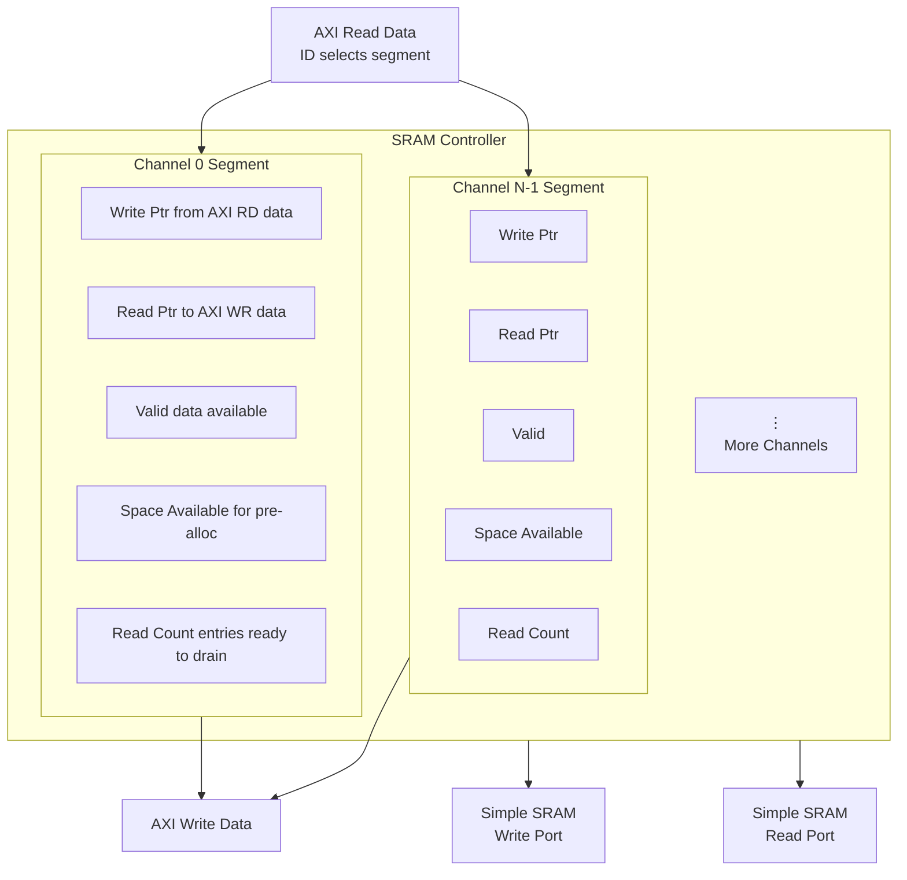

# SRAM Controller Specification

**Module:** `sram_controller.sv`
**Purpose:** Multi-Channel SRAM Segmentation and Flow Control
**Version:** 1.0
**Date:** 2025-10-18
**Author:** RTL Design Sherpa Project

---

## 1. Overview

The SRAM Controller manages a monolithic SRAM buffer by partitioning it into **per-channel segments** with independent read/write pointers and flow control. This enables multiple channels to operate concurrently without address conflicts while maximizing SRAM utilization.

### 1.1 Key Features

- **Per-Channel Segmentation:** Divides SRAM into NUM_CHANNELS independent segments
- **Dual-Pointer Management:** Separate write pointer (AXI read data) and read pointer (AXI write data)
- **Flow Control:** Valid/ready handshaking with occupancy tracking
- **Pre-Allocation:** AXI read engine reserves space before issuing read commands
- **ID-Based Routing:** AXI transaction ID selects SRAM segment

### 1.2 Block Diagram


<!--
Original Mermaid diagram (for editing):


-->

---

## 2. Architecture Details

### 2.1 SRAM Segmentation

The SRAM is divided into **NUM_CHANNELS** equal segments:

```
Total SRAM Depth: SRAM_DEPTH
Segment Size: SEGMENT_SIZE = SRAM_DEPTH / NUM_CHANNELS

Channel 0 Segment: [0 : SEGMENT_SIZE-1]
Channel 1 Segment: [SEGMENT_SIZE : 2×SEGMENT_SIZE-1]
⋮
Channel N-1 Segment: [(N-1)×SEGMENT_SIZE : N×SEGMENT_SIZE-1]
```

**Example (8 channels, 4096 total depth):**
- Total SRAM: 4096 entries
- Segment size: 512 entries per channel
- Channel 0: addresses 0-511
- Channel 1: addresses 512-1023
- Channel 7: addresses 3584-4095

### 2.2 Address Calculation

For a given channel ID and local pointer:

```systemverilog
sram_addr = (channel_id × SEGMENT_SIZE) + local_ptr
```

Where:
- `channel_id`: 0 to NUM_CHANNELS-1
- `local_ptr`: 0 to SEGMENT_SIZE-1 (wraps within segment)

### 2.3 Per-Channel State

Each channel maintains:

| Signal | Width | Purpose |
|--------|-------|---------|
| `wr_ptr[ch]` | `$clog2(SEGMENT_SIZE)` | Write pointer (AXI read data writes here) |
| `rd_ptr[ch]` | `$clog2(SEGMENT_SIZE)` | Read pointer (AXI write data reads from here) |
| `valid[ch]` | 1-bit | Data available: `wr_ptr ≠ rd_ptr` |
| `space_avail[ch]` | 1-bit | Space available for new writes |
| `rd_count[ch]` | `$clog2(SEGMENT_SIZE)+1` | Number of entries ready to drain |
| `wr_reserved[ch]` | `$clog2(SEGMENT_SIZE)+1` | Pre-allocated space (not yet written) |

---

## 3. Data Flow Paths

### 3.1 Write Path (AXI Read Data → SRAM)

**Sequence:**

1. **AXI Read Engine** issues read command
2. **Pre-Allocation:** Engine requests space via `rd_space_req[ch]`
   - Controller checks `space_avail[ch]`
   - If space available: asserts `rd_space_grant[ch]`, increments `wr_reserved[ch]`
   - Engine stores expected beat count
3. **AXI Read Data Returns:** `axi_rd_data_valid` asserted
4. **ID Routing:** `axi_rd_data_id` selects channel segment
5. **Write to SRAM:**
   - Address: `(channel_id × SEGMENT_SIZE) + wr_ptr[channel_id]`
   - Data: `axi_rd_data`
6. **Pointer Update:** `wr_ptr[channel_id]` increments
7. **Reserved Decrement:** `wr_reserved[channel_id]` decrements

**Example:**
```
Channel 2 (segment starts at 1024):
- wr_ptr = 5
- SRAM write address = 1024 + 5 = 1029
- After write: wr_ptr = 6
```

### 3.2 Read Path (SRAM → AXI Write Data)

**Sequence:**

1. **AXI Write Engine** checks `sram_rd_valid[ch]` (data available)
2. **Read Request:** Engine asserts `axi_wr_sram_req[ch]`
3. **Read from SRAM:**
   - Address: `(channel_id × SEGMENT_SIZE) + rd_ptr[channel_id]`
   - Data latches after 1 cycle (SRAM read latency)
4. **Data Transfer:** `axi_wr_sram_data` → AXI W channel
5. **Pointer Update:** `rd_ptr[channel_id]` increments
6. **Count Update:** `rd_count[channel_id]` decrements

**Example:**
```
Channel 2 (segment starts at 1024):
- rd_ptr = 3
- SRAM read address = 1024 + 3 = 1027
- After read: rd_ptr = 4
```

---

## 4. Flow Control Mechanisms

### 4.1 Pre-Allocation (Critical for Preventing Overwrites)

**Problem:** AXI read commands issued before data arrives. Without pre-allocation, multiple channels could reserve the same space.

**Solution:** Two-stage allocation:

1. **Reserve Stage (Read Command Issued):**
   ```systemverilog
   // AXI Read Engine requests space
   rd_space_req[ch] = 1'b1;
   rd_xfer_count[ch] = burst_length;  // E.g., 16 beats

   // Controller checks and grants
   if (space_available >= burst_length) begin
       rd_space_grant[ch] = 1'b1;
       wr_reserved[ch] += burst_length;  // Reserve 16 entries
   end
   ```

2. **Commit Stage (Data Arrives):**
   ```systemverilog
   // Each AXI read data beat
   if (axi_rd_data_valid && axi_rd_data_ready) begin
       wr_ptr[ch] <= wr_ptr[ch] + 1;
       wr_reserved[ch] <= wr_reserved[ch] - 1;  // Commit 1 reserved entry
   end
   ```

**Key Invariant:**
```
Occupied + Reserved ≤ SEGMENT_SIZE
```

### 4.2 Occupancy Tracking

**Read Count (Entries Available to Drain):**
```systemverilog
rd_count[ch] = (wr_ptr[ch] >= rd_ptr[ch]) ?
               (wr_ptr[ch] - rd_ptr[ch]) :
               (SEGMENT_SIZE - rd_ptr[ch] + wr_ptr[ch]);
```

**Space Available (Entries Free for New Writes):**
```systemverilog
space_available[ch] = SEGMENT_SIZE - rd_count[ch] - wr_reserved[ch];
```

**Valid Signal (Data Ready to Read):**
```systemverilog
sram_rd_valid[ch] = (rd_count[ch] > 0);
```

**Space Valid Signal (Room for New Writes):**
```systemverilog
rd_space_valid[ch] = (space_available[ch] > MIN_SPACE_THRESHOLD);
```

---

## 5. Interface Specification

### 5.1 Parameters

```systemverilog
parameter int NUM_CHANNELS = 8,           // Number of channels
parameter int SRAM_DEPTH = 4096,          // Total SRAM depth
parameter int SRAM_ADDR_WIDTH = $clog2(SRAM_DEPTH),
parameter int DATA_WIDTH = 512,           // Data width in bits
parameter int ID_WIDTH = 8,               // AXI ID width
parameter int SEGMENT_SIZE = SRAM_DEPTH / NUM_CHANNELS,
parameter int SEG_PTR_WIDTH = $clog2(SEGMENT_SIZE),
parameter int SEG_COUNT_WIDTH = $clog2(SEGMENT_SIZE) + 1,
parameter int MIN_SPACE_THRESHOLD = 8     // Minimum space for grant
```

### 5.2 Clock and Reset

```systemverilog
input  logic                        clk,
input  logic                        rst_n
```

### 5.3 AXI Read Data Interface (Write to SRAM)

```systemverilog
// Data arriving from AXI read transactions
input  logic                        axi_rd_data_valid,      // Read data valid
input  logic [ID_WIDTH-1:0]         axi_rd_data_id,         // Transaction ID → selects channel
input  logic [DATA_WIDTH-1:0]       axi_rd_data,            // Read data payload
output logic                        axi_rd_data_ready,      // Ready to accept data

// Pre-allocation interface (before data arrives)
input  logic [NUM_CHANNELS-1:0]     rd_space_req,           // Channel requests space
input  logic [NUM_CHANNELS-1:0][7:0] rd_xfer_count,        // Number of beats to reserve
output logic [NUM_CHANNELS-1:0]     rd_space_grant,         // Space granted
output logic [NUM_CHANNELS-1:0]     rd_space_valid          // Space available for new requests
```

### 5.4 AXI Write Data Interface (Read from SRAM)

```systemverilog
// Read requests from AXI write engine
input  logic [NUM_CHANNELS-1:0]     axi_wr_sram_req,        // Channel requests read
output logic [NUM_CHANNELS-1:0]     axi_wr_sram_ack,        // Read acknowledged
output logic [NUM_CHANNELS-1:0][DATA_WIDTH-1:0] axi_wr_sram_data,  // Read data (1 cycle latency)

// Flow control signals
output logic [NUM_CHANNELS-1:0]     sram_rd_valid,          // Data available to read
output logic [NUM_CHANNELS-1:0][SEG_COUNT_WIDTH-1:0] sram_rd_count  // Number of entries available
```

### 5.5 SRAM Physical Interface

```systemverilog
// Write port (from AXI read data)
output logic                        sram_wr_en,
output logic [SRAM_ADDR_WIDTH-1:0]  sram_wr_addr,
output logic [DATA_WIDTH-1:0]       sram_wr_data,

// Read port (to AXI write data)
output logic                        sram_rd_en,
output logic [SRAM_ADDR_WIDTH-1:0]  sram_rd_addr,
input  logic [DATA_WIDTH-1:0]       sram_rd_data,
input  logic                        sram_rd_data_valid      // SRAM read latency = 1 cycle
```

---

## 6. Operational Examples

### 6.1 Example: Single Channel Transfer (Channel 0)

**Initial State:**
- `wr_ptr[0] = 0`
- `rd_ptr[0] = 0`
- `wr_reserved[0] = 0`
- `rd_count[0] = 0`
- Segment: addresses 0-511

**Step 1: AXI Read Engine Requests Space**
```
rd_space_req[0] = 1
rd_xfer_count[0] = 16  // Request 16 beats

Controller checks: space_available[0] = 512 - 0 - 0 = 512 ✓
rd_space_grant[0] = 1
wr_reserved[0] = 16
```

**Step 2: AXI Read Data Arrives (Beat 1)**
```
axi_rd_data_valid = 1
axi_rd_data_id = 0  // Channel 0
axi_rd_data = 0xDEADBEEF...

SRAM write:
  sram_wr_addr = 0×512 + 0 = 0
  sram_wr_data = 0xDEADBEEF...
  sram_wr_en = 1

wr_ptr[0] = 1
wr_reserved[0] = 15
rd_count[0] = 1
sram_rd_valid[0] = 1  // Data now available!
```

**Step 3: AXI Write Engine Reads (Beat 1)**
```
axi_wr_sram_req[0] = 1

SRAM read:
  sram_rd_addr = 0×512 + 0 = 0
  sram_rd_en = 1

(Next cycle)
axi_wr_sram_data[0] = 0xDEADBEEF...
axi_wr_sram_ack[0] = 1

rd_ptr[0] = 1
rd_count[0] = 0  // (wr_ptr=1, rd_ptr=1)
sram_rd_valid[0] = 0  // No more data
```

### 6.2 Example: Multi-Channel Concurrent Access

**Scenario:** Channel 0 and Channel 3 both active

**Channel 0 (Segment 0-511):**
- AXI read data arrives: ID=0, writes to address 0 + wr_ptr[0]
- wr_ptr[0] increments

**Channel 3 (Segment 1536-2047):**
- AXI read data arrives: ID=3, writes to address 1536 + wr_ptr[3]
- wr_ptr[3] increments

**No Address Conflict:** Each channel writes to its own segment!

---

## 7. Timing Diagrams

### 7.1 Pre-Allocation and Write Sequence

```
Cycle:      0    1    2    3    4    5    6    7
            ─────────────────────────────────────
rd_space_req[0]:  ▔▔▔▔ ____________________________
rd_xfer_count[0]: [16]  ____________________________
rd_space_grant[0]: ____ ▔▔▔▔ ________________________
wr_reserved[0]:   [0]  [16] [16] [16] [15] [14] ...

axi_rd_data_valid: ____ ____ ____ ▔▔▔▔ ▔▔▔▔ ▔▔▔▔ ...
axi_rd_data_id:   ____ ____ ____ [0]  [0]  [0]  ...
sram_wr_en:       ____ ____ ____ ▔▔▔▔ ▔▔▔▔ ▔▔▔▔ ...
wr_ptr[0]:        [0]  [0]  [0]  [0]  [1]  [2]  ...
rd_count[0]:      [0]  [0]  [0]  [0]  [1]  [2]  ...
```

### 7.2 Read Sequence

```
Cycle:      0    1    2    3    4    5
            ─────────────────────────────
rd_count[0]:     [2]  [2]  [1]  [0]  [0]
sram_rd_valid[0]: ▔▔▔▔ ▔▔▔▔ ▔▔▔▔ ____ ____

axi_wr_sram_req[0]: ▔▔▔▔ ▔▔▔▔ ____ ____ ____
sram_rd_en:      ▔▔▔▔ ▔▔▔▔ ____ ____ ____
sram_rd_addr:    [0]  [1]  ____ ____ ____
rd_ptr[0]:       [0]  [1]  [2]  [2]  [2]

axi_wr_sram_data[0]: xxxx [D0] [D1] xxxx xxxx  (1-cycle latency)
axi_wr_sram_ack[0]:  ____ ▔▔▔▔ ▔▔▔▔ ____ ____
```

---

## 8. Error Conditions and Edge Cases

### 8.1 Segment Overflow (Should Never Happen)

**Condition:** `rd_count[ch] + wr_reserved[ch] > SEGMENT_SIZE`

**Prevention:**
- Pre-allocation checks space before granting
- `rd_space_grant` only asserted if space available

**Detection:**
```systemverilog
assert (rd_count[ch] + wr_reserved[ch] <= SEGMENT_SIZE);
```

### 8.2 Pointer Wrap-Around

**Scenario:** Write pointer wraps from SEGMENT_SIZE-1 to 0

**Handling:**
```systemverilog
wr_ptr[ch] <= (wr_ptr[ch] == SEGMENT_SIZE-1) ? '0 : wr_ptr[ch] + 1;
```

**Read Count Calculation (handles wrap):**
```systemverilog
rd_count[ch] = (wr_ptr[ch] >= rd_ptr[ch]) ?
               (wr_ptr[ch] - rd_ptr[ch]) :
               (SEGMENT_SIZE - rd_ptr[ch] + wr_ptr[ch]);
```

### 8.3 Empty Segment Read Attempt

**Condition:** `axi_wr_sram_req[ch]` asserted when `sram_rd_valid[ch] = 0`

**Prevention:** AXI write engine should check `sram_rd_valid[ch]` before asserting `axi_wr_sram_req[ch]`

**RTL Handling:** Controller ignores request, no ack generated

---

## 9. Performance Considerations

### 9.1 Segment Size Selection

**Trade-offs:**

| Segment Size | Advantages | Disadvantages |
|--------------|------------|---------------|
| **Large (512+ entries)** | Better burst efficiency, fewer wraps | More total SRAM needed |
| **Small (64-128 entries)** | Less SRAM area | More wrap-arounds, potential stalls |

**Recommendation:** Size based on:
- Maximum AXI burst length (e.g., 4× MAX_BURST_LEN = 64 entries for 16-beat bursts)
- Expected channel utilization patterns
- SRAM area budget

### 9.2 Arbitration Impact

**Write Arbitration:** Multiple channels may have AXI read data arriving simultaneously
- SRAM write port is single-ported
- Need arbiter if multiple `axi_rd_data_valid[ch]` asserted

**Read Arbitration:** Multiple channels may request SRAM read simultaneously
- SRAM read port is single-ported
- Need arbiter for `axi_wr_sram_req[ch]`

### 9.3 Latency Analysis

**Write Path:**
- AXI read data arrival → SRAM write: **1 cycle**
- Pre-allocation latency: **1 cycle** (grant next cycle after request)

**Read Path:**
- SRAM read request → data available: **2 cycles** (1 cycle SRAM latency + 1 cycle register)

---

## 10. Verification Strategy

### 10.1 Unit Tests

**Test Scenarios:**
1. **Single Channel Fill/Drain:** Write until full, read until empty
2. **Multi-Channel Concurrent:** All channels active simultaneously
3. **Pointer Wrap-Around:** Test wrap at segment boundaries
4. **Pre-Allocation:** Verify reserved space prevents overwrites
5. **Back-to-Back Transfers:** No idle cycles between bursts

### 10.2 Coverage Metrics

**Functional Coverage:**
- All channels accessed ✓
- Pointer wrap-around ✓
- Full segment (rd_count = SEGMENT_SIZE) ✓
- Empty segment (rd_count = 0) ✓
- Maximum reservation (wr_reserved = MAX_BURST_LEN) ✓

**Code Coverage:**
- Line coverage: >95%
- Branch coverage: >90%
- FSM state coverage: 100% (if FSM used)

### 10.3 Assertions

```systemverilog
// Pointer bounds
assert property (wr_ptr[ch] < SEGMENT_SIZE);
assert property (rd_ptr[ch] < SEGMENT_SIZE);

// Occupancy invariant
assert property (rd_count[ch] + wr_reserved[ch] <= SEGMENT_SIZE);

// Valid signal correctness
assert property (sram_rd_valid[ch] == (rd_count[ch] > 0));

// Grant only when space available
assert property (rd_space_grant[ch] |-> (space_available[ch] >= rd_xfer_count[ch]));
```

---

## 11. Implementation Notes

### 11.1 SRAM Instantiation

**Dual-Port SRAM Required:**
```systemverilog
simple_sram #(
    .DATA_WIDTH(DATA_WIDTH),
    .ADDR_WIDTH(SRAM_ADDR_WIDTH),
    .DEPTH(SRAM_DEPTH)
) u_sram (
    .i_clk(clk),
    .i_rst_n(rst_n),
    // Write port (from AXI read data)
    .i_wr_en(sram_wr_en),
    .i_wr_addr(sram_wr_addr),
    .i_wr_data(sram_wr_data),
    // Read port (to AXI write data)
    .i_rd_en(sram_rd_en),
    .i_rd_addr(sram_rd_addr),
    .o_rd_data(sram_rd_data),
    .o_rd_valid(sram_rd_data_valid)
);
```

### 11.2 Reset Behavior

**On Reset:**
- All `wr_ptr[ch] = 0`
- All `rd_ptr[ch] = 0`
- All `wr_reserved[ch] = 0`
- All `rd_count[ch] = 0`
- All `sram_rd_valid[ch] = 0`

### 11.3 Pipeline Stages

**Critical Path:** Address calculation + SRAM access
- May need pipeline register for `sram_wr_addr` in high-frequency designs
- Read data path already has 1-cycle latency (SRAM read)

---

## 12. Integration with STREAM Engines

### 12.1 AXI Read Engine Integration

```systemverilog
axi_read_engine u_rd_engine (
    // ... AXI AR/R interface ...

    // SRAM Controller Interface
    .rd_space_req(rd_space_req[ch]),
    .rd_xfer_count(rd_xfer_count[ch]),
    .rd_space_grant(rd_space_grant[ch]),
    .rd_space_valid(rd_space_valid[ch]),

    .axi_rd_data_valid(axi_rd_data_valid),
    .axi_rd_data_id(axi_rd_data_id),
    .axi_rd_data(axi_rd_data),
    .axi_rd_data_ready(axi_rd_data_ready)
);
```

### 12.2 AXI Write Engine Integration

```systemverilog
axi_write_engine u_wr_engine (
    // ... AXI AW/W/B interface ...

    // SRAM Controller Interface
    .sram_rd_valid(sram_rd_valid[ch]),
    .sram_rd_count(sram_rd_count[ch]),
    .axi_wr_sram_req(axi_wr_sram_req[ch]),
    .axi_wr_sram_ack(axi_wr_sram_ack[ch]),
    .axi_wr_sram_data(axi_wr_sram_data[ch])
);
```

---

## 13. References

- **STREAM PRD:** `projects/components/stream/PRD.md`
- **Simple SRAM:** `projects/components/rapids/rtl/rapids_fub/simple_sram.sv` (shared module)
- **AXI Read Engine:** `projects/components/stream/rtl/stream_fub/axi_read_engine.sv`
- **AXI Write Engine:** `projects/components/stream/rtl/stream_fub/axi_write_engine.sv`
- **RAPIDS SRAM Controller (reference):** `projects/components/rapids/rtl/rapids_fub/` (if exists)

---

**Document Version:** 1.0
**Last Updated:** 2025-10-18
**Review Status:** Initial Draft
**Next Review:** After RTL implementation

---

## Appendix A: Signal Summary Table

| Signal | Direction | Width | Purpose |
|--------|-----------|-------|---------|
| **Clock/Reset** ||||
| `clk` | input | 1 | System clock |
| `rst_n` | input | 1 | Active-low reset |
| **AXI Read Data (Write to SRAM)** ||||
| `axi_rd_data_valid` | input | 1 | Read data valid |
| `axi_rd_data_id` | input | ID_WIDTH | Transaction ID → channel select |
| `axi_rd_data` | input | DATA_WIDTH | Read data payload |
| `axi_rd_data_ready` | output | 1 | Ready for data |
| `rd_space_req[ch]` | input | NUM_CHANNELS | Request space reservation |
| `rd_xfer_count[ch]` | input | NUM_CHANNELS×8 | Beats to reserve |
| `rd_space_grant[ch]` | output | NUM_CHANNELS | Space granted |
| `rd_space_valid[ch]` | output | NUM_CHANNELS | Space available |
| **AXI Write Data (Read from SRAM)** ||||
| `axi_wr_sram_req[ch]` | input | NUM_CHANNELS | Read request |
| `axi_wr_sram_ack[ch]` | output | NUM_CHANNELS | Read acknowledged |
| `axi_wr_sram_data[ch]` | output | NUM_CHANNELS×DATA_WIDTH | Read data |
| `sram_rd_valid[ch]` | output | NUM_CHANNELS | Data available |
| `sram_rd_count[ch]` | output | NUM_CHANNELS×SEG_COUNT_WIDTH | Entries available |
| **SRAM Physical** ||||
| `sram_wr_en` | output | 1 | Write enable |
| `sram_wr_addr` | output | SRAM_ADDR_WIDTH | Write address |
| `sram_wr_data` | output | DATA_WIDTH | Write data |
| `sram_rd_en` | output | 1 | Read enable |
| `sram_rd_addr` | output | SRAM_ADDR_WIDTH | Read address |
| `sram_rd_data` | input | DATA_WIDTH | Read data |
| `sram_rd_data_valid` | input | 1 | Read data valid (1-cycle latency) |

---

**End of Specification**
