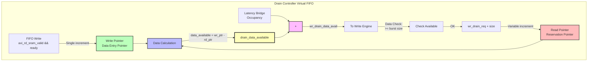

# Stream Drain Controller

**Module:** `stream_drain_ctrl.sv`
**Category:** FUB (Functional Unit Block)
**Parent:** `sram_controller_unit.sv`

## Overview

The `stream_drain_ctrl` module is a **virtual FIFO without data storage** that tracks data availability using FIFO pointer logic. It provides pre-reservation support for AXI write engines to prevent underflow when draining data from the FIFO.

### What Makes This a "Virtual FIFO"

**Virtual FIFO:**
- Has write pointer (data entry pointer)
- Has read pointer (drain reservation pointer)
- Calculates full/empty/data_available
- **NO data storage** - only pointer arithmetic

**Use Case:** Reserve FIFO data BEFORE AXI write burst starts

## The Drain Problem

### Without Drain Controller

**Problem:** Race condition between data check and drain

```
Cycle 0: Write engine checks FIFO occupancy
         data_available = 100 beats → OK to issue 16-beat burst

Cycle 5: AW handshake completes, AXI write starts

Cycle 10: Meanwhile, read engine allocates 90 beats in FIFO
          → Only 10 beats of actual data remain (NOT ENOUGH!)

Cycle 15: AXI write engine tries to drain 16 beats
          → UNDERFLOW! Only 10 beats available
```

### With Drain Controller

**Solution:** Reserve data when issuing AW, not when draining

```
Cycle 0: Write engine checks data_available = 100 beats
         Reserve 16 beats:
           wr_drain_req = 1, wr_drain_size = 16
           → data_available = 84 beats (reserved!)

Cycle 5: AW handshake completes

Cycle 10: Read engine checks data_available = 84 beats
          → Sees reduced data, won't over-allocate

Cycle 15: AXI write data drains from FIFO
          → Data was reserved, guaranteed available
```

## Architecture

### Two-Pointer System


<!--
Original Mermaid diagram (for editing):


<!--
Original Mermaid diagram (for editing):


-->
-->

**Write Pointer (Data Entry Pointer):**
- Advances when data **enters FIFO** (FIFO write handshake)
- Single-beat increment
- Represents "data added"

**Read Pointer (Drain Reservation Pointer):**
- Advances when data is **reserved** (drain request)
- Variable-size increment (wr_drain_size)
- Represents "data reserved"

**Data Calculation:**
```systemverilog
data_available = wr_ptr - rd_ptr
```

### NORMAL FIFO Naming Convention

**✅ GOOD NEWS:** Drain controller uses STANDARD FIFO naming (unlike allocation controller)!

**Standard FIFO:**
| Signal | Meaning |
|--------|---------|
| `wr_*` | Write data → Increment occupancy → data_available increases |
| `rd_*` | Read data → Decrement occupancy → data_available decreases |

**Drain Controller:**
| Signal | Meaning |
|--------|---------|
| `wr_*` | Data **enters FIFO** → Increment occupancy → data_available **increases** |
| `rd_*` | **Reserve data** → Decrement availability → data_available **decreases** |

**This matches normal FIFO intuition!**

```systemverilog
// Write side = Data enters FIFO
.wr_valid (axi_rd_sram_valid && axi_rd_sram_ready),  // FIFO write handshake

// Read side = Reserve data for upcoming write burst
.rd_valid (wr_drain_req),
.rd_size  (wr_drain_size)  // Variable size (e.g., 16 beats)
```

## Parameters

| Parameter | Type | Default | Description |
|-----------|------|---------|-------------|
| `DEPTH` | int | 512 | Virtual FIFO depth (must match physical FIFO) |
| `ALMOST_WR_MARGIN` | int | 1 | Almost full threshold |
| `ALMOST_RD_MARGIN` | int | 1 | Almost empty threshold |
| `REGISTERED` | int | 1 | Register outputs for timing |

## Interfaces

### Write Interface (Data Enters FIFO)

| Signal | Direction | Width | Description |
|--------|-----------|-------|-------------|
| `wr_valid` | Input | 1 | Data written to FIFO |
| `wr_ready` | Output | 1 | Not full (!wr_full) |

**Usage:**
```systemverilog
// Connect to FIFO write handshake
assign wr_valid = (axi_rd_sram_valid && axi_rd_sram_ready);
```

### Read Interface (Drain Requests)

| Signal | Direction | Width | Description |
|--------|-----------|-------|-------------|
| `rd_valid` | Input | 1 | Request to drain |
| `rd_size` | Input | 8 | Number of entries to drain |
| `rd_ready` | Output | 1 | Data available (!rd_empty) |

**Usage:**
```systemverilog
// Write engine reserves data before issuing AW
wr_drain_req = (data_check_ok && !aw_pending);
wr_drain_size = cfg_axi_wr_xfer_beats;
```

### Status Outputs

| Signal | Direction | Width | Description |
|--------|-----------|-------|-------------|
| `data_available` | Output | AW+1 | Available unreserved data |
| `wr_full` | Output | 1 | FIFO full |
| `wr_almost_full` | Output | 1 | Almost full |
| `rd_empty` | Output | 1 | No data available |
| `rd_almost_empty` | Output | 1 | Almost empty |

**Note:** `data_available` is the most important output - used by write engine for data checking.

## Operation

### Drain Flow

**Step 1: Data Enters FIFO**
```systemverilog
// AXI read data arrives, enters FIFO
axi_rd_sram_valid = 1, axi_rd_sram_ready = 1

// Drain controller sees write
wr_valid = 1
r_wr_ptr_bin <= r_wr_ptr_bin + 1
data_available increases by 1
```

**Step 2: Write Engine Checks Data**
```systemverilog
// Write engine checks data availability
if (data_available >= cfg_axi_wr_xfer_beats) begin
    // Data OK, proceed to reservation
end
```

**Step 3: Reserve Data**
```systemverilog
wr_drain_req = 1'b1;
wr_drain_size = 8'd16;  // Reserve 16 beats

// Next cycle: rd_ptr advances
r_rd_ptr_bin <= r_rd_ptr_bin + 16;
data_available decreases by 16
```

**Step 4: AXI Write Executes**
```systemverilog
// Some cycles later, AW handshake completes
m_axi_awvalid = 1, m_axi_awready = 1
// AXI write starts
```

**Step 5: Data Drains from FIFO**
```systemverilog
// Write engine drains data from FIFO
axi_wr_sram_valid = 1, axi_wr_sram_ready = 1
// Data exits FIFO → Actual drain happens
// Drain controller already accounted for this via reservation
```

### Pointer Arithmetic

**Write Pointer (Data Entry):**
```systemverilog
// Single-beat increment (uses counter_bin utility)
counter_bin #(
    .WIDTH (AW + 1),
    .MAX   (D)
) write_pointer_inst (
    .clk              (axi_aclk),
    .rst_n            (axi_aresetn),
    .enable           (w_write && !r_wr_full),
    .counter_bin_curr (r_wr_ptr_bin),
    .counter_bin_next (w_wr_ptr_bin_next)
);
```

**Read Pointer (Drain Reservation):**
```systemverilog
// Variable-size increment
if (w_read && !r_rd_empty) begin
    r_rd_ptr_bin <= r_rd_ptr_bin + (AW+1)'(rd_size);
end
```

**Data Calculation:**
```systemverilog
// Occupancy = wr_ptr - rd_ptr
w_count = w_wr_ptr_bin_next - w_rd_ptr_bin_next;

// Data available = occupancy
data_available = w_count;
```

## Timing Behavior

### Data Entry Latency

**Data entry is IMMEDIATE (combinational + 1 cycle):**

```
Cycle N:   axi_rd_sram_valid = 1, axi_rd_sram_ready = 1
           → wr_valid = 1
Cycle N+1: r_wr_ptr_bin = old_value + 1
           data_available = old_value + 1
```

**Write engine sees updated data_available on next cycle.**

### Drain Reservation Latency

**Reservation is IMMEDIATE (combinational + 1 cycle):**

```
Cycle N:   wr_drain_req = 1, wr_drain_size = 16
Cycle N+1: r_rd_ptr_bin = old_value + 16
           data_available = old_value - 16
```

**Read engine sees updated data_available on next cycle.**

## Integration Example

### In sram_controller_unit.sv

```systemverilog
stream_drain_ctrl #(
    .DEPTH(SD),
    .REGISTERED(1)
) u_drain_ctrl (
    .axi_aclk           (clk),
    .axi_aresetn        (rst_n),

    // DATA WRITTEN (increment occupancy)
    .wr_valid           (axi_rd_sram_valid && axi_rd_sram_ready),  // FIFO write
    .wr_ready           (),  // Unused

    // DRAIN REQUEST (reserve data for upcoming write)
    .rd_valid           (wr_drain_req),      // From write engine
    .rd_size            (wr_drain_size),     // Burst size
    .rd_ready           (),                  // Unused (data check uses data_available)

    // Data tracking
    .data_available     (drain_data_available),  // FIFO-only data count

    // Unused status
    .wr_full            (),
    .wr_almost_full     (),
    .rd_empty           (),
    .rd_almost_empty    ()
);

// CRITICAL: Add latency bridge occupancy!
// Drain controller tracks FIFO only, not latency bridge buffered data
assign wr_drain_data_avail = drain_data_available + SCW'(bridge_occupancy);
```

**Why Add Bridge Occupancy:**

The drain controller only sees data in the FIFO, not data buffered in the latency bridge. The latency bridge can hold up to 5 beats (1 in-flight + 4 in skid buffer).

```
Example:
  FIFO count (drain_data_available): 100 beats
  Bridge occupancy: 3 beats
  Total available to write engine: 100 + 3 = 103 beats
```

**Without this addition, write engine underestimates available data!**

## Debug Support

### Display Statements

**Data Entry:**
```systemverilog
$display("DRAIN_CTRL @ %t: data written, wr_ptr: %0d -> %0d, data_available will be %0d",
        $time, r_wr_ptr_bin, w_wr_ptr_bin_next,
        w_wr_ptr_bin_next - r_rd_ptr_bin);
```

**No explicit drain display** - drain requests are application-level, not controller-level events.

### Waveform Analysis

**Key Signals to Monitor:**
- `r_wr_ptr_bin` - Data entry pointer
- `r_rd_ptr_bin` - Drain reservation pointer
- `data_available` - Available unreserved data
- `axi_rd_sram_valid`, `axi_rd_sram_ready` - FIFO write handshake
- `wr_drain_req`, `wr_drain_size` - Drain requests

## Common Issues

### Issue 1: Data Available Too Low

**Symptom:** Write engine sees less data than expected

**Root Cause:** Bridge occupancy not added

**Wrong:**
```systemverilog
assign wr_drain_data_avail = drain_data_available;  // Missing bridge data!
```

**Correct:**
```systemverilog
assign wr_drain_data_avail = drain_data_available + bridge_occupancy;
```

### Issue 2: Underflow Despite Drain Controller

**Symptom:** FIFO underflows even with drain controller

**Root Cause:** Write engine drains without reservation

**Wrong:**
```systemverilog
// Issue AW without checking data_available
m_axi_awvalid = 1;  // No drain request!
```

**Correct:**
```systemverilog
// Always reserve before issuing AW
if (data_available >= cfg_axi_wr_xfer_beats) begin
    wr_drain_req = 1'b1;
    wr_drain_size = cfg_axi_wr_xfer_beats;
    // THEN issue AW on next cycle
end
```

### Issue 3: Data Not Incrementing

**Symptom:** `data_available` never increases

**Root Cause:** `wr_valid` not connected to FIFO write handshake

**Wrong:**
```systemverilog
.wr_valid (fifo_rd_valid)  // FIFO read - WRONG side!
```

**Correct:**
```systemverilog
.wr_valid (axi_rd_sram_valid && axi_rd_sram_ready)  // FIFO write - CORRECT!
```

## Comparison with Allocation Controller

| Aspect | Drain Controller | Allocation Controller |
|--------|-----------------|----------------------|
| **Purpose** | Reserve FIFO data | Reserve FIFO space |
| **User** | AXI write engine | AXI read engine |
| **Write side** | Data enters FIFO (increment) | Allocation request (reserve) |
| **Read side** | Drain request (reserve) | Data exits controller (release) |
| **Naming** | SAME as normal FIFO | OPPOSITE of normal FIFO |
| **Output** | `data_available` | `space_free` |
| **Bridge compensation** | YES (add bridge_occupancy) | NO (space is absolute) |

## Resource Utilization

**Per Instance:**
- 2 × (AW+1)-bit counters (wr_ptr, rd_ptr)
- 1 × (AW+1)-bit data_available calculation
- FIFO control block (full/empty logic)
- ~50-100 flip-flops total

**Example (DEPTH=512, AW=9):**
- 2 × 10-bit counters = 20 FFs
- Control logic = ~30 FFs
- **Total:** ~50 FFs

**Very lightweight - pointer logic only, no data storage.**

## Related Modules

- **Counterpart:** `stream_alloc_ctrl.sv` - Allocation-side flow control
- **Parent:** `sram_controller_unit.sv` - Instantiates drain controller
- **User:** `axi_write_engine.sv` - Checks `wr_drain_data_avail` before issuing AW

## References

- **Allocation Controller:** `stream_alloc_ctrl.md`
- **SRAM Controller Unit:** `sram_controller_unit.md`
- **AXI Write Engine:** `axi_write_engine.md`
- **Latency Bridge:** `stream_latency_bridge.md` (for bridge_occupancy signal)
