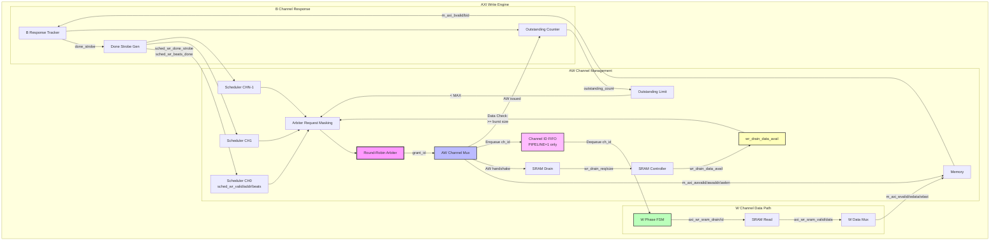

# AXI Write Engine Specification

**Module:** `axi_write_engine.sv`
**Location:** `projects/components/stream/rtl/fub/`
**Status:** Implemented

---

## Overview

The AXI Write Engine is a high-performance multi-channel AXI4 write engine that manages write transactions from multiple independent channels to system memory. It features space-aware arbitration, streaming data path from SRAM controller, and support for pipelined operation.

### Key Features

- **Multi-channel support:** Arbitrates across NUM_CHANNELS independent channels
- **Space-aware arbitration:** Only grants to channels with sufficient SRAM data available
- **Pre-allocation handshake:** Reserves SRAM data before issuing AXI AW command
- **Streaming pipeline:** No internal buffering - direct SRAM-to-AXI streaming
- **Channel ID tracking:** Encodes channel ID in AXI transaction ID and USER field
- **Pipelined operation:** Optional pipelining with outstanding transaction support
- **Completion feedback:** Reports burst completion back to schedulers

### Block Diagram


<!--
Original Mermaid diagram (for editing):


<!--
Original Mermaid diagram (for editing):


-->
-->

---

## Parameters

```systemverilog
parameter int NUM_CHANNELS = 8;              // Number of independent channels
parameter int ADDR_WIDTH = 64;               // AXI address bus width
parameter int DATA_WIDTH = 512;              // AXI data bus width
parameter int ID_WIDTH = 8;                  // AXI ID field width
parameter int USER_WIDTH = 1;                // AXI USER field width (channel ID)
parameter int SEG_COUNT_WIDTH = 8;           // Width of space/count signals
parameter int PIPELINE = 0;                  // 0: Single txn/channel, 1: Multiple outstanding
parameter int AW_MAX_OUTSTANDING = 8;        // Max outstanding AW per channel (PIPELINE=1)
```

### Parameter Guidelines

**NUM_CHANNELS:**
- Typical: 2-8 channels
- Must match scheduler array size
- Affects arbiter complexity and area

**DATA_WIDTH:**
- Common: 128, 256, 512 bits
- Must match SRAM controller data width
- Determines AXI AWSIZE encoding

**PIPELINE:**
- `0` = Non-pipelined: Wait for B response before next AW (simple, lower throughput)
- `1` = Pipelined: Allow multiple outstanding AW per channel (higher throughput)

**AW_MAX_OUTSTANDING:**
- Only used when PIPELINE=1
- Typical: 4-16 depending on memory latency
- Higher values improve throughput but increase area

**USER_WIDTH:**
- Typically $clog2(NUM_CHANNELS) to carry channel ID
- Enables transaction tracking in debug/monitoring
- Set to 1 if AXI USER not used

---

## Interface

### Clock and Reset

```systemverilog
input  logic                    clk;        // System clock
input  logic                    rst_n;      // Active-low async reset
```

### Configuration Interface

```systemverilog
input  logic [7:0]              cfg_axi_wr_xfer_beats;  // Transfer size in beats
```

The `cfg_axi_wr_xfer_beats` parameter sets the AXI burst length for all channels. This is converted to AXI `AWLEN` format (beats-1) internally.

### Scheduler Interface (Per-Channel)

```systemverilog
// Request interface - one set per channel
input  logic [NC-1:0]           sched_wr_valid;      // Channel requests write
output logic [NC-1:0]           sched_wr_ready;      // Engine ready for channel
input  logic [NC-1:0][AW-1:0]   sched_wr_addr;       // Destination addresses
input  logic [NC-1:0][31:0]     sched_wr_beats;      // Beats remaining to write
input  logic [NC-1:0][7:0]      sched_wr_burst_len;  // Requested burst length

// Completion interface
output logic [NC-1:0]           sched_wr_done_strobe;  // Burst completed (1 cycle pulse)
output logic [NC-1:0][31:0]     sched_wr_beats_done;   // Beats completed in burst
output logic [NC-1:0]           axi_wr_all_complete;   // No outstanding transactions
```

**Interface Protocol:**
1. Scheduler asserts `sched_wr_valid[i]` with address, beats remaining
2. Engine asserts `sched_wr_ready[i]` when it can accept the request
3. Handshake occurs when both valid and ready are asserted
4. Engine issues AXI AW command and streams W data from SRAM
5. When B response arrives, engine pulses `sched_wr_done_strobe[i]` and provides `sched_wr_beats_done[i]`
6. Scheduler updates its remaining beat count and repeats if more beats remain

### SRAM Drain Interface

```systemverilog
// Pre-allocation interface
output logic [NC-1:0]           wr_drain_req;        // Channel requests to reserve data
output logic [NC-1:0][7:0]      wr_drain_size;       // Beats to reserve
input  logic [NC-1:0][SCW-1:0]  wr_drain_data_avail; // Data available after reservation

// Data drain interface (ID-based muxed output from SRAM controller)
input  logic [NC-1:0]           axi_wr_sram_valid;   // Per-channel data valid
output logic                    axi_wr_sram_drain;   // Drain request (consumer ready)
output logic [CIW-1:0]          axi_wr_sram_id;      // Channel ID select for drain
input  logic [DW-1:0]           axi_wr_sram_data;    // Data from selected channel (muxed)
```

**SRAM Protocol:**
1. **Pre-allocation:** Before issuing AXI AW, engine checks `wr_drain_data_avail[ch]` to ensure sufficient data
2. **Space-aware arbitration:** Arbiter only grants to channels with `wr_drain_data_avail >= burst_len`
3. **Reservation:** When AW handshakes, engine pulses `wr_drain_req[ch]` with `wr_drain_size[ch] = burst_len`
4. **Data streaming:** During W phase, engine sets `axi_wr_sram_id = channel_id` and asserts `axi_wr_sram_drain` when ready
5. **Muxed data:** SRAM controller provides data from selected channel via `axi_wr_sram_data`

### AXI4 Master Interface

```systemverilog
// AXI AW (Write Address) Channel
output logic [IW-1:0]           m_axi_awid;          // Transaction ID (contains channel ID)
output logic [AW-1:0]           m_axi_awaddr;        // Write address
output logic [7:0]              m_axi_awlen;         // Burst length - 1
output logic [2:0]              m_axi_awsize;        // Burst size (log2(bytes))
output logic [1:0]              m_axi_awburst;       // Burst type (INCR=0b01)
output logic                    m_axi_awvalid;
input  logic                    m_axi_awready;

// AXI W (Write Data) Channel
output logic [DW-1:0]           m_axi_wdata;         // Write data
output logic [(DW/8)-1:0]       m_axi_wstrb;         // Write strobes (all 1's)
output logic                    m_axi_wlast;         // Last beat in burst
output logic [UW-1:0]           m_axi_wuser;         // USER field (channel ID for debug)
output logic                    m_axi_wvalid;
input  logic                    m_axi_wready;

// AXI B (Write Response) Channel
input  logic [IW-1:0]           m_axi_bid;           // Transaction ID (routed back)
input  logic [1:0]              m_axi_bresp;         // Response (OKAY, SLVERR, DECERR)
input  logic                    m_axi_bvalid;
output logic                    m_axi_bready;
```

**AXI ID Encoding:**
- Lower bits `[CIW-1:0]` contain channel ID
- Allows B responses to be routed back to correct channel
- Enables MonBus packet generation with channel ID
- Critical for multi-channel operation

**AXI USER Field:**
- Contains channel ID: `m_axi_wuser = UW'(channel_id)`
- Useful for transaction tracking and debugging
- Can be monitored to verify correct channel assignment

### Debug Interface

```systemverilog
output logic [31:0]             dbg_aw_transactions;  // Total AW transactions issued
output logic [31:0]             dbg_w_beats;          // Total W beats written
```

---

## Operation

### Arbitration and Channel Selection

The write engine uses a round-robin arbiter with space-aware masking:

```systemverilog
// Space check: Only arbitrate channels with sufficient SRAM data
w_space_ok[i] = (wr_drain_data_avail[i] >= (cfg_axi_wr_xfer_beats << 1));

// Mask off channels without space or not requesting
w_arb_req_masked[i] = sched_wr_valid[i] && w_space_ok[i] && !r_outstanding_limit[i];

// Round-robin arbitration among masked requests
arbiter_round_robin #(.WIDTH(NC)) u_arbiter (
    .i_req        (w_arb_req_masked),
    .o_grant      (w_arb_grant),
    .o_grant_valid(w_arb_grant_valid),
    .o_grant_id   (w_arb_grant_id)
);
```

**Key Points:**
- Only channels with 2x burst length of available data participate in arbitration
- Outstanding transaction limits prevent channel from exceeding max outstanding count
- Arbiter provides fair round-robin scheduling across ready channels

### Transaction Flow

#### Non-Pipelined Mode (PIPELINE=0)

```
1. Arbiter grants to channel with sufficient SRAM data
2. Engine latches AW parameters (address, length, channel ID)
3. Engine issues AXI AW transaction
4. When AW handshakes:
   - Pulse wr_drain_req to reserve SRAM data
   - Activate W phase state machine
5. Stream W data from SRAM (wvalid = w_active && sram_valid)
6. Assert wlast on final beat
7. Wait for B response (blocking - no new AW until B arrives)
8. When B response arrives:
   - Pulse sched_wr_done_strobe
   - Provide sched_wr_beats_done count
   - Return to IDLE - ready for next request
```

**Characteristics:**
- Simple control logic
- One outstanding transaction per channel maximum
- B response blocks next AW issue
- Lower throughput but minimal area

#### Pipelined Mode (PIPELINE=1)

```
1. Arbiter grants to channel with sufficient SRAM data
2. Engine latches AW parameters and issues AXI AW
3. AW handshake:
   - Enqueue channel ID + burst length to W phase FIFO
   - Increment outstanding transaction counter
   - Pulse wr_drain_req
   - Arbiter can immediately grant next request (if < MAX_OUTSTANDING)
4. W phase state machine:
   - Dequeue from FIFO to get next channel to drain
   - Stream W data for that channel
   - On wlast, check if FIFO has next entry:
     * If yes: Load next channel immediately (zero bubble!)
     * If no: Go idle
5. B response processing (asynchronous):
   - Decrement outstanding transaction counter
   - Pulse done_strobe when B arrives
```

**Characteristics:**
- Multiple outstanding transactions per channel (up to AW_MAX_OUTSTANDING)
- AW/W/B channels operate independently
- Hides B response latency
- Higher throughput (~5-7x vs non-pipelined for high-latency memory)
- Requires channel ID FIFO and outstanding counter logic

### W Phase Channel ID FIFO (PIPELINE=1)

The channel ID FIFO decouples AW issue from W data streaming:

**FIFO Entry:**
```systemverilog
{burst_len[7:0], channel_id[CIW-1:0]}  // Total width: 8 + CIW bits
```

**FIFO Operation:**
- **Write:** When AW handshakes, enqueue {m_axi_awlen + 1, channel_id}
- **Read:** W state machine dequeues to get next channel to drain
- **Depth:** AW_MAX_OUTSTANDING (matches max outstanding transactions)

**Lookahead Optimization:**
On `wlast` beat, if FIFO has next entry, load it immediately without bubble cycle:

```systemverilog
if (wlast && ch_id_fifo_rd_valid) begin
    r_current_drain_id <= ch_id_fifo_rd_data[CIW-1:0];
    r_current_drain_remaining <= ch_id_fifo_rd_data[CIFW-1:CIW];
    ch_id_fifo_rd_ready <= 1'b1;
    // r_current_drain_valid stays 1 → continuous wvalid!
end
```

This achieves back-to-back burst execution with zero idle cycles between bursts.

### Outstanding Transaction Tracking

**PIPELINE=0:**
```systemverilog
// Simple boolean per channel (0 or 1 outstanding)
logic [NC-1:0] r_outstanding_limit;

// Set when AW issues, clear when B arrives
if (aw_handshake && channel_id == i) r_outstanding_limit[i] <= 1'b1;
if (b_handshake && bid[CIW-1:0] == i) r_outstanding_limit[i] <= 1'b0;
```

**PIPELINE=1:**
```systemverilog
// Counter per channel (0 to AW_MAX_OUTSTANDING)
logic [NC-1:0][MOW-1:0] r_outstanding_count;

// Increment on AW issue, decrement on B response
if (aw_handshake && channel_id == i)
    r_outstanding_count[i] <= r_outstanding_count[i] + 1;
if (b_handshake && bid[CIW-1:0] == i)
    r_outstanding_count[i] <= r_outstanding_count[i] - 1;

// Limit check
r_outstanding_limit[i] = (r_outstanding_count[i] >= AW_MAX_OUTSTANDING);
```

### Address Management

The scheduler provides the **base address** only. The write engine computes:

```systemverilog
// Engine tracks beats issued per channel
logic [NC-1:0][31:0] r_beats_issued;

// AW address = base + (beats_issued * bytes_per_beat)
assign m_axi_awaddr = sched_wr_addr[w_arb_grant_id] +
                      (AW'(r_beats_issued[w_arb_grant_id]) * AW'(BYTES_PER_BEAT));

// After issuing AW burst
r_beats_issued[w_arb_grant_id] <= r_beats_issued[w_arb_grant_id] + burst_len;
```

**Note:** Scheduler does NOT track address - only provides static base address. Engine handles all address arithmetic internally.

---

## Timing

### Non-Pipelined Timing (PIPELINE=0)

```
Cycle  AW      W       B       State
-----  ---     ---     ---     -----
  0    IDLE    IDLE    IDLE    Waiting for grant
  1    VALID   -       -       AW issued
  2    VALID   -       -       (if !awready)
  3    DONE    VALID   -       AW handshake, W starts
  4    -       VALID   -       W beat 1
  ...
 18    -       LAST    -       W beat 16 (wlast)
 19    -       IDLE    PEND    Waiting for B
 20    -       IDLE    PEND    (B latency...)
 50    -       IDLE    VALID   B response arrives
 51    IDLE    IDLE    IDLE    Done - ready for next
```

**Latency:** ~50-100 cycles for DDR4 memory (dominated by B response)
**Throughput:** 16 beats / 51 cycles = 0.31 beats/cycle

### Pipelined Timing (PIPELINE=1)

```
Cycle  AW0     AW1     W0      W1      B0      B1
-----  ---     ---     ---     ---     ---     ---
  0    VALID   -       -       -       -       -       AW0 issued
  1    DONE    VALID   -       -       -       -       AW0→W, AW1 issued
  2    -       DONE    VALID   -       -       -       AW1→W, W0 starts
  3    -       -       VALID   VALID   -       -       W0 + W1 concurrent
 ...
 18    -       -       LAST    VALID   -       -       W0 completes
 19    -       -       IDLE    VALID   -       -       W1 continues
 ...
 34    -       -       -       LAST    -       -       W1 completes
 50    -       -       -       -       VALID   -       B0 arrives
 51    -       -       -       -       DONE    VALID   B1 arrives
```

**Latency:** Same ~50-100 cycles for B response
**Throughput:** 32 beats / 51 cycles = 0.63 beats/cycle (~2x improvement)

With 8 outstanding: Can sustain ~16 beats issued per ~17 cycles ≈ 0.94 beats/cycle

---

## Area and Performance

### Resource Estimates

| Mode | LUTs | FFs | BRAM | FMax (MHz) |
|------|------|-----|------|------------|
| PIPELINE=0, NC=4 | ~800 | ~600 | 0 | ~300 |
| PIPELINE=0, NC=8 | ~1200 | ~900 | 0 | ~280 |
| PIPELINE=1, NC=4 | ~1600 | ~1200 | 1 (FIFO) | ~250 |
| PIPELINE=1, NC=8 | ~2400 | ~1800 | 2 (FIFO) | ~230 |

**Notes:**
- Estimates for DATA_WIDTH=512, ADDR_WIDTH=64
- BRAM usage for channel ID FIFO (can be LUT RAM for small depths)
- FMax depends on arbiter fan-out and SRAM interface timing

### Throughput Comparison

**Single Channel Streaming:**

| Memory Type | B Latency | PIPELINE=0 | PIPELINE=1 (4 out) | PIPELINE=1 (8 out) |
|-------------|-----------|------------|--------------------|--------------------|
| Embedded SRAM | 5-10 | 0.62 | 0.85 | 0.90 |
| DDR3 | 40-60 | 0.24 | 0.89 | 0.93 |
| DDR4 | 60-100 | 0.14 | 0.92 | 0.95 |
| PCIe Gen3 | 30-50 | 0.31 | 0.87 | 0.91 |

**Key Observation:** Pipelining benefit scales with memory latency - higher latency = greater improvement.

---

## Testing

**Test Location:** `projects/components/stream/dv/tests/macro/`

**Integration Tests:**
- `test_stream_core.py` - Full system integration with multi-channel operation

**Test Scenarios:**
1. Single channel, single burst
2. Multi-channel concurrent writes
3. Pipeline mode with multiple outstanding transactions
4. SRAM backpressure handling
5. AXI backpressure (wready deasserted)
6. B response handling
7. Channel ID encoding verification
8. USER field verification

---

## Related Documentation

- **Scheduler:** `04_scheduler.md` - Interface contract and address tracking
- **Read Engine:** `08_axi_read_engine.md` - Companion read engine
- **SRAM Controller:** `09_sram_controller.md` - Data buffering
- **Scheduler Group:** `01_scheduler_group.md` - Multi-channel integration

---

**Last Updated:** 2025-11-16 (matched to actual RTL implementation)
