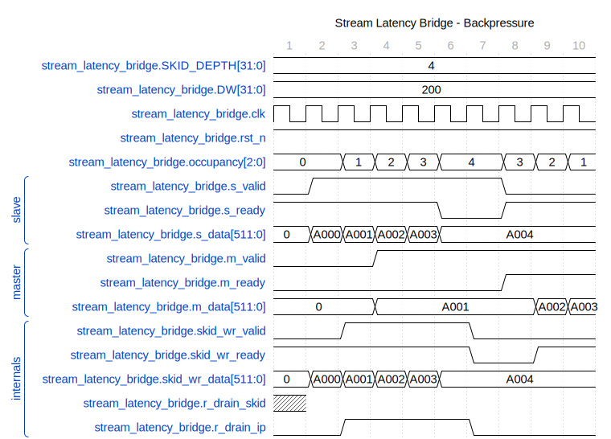

<!-- RTL Design Sherpa Documentation Header -->
<table>
<tr>
<td width="80">
  <a href="https://github.com/sean-galloway/RTLDesignSherpa">
    
  </a>
</td>
<td>
  <strong>RTL Design Sherpa</strong> · <em>Learning Hardware Design Through Practice</em><br>
  <sub>
    <a href="https://github.com/sean-galloway/RTLDesignSherpa">GitHub</a> ·
    <a href="https://github.com/sean-galloway/RTLDesignSherpa/blob/main/docs/DOCUMENTATION_INDEX.md">Documentation Index</a> ·
    <a href="https://github.com/sean-galloway/RTLDesignSherpa/blob/main/LICENSE">MIT License</a>
  </sub>
</td>
</tr>
</table>

---

<!-- End Header -->

# Stream Latency Bridge

**Module:** `stream_latency_bridge.sv`
**Location:** `projects/components/stream/rtl/fub/`
**Category:** FUB (Functional Unit Block)
**Parent:** `sram_controller_unit.sv`
**Status:** Implemented
**Last Updated:** 2025-11-30

---

## Overview

The `stream_latency_bridge` module is a simple latency-1 bridge that compensates for registered FIFO output latency. It uses glue logic plus a skid buffer to handle backpressure from downstream consumers.

### Key Features

- **1-Cycle Latency Compensation:** Bridges registered FIFO output to consumer
- **Skid Buffer Architecture:** 4-deep FIFO absorbs consumer backpressure
- **Full Throughput:** Maintains back-to-back transfers when consumer is ready
- **Simple Design:** No complex ready calculations - skid buffer handles it all
- **Occupancy Tracking:** Reports total beats held for flow control

---

## Architecture

### Block Diagram

### Figure 2.10.1: Stream Latency Bridge Block Diagram


**Source:** [06_stream_latency_bridge_block.mmd](../assets/mermaid/06_stream_latency_bridge_block.mmd)

### Operation Flow

```
Cycle 0: Drain FIFO (s_valid && skid_ready) � r_drain_ip = 1
Cycle 1: Data arrives from FIFO � Push to skid (skid_valid = r_drain_ip)
Cycle N: Consumer drains skid buffer at its own pace
```

### Component Diagram

```
                    +-------------------+
                    |   Glue Logic      |

: Component Diagram
   s_valid -------->|  (r_drain_ip)     |
   s_ready <--------|                   |
   s_data  -------->|                   |
                    +--------+----------+
                             |
                             v
                    +-------------------+
                    |   Skid Buffer     |
                    |  (gaxi_fifo_sync) |
                    |  Depth: 4         |

: Component Diagram
                    +--------+----------+
                             |
                             v
   m_valid <-----------------|
   m_ready ---------------->||
   m_data  <-----------------|
```

### Backpressure Logic

The bridge uses a conservative backpressure approach:
- Track stalled writes (wr_valid && !wr_ready)
- Calculate pending count = skid_count + stalled
- Allow accept when pending < SKID_DEPTH OR consumer is draining

```
Truth Table (SKID_DEPTH=4):
count | wr_valid | wr_ready | stalled | pending | room | s_ready
------|----------|----------|---------|---------|------|--------
0     | 0        | 1        | 0       | 0       | 1    | 1      � Empty
0     | 1        | 1        | 0       | 0       | 1    | 1      � Writing, completes
3     | 0        | 1        | 0       | 3       | 1    | 1      � Room for 1
3     | 1        | 1        | 0       | 3       | 1    | 1      � Writing, will be 4
3     | 1        | 0        | 1       | 4       | 0    | 0      � Write stalled
4     | 0        | 0        | 0       | 4       | 0    | 0      � Full
```

---

## Parameters

| Parameter | Type | Default | Description |
|-----------|------|---------|-------------|
| `DATA_WIDTH` | int | 64 | Data width in bits |
| `SKID_DEPTH` | int | 4 | Skid buffer depth (2-4 recommended) |

: Parameters

### Derived Parameters

| Parameter | Derivation | Description |
|-----------|------------|-------------|
| `DW` | DATA_WIDTH | Short alias |

: Derived Parameters

---

## Port List

### Clock and Reset

| Signal | Direction | Width | Description |
|--------|-----------|-------|-------------|
| `clk` | input | 1 | System clock |
| `rst_n` | input | 1 | Active-low asynchronous reset |

: Clock and Reset

### Upstream Interface (from registered FIFO)

| Signal | Direction | Width | Description |
|--------|-----------|-------|-------------|
| `s_valid` | input | 1 | Upstream valid (FIFO not empty) |
| `s_ready` | output | 1 | Ready to accept from FIFO |
| `s_data` | input | DW | Data from FIFO (valid 1 cycle after handshake) |

: Upstream Interface

### Downstream Interface (to consumer)

| Signal | Direction | Width | Description |
|--------|-----------|-------|-------------|
| `m_valid` | output | 1 | Data valid to consumer |
| `m_ready` | input | 1 | Consumer ready |
| `m_data` | output | DW | Data to consumer |

: Downstream Interface

### Status Interface

| Signal | Direction | Width | Description |
|--------|-----------|-------|-------------|
| `occupancy` | output | 3 | Beats in bridge (0-5: 1 in flight + 4 in skid) |

: Status Interface

### Debug Interface

| Signal | Direction | Width | Description |
|--------|-----------|-------|-------------|
| `dbg_r_pending` | output | 1 | Data in flight (r_drain_ip) |
| `dbg_r_out_valid` | output | 1 | Output valid (m_valid) |

: Debug Interface

---

## Operation

### Glue Logic

The glue logic consists of a single flop (`r_drain_ip`) that tracks when a FIFO drain is in progress:

```systemverilog
// Drain FIFO when upstream has data AND we can accept
wire w_drain_fifo = s_valid && s_ready;

// Flop the drain signal to track data in flight
always_ff @(posedge clk or negedge rst_n) begin
    if (!rst_n) begin
        r_drain_ip <= 1'b0;
    end else begin
        r_drain_ip <= w_drain_fifo;
    end
end

// When r_drain_ip asserted, data arrived from FIFO � push to skid
assign skid_wr_valid = r_drain_ip;
assign skid_wr_data = s_data;
```

### Skid Buffer

A 4-deep `gaxi_fifo_sync` instance with:
- Non-registered mode (REGISTERED=0) for minimum latency
- Auto memory style selection

### Occupancy Calculation

```systemverilog
// Total occupancy = data in skid buffer
// Note: r_drain_ip not counted separately (conservative)
assign occupancy = skid_count;
```

---

## Timing Diagrams

### Backpressure Handling

The following diagram shows how the latency bridge handles downstream backpressure:

#### Waveform 2.10.1: Stream Latency Bridge Backpressure



**Source:** [latency_bridge_backpressure.json](../assets/wavedrom/latency_bridge_backpressure.json)

---

## Integration Example

```systemverilog
stream_latency_bridge #(
    .DATA_WIDTH (512),
    .SKID_DEPTH (4)
) u_latency_bridge (
    .clk            (clk),
    .rst_n          (rst_n),

    // Slave (from FIFO)
    .s_data         (fifo_rd_data),
    .s_valid        (fifo_rd_valid),
    .s_ready        (fifo_rd_ready),

    // Master (to AXI Write Engine)
    .m_data         (axi_wr_sram_data),
    .m_valid        (axi_wr_sram_valid),
    .m_ready        (axi_wr_sram_ready),

    // Status
    .occupancy      (bridge_occupancy),

    // Debug
    .dbg_r_pending  (dbg_bridge_pending),
    .dbg_r_out_valid(dbg_bridge_out_valid)
);
```

---

## Design Rationale

### Why Use a Skid Buffer?

Previous designs attempted complex ready signal calculations to handle backpressure. This led to:
- Timing issues from deep combinatorial paths
- Edge cases with multi-cycle backpressure
- Difficult debugging of flow control bugs

The skid buffer approach:
- Simple glue logic (single flop)
- FIFO handles all backpressure complexity
- Proven, reusable component
- Easy to verify and debug

### Why 4-Deep?

- **2-deep:** Minimum for back-to-back (1 in flight + 1 buffered)
- **4-deep:** Allows 2-3 cycles of consumer stall without upstream backpressure
- **8-deep:** Overkill for most use cases

4-deep provides good balance between:
- Latency tolerance (handles brief stalls)
- Resource usage (small FIFO)
- Throughput (back-to-back capable)

---

## Related Documentation

- **Parent:** `09_sram_controller_unit.md` - Single-channel SRAM controller
- **Consumer:** `12_axi_write_engine.md` - Receives bridge output
- **Producer:** `06_axi_read_engine.md` - Feeds upstream FIFO
---

## Revision History

| Version | Date | Author | Description |
|---------|------|--------|-------------|
| 0.90 | 2025-11-22 | seang | Initial block specification |
| 0.91 | 2026-01-02 | seang | Added table captions and figure numbers |

: Stream Latency Bridge Revision History

---

**Last Updated:** 2026-01-02
