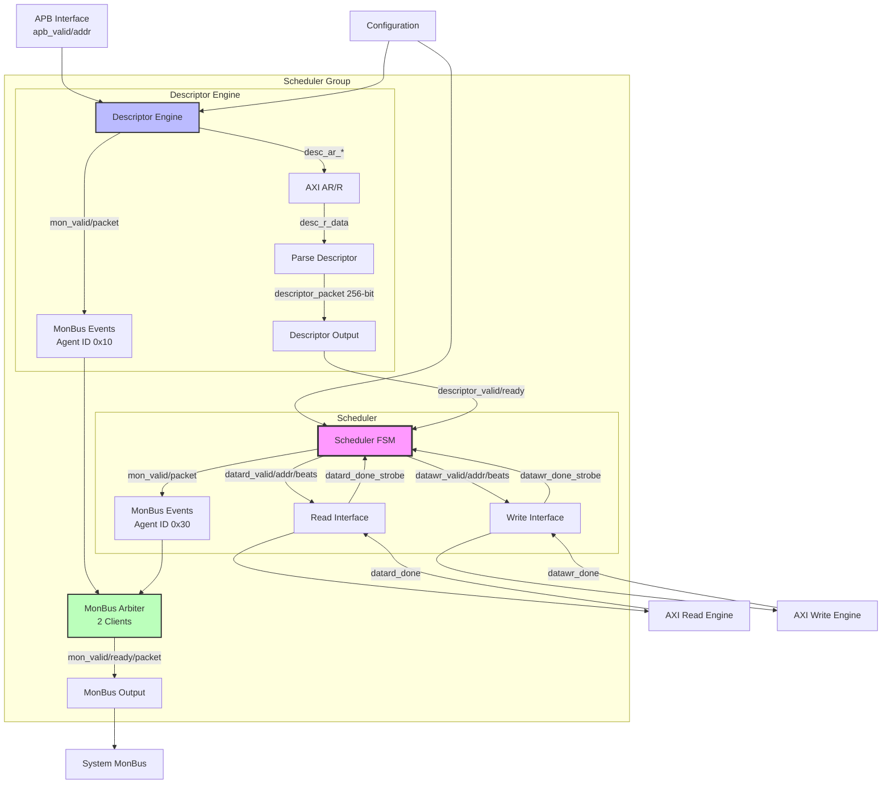

# Scheduler Group Specification

**Module:** `scheduler_group.sv`
**Location:** `projects/components/stream/rtl/macro/`
**Status:** Implemented

---

## Overview

The Scheduler Group is a wrapper module that combines the descriptor engine and scheduler for a single channel, providing a complete descriptor-driven DMA control path. It aggregates MonBus events from both components and presents a unified interface to the system.

### Key Features

- **Component Integration:** Combines descriptor_engine + scheduler into single unit
- **MonBus Aggregation:** Arbitrates MonBus events from 2 sources (descriptor engine, scheduler)
- **APB Kickoff:** Initial descriptor address programming via APB interface
- **Configuration Management:** Unified config interface for both components
- **Status Reporting:** Combined idle/state from both components

---

## Architecture

### Block Diagram


<!--
Original Mermaid diagram (for editing):


<!--
Original Mermaid diagram (for editing):


-->
-->

---

## Parameters

```systemverilog
parameter int CHANNEL_ID = 0;                    // Channel identifier
parameter int NUM_CHANNELS = 8;                  // Total channels in system
parameter int CHAN_WIDTH = $clog2(NUM_CHANNELS); // Channel ID width
parameter int ADDR_WIDTH = 64;                   // Address bus width
parameter int DATA_WIDTH = 512;                  // Data bus width (for scheduler)
parameter int AXI_ID_WIDTH = 8;                  // AXI ID width
parameter int TIMEOUT_CYCLES = 1000;             // Scheduler timeout threshold

// Monitor Bus Parameters - Base IDs for each component
parameter DESC_MON_AGENT_ID = 16;                // 0x10 - Descriptor Engine
parameter SCHED_MON_AGENT_ID = 48;               // 0x30 - Scheduler
parameter MON_UNIT_ID = 1;                       // 0x1
parameter MON_CHANNEL_ID = 0;                    // Base channel ID
```

**MonBus Agent ID Convention:**
- Descriptor Engine: 0x10 (16)
- Scheduler: 0x30 (48)
- Allows system to distinguish event sources

---

## Interface

### Clock and Reset

```systemverilog
input  logic                        clk;
input  logic                        rst_n;      // Active-low asynchronous reset
```

### APB Programming Interface

**Initial Descriptor Kickoff:**
```systemverilog
input  logic                        apb_valid;
output logic                        apb_ready;
input  logic [ADDR_WIDTH-1:0]       apb_addr;   // Initial descriptor address
```

**Protocol:**
1. Software writes descriptor address to channel-specific APB register
2. APB bridge asserts `apb_valid` with `apb_addr`
3. Descriptor engine captures address when `apb_ready` asserted
4. Descriptor engine begins fetching from `apb_addr`

### Configuration Interface

**Channel Control:**
```systemverilog
input  logic                        cfg_channel_enable;     // Enable channel
input  logic                        cfg_channel_reset;      // Soft reset channel
```

**Scheduler Configuration (Future Enhancement):**
```systemverilog
input  logic [15:0]                 cfg_sched_timeout_cycles;   // Timeout (not used yet)
input  logic                        cfg_sched_timeout_enable;   // Timeout enable (not used yet)
input  logic                        cfg_sched_err_enable;       // Error reporting (not used yet)
input  logic                        cfg_sched_compl_enable;     // Completion events (not used yet)
input  logic                        cfg_sched_perf_enable;      // Performance events (not used yet)
```

**Note:** Scheduler currently uses compile-time `TIMEOUT_CYCLES` parameter. Runtime config inputs are placeholders for future enhancement.

**Descriptor Engine Configuration:**
```systemverilog
input  logic                        cfg_desceng_prefetch;       // Enable prefetch
input  logic [3:0]                  cfg_desceng_fifo_thresh;    // FIFO threshold
input  logic [ADDR_WIDTH-1:0]       cfg_desceng_addr0_base;     // Address range 0 base
input  logic [ADDR_WIDTH-1:0]       cfg_desceng_addr0_limit;    // Address range 0 limit
input  logic [ADDR_WIDTH-1:0]       cfg_desceng_addr1_base;     // Address range 1 base
input  logic [ADDR_WIDTH-1:0]       cfg_desceng_addr1_limit;    // Address range 1 limit
```

### Status Interface

```systemverilog
output logic                        descriptor_engine_idle;     // Descriptor engine idle
output logic                        scheduler_idle;             // Scheduler idle
output logic [6:0]                  scheduler_state;            // Scheduler state (ONE-HOT)
```

**Combined Idle:**
- Channel fully idle when `descriptor_engine_idle && scheduler_idle`

### Descriptor Engine AXI4 Master Read Interface

**AR Channel:**
```systemverilog
output logic                        desc_ar_valid;
input  logic                        desc_ar_ready;
output logic [ADDR_WIDTH-1:0]       desc_ar_addr;
output logic [7:0]                  desc_ar_len;
output logic [2:0]                  desc_ar_size;
output logic [1:0]                  desc_ar_burst;
output logic [AXI_ID_WIDTH-1:0]     desc_ar_id;
output logic                        desc_ar_lock;
output logic [3:0]                  desc_ar_cache;
output logic [2:0]                  desc_ar_prot;
output logic [3:0]                  desc_ar_qos;
output logic [3:0]                  desc_ar_region;
```

**R Channel:**
```systemverilog
input  logic                        desc_r_valid;
output logic                        desc_r_ready;
input  logic [255:0]                desc_r_data;        // FIXED 256-bit descriptor width
input  logic [1:0]                  desc_r_resp;
input  logic                        desc_r_last;
input  logic [AXI_ID_WIDTH-1:0]     desc_r_id;
```

**Descriptor Width:**
- FIXED at 256 bits (STREAM descriptor format)
- No parameterization (unlike RAPIDS which supports variable descriptor widths)

### Data Read Interface (to AXI Read Engine)

```systemverilog
output logic                        datard_valid;               // Request read
input  logic                        datard_ready;               // Engine ready
output logic [ADDR_WIDTH-1:0]       datard_addr;                // Source address
output logic [31:0]                 datard_beats_remaining;     // Beats left
output logic [3:0]                  datard_channel_id;          // Channel ID
```

**Completion:**
```systemverilog
input  logic                        datard_done_strobe;         // Read burst done
input  logic [31:0]                 datard_beats_done;          // Beats completed
```

**Error:**
```systemverilog
input  logic                        datard_error;               // Read error
```

### Data Write Interface (to AXI Write Engine)

```systemverilog
output logic                        datawr_valid;               // Request write
input  logic                        datawr_ready;               // Engine ready
output logic [ADDR_WIDTH-1:0]       datawr_addr;                // Destination address
output logic [31:0]                 datawr_beats_remaining;     // Beats left
output logic [3:0]                  datawr_channel_id;          // Channel ID
```

**Completion:**
```systemverilog
input  logic                        datawr_done_strobe;         // Write burst done
input  logic [31:0]                 datawr_beats_done;          // Beats completed
```

**Error:**
```systemverilog
input  logic                        datawr_error;               // Write error
```

### Unified Monitor Bus Interface

```systemverilog
output logic                        mon_valid;
input  logic                        mon_ready;
output logic [63:0]                 mon_packet;
```

**Aggregation:**
- Combines events from descriptor_engine and scheduler
- 2-client round-robin arbiter with skid buffers
- Maintains event ordering within each component

---

## Internal Architecture

### Component Interconnect

**Descriptor Engine → Scheduler:**
```systemverilog
logic                        desceng_to_sched_valid;
logic                        desceng_to_sched_ready;
logic [255:0]                desceng_to_sched_packet;    // 256-bit descriptors
logic                        desceng_to_sched_error;
logic                        desceng_to_sched_eos;       // End of stream
logic                        desceng_to_sched_eol;       // End of list
logic                        desceng_to_sched_eod;       // End of descriptor
logic [1:0]                  desceng_to_sched_type;      // Descriptor type
```

**Scheduler → Descriptor Engine:**
```systemverilog
assign sched_channel_idle = scheduler_idle;
```

**Feedback Loop:**
- Scheduler idle signal tells descriptor engine when channel ready for next descriptor
- Critical for descriptor chaining

### MonBus Aggregation

**Per-Component MonBus Signals:**
```systemverilog
// Descriptor Engine MonBus
logic                        desceng_mon_valid;
logic                        desceng_mon_ready;
logic [63:0]                 desceng_mon_packet;

// Scheduler MonBus
logic                        sched_mon_valid;
logic                        sched_mon_ready;
logic [63:0]                 sched_mon_packet;
```

**Arbiter Instantiation:**
```systemverilog
monbus_arbiter #(
    .CLIENTS                (2),
    .INPUT_SKID_ENABLE      (1),
    .OUTPUT_SKID_ENABLE     (1),
    .INPUT_SKID_DEPTH       (2),
    .OUTPUT_SKID_DEPTH      (2)
) u_monbus_aggregator (
    .axi_aclk               (clk),
    .axi_aresetn            (rst_n),
    .block_arb              (1'b0),
    // Client inputs (2 sources)
    .monbus_valid_in        ('{desceng_mon_valid, sched_mon_valid}),
    .monbus_ready_in        ('{desceng_mon_ready, sched_mon_ready}),
    .monbus_packet_in       ('{desceng_mon_packet, sched_mon_packet}),
    // Aggregated output
    .monbus_valid           (mon_valid),
    .monbus_ready           (mon_ready),
    .monbus_packet          (mon_packet)
);
```

**Arbitration:**
- Round-robin between 2 clients
- Input skid buffers prevent backpressure to components
- Output skid buffer prevents stalls to system

---

## Operation Flows

### Initialization (APB Kickoff)

```
1. Software Setup:
   - Configure descriptor engine (address ranges, thresholds)
   - Configure scheduler (enable, timeout)
   - Write initial descriptor address to APB register

2. APB Transaction:
   apb_valid = 1
   apb_addr = 0x1000_0000  (initial descriptor)

3. Descriptor Engine:
   - Captures apb_addr
   - Begins fetching descriptor from 0x1000_0000
   - AXI AR transaction: desc_ar_addr = 0x1000_0000, desc_ar_len = 0 (1 beat = 256 bits)

4. Descriptor Arrives:
   desc_r_data = {src_addr, dst_addr, length, ...}
   desceng_to_sched_valid = 1
   desceng_to_sched_packet = desc_r_data

5. Scheduler:
   - Receives descriptor
   - Transitions IDLE → FETCH_DESC → XFER_DATA
   - Begins concurrent read/write operations
```

### Normal Transfer Flow

```
Descriptor Engine:
  [IDLE] → [FETCH] → [PARSE] → [DELIVER] → (chain?) → [IDLE]
          |          |         |
          AR issue   R data    Pass to scheduler
                               |
Scheduler:                     ↓
  [IDLE] → [FETCH_DESC] → [XFER_DATA] → [COMPLETE] → (chain?) → [IDLE]
                           |              |
                           Read/Write     Check next_ptr
                           concurrent
```

### Descriptor Chaining Flow

```
Transfer 0 Complete:
  Scheduler: [COMPLETE] → Check next_descriptor_ptr != 0 → [NEXT_DESC]
  Descriptor Engine: Receives scheduler_idle = 0 → Fetch next descriptor

Transfer 1 Start:
  Descriptor Engine: Fetch descriptor @ next_ptr → Deliver to scheduler
  Scheduler: [NEXT_DESC] → [FETCH_DESC] → [XFER_DATA] → ...
```

### MonBus Event Aggregation

```
Concurrent Events:
  Cycle N: Descriptor Engine: Fetch complete → desceng_mon_valid = 1
  Cycle N: Scheduler: State transition → sched_mon_valid = 1

Arbiter Behavior:
  Cycle N: Grant client 0 (descriptor engine)
           mon_valid = 1, mon_packet = desceng_mon_packet
  Cycle N+1: Grant client 1 (scheduler)
             mon_valid = 1, mon_packet = sched_mon_packet
```

---

## Configuration Details

### Descriptor Engine Configuration

**Address Range Checking:**
```systemverilog
cfg_desceng_addr0_base  = 0x1000_0000
cfg_desceng_addr0_limit = 0x1FFF_FFFF  // 256MB range 0

cfg_desceng_addr1_base  = 0x8000_0000
cfg_desceng_addr1_limit = 0x8FFF_FFFF  // 256MB range 1
```

**Purpose:**
- Validate descriptor addresses (prevent out-of-range fetches)
- Support multiple memory regions (DDR, SRAM, etc.)

**Prefetch:**
```systemverilog
cfg_desceng_prefetch = 1  // Enable prefetch of next descriptor
```

**FIFO Threshold:**
```systemverilog
cfg_desceng_fifo_thresh = 4  // Minimum entries before scheduling
```

### Scheduler Configuration (Future)

**Currently Unused (compile-time parameters):**
- `cfg_sched_timeout_cycles` → Use TIMEOUT_CYCLES parameter
- `cfg_sched_timeout_enable` → Always enabled
- `cfg_sched_err_enable` → Always enabled
- `cfg_sched_compl_enable` → Always enabled
- `cfg_sched_perf_enable` → Not implemented

**Future Enhancement:**
- Runtime timeout adjustment
- Selective MonBus event filtering
- Performance counter control

---

## Error Handling

### Error Sources

**Descriptor Engine Errors:**
- Invalid descriptor address (out of range)
- AXI read error (RRESP != OKAY)
- Descriptor fetch timeout

**Scheduler Errors:**
- Invalid descriptor (valid bit = 0)
- Read engine error (datard_error)
- Write engine error (datawr_error)
- Timeout (no progress for TIMEOUT_CYCLES)

### Error Propagation

```systemverilog
Descriptor Engine Error:
  desceng_to_sched_error = 1
  → Scheduler receives error
  → Scheduler transitions to CH_ERROR
  → MonBus error event generated

Scheduler Error:
  Scheduler transitions to CH_ERROR
  → MonBus error event generated
  → Channel stops operation
  → Requires cfg_channel_reset to recover
```

---

## MonBus Event Types

### Descriptor Engine Events

**Event Codes:**
- DESC_FETCH_START: Descriptor fetch initiated
- DESC_FETCH_COMPLETE: Descriptor fetched successfully
- DESC_PARSE_ERROR: Descriptor parsing error
- DESC_ADDR_ERROR: Address range violation

**Agent ID:** 0x10 (DESC_MON_AGENT_ID)

### Scheduler Events

**Event Codes:**
- SCHED_STATE_TRANSITION: FSM state change
- SCHED_IRQ: Interrupt generation (descriptor.gen_irq)
- SCHED_ERROR: Error condition
- SCHED_TIMEOUT: Timeout expired
- SCHED_COMPLETE: Transfer complete

**Agent ID:** 0x30 (SCHED_MON_AGENT_ID)

---

## Timing Characteristics

### Latency

**APB to First Descriptor Fetch:**
- APB handshake: 1 cycle
- Descriptor engine processing: 2-3 cycles
- AXI AR issue: 1 cycle
- Total: ~4-5 cycles

**Descriptor to Scheduler Delivery:**
- AXI R latency: Variable (memory dependent)
- Descriptor parsing: 1 cycle
- Scheduler handshake: 1 cycle
- Total: Memory latency + 2 cycles

### Throughput

**Descriptor Fetch Bandwidth:**
- 256 bits/descriptor
- Single outstanding fetch (non-pipelined)
- Limited by AXI read latency

**MonBus Bandwidth:**
- 2 events/cycle max (1 from each component)
- Arbiter serializes to 1 event/cycle output
- Skid buffers absorb bursts

---

## Testing

**Test Location:** `projects/components/stream/dv/tests/macro/scheduler_group/`

**Key Test Scenarios:**

1. **APB kickoff** - Initial descriptor programming
2. **Single descriptor** - Basic operation
3. **Descriptor chaining** - Multiple linked descriptors
4. **MonBus aggregation** - Concurrent events from both components
5. **Error handling** - Descriptor fetch errors, scheduler errors
6. **Channel reset** - Soft reset during operation
7. **Configuration** - Address range validation, prefetch enable

---

## Assertions

**Formal Verification Properties:**

```systemverilog
// MonBus connectivity
property monitor_bus_connected;
    (desceng_mon_valid || sched_mon_valid) |-> ##[1:10] mon_valid;
endproperty

// Component integration
property descriptor_scheduler_handshake;
    (desceng_to_sched_valid && desceng_to_sched_ready) |->
        ##[1:5] (scheduler_state != CH_IDLE);
endproperty

// Channel reset propagation
property channel_reset_propagation;
    cfg_channel_reset |-> ##[1:100] (descriptor_engine_idle && scheduler_idle);
endproperty
```

---

## Related Documentation

- **Descriptor Engine:** `03_descriptor_engine.md` - Descriptor fetch and parsing
- **Scheduler:** `02_scheduler.md` - DMA control logic
- **MonBus Arbiter:** AMBA monitor bus specification
- **Scheduler Group Array:** `12_scheduler_group_array.md` - Multi-channel integration

---

**Last Updated:** 2025-11-16
