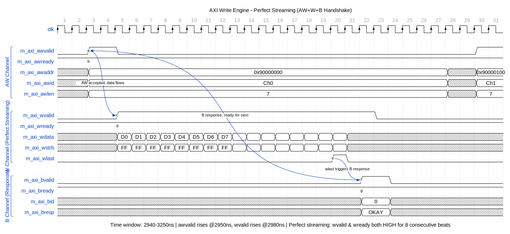

# AXI Write Engine

**Module:** `axi_write_engine.sv`
**Location:** `projects/components/stream/rtl/fub/`
**Category:** FUB (Functional Unit Block)
**Parent:** `stream_core.sv`
**Status:** Implemented
**Last Updated:** 2025-11-30

---

## Overview

The `axi_write_engine` module is a high-performance multi-channel AXI4 write engine with data-aware arbitration. It serves all 8 STREAM channels through a single AXI master interface with intelligent flow control.

### Key Features

- **Round-Robin Arbitration:** Fair scheduling across channels
- **Data-Aware Masking:** Only arbitrate channels with sufficient SRAM data
- **Pre-Drain Handshake:** Reserve SRAM data before AW command issues
- **FIFO-Based W Tracking:** Single shared FIFO for W-phase order preservation
- **Per-Channel B Tracking:** Separate FIFOs for out-of-order B responses
- **Channel ID in AXI ID:** Enables per-channel response routing
- **Pipelined/Non-Pipelined Modes:** Configurable outstanding transaction depth

---

## Architecture

### Block Diagram


**Source:** [10_axi_write_engine_block.mmd](../assets/mermaid/10_axi_write_engine_block.mmd)

### Operation Flow

```
1. Scheduler Interface: Each channel can request write bursts
2. Data Checking: Mask channels without sufficient SRAM data
3. Arbitration: Round-robin arbiter selects next channel to service
4. AXI AW Issue: Issue write command to AXI, assert wr_drain to reserve data
5. W-Phase FIFO: Push transaction to shared FIFO (preserves AW order)
6. AXI W Stream: Stream write data from SRAM controller (ID-based mux)
7. AXI B Response: Pop per-channel B-phase FIFO, complete transaction
```

### Key Design Decisions

**FIFO-Based W Tracking (No FSM):**
Instead of a state machine, uses a single shared FIFO to track pending W-phase transactions. This preserves the AW command order which is critical for W-phase correctness.

**Separate W and B Phase FIFOs:**
- **W-Phase FIFO:** Single shared FIFO (in-order with AW)
- **B-Phase FIFOs:** Per-channel FIFOs (out-of-order responses allowed by AXI4)

**ID-Based SRAM Interface:**
The write engine drives `axi_wr_sram_id` to select which channel's data to drain. The SRAM controller muxes the appropriate channel's data to `axi_wr_sram_data`.

---

## Parameters

| Parameter | Type | Default | Description |
|-----------|------|---------|-------------|
| `NUM_CHANNELS` | int | 8 | Number of channels |
| `ADDR_WIDTH` | int | 64 | AXI address width |
| `DATA_WIDTH` | int | 512 | AXI data width |
| `ID_WIDTH` | int | 8 | AXI ID width |
| `USER_WIDTH` | int | 8 | AXI USER width |
| `SEG_COUNT_WIDTH` | int | 8 | Width of space/count signals |
| `PIPELINE` | int | 0 | 0: non-pipelined, 1: pipelined |
| `AW_MAX_OUTSTANDING` | int | 8 | Maximum outstanding AW requests (PIPELINE=1) |
| `W_PHASE_FIFO_DEPTH` | int | 64 | W-phase transaction FIFO depth |
| `B_PHASE_FIFO_DEPTH` | int | 16 | B-phase transaction FIFO depth per channel |

### Derived Parameters

| Parameter | Derivation | Description |
|-----------|------------|-------------|
| `NC` | NUM_CHANNELS | Short alias |
| `AW` | ADDR_WIDTH | Short alias |
| `DW` | DATA_WIDTH | Short alias |
| `IW` | ID_WIDTH | Short alias |
| `UW` | USER_WIDTH | Short alias |
| `SCW` | SEG_COUNT_WIDTH | Segment count width |
| `CIW` | $clog2(NC) | Channel ID width (min 1 bit) |
| `AXSIZE` | $clog2(DW/8) | AXI burst size |

---

## Port List

### Clock and Reset

| Signal | Direction | Width | Description |
|--------|-----------|-------|-------------|
| `clk` | input | 1 | System clock |
| `rst_n` | input | 1 | Active-low asynchronous reset |

### Configuration Interface

| Signal | Direction | Width | Description |
|--------|-----------|-------|-------------|
| `cfg_axi_wr_xfer_beats` | input | 8 | Transfer size in beats (all channels) |

### Scheduler Interface (Per-Channel)

| Signal | Direction | Width | Description |
|--------|-----------|-------|-------------|
| `sched_wr_valid[ch]` | input | NC | Channel requests write |
| `sched_wr_ready[ch]` | output | NC | Engine ready (descriptor complete) |
| `sched_wr_addr[ch]` | input | NC x AW | Destination addresses |
| `sched_wr_beats[ch]` | input | NC x 32 | Beats remaining to write |
| `sched_wr_burst_len[ch]` | input | NC x 8 | Requested burst length |

### Completion Interface (Per-Channel)

| Signal | Direction | Width | Description |
|--------|-----------|-------|-------------|
| `sched_wr_done_strobe[ch]` | output | NC | Burst completed (1 cycle pulse) |
| `sched_wr_beats_done[ch]` | output | NC x 32 | Number of beats completed |

### SRAM Drain Interface

| Signal | Direction | Width | Description |
|--------|-----------|-------|-------------|
| `axi_wr_drain_req[ch]` | output | NC | Request to reserve data |
| `axi_wr_drain_size[ch]` | output | NC x 8 | Beats to reserve |
| `axi_wr_drain_data_avail[ch]` | input | NC x SCW | Data available per channel |

### SRAM Read Interface

| Signal | Direction | Width | Description |
|--------|-----------|-------|-------------|
| `axi_wr_sram_valid[ch]` | input | NC | Per-channel valid |
| `axi_wr_sram_drain` | output | 1 | Drain request |
| `axi_wr_sram_id` | output | CIW | Channel ID select |
| `axi_wr_sram_data` | input | DW | Muxed data from selected channel |

### AXI4 AW Channel

| Signal | Direction | Width | Description |
|--------|-----------|-------|-------------|
| `m_axi_awvalid` | output | 1 | Address valid |
| `m_axi_awready` | input | 1 | Address ready |
| `m_axi_awid` | output | IW | Transaction ID |
| `m_axi_awaddr` | output | AW | Address |
| `m_axi_awlen` | output | 8 | Burst length - 1 |
| `m_axi_awsize` | output | 3 | Burst size (log2 bytes) |
| `m_axi_awburst` | output | 2 | Burst type (INCR) |

### AXI4 W Channel

| Signal | Direction | Width | Description |
|--------|-----------|-------|-------------|
| `m_axi_wvalid` | output | 1 | Write data valid |
| `m_axi_wready` | input | 1 | Write data ready |
| `m_axi_wdata` | output | DW | Write data |
| `m_axi_wstrb` | output | DW/8 | Write strobes |
| `m_axi_wlast` | output | 1 | Last beat of burst |
| `m_axi_wuser` | output | UW | Channel ID for tracking |

### AXI4 B Channel

| Signal | Direction | Width | Description |
|--------|-----------|-------|-------------|
| `m_axi_bvalid` | input | 1 | Response valid |
| `m_axi_bready` | output | 1 | Response ready |
| `m_axi_bid` | input | IW | Transaction ID |
| `m_axi_bresp` | input | 2 | Response |

### Error Interface

| Signal | Direction | Width | Description |
|--------|-----------|-------|-------------|
| `sched_wr_error[ch]` | output | NC | Sticky error flag per channel |

### Debug Interface

| Signal | Direction | Width | Description |
|--------|-----------|-------|-------------|
| `dbg_wr_all_complete[ch]` | output | NC | All writes complete |
| `dbg_aw_transactions` | output | 32 | Total AW transactions issued |
| `dbg_w_beats` | output | 32 | Total W beats written to AXI |

---

## Operation

### Data-Aware Request Masking

```systemverilog
// Only request arbitration if:
// 1. Scheduler is requesting (sched_wr_valid)
// 2. Sufficient SRAM data available (w_data_ok)
// 3. Below outstanding limit (w_no_outstanding)
w_arb_request[i] = sched_wr_valid[i] && w_data_ok[i] && w_no_outstanding[i];

// Data check includes final burst handling
w_data_ok[i] = w_has_data[i] || w_final_burst[i];
```

### W-Phase Transaction FIFO

Single shared FIFO preserves AW command order:

```systemverilog
typedef struct packed {
    logic [7:0]    beats;       // Number of beats for this W transaction
    logic [CIW-1:0] channel_id;  // Channel ID for this transaction
} w_phase_txn_t;

// Push on AW handshake (preserves order)
if (m_axi_awvalid && m_axi_awready) begin
    w_phase_txn_fifo_wr = 1'b1;
    w_phase_txn_fifo_din.beats = m_axi_awlen + 8'd1;
    w_phase_txn_fifo_din.channel_id = r_aw_channel_id;
end
```

### B-Phase Transaction FIFOs

Per-channel FIFOs track beats and last flag for completion:

```systemverilog
typedef struct packed {
    logic [7:0]  beats;     // Number of beats in this transaction
    logic        last;      // Is this the last transfer for descriptor?
} b_phase_txn_t;

// last flag determines when sched_wr_ready asserts
if (m_axi_bvalid && m_axi_bready) begin
    if (b_phase_txn_fifo_dout[ch_id].last) begin
        r_sched_ready[ch_id] <= 1'b1;
    end
end
```

### Outstanding Transaction Tracking

**PIPELINE=0 (Non-Pipelined):**
- Boolean flag per channel (0 or 1 outstanding)
- Set when AW issues, clear when B arrives

**PIPELINE=1 (Pipelined):**
- Counter per channel (0 to AW_MAX_OUTSTANDING)
- Increment on AW, decrement on B

---

## Timing Diagrams

### Perfect Streaming - AXI Write Transaction

The following timing diagram shows the AXI write engine operating at maximum throughput with **perfect streaming** - where both `wvalid` and `wready` remain HIGH for consecutive clock cycles, achieving one data beat per cycle.



**Transaction Flow:**

1. **AW Channel Handshake (Address Phase)**
   - `m_axi_awvalid` rises to initiate a write request
   - `m_axi_awready` is already HIGH (slave ready)
   - Address (`awaddr`), ID (`awid`), and length (`awlen=7` for 8 beats) are captured
   - Handshake completes in a single cycle when both valid and ready are HIGH
   - Simultaneously, `axi_wr_drain_req` reserves data from SRAM controller

2. **W Channel Streaming (Data Phase)**
   - After AW acceptance, the engine begins streaming data from SRAM
   - `m_axi_wvalid` rises and **stays HIGH** for all 8 beats
   - `m_axi_wready` remains HIGH throughout (no backpressure from AXI slave)
   - **Perfect streaming**: One data beat transferred every clock cycle
   - `m_axi_wlast` rises on the final beat (beat 7) to mark burst completion
   - `wstrb` is all-ones (0xFF) indicating full data width valid

3. **B Channel Response (Completion Phase)**
   - After `wlast`, the AXI slave returns a write response
   - `m_axi_bvalid` rises with `bid` matching the transaction ID
   - `m_axi_bready` is HIGH (engine always ready for responses)
   - `bresp=OKAY` indicates successful write
   - Response triggers `sched_wr_done_strobe` to notify scheduler

4. **Next Transaction**
   - After B response, the engine can immediately issue the next AW request
   - The cycle repeats for the next channel or next burst

**Key Performance Indicators:**
- **No bubbles**: `wvalid` and `wready` both HIGH during data phase
- **Full bandwidth**: Data width (256/512 bits) x clock frequency
- **Zero-wait states**: SRAM controller provides data at line rate
- **Minimal latency**: B response arrives shortly after `wlast`

### Multi-Channel Streaming

For multi-channel operation showing channel switching while maintaining streaming performance, see:


This diagram shows how the engine arbitrates between channels while maintaining high throughput. Note how:
- Different channel IDs (`awid`) appear in sequence
- W-phase FIFO preserves AW order for correct data association
- B responses can arrive out-of-order (per AXI4 spec)

---

## Integration Example

```systemverilog
axi_write_engine #(
    .NUM_CHANNELS       (8),
    .ADDR_WIDTH         (64),
    .DATA_WIDTH         (512),
    .ID_WIDTH           (8),
    .SEG_COUNT_WIDTH    (10),
    .PIPELINE           (0),
    .AW_MAX_OUTSTANDING (8),
    .W_PHASE_FIFO_DEPTH (64),
    .B_PHASE_FIFO_DEPTH (16)
) u_axi_write_engine (
    .clk                    (clk),
    .rst_n                  (rst_n),

    // Configuration
    .cfg_axi_wr_xfer_beats  (cfg_axi_wr_xfer_beats),

    // Scheduler interface
    .sched_wr_valid         (sched_wr_valid),
    .sched_wr_ready         (sched_wr_ready),
    .sched_wr_addr          (sched_wr_addr),
    .sched_wr_beats         (sched_wr_beats),
    .sched_wr_burst_len     (sched_wr_burst_len),

    // Completion interface
    .sched_wr_done_strobe   (sched_wr_done_strobe),
    .sched_wr_beats_done    (sched_wr_beats_done),

    // SRAM drain interface
    .axi_wr_drain_req       (axi_wr_drain_req),
    .axi_wr_drain_size      (axi_wr_drain_size),
    .axi_wr_drain_data_avail(axi_wr_drain_data_avail),

    // SRAM read interface
    .axi_wr_sram_valid      (axi_wr_sram_valid),
    .axi_wr_sram_drain      (axi_wr_sram_drain),
    .axi_wr_sram_id         (axi_wr_sram_id),
    .axi_wr_sram_data       (axi_wr_sram_data),

    // AXI master
    .m_axi_awvalid          (m_axi_wr_awvalid),
    .m_axi_awready          (m_axi_wr_awready),
    .m_axi_awid             (m_axi_wr_awid),
    .m_axi_awaddr           (m_axi_wr_awaddr),
    .m_axi_awlen            (m_axi_wr_awlen),
    .m_axi_awsize           (m_axi_wr_awsize),
    .m_axi_awburst          (m_axi_wr_awburst),

    .m_axi_wvalid           (m_axi_wr_wvalid),
    .m_axi_wready           (m_axi_wr_wready),
    .m_axi_wdata            (m_axi_wr_wdata),
    .m_axi_wstrb            (m_axi_wr_wstrb),
    .m_axi_wlast            (m_axi_wr_wlast),
    .m_axi_wuser            (m_axi_wr_wuser),

    .m_axi_bvalid           (m_axi_wr_bvalid),
    .m_axi_bready           (m_axi_wr_bready),
    .m_axi_bid              (m_axi_wr_bid),
    .m_axi_bresp            (m_axi_wr_bresp),

    // Error and debug
    .sched_wr_error         (sched_wr_error),
    .dbg_wr_all_complete    (dbg_wr_all_complete),
    .dbg_aw_transactions    (dbg_aw_transactions),
    .dbg_w_beats            (dbg_w_beats)
);
```

---

## Related Documentation

- **Parent:** `01_stream_core.md` - Top-level integration
- **Scheduler Array:** `02_scheduler_group_array.md` - Provides sched_wr_* signals
- **SRAM Controller:** `08_sram_controller.md` - Data source
- **Drain Controller:** `11_stream_drain_ctrl.md` - Data availability tracking
- **Read Engine:** `06_axi_read_engine.md` - Complementary read datapath

---

**Last Updated:** 2025-12-13 (added timing diagrams)
