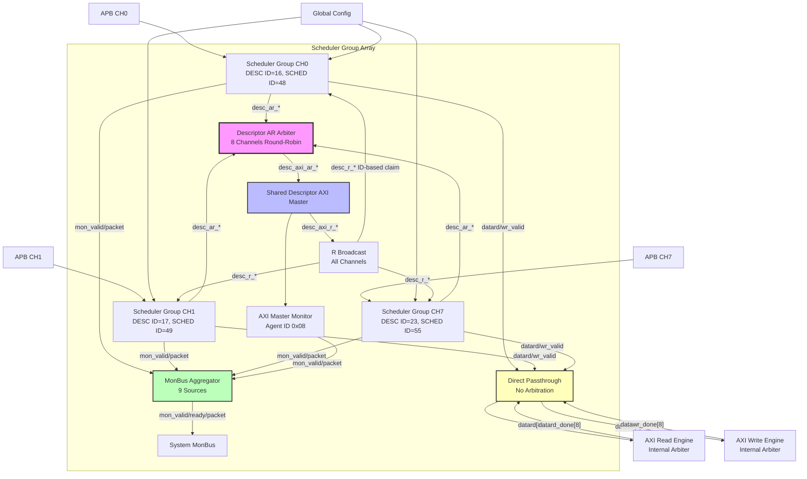

# Scheduler Group Array Specification

**Module:** `scheduler_group_array.sv`
**Location:** `projects/components/stream/rtl/macro/`
**Status:** Implemented

---

## Overview

The Scheduler Group Array is the top-level multi-channel DMA control structure, instantiating 8 independent scheduler_group instances with shared resource management. It provides descriptor fetch arbitration and unified MonBus aggregation.

### Key Features

- **8 Independent Channels:** Each with descriptor engine + scheduler
- **Shared Descriptor AXI Master:** Round-robin AR arbitration across channels
- **AXI Master Monitor:** Monitors descriptor fetch transactions for debug/performance
- **Direct Data Paths:** Read/write interfaces pass through (engines arbitrate, not array)
- **9-Source MonBus Aggregation:** 8 channels + descriptor AXI monitor
- **Global Configuration:** Common config distributed to all channels

---

## Architecture

### Block Diagram


<!--
Original Mermaid diagram (for editing):


<!--
Original Mermaid diagram (for editing):


-->
-->

---

## Parameters

```systemverilog
parameter int NUM_CHANNELS = 8;                  // Number of channels (fixed at 8)
parameter int CHAN_WIDTH = $clog2(NUM_CHANNELS); // Channel ID width (3 bits)
parameter int ADDR_WIDTH = 64;                   // Address bus width
parameter int DATA_WIDTH = 512;                  // Data bus width
parameter int AXI_ID_WIDTH = 8;                  // AXI ID width
parameter int TIMEOUT_CYCLES = 1000;             // Scheduler timeout threshold

// Monitor Bus Base IDs
parameter DESC_MON_BASE_AGENT_ID = 16;           // 0x10 - Descriptor Engines (16-23)
parameter SCHED_MON_BASE_AGENT_ID = 48;          // 0x30 - Schedulers (48-55)
parameter DESC_AXI_MON_AGENT_ID = 8;             // 0x08 - Descriptor AXI Master Monitor
parameter MON_UNIT_ID = 1;                       // 0x1
```

**MonBus Agent ID Mapping:**
```
Channel 0: Descriptor Engine = 16 (0x10), Scheduler = 48 (0x30)
Channel 1: Descriptor Engine = 17 (0x11), Scheduler = 49 (0x31)
...
Channel 7: Descriptor Engine = 23 (0x17), Scheduler = 55 (0x37)
Desc AXI Monitor: 8 (0x08)
```

---

## Interface

### Clock and Reset

```systemverilog
input  logic                        clk;
input  logic                        rst_n;      // Active-low asynchronous reset
```

### APB Programming Interface (Per-Channel)

**Descriptor Kickoff:**
```systemverilog
input  logic [NUM_CHANNELS-1:0]                 apb_valid;
output logic [NUM_CHANNELS-1:0]                 apb_ready;
input  logic [NUM_CHANNELS-1:0][ADDR_WIDTH-1:0] apb_addr;   // Initial descriptor addresses
```

**Per-Channel Independent:**
- Each channel has separate APB interface
- Software writes descriptor address for channel N
- Channel N descriptor engine begins fetching

### Configuration Interface

**Per-Channel Control:**
```systemverilog
input  logic [NUM_CHANNELS-1:0]              cfg_channel_enable;     // Per-channel enable
input  logic [NUM_CHANNELS-1:0]              cfg_channel_reset;      // Per-channel soft reset
```

**Global Scheduler Configuration:**
```systemverilog
input  logic                                 cfg_sched_enable;          // Master enable
input  logic [15:0]                          cfg_sched_timeout_cycles;  // Timeout (future)
input  logic                                 cfg_sched_timeout_enable;  // Timeout enable (future)
input  logic                                 cfg_sched_err_enable;      // Error reporting (future)
input  logic                                 cfg_sched_compl_enable;    // Completion events (future)
input  logic                                 cfg_sched_perf_enable;     // Performance events (future)
```

**Global Descriptor Engine Configuration:**
```systemverilog
input  logic                                 cfg_desceng_enable;        // Master enable
input  logic                                 cfg_desceng_prefetch;      // Enable prefetch
input  logic [3:0]                           cfg_desceng_fifo_thresh;   // FIFO threshold
input  logic [ADDR_WIDTH-1:0]                cfg_desceng_addr0_base;    // Address range 0 base
input  logic [ADDR_WIDTH-1:0]                cfg_desceng_addr0_limit;   // Address range 0 limit
input  logic [ADDR_WIDTH-1:0]                cfg_desceng_addr1_base;    // Address range 1 base
input  logic [ADDR_WIDTH-1:0]                cfg_desceng_addr1_limit;   // Address range 1 limit
```

**Descriptor AXI Monitor Configuration:**
```systemverilog
input  logic                                 cfg_daxmon_err_enable;     // Enable error detection
input  logic                                 cfg_daxmon_compl_enable;   // Enable completion packets
input  logic                                 cfg_daxmon_timeout_enable; // Enable timeout detection
input  logic                                 cfg_daxmon_perf_enable;    // Enable performance packets
input  logic                                 cfg_daxmon_debug_enable;   // Enable debug packets
```

**Global vs. Per-Channel:**
- cfg_channel_enable/reset: **Per-channel** (independent control)
- cfg_sched_*, cfg_desceng_*: **Global** (broadcast to all channels)
- cfg_daxmon_*: **Global** (single monitor instance)

### Status Interface

**Per-Channel Status:**
```systemverilog
output logic [NUM_CHANNELS-1:0]              descriptor_engine_idle;
output logic [NUM_CHANNELS-1:0]              scheduler_idle;
output logic [NUM_CHANNELS-1:0][6:0]         scheduler_state;  // ONE-HOT encoding
```

**Descriptor AXI Monitor Status:**
```systemverilog
output logic                                 desc_axi_mon_busy;
output logic [7:0]                           desc_axi_mon_active_txns;
output logic [15:0]                          desc_axi_mon_error_count;
output logic [31:0]                          desc_axi_mon_txn_count;
output logic                                 desc_axi_mon_conflict_error;
```

### Shared Descriptor AXI4 Master Read Interface

**AR Channel (Arbitrated Output):**
```systemverilog
output logic                        desc_axi_arvalid;
input  logic                        desc_axi_arready;
output logic [ADDR_WIDTH-1:0]       desc_axi_araddr;
output logic [7:0]                  desc_axi_arlen;
output logic [2:0]                  desc_axi_arsize;
output logic [1:0]                  desc_axi_arburst;
output logic [AXI_ID_WIDTH-1:0]     desc_axi_arid;
output logic                        desc_axi_arlock;
output logic [3:0]                  desc_axi_arcache;
output logic [2:0]                  desc_axi_arprot;
output logic [3:0]                  desc_axi_arqos;
output logic [3:0]                  desc_axi_arregion;
```

**R Channel (Broadcast to All Channels):**
```systemverilog
input  logic                        desc_axi_rvalid;
output logic                        desc_axi_rready;
input  logic [255:0]                desc_axi_rdata;        // FIXED 256-bit descriptor
input  logic [1:0]                  desc_axi_rresp;
input  logic                        desc_axi_rlast;
input  logic [AXI_ID_WIDTH-1:0]     desc_axi_rid;
```

**Arbitration:**
- AR channel: Round-robin arbiter selects one channel at a time
- R channel: Broadcast to all channels, each checks RID to claim data

### Shared Data Read Interface (to AXI Read Engine)

**Per-Channel Arrays (Direct Passthrough):**
```systemverilog
output logic [NUM_CHANNELS-1:0]                     datard_valid;
input  logic [NUM_CHANNELS-1:0]                     datard_ready;
output logic [NUM_CHANNELS-1:0][ADDR_WIDTH-1:0]     datard_addr;
output logic [NUM_CHANNELS-1:0][31:0]               datard_beats_remaining;
```

**NO ARBITRATION:**
- All 8 channels connect directly to read engine
- Read engine performs arbitration internally

### Shared Data Write Interface (to AXI Write Engine)

**Per-Channel Arrays (Direct Passthrough):**
```systemverilog
output logic [NUM_CHANNELS-1:0]                     datawr_valid;
input  logic [NUM_CHANNELS-1:0]                     datawr_ready;
output logic [NUM_CHANNELS-1:0][ADDR_WIDTH-1:0]     datawr_addr;
output logic [NUM_CHANNELS-1:0][31:0]               datawr_beats_remaining;
```

**NO ARBITRATION:**
- All 8 channels connect directly to write engine
- Write engine performs arbitration internally

### Data Path Completion Strobes

**Per-Channel Feedback (Direct Passthrough):**
```systemverilog
input  logic [NUM_CHANNELS-1:0]                     datard_done_strobe;
input  logic [NUM_CHANNELS-1:0][31:0]               datard_beats_done;
input  logic [NUM_CHANNELS-1:0]                     datawr_done_strobe;
input  logic [NUM_CHANNELS-1:0][31:0]               datawr_beats_done;
```

### Error Signals

**Per-Channel Errors (Direct Passthrough):**
```systemverilog
input  logic [NUM_CHANNELS-1:0]                     datard_error;
input  logic [NUM_CHANNELS-1:0]                     datawr_error;
```

### Unified Monitor Bus Interface

```systemverilog
output logic                        mon_valid;
input  logic                        mon_ready;
output logic [63:0]                 mon_packet;
```

**Aggregation:**
- 9 sources: 8 × scheduler_group + 1 × desc_axi_monitor
- Round-robin arbitration
- Input skid buffers (depth 2)
- Output skid buffer (depth 2)

---

## Internal Architecture

### Scheduler Group Instantiation

**8 Independent Instances:**
```systemverilog
generate
    for (genvar ch = 0; ch < NUM_CHANNELS; ch++) begin : gen_scheduler_groups
        scheduler_group #(
            .CHANNEL_ID             (ch),
            .NUM_CHANNELS           (NUM_CHANNELS),
            .DESC_MON_AGENT_ID      (8'(DESC_MON_BASE_AGENT_ID + ch)),  // 16-23
            .SCHED_MON_AGENT_ID     (8'(SCHED_MON_BASE_AGENT_ID + ch)), // 48-55
            .MON_CHANNEL_ID         (6'(ch))
        ) u_scheduler_group (
            // ... per-channel connections ...
        );
    end
endgenerate
```

**Per-Channel Unique:**
- CHANNEL_ID: 0-7
- DESC_MON_AGENT_ID: 16-23 (BASE + ch)
- SCHED_MON_AGENT_ID: 48-55 (BASE + ch)
- MON_CHANNEL_ID: 0-7

### Descriptor AXI AR Arbitration

**Round-Robin Arbiter:**
```systemverilog
arbiter_round_robin #(
    .CLIENTS      (NUM_CHANNELS),
    .WAIT_GNT_ACK (1)              // Wait for AR handshake
) u_desc_ar_arbiter (
    .request      (desc_ar_valid),                    // 8 channels requesting
    .grant_ack    (desc_ar_grant_ack),                // Ack when AR accepted
    .grant_valid  (desc_ar_grant_valid),
    .grant        (desc_ar_grant),                    // One-hot grant
    .grant_id     (desc_ar_grant_id)                  // Binary grant ID
);
```

**AR Mux:**
```systemverilog
// Select AR signals from granted channel
assign desc_axi_int_araddr = desc_ar_addr[desc_ar_grant_id];
assign desc_axi_int_arlen  = desc_ar_len[desc_ar_grant_id];
// ... other AR signals ...
```

**AR Ready Demux:**
```systemverilog
// Broadcast ready to all channels (only granted channel uses it)
for (genvar ch = 0; ch < NUM_CHANNELS; ch++) begin
    assign desc_ar_ready[ch] = (desc_ar_grant[ch] && desc_axi_int_arready);
end
```

### Descriptor AXI R Broadcast

**R Valid Broadcast:**
```systemverilog
// All channels see R valid
assign desc_r_valid = {NUM_CHANNELS{desc_axi_int_rvalid}};
```

**R Data Broadcast:**
```systemverilog
// All channels see same R data
for (genvar ch = 0; ch < NUM_CHANNELS; ch++) begin
    assign desc_r_data[ch] = desc_axi_int_rdata;
    assign desc_r_id[ch]   = desc_axi_int_rid;
    assign desc_r_last[ch] = desc_axi_int_rlast;
    assign desc_r_resp[ch] = desc_axi_int_rresp;
end
```

**R Ready OR:**
```systemverilog
// R ready if ANY channel ready (each checks RID to claim)
assign desc_axi_int_rready = |desc_r_ready;
```

**ID-Based Claiming:**
- Each descriptor engine checks `desc_r_id` against expected ID
- Only matching channel asserts `desc_r_ready`
- Allows out-of-order responses (different channels)

### AXI Master Read Monitor

**Monitor Insertion:**
```systemverilog
axi4_master_read_monitor #(
    .ADDR_WIDTH(ADDR_WIDTH),
    .DATA_WIDTH(256),              // FIXED for descriptor width
    .ID_WIDTH(AXI_ID_WIDTH)
) u_desc_axi_monitor (
    // AR channel (tap)
    .m_axi_araddr   (desc_axi_int_araddr),
    .m_axi_arvalid  (desc_axi_int_arvalid),
    .m_axi_arready  (desc_axi_int_arready),
    // ... other AR signals ...

    // R channel (tap)
    .m_axi_rdata    (desc_axi_int_rdata),
    .m_axi_rvalid   (desc_axi_int_rvalid),
    .m_axi_rready   (desc_axi_int_rready),
    // ... other R signals ...

    // MonBus output
    .mon_valid      (desc_axi_mon_valid),
    .mon_ready      (desc_axi_mon_ready),
    .mon_packet     (desc_axi_mon_packet),

    // Status outputs
    .busy           (desc_axi_mon_busy),
    .active_txns    (desc_axi_mon_active_txns),
    .error_count    (desc_axi_mon_error_count),
    .txn_count      (desc_axi_mon_txn_count)
);
```

**Pass-Through:**
- Monitor does NOT modify AXI signals
- Observes transactions and generates MonBus events
- Provides visibility into descriptor fetch performance

### MonBus Aggregation

**9-Source Arbiter:**
```systemverilog
localparam int MONBUS_SOURCES = NUM_CHANNELS + 1;  // 8 channels + 1 monitor

monbus_arbiter #(
    .CLIENTS                (MONBUS_SOURCES),      // 9 sources
    .INPUT_SKID_ENABLE      (1),
    .OUTPUT_SKID_ENABLE     (1),
    .INPUT_SKID_DEPTH       (2),
    .OUTPUT_SKID_DEPTH      (2)
) u_monbus_aggregator (
    .monbus_valid_in        (monbus_valid_all),    // [9] array
    .monbus_ready_in        (monbus_ready_all),
    .monbus_packet_in       (monbus_packet_all),
    .monbus_valid           (mon_valid),
    .monbus_ready           (mon_ready),
    .monbus_packet          (mon_packet)
);
```

**Source Mapping:**
```systemverilog
// Channels 0-7
for (genvar ch = 0; ch < NUM_CHANNELS; ch++) begin
    assign monbus_valid_all[ch]  = mon_valid_ch[ch];
    assign monbus_packet_all[ch] = mon_packet_ch[ch];
    assign mon_ready_ch[ch]      = monbus_ready_all[ch];
end

// Descriptor AXI monitor (source 8)
assign monbus_valid_all[NUM_CHANNELS]  = desc_axi_mon_valid;
assign monbus_packet_all[NUM_CHANNELS] = desc_axi_mon_packet;
assign desc_axi_mon_ready              = monbus_ready_all[NUM_CHANNELS];
```

---

## Operation Flows

### Multi-Channel Concurrent Operation

**Scenario:** Channels 0, 2, 5 active simultaneously

**Descriptor Fetch:**
```
Cycle N:   CH0 requests AR (desc_ar_valid[0] = 1)
           CH2 requests AR (desc_ar_valid[2] = 1)
           Arbiter grants CH0 → desc_axi_arvalid = 1, araddr = ch0_addr

Cycle N+1: AR accepted → CH0 waits for R data
           Arbiter grants CH2 → desc_axi_arvalid = 1, araddr = ch2_addr

Cycle N+5: R data arrives, RID = 0 → CH0 claims (desc_r_ready[0] = 1)

Cycle N+7: R data arrives, RID = 2 → CH2 claims (desc_r_ready[2] = 1)
```

**Data Transfers (Concurrent):**
```
All 3 channels:
  - datard_valid[0,2,5] = 1 (requesting read engine)
  - datawr_valid[0,2,5] = 1 (requesting write engine)
  - Read engine arbitrates AR channel
  - Write engine arbitrates AW channel
  - SRAM controller isolates channel data (per-channel FIFOs)
```

### MonBus Event Aggregation (9 Sources)

**Concurrent Events:**
```
Cycle N:
  CH0 descriptor engine: Fetch complete → mon_valid_ch[0] = 1
  CH2 scheduler: State transition → mon_valid_ch[2] = 1
  Desc AXI monitor: Transaction complete → desc_axi_mon_valid = 1

MonBus Arbiter:
  Cycle N:   Grant source 0 (CH0 desc eng) → mon_packet = CH0 event
  Cycle N+1: Grant source 2 (CH2 sched)    → mon_packet = CH2 event
  Cycle N+2: Grant source 8 (AXI mon)      → mon_packet = AXI event
```

---

## Resource Sharing

### Shared: Descriptor AXI Master

**Why Shared:**
- Descriptor fetch bandwidth: ~256 bits per descriptor
- Infrequent access (once per descriptor, not per beat)
- Total bandwidth << 1% of AXI bus capacity
- 8 separate AXI masters wasteful

**Arbitration:**
- Round-robin ensures fairness
- ACK mode prevents head-of-line blocking
- Out-of-order R responses (ID-based claiming)

### NOT Shared: Data Read/Write

**Why NOT Shared (Direct Passthrough):**
- Data path bandwidth: Continuous streaming (many GB/s)
- Need concurrent operation (all channels transferring simultaneously)
- Engines perform internal arbitration:
  - Read engine: Round-robin AR arbiter
  - Write engine: Round-robin AW arbiter
- Array just passes through (no arbitration overhead)

**Benefit:**
- Scheduler_group_array remains simple
- Arbitration complexity in engines (where it belongs)
- Engines can optimize (space-aware, pipeline-aware)

---

## Configuration Management

### Global Configuration Distribution

**Single Config → All Channels:**
```systemverilog
// All scheduler_groups receive same global config
for (genvar ch = 0; ch < NUM_CHANNELS; ch++) begin
    u_scheduler_group[ch].cfg_desceng_prefetch = cfg_desceng_prefetch;
    u_scheduler_group[ch].cfg_desceng_addr0_base = cfg_desceng_addr0_base;
    // ... all other cfg_desceng_*, cfg_sched_* ...
end
```

**Per-Channel Override:**
- cfg_channel_enable[ch]: Enable/disable individual channels
- cfg_channel_reset[ch]: Reset individual channels

**Rationale:**
- Global config simplifies software (single write configures all)
- Per-channel enable allows selective activation
- Per-channel reset allows fault isolation

---

## Timing Considerations

### AR Arbitration Latency

**Path:**
```
Channel AR request → Arbiter → AR mux → AXI master
```

**Latency:** 1 cycle (combinational arbiter + registered mux)

### R Broadcast Latency

**Path:**
```
AXI R data → Broadcast → All channels → ID match → Claim
```

**Latency:** 1 cycle (combinational broadcast + ID compare)

### MonBus Aggregation Latency

**Path:**
```
Channel event → Input skid → Arbiter → Output skid → System
```

**Latency:** 2-4 cycles (skid buffers absorb backpressure)

---

## Testing

**Test Location:** `projects/components/stream/dv/tests/macro/scheduler_group_array/`

**Key Test Scenarios:**

1. **All channels active** - 8 concurrent transfers
2. **Descriptor AR arbitration** - All channels fetching simultaneously
3. **R response distribution** - Out-of-order R data to correct channels
4. **MonBus aggregation** - Burst events from all 9 sources
5. **Per-channel reset** - Reset one channel without affecting others
6. **Global config** - Verify config broadcast to all channels
7. **AXI monitor** - Verify transaction tracking and error detection

---

## Performance Metrics

### Descriptor Fetch Bandwidth

**Per Channel:**
- 1 descriptor = 256 bits = 32 bytes
- Fetch latency: ~100 cycles (DDR4 @ 100 cycle read latency)
- Max rate: ~1 descriptor / 100 cycles per channel

**All Channels (Shared Master):**
- 8 channels × 1 descriptor / 100 cycles = 8 / 100 = 0.08 descriptors/cycle
- Negligible AXI bandwidth consumption

### Data Transfer Bandwidth

**Per Channel:**
- Depends on engine PIPELINE mode and memory latency
- PIPELINE=1: ~0.9 beats/cycle (near-peak)

**All Channels (Engines Arbitrate):**
- Engines share single AXI master (read or write)
- Total bandwidth = 1 AXI master capacity
- Fair sharing via engine round-robin arbitration

---

## Related Documentation

- **Scheduler Group:** `11_scheduler_group.md` - Single channel control
- **AXI Read Engine:** `08_axi_read_engine.md` - Data read arbitration
- **AXI Write Engine:** `10_axi_write_engine.md` - Data write arbitration
- **Stream Core:** `13_stream_core.md` - Top-level integration

---

**Last Updated:** 2025-11-16
