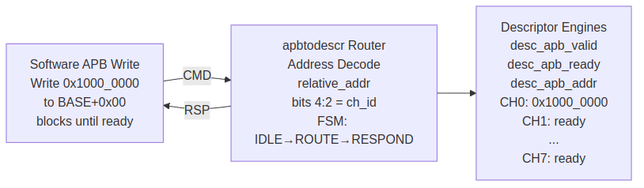
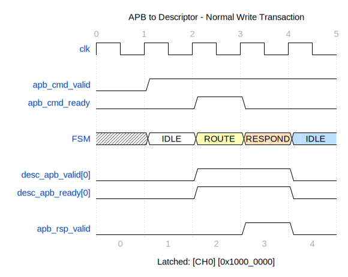
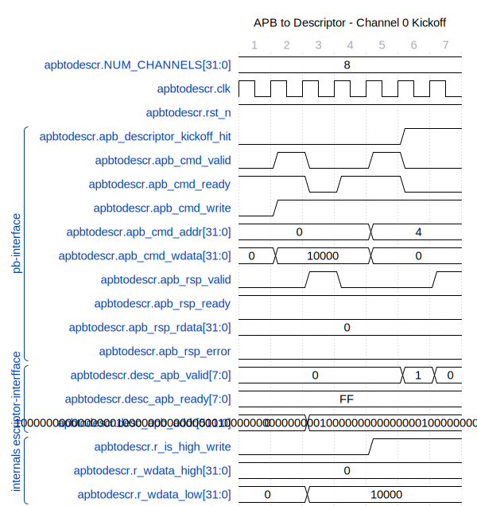

<!-- RTL Design Sherpa Documentation Header -->
<table>
<tr>
<td width="80">
  <a href="https://github.com/sean-galloway/RTLDesignSherpa">
    
  </a>
</td>
<td>
  <strong>RTL Design Sherpa</strong> · <em>Learning Hardware Design Through Practice</em><br>
  <sub>
    <a href="https://github.com/sean-galloway/RTLDesignSherpa">GitHub</a> ·
    <a href="https://github.com/sean-galloway/RTLDesignSherpa/blob/main/docs/DOCUMENTATION_INDEX.md">Documentation Index</a> ·
    <a href="https://github.com/sean-galloway/RTLDesignSherpa/blob/main/LICENSE">MIT License</a>
  </sub>
</td>
</tr>
</table>

---

<!-- End Header -->

# APB to Descriptor Router

**Module:** `apbtodescr.sv`
**Location:** `projects/components/stream/rtl/fub/`
**Category:** FUB (Functional Unit Block)
**Parent:** `stream_top.sv`
**Status:** Implemented
**Last Updated:** 2025-11-30

---

## Overview

The `apbtodescr` module is an APB-to-descriptor engine router that handles address-based routing of APB writes to descriptor engine kick-off ports. It decodes the APB address to determine the target channel and routes the 64-bit descriptor address using a two-write sequence.

### Key Features

- **Address-Based Routing:** APB address bits select target channel
- **64-bit Address Assembly:** Two 32-bit APB writes combine into 64-bit descriptor address
- **Backpressure Handling:** Delays APB response if descriptor engine busy
- **Address Range Checking:** Error on out-of-range addresses
- **Integration Signal:** `apb_descriptor_kickoff_hit` for response muxing

---

## Architecture

### Address Map

```
Relative to BASE_ADDR:
  BASE + 0x00: Channel 0 descriptor address LOW  [31:0]
  BASE + 0x04: Channel 0 descriptor address HIGH [63:32]
  BASE + 0x08: Channel 1 descriptor address LOW  [31:0]
  BASE + 0x0C: Channel 1 descriptor address HIGH [63:32]
  ...
  BASE + 0x38: Channel 7 descriptor address LOW  [31:0]
  BASE + 0x3C: Channel 7 descriptor address HIGH [63:32]
```

### Block Diagram

### Figure 2.13.1: APB to Descriptor Block Diagram



**Source:** [02_apbtodescr_block.mmd](../assets/mermaid/02_apbtodescr_block.mmd)

### FSM Diagram

### Figure 2.13.2: APB to Descriptor FSM


**Source:** [02_apbtodescr_fsm.mmd](../assets/mermaid/02_apbtodescr_fsm.mmd)

### Write Flow

```
1. Software writes LOW word to CHx_CTRL_LOW register
2. PeakRDL APB slave presents write on cmd/rsp interface
3. Module captures LOW word, responds with OKAY
4. Software writes HIGH word to CHx_CTRL_HIGH register
5. Module assembles 64-bit address from LOW + HIGH
6. Module asserts desc_apb_valid[channel_id]
7. Module drives desc_apb_addr[channel_id]
8. Waits for desc_apb_ready[channel_id]
9. Completes APB transaction (asserts apb_rsp_valid)
```

### FSM States

```systemverilog
typedef enum logic [2:0] {
    IDLE          = 3'b000,    // Waiting for APB command (LOW write)
    RESPOND_LOW   = 3'b001,    // Sending response after LOW write
    WAIT_HIGH     = 3'b010,    // Waiting for HIGH write
    ROUTE         = 3'b011,    // Routing to descriptor engine
    RESPOND_HIGH  = 3'b100     // Sending final response after HIGH write
} state_t;
```

---

## Parameters

| Parameter | Type | Default | Description |
|-----------|------|---------|-------------|
| `ADDR_WIDTH` | int | 32 | APB address width |
| `DATA_WIDTH` | int | 32 | APB data width |
| `NUM_CHANNELS` | int | 8 | Number of DMA channels |

: Parameters

---

## Port List

### Clock and Reset

| Signal | Direction | Width | Description |
|--------|-----------|-------|-------------|
| `clk` | input | 1 | System clock |
| `rst_n` | input | 1 | Active-low asynchronous reset |

: Clock and Reset

### APB Slave CMD Interface

| Signal | Direction | Width | Description |
|--------|-----------|-------|-------------|
| `apb_cmd_valid` | input | 1 | Command valid |
| `apb_cmd_ready` | output | 1 | Ready to accept command |
| `apb_cmd_addr` | input | ADDR_WIDTH | Command address |
| `apb_cmd_wdata` | input | DATA_WIDTH | Write data |
| `apb_cmd_write` | input | 1 | Write enable (1=write, 0=read) |

: APB Slave CMD Interface

### APB Slave RSP Interface

| Signal | Direction | Width | Description |
|--------|-----------|-------|-------------|
| `apb_rsp_valid` | output | 1 | Response valid |
| `apb_rsp_ready` | input | 1 | Response ready |
| `apb_rsp_rdata` | output | DATA_WIDTH | Read data (always 0) |
| `apb_rsp_error` | output | 1 | Error flag |

: APB Slave RSP Interface

### Descriptor Engine APB Ports

| Signal | Direction | Width | Description |
|--------|-----------|-------|-------------|
| `desc_apb_valid[ch]` | output | NUM_CHANNELS | Per-channel valid |
| `desc_apb_ready[ch]` | input | NUM_CHANNELS | Per-channel ready |
| `desc_apb_addr[ch]` | output | NUM_CHANNELS x 64 | 64-bit descriptor addresses |

: Descriptor Engine APB Ports

### Integration Control

| Signal | Direction | Width | Description |
|--------|-----------|-------|-------------|
| `apb_descriptor_kickoff_hit` | output | 1 | Indicates kick-off in progress |

: Integration Control

---

## Operation

### Address Decode

```systemverilog
// Extract channel ID from address (dword-aligned: addr[5:3])
// Address bits [1:0] are ignored (word-aligned)
// Address bit  [2]   selects LOW (0) or HIGH (1) register
// Address bits [5:3] select channel 0-7
assign channel_id = apb_cmd_addr[5:3];
assign r_is_high_write = apb_cmd_addr[2];

// Valid range: 0x00 to 0x3F (8 channels x 8 bytes)
assign addr_in_range = ({20'h0, apb_cmd_addr[11:0]} < (NUM_CHANNELS * 8));
```

### 64-bit Address Assembly

```systemverilog
// LOW write captured in IDLE state
if (r_state == IDLE && apb_cmd_valid) begin
    r_wdata_low <= apb_cmd_wdata;
end

// HIGH write captured in WAIT_HIGH state
if (r_state == WAIT_HIGH && apb_cmd_valid) begin
    r_wdata_high <= apb_cmd_wdata;
end

// Assembled 64-bit address
desc_apb_addr[ch] = {r_wdata_high, r_wdata_low};
```

### Error Conditions

1. **Read Operation:** APB reads not supported
2. **Address Out of Range:** Beyond channel address space
3. **HIGH Before LOW:** HIGH write without preceding LOW write
4. **Wrong Channel:** HIGH write to different channel than LOW

---

## Timing Diagrams

### Normal Write Sequence

The following diagram shows the normal write flow where a LOW word followed by HIGH word kicks off a channel:

#### Waveform 2.13.1: APB Normal Write Sequence



**Source:** [apbtodescr_normal_write.json](../assets/wavedrom/apbtodescr_normal_write.json)

### Backpressure Handling

When the descriptor engine is busy, the APB response is delayed until the engine accepts the kick-off:

#### Waveform 2.13.2: APB Write with Backpressure


**Source:** [apbtodescr_backpressure_write.json](../assets/wavedrom/apbtodescr_backpressure_write.json)

### Channel Kick-off Examples

#### Waveform 2.13.3: Channel 0 Kick-off



**Source:** [apbtodescr_ch0_kickoff.json](../assets/wavedrom/apbtodescr_ch0_kickoff.json)

#### Waveform 2.13.4: Channel 7 Kick-off


**Source:** [apbtodescr_ch7_kickoff.json](../assets/wavedrom/apbtodescr_ch7_kickoff.json)

### Multi-Channel Operation

The following diagram shows multiple channels being kicked off in sequence:

#### Waveform 2.13.5: Multi-Channel Kick-off Sequence


**Source:** [apbtodescr_multi_channel.json](../assets/wavedrom/apbtodescr_multi_channel.json)

---

## Integration Example

```systemverilog
apbtodescr #(
    .ADDR_WIDTH     (32),
    .DATA_WIDTH     (32),
    .NUM_CHANNELS   (8)
) u_apbtodescr (
    .clk                        (clk),
    .rst_n                      (rst_n),

    // APB CMD/RSP from PeakRDL
    .apb_cmd_valid              (apb_kickoff_cmd_valid),
    .apb_cmd_ready              (apb_kickoff_cmd_ready),
    .apb_cmd_addr               (apb_kickoff_cmd_addr),
    .apb_cmd_wdata              (apb_kickoff_cmd_wdata),
    .apb_cmd_write              (apb_kickoff_cmd_write),

    .apb_rsp_valid              (apb_kickoff_rsp_valid),
    .apb_rsp_ready              (apb_kickoff_rsp_ready),
    .apb_rsp_rdata              (apb_kickoff_rsp_rdata),
    .apb_rsp_error              (apb_kickoff_rsp_error),

    // To descriptor engines
    .desc_apb_valid             (desc_apb_valid),
    .desc_apb_ready             (desc_apb_ready),
    .desc_apb_addr              (desc_apb_addr),

    // Integration
    .apb_descriptor_kickoff_hit (kickoff_hit)
);
```

---

## Common Issues

### Issue 1: APB Response Not Returning

**Symptom:** APB write hangs without response

**Root Causes:**
1. Descriptor engine not asserting ready
2. FSM stuck in ROUTE state
3. `apb_rsp_ready` not being asserted

**Solution:** Check descriptor engine acceptance and FSM state.

### Issue 2: Wrong Channel Kicked Off

**Symptom:** Different channel starts than expected

**Root Cause:** HIGH write sent to different channel than LOW

**Solution:** Ensure software writes LOW then HIGH to same channel address.

---

## Related Documentation

- **Parent:** `01_stream_core.md` - Top-level integration
- **Consumer:** `05_descriptor_engine.md` - Receives kick-off
- **Register File:** PeakRDL-generated `stream_regs.sv`
---

## Revision History

| Version | Date | Author | Description |
|---------|------|--------|-------------|
| 0.90 | 2025-11-22 | seang | Initial block specification |
| 0.91 | 2026-01-02 | seang | Added table captions and figure numbers |

: APB to Descriptor Router Revision History

---

**Last Updated:** 2026-01-02
