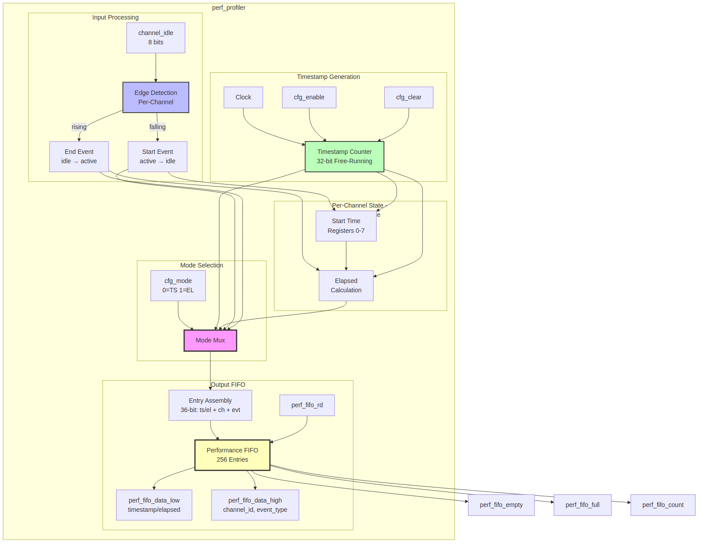

<!-- RTL Design Sherpa Documentation Header -->
<table>
<tr>
<td width="80">
  <a href="https://github.com/sean-galloway/RTLDesignSherpa">
    
  </a>
</td>
<td>
  <strong>RTL Design Sherpa</strong> · <em>Learning Hardware Design Through Practice</em><br>
  <sub>
    <a href="https://github.com/sean-galloway/RTLDesignSherpa">GitHub</a> ·
    <a href="https://github.com/sean-galloway/RTLDesignSherpa/blob/main/docs/DOCUMENTATION_INDEX.md">Documentation Index</a> ·
    <a href="https://github.com/sean-galloway/RTLDesignSherpa/blob/main/LICENSE">MIT License</a>
  </sub>
</td>
</tr>
</table>

---

<!-- End Header -->

# Performance Profiler

**Module:** `perf_profiler.sv`
**Location:** `projects/components/stream/rtl/fub/`
**Category:** FUB (Functional Unit Block)
**Parent:** `stream_top.sv`
**Status:** Implemented
**Last Updated:** 2025-11-30

---

## Overview

The `perf_profiler` module captures timing information for channel activity to enable performance analysis and bottleneck identification. It monitors channel idle signals and records either timestamps or elapsed times to a FIFO for software retrieval.

### Key Features

- **Two Profiling Modes:**
  - Mode 0 (TIMESTAMP): Captures timestamps on idle signal edges
  - Mode 1 (ELAPSED): Captures elapsed time directly
- **Per-Channel Profiling:** Tracks all 8 channels independently
- **256-Entry FIFO:** Buffers performance data for software polling
- **Channel ID Tagging:** Each entry includes source channel
- **Configurable via APB:** Enable, mode, and clear controls

---

## Architecture

### Block Diagram

### Figure 2.15.1: Performance Profiler Block Diagram



**Source:** [15_perf_profiler_block.mmd](../assets/mermaid/15_perf_profiler_block.mmd)

### Profiling Modes

**Mode 0 - TIMESTAMP:**
```
Records timestamp when:
  - Channel transitions idle � active (start)
  - Channel transitions active � idle (end)

Software calculates: elapsed = timestamp_end - timestamp_start

Advantages:
  - Simpler hardware
  - More flexible analysis
  - Can detect partial transfers
```

**Mode 1 - ELAPSED:**
```
Records elapsed time when:
  - Channel returns to idle

elapsed_time = current_timestamp - start_timestamp

Advantages:
  - Hardware calculates duration
  - Simpler software processing
  - Direct performance metric
```

### FIFO Entry Format (36-bit)

| Bits | Field | Description |
|------|-------|-------------|
| [31:0] | timestamp/elapsed | Timestamp or elapsed time |
| [34:32] | channel_id | Source channel (0-7) |
| [35] | event_type | 0=start, 1=end (timestamp mode) |

: FIFO Entry Format

---

## Parameters

| Parameter | Type | Default | Description |
|-----------|------|---------|-------------|
| `NUM_CHANNELS` | int | 8 | Number of channels to monitor |
| `CHANNEL_WIDTH` | int | $clog2(NUM_CHANNELS) | Channel ID width |
| `TIMESTAMP_WIDTH` | int | 32 | Timestamp counter width |
| `FIFO_DEPTH` | int | 256 | Performance FIFO depth |
| `FIFO_ADDR_WIDTH` | int | $clog2(FIFO_DEPTH) | FIFO address width |

: Parameters

---

## Port List

### Clock and Reset

| Signal | Direction | Width | Description |
|--------|-----------|-------|-------------|
| `clk` | input | 1 | System clock |
| `rst_n` | input | 1 | Active-low asynchronous reset |

: Clock and Reset

### Channel Monitoring

| Signal | Direction | Width | Description |
|--------|-----------|-------|-------------|
| `channel_idle` | input | NUM_CHANNELS | Per-channel idle signals |

: Channel Monitoring

### Configuration Interface

| Signal | Direction | Width | Description |
|--------|-----------|-------|-------------|
| `cfg_enable` | input | 1 | Enable profiling |
| `cfg_mode` | input | 1 | 0=timestamp, 1=elapsed |
| `cfg_clear` | input | 1 | Clear FIFO and counters |

: Configuration Interface

### FIFO Read Interface

| Signal | Direction | Width | Description |
|--------|-----------|-------|-------------|
| `perf_fifo_rd` | input | 1 | Read strobe (pops FIFO) |
| `perf_fifo_data_low` | output | 32 | Timestamp/elapsed [31:0] |
| `perf_fifo_data_high` | output | 32 | {28'b0, event_type, channel_id} |
| `perf_fifo_empty` | output | 1 | FIFO empty flag |
| `perf_fifo_full` | output | 1 | FIFO full flag |
| `perf_fifo_count` | output | 16 | Number of entries |

: FIFO Read Interface

---

## Operation

### Edge Detection

```systemverilog
// Detect idle signal transitions
assign w_idle_rising  = channel_idle & ~r_idle_prev;  // Active � Idle (end)
assign w_idle_falling = ~channel_idle & r_idle_prev;  // Idle � Active (start)
```

### Timestamp Counter

```systemverilog
// Free-running 32-bit counter
// Increments every cycle when profiling enabled
// Wraps at 2^32 - 1 (software handles rollover)
always_ff @(posedge clk or negedge rst_n) begin
    if (!rst_n) begin
        r_timestamp_counter <= '0;
    end else if (cfg_clear) begin
        r_timestamp_counter <= '0;
    end else if (cfg_enable) begin
        r_timestamp_counter <= r_timestamp_counter + 1'b1;
    end
end
```

### Start Time Capture (Elapsed Mode)

```systemverilog
// Per-channel start time tracking
generate
    for (ch = 0; ch < NUM_CHANNELS; ch++) begin
        always_ff @(posedge clk) begin
            if (cfg_enable && cfg_mode == MODE_ELAPSED) begin
                if (w_idle_falling[ch]) begin
                    r_start_time[ch] <= r_timestamp_counter;
                    r_channel_active[ch] <= 1'b1;
                end
                else if (w_idle_rising[ch]) begin
                    r_channel_active[ch] <= 1'b0;
                end
            end
        end
    end
endgenerate
```

### Two-Register Read Sequence

```
Software reads FIFO via APB:
1. Check perf_fifo_empty == 0
2. Read PERF_FIFO_DATA_LOW:
   - Triggers perf_fifo_rd strobe
   - Pops FIFO, latches 36-bit entry
   - Returns timestamp/elapsed [31:0]
3. Read PERF_FIFO_DATA_HIGH:
   - Returns {28'b0, event_type, channel_id}
   - No FIFO pop
4. Parse data and repeat
```

---

## Integration Example

```systemverilog
perf_profiler #(
    .NUM_CHANNELS       (8),
    .TIMESTAMP_WIDTH    (32),
    .FIFO_DEPTH         (256)
) u_perf_profiler (
    .clk                (clk),
    .rst_n              (rst_n),

    // From schedulers
    .channel_idle       (scheduler_idle),

    // Configuration
    .cfg_enable         (cfg_perf_enable),
    .cfg_mode           (cfg_perf_mode),
    .cfg_clear          (cfg_perf_clear),

    // FIFO read interface (to APB)
    .perf_fifo_rd       (perf_fifo_rd),
    .perf_fifo_data_low (perf_fifo_data_low),
    .perf_fifo_data_high(perf_fifo_data_high),
    .perf_fifo_empty    (perf_fifo_empty),
    .perf_fifo_full     (perf_fifo_full),
    .perf_fifo_count    (perf_fifo_count)
);
```

---

## Software Usage

### Example: Measure Channel 0 Transfer Time

```c
// Enable timestamp mode
write_reg(PERF_CONFIG, PERF_EN | MODE_TIMESTAMP);

// Start transfer on channel 0
write_reg(CH0_CTRL_LOW, desc_addr_low);
write_reg(CH0_CTRL_HIGH, desc_addr_high);

// Wait for completion
while (!read_reg(CH0_STATUS) & COMPLETE);

// Read performance data
while (!(read_reg(PERF_STATUS) & FIFO_EMPTY)) {
    uint32_t low  = read_reg(PERF_FIFO_DATA_LOW);   // Pops FIFO
    uint32_t high = read_reg(PERF_FIFO_DATA_HIGH);  // Reads latched

    uint32_t timestamp = low;
    uint8_t  channel   = high & 0x7;
    uint8_t  event     = (high >> 3) & 0x1;

    if (channel == 0) {
        if (event == 0)  // Start
            start_time = timestamp;
        else             // End
            elapsed = timestamp - start_time;
    }
}
```

---

## Common Issues

### Issue 1: FIFO Overflow

**Symptom:** Performance data lost

**Root Cause:** Software not polling fast enough

**Solution:**
- Poll more frequently
- Use larger FIFO depth
- Consider interrupt on half-full

### Issue 2: Timestamp Rollover

**Symptom:** Negative elapsed times calculated

**Root Cause:** 32-bit counter wrapped during measurement

**Solution:** Handle rollover in software:
```c
if (end_time < start_time)
    elapsed = (0xFFFFFFFF - start_time) + end_time + 1;
```

---

## Related Documentation

- **Parent:** `01_stream_core.md` - Top-level integration
- **Data Source:** `04_scheduler.md` - Provides idle signals
- **Configuration:** `14_apb_config.md` - Config register mapping
---

## Revision History

| Version | Date | Author | Description |
|---------|------|--------|-------------|
| 0.90 | 2025-11-22 | seang | Initial block specification |
| 0.91 | 2026-01-02 | seang | Added table captions and figure numbers |

: Performance Profiler Revision History

---

**Last Updated:** 2026-01-02
