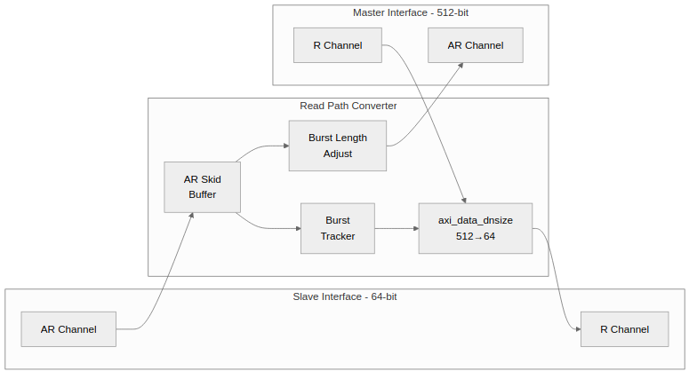

<!-- RTL Design Sherpa Documentation Header -->
<table>
<tr>
<td width="80">
  <a href="https://github.com/sean-galloway/RTLDesignSherpa">
    
  </a>
</td>
<td>
  <strong>RTL Design Sherpa</strong> · <em>Learning Hardware Design Through Practice</em><br>
  <sub>
    <a href="https://github.com/sean-galloway/RTLDesignSherpa">GitHub</a> ·
    <a href="https://github.com/sean-galloway/RTLDesignSherpa/blob/main/docs/DOCUMENTATION_INDEX.md">Documentation Index</a> ·
    <a href="https://github.com/sean-galloway/RTLDesignSherpa/blob/main/LICENSE">MIT License</a>
  </sub>
</td>
</tr>
</table>

---

<!-- End Header -->

# 2.6 axi4_dwidth_converter_rd

The **axi4_dwidth_converter_rd** module is the complete AXI4 read path — AR and R channels with burst length adjustment and burst-aware RLAST generation.

## 2.6.1 Overview

The read converter combines the generic `axi_data_dnsize` with AXI4 protocol handling:

1. **Address Channel (AR)**: Passes through with burst length adjustment
2. **Read Data Channel (R)**: Uses `axi_data_dnsize` for data splitting
3. **Burst Tracking**: Generates correct RLAST based on original ARLEN
4. **Response Broadcasting**: Propagates RRESP to all narrow beats

## 2.6.2 Block Diagram

### Figure 2.7: Read Converter Architecture



## 2.6.3 Interface Specification

### Parameters

| Parameter | Type | Default | Description |
| --- | --- | --- | --- |
| S_AXI_DATA_WIDTH | int | 32 | Slave-side data width |
| M_AXI_DATA_WIDTH | int | 128 | Master-side data width |
| AXI_ID_WIDTH | int | 8 | Transaction ID width |
| AXI_ADDR_WIDTH | int | 32 | Address width |
| AXI_USER_WIDTH | int | 1 | User-signal width |
| SKID_DEPTH_AR | int | 4 | AR skid buffer depth |
| SKID_DEPTH_R | int | 4 | R skid buffer depth |
| RASM_DEPTH | int | 272 | Per-ID beat capacity; must cover the 256-beat AXI4 master-burst maximum (BUG-009) |
| RASM_MAX_OUTSTANDING | int | 16 | Shared reassembly pool capacity in bursts (BUG-009) |

: Table 2.17: Read Converter Parameters

### Ports

```systemverilog
module axi4_dwidth_converter_rd #(
    // Width Configuration
    parameter int S_AXI_DATA_WIDTH  = 32,
    parameter int M_AXI_DATA_WIDTH  = 128,
    parameter int AXI_ID_WIDTH      = 8,
    parameter int AXI_ADDR_WIDTH    = 32,
    parameter int AXI_USER_WIDTH    = 1,

    // Skid Buffer Depths (for timing closure)
    parameter int SKID_DEPTH_AR     = 2,
    parameter int SKID_DEPTH_R      = 4,

    // Calculated Parameters
    localparam int S_STRB_WIDTH = S_AXI_DATA_WIDTH / 8,
    localparam int M_STRB_WIDTH = M_AXI_DATA_WIDTH / 8,
    localparam int WIDTH_RATIO  = (S_AXI_DATA_WIDTH < M_AXI_DATA_WIDTH) ?
                                  (M_AXI_DATA_WIDTH / S_AXI_DATA_WIDTH) :
                                  (S_AXI_DATA_WIDTH / M_AXI_DATA_WIDTH),
    localparam bit UPSIZE       = (S_AXI_DATA_WIDTH < M_AXI_DATA_WIDTH) ? 1'b1 : 1'b0,
    localparam bit DOWNSIZE     = (S_AXI_DATA_WIDTH > M_AXI_DATA_WIDTH) ? 1'b1 : 1'b0,

    // Skid buffer packed widths
    localparam int AR_WIDTH = AXI_ID_WIDTH + AXI_ADDR_WIDTH + 8 + 3 + 2 + 1 + 4 + 3 + 4 + 4 + AXI_USER_WIDTH,
    localparam int R_WIDTH  = S_AXI_DATA_WIDTH + 2 + AXI_USER_WIDTH + 1 + AXI_ID_WIDTH
) (
    // Clock and Reset
    input  logic                        aclk,
    input  logic                        aresetn,

    //==========================================================================
    // Slave AXI Read Interface
    //==========================================================================

    // Read Address Channel
    input  logic [AXI_ID_WIDTH-1:0]     s_axi_arid,
    input  logic [AXI_ADDR_WIDTH-1:0]   s_axi_araddr,
    input  logic [7:0]                  s_axi_arlen,
    input  logic [2:0]                  s_axi_arsize,
    input  logic [1:0]                  s_axi_arburst,
    input  logic                        s_axi_arlock,
    input  logic [3:0]                  s_axi_arcache,
    input  logic [2:0]                  s_axi_arprot,
    input  logic [3:0]                  s_axi_arqos,
    input  logic [3:0]                  s_axi_arregion,
    input  logic [AXI_USER_WIDTH-1:0]   s_axi_aruser,
    input  logic                        s_axi_arvalid,
    output logic                        s_axi_arready,

    // Read Data Channel
    output logic [AXI_ID_WIDTH-1:0]     s_axi_rid,
    output logic [S_AXI_DATA_WIDTH-1:0] s_axi_rdata,
    output logic [1:0]                  s_axi_rresp,
    output logic                        s_axi_rlast,
    output logic [AXI_USER_WIDTH-1:0]   s_axi_ruser,
    output logic                        s_axi_rvalid,
    input  logic                        s_axi_rready,

    //==========================================================================
    // Master AXI Read Interface
    //==========================================================================

    // Read Address Channel
    output logic [AXI_ID_WIDTH-1:0]     m_axi_arid,
    output logic [AXI_ADDR_WIDTH-1:0]   m_axi_araddr,
    output logic [7:0]                  m_axi_arlen,
    output logic [2:0]                  m_axi_arsize,
    output logic [1:0]                  m_axi_arburst,
    output logic                        m_axi_arlock,
    output logic [3:0]                  m_axi_arcache,
    output logic [2:0]                  m_axi_arprot,
    output logic [3:0]                  m_axi_arqos,
    output logic [3:0]                  m_axi_arregion,
    output logic [AXI_USER_WIDTH-1:0]   m_axi_aruser,
    output logic                        m_axi_arvalid,
    input  logic                        m_axi_arready,

    // Read Data Channel
    input  logic [AXI_ID_WIDTH-1:0]     m_axi_rid,
    input  logic [M_AXI_DATA_WIDTH-1:0] m_axi_rdata,
    input  logic [1:0]                  m_axi_rresp,
    input  logic                        m_axi_rlast,
    input  logic [AXI_USER_WIDTH-1:0]   m_axi_ruser,
    input  logic                        m_axi_rvalid,
    output logic                        m_axi_rready
);
```

## 2.6.4 Burst Length Conversion

### Ratio Calculation

Same as write converter:

```systemverilog
// Direction-aware, same as the write converter (2.5.4)
localparam int RATIO = (S_AXI_DATA_WIDTH < M_AXI_DATA_WIDTH)
                       ? (M_AXI_DATA_WIDTH / S_AXI_DATA_WIDTH)
                       : (S_AXI_DATA_WIDTH / M_AXI_DATA_WIDTH);
localparam int RATIO_LOG2 = $clog2(RATIO);

// upsize: New ARLEN = ceil((start_lane + ARLEN + 1) / RATIO) - 1
// (round UP; the start lane counts for mid-word bursts, see 2.6.5)
// downsize: split into master bursts of <= 256 beats (see 2.6.5)
```

### Examples

| S_DATA | M_DATA | Ratio | S_ARLEN | S_beats | M_ARLEN | M_beats |
| --- | --- | --- | --- | --- | --- | --- |
| 64 | 512 | 8 | 7 | 8 | 0 | 1 |
| 64 | 512 | 8 | 15 | 16 | 1 | 2 |
| 64 | 512 | 8 | 31 | 32 | 3 | 4 |

: Table 2.18: Read Burst Length Conversion

## 2.6.5 Address Channel Handling

### AR Passthrough with Adjustment

Same two directions as the write converter (see 2.5.4 for why the upsize
divide rounds up):

```systemverilog
// narrow -> wide (upsize): beats combine, round up; the start lane
// counts toward the wide total for mid-word bursts
assign m_axi_arlen  = 8'(((w_ar_lane + 10'(int_arlen) + 10'(WIDTH_RATIO))
                          / 10'(WIDTH_RATIO)) - 10'd1);

// wide -> narrow (downsize): each wide beat becomes RATIO narrow beats,
// and the product can exceed both AWLEN's 8 bits and the 256-beat legal
// maximum -- so one slave burst is SPLIT into master bursts of <= 256
// beats (same mechanism as the write converter, see 2.5.5)
assign m_axi_arlen  = 8'(w_this_beats - 9'd1);  // min(remaining, 256)

// size is the master's own full width, not a shift of ARSIZE
assign m_axi_arsize = MASTER_SIZE[2:0];
```

For a split read the slave must still see ONE burst: each master burst
returns its own RLAST, and every one except the final master burst's is
masked out of the upsize, whose accumulation simply continues across the
boundary. The masking is safe by construction — 256 narrow beats is a
whole number of wide beats at every ratio, so a masked boundary can never
land mid-accumulation. A one-bit flag queue, pushed per issued AR and
popped per master RLAST, says which burst is final.

On the UPSIZE path the issued address is aligned down to the master
data width — the slave returns whole wide words — and mid-word INCR
starts are handled by the R slicer: the burst-length FIFO carries the
start lane alongside the narrow length, `m_axi_arlen` counts it
(`ceil((start_lane + narrow_beats) / RATIO)` wide beats), and
`axi_data_dnsize` slices the burst's FIRST wide word from that lane,
so the narrow master receives the bytes it actually addressed. Later
wide words slice from lane 0. FIXED/WRAP keep the wide-aligned
requirement (asserted in simulation). The downsize path issues narrow
accesses and passes the address through the splitter unmodified apart
from the per-burst advance:

```systemverilog
localparam int ALIGN_BITS = $clog2(M_STRB_WIDTH);
assign aligned_araddr = {int_araddr[AXI_ADDR_WIDTH-1:ALIGN_BITS],
                         {ALIGN_BITS{1'b0}}};
assign m_axi_araddr   = aligned_araddr;
```

### Burst-Length Tracking

Only the wide→narrow R data path needs explicit framing — that is the
converter's **UPSIZE** mode (S narrower than M: wide master read data
sliced down to narrow slave beats through `axi_data_dnsize`). The downsize
block ignores a `burst_start` pulse while a burst is active and keeps no
length queue of its own, so framing only the first burst would collapse
N read bursts into one — bursts 2..N would drain with `narrow_last` never
asserting.

Since BUG-009 the framing record is the per-ID reassembly record (2.6.9),
pushed at AR accept and holding the burst's narrow length and start lane;
it replaces the 16-deep burst-length FIFO this section originally
described. The record is per-ID (one outstanding master burst per ID by
reservation), so no shared queue is needed and overlapping bursts are
framed independently.

The narrow→wide R data path (the converter's DOWNSIZE mode) needs no
such framing; its generate branch ties the shared handshake wires off
inert.

## 2.6.6 Read Data Channel

### Downsize Instance

```systemverilog
axi_data_dnsize #(
    .WIDE_WIDTH      (M_AXI_DATA_WIDTH),
    .NARROW_WIDTH    (S_AXI_DATA_WIDTH),
    .WIDE_SB_WIDTH   (2),          // RRESP
    .NARROW_SB_WIDTH (2),
    .SB_BROADCAST    (1),          // Broadcast RRESP
    .TRACK_BURSTS    (1),
    .BURST_LEN_WIDTH (8)
) u_r_dnsize (
    .aclk            (aclk),
    .aresetn         (aresetn),
    // burst framing is MANDATORY with TRACK_BURSTS(1): burst_len is in
    // NARROW beats - 1, and burst_start is LEVEL-HELD while the length
    // FIFO is non-empty (the dnsize samples it only when idle, which is
    // what frames every overlapping burst); leaving them off silently
    // produces framing with no LAST (see 2.3.9)
    .burst_len       (w_blen_rd_data),
    .burst_start     (w_blen_rd_valid),
    .start_lane      (w_blen_rd_lane[$clog2(WIDTH_RATIO)-1:0]),
    .wide_valid      (m_axi_rvalid),
    .wide_ready      (m_axi_rready),
    .wide_data       (m_axi_rdata),
    .wide_sideband   (m_axi_rresp),
    .wide_last       (m_axi_rlast),
    .narrow_valid    (int_r_valid),
    .narrow_ready    (int_r_ready),
    .narrow_data     (int_rdata),
    .narrow_sideband (int_rresp),
    .narrow_last     (int_rlast)
);
```

## 2.6.7 RLAST Generation

There is no local RLAST tracker in the converter. The downsize block
generates `narrow_last` itself in TRACK_BURSTS mode, framed by the per-ID
reassembly record (2.6.9): the record supplies the burst's original narrow
length and start lane, `burst_start` pulses at the first accepted wide beat,
and the dnsize counts narrow beats against it — `int_rlast` comes out of the
dnsize and passes to `s_axi_rlast` through the R skid.

(An earlier revision showed a standalone counter loading
`(arlen + 1) * RATIO - 1`, the same xRATIO framing 2.3.4 calls out as
the classic mis-framing bug; a later one used a 16-deep burst-length FIFO of
narrow arlen/lane per outstanding read. No such multiply exists anywhere in
the converter, and the FIFO was replaced by the per-ID record when the
BUG-009 reassembly layer landed.)

## 2.6.8 RID Handling

### ID Tracking

RID no longer rides a "most recent beat" register. The reassembly layer
knows which burst it is feeding (`rasm_feed_id`) and which burst is emerging
at the slave side (`rasm_out_id`, loaded when feeding starts, so it is stable
before the first output beat); the primitives see one contiguous burst at a
time by construction:

```systemverilog
assign int_rid   = rasm_out_id;
assign int_ruser = rasm_ruser[rasm_out_id];
```

RUSER is captured on the first beat of each burst in reassembly (exact even
for single-beat bursts).

### Ordering Guarantee (read side; write side fixed by BUG-008)

**Write side: no constraint beyond AXI4 itself.** Since 2026-10-04 the B fold
is a per-burst CAM keyed by AWID (see `05_dwidth_converter_wr.md`): any
cross-ID B completion order is exact (fixed as projects/components/utility-ip/converters BUG-008).

**Read side: full AXI4 R interleaving across IDs is supported (BUG-009,
fixed 2026-10-04).** A reassembly layer between `m_axi` R and the data
primitives demuxes beats by RID into per-ID queues backed by a shared beat
pool, detects when a complete master burst has arrived (beat count from the
AR-split record plus RLAST), and feeds each assembled burst contiguously into
`axi_data_upsize`/`axi_data_dnsize`. The primitives are unchanged and still
see one burst at a time, so per-beat RID/RUSER attribution is exact no matter
how the downstream interleaves beats across IDs.

The layer is bounded and deadlock-free by reservation: at most one
unassembled master burst per ID — master AR issue for an ID is throttled
until its previous burst has been completely fed to the primitive, and the
shared pool is sized to `RASM_MAX_OUTSTANDING` full bursts (default 16).
Throughput tradeoff: same-ID read chains serialize through reassembly (they
complete in order anyway); cross-ID traffic stays concurrent. Buffer sizing:
`RASM_DEPTH` (default 272 beats) must cover the 256-beat AXI4 master-burst
maximum; the pool is `RASM_MAX_OUTSTANDING * RASM_DEPTH` entries of
`{data, resp, last, next}` — a shared linked list, avoiding the 2^ID_WIDTH
area explosion of per-ID FIFOs. If the per-ID reservation is ever relaxed to
multiple outstanding bursts per ID, `bridge_cam` mode 2 (`ALLOW_DUPLICATES=1`,
the ordered duplicate-tag CAM in fabric-gen-ip/bridge) is the designated
upgrade for the tracking structure.

Protocol violations (R beat with no outstanding AR record, more beats than
the AR promised, premature RLAST) are flagged by `SIMULATION`-guarded
`$error`s and consumed without deadlock.

## 2.6.9 R Reassembly Layer (BUG-009, 2026-10-04)

AXI4 permits a slave to interleave R beats across ARIDs, and the house
BFM environment is required to exercise that capability — so the read
converter no longer assumes a contiguous master R stream. Between
`m_axi` R and the data primitives sits a reassembly layer:

1. **Demux by RID.** Every master R beat is appended to its ID's queue.
   Queues are singly-linked lists through a shared beat pool
   (`RASM_MAX_OUTSTANDING * RASM_DEPTH` entries of
   `{data, resp, last, next}`); a free list recycles entries. The shared
   pool avoids the 2^ID_WIDTH area explosion of per-ID FIFOs at large
   ID widths.
2. **Assembly detection.** Each issued master AR pushes a per-ID record
   `{valid, final, beats}` (downsize: split-record beats + final flag;
   upsize: wide-beat count, narrow length, start lane). A burst is
   assembled when its record's beat count is met by beats whose last
   carries RLAST.
3. **Reservation.** At most one unassembled master burst per ID: master
   AR issue for an ID is throttled while its record is valid, so the
   pool is bounded and no reorder deadlock is possible (a burst's beats
   always have their reserved space). Cost: same-ID read chains
   serialize through reassembly; cross-ID traffic stays concurrent.
4. **Burst-at-a-time feeding.** A round-robin scheduler picks an ID with
   an assembled burst and feeds that burst's beats contiguously into
   `axi_data_upsize` (downsize) or `axi_data_dnsize` (upsize). The
   primitives are untouched; the per-ID record drives final-flag gating
   (downsize) and burst framing (upsize). For downsize, the scheduler
   keeps feeding the same ID while its slave burst's converted output is
   still draining, so wide-word accumulation never mixes splits of
   different slave bursts.
5. **Exact attribution.** `int_rid`/`int_ruser` come from the tracked
   feed/output IDs and the first-beat RUSER capture — exact per beat
   regardless of arrival order.

Protocol violations (R with no outstanding AR, more beats than the AR
promised, premature RLAST) are flagged by `SIMULATION`-guarded `$error`
checks and consumed without deadlock.

## 2.6.10 Resource Utilization

### Typical Resources (64→512 UPSIZE, ratio 8, ID=4)

The burst-length FIFO exists only in the converter's UPSIZE mode (see
2.6.5), so the configuration here is upsize — an earlier revision
labeled this table 512→64 (DOWNSIZE), a mode in which that FIFO is
tied off and does not exist. Hand estimates, not synthesis results,
except the FIFO, which is counted from its declarations.

```
AR skid buffer:      ~150 flip-flops
R dnsize data path:  ~600 flip-flops, ~50 LUTs  (single-buffer slicer)
Burst-length FIFO:   186 flip-flops
                     (16 x 8b length + 16 x 3b start lane + two 5b pointers)
Control logic:       ~80 LUTs

Total: ~940 flip-flops, ~130 LUTs (sum of the lines above)
```

There is no separate "burst tracker" block — 2.6.7 explains RLAST
comes from the dnsize's own counter, framed by the FIFO. The R data
path is the single-buffer `axi_data_dnsize` — the only implementation;
its ping-pong `DUAL_BUFFER` variant was removed, see 2.3.8.

## 2.6.10 Timing

### Latency

| Path | Latency |
| --- | --- |
| AR passthrough | 1-2 cycles (skid) |
| First R beat | 1 cycle (load buffer) |
| Subsequent R beats | 1 beat/cycle |

: Table 2.20: Read Converter Latency

### Throughput

- AR channel: 1 transaction/cycle
- R channel: the downsize accepts its next wide beat during the last narrow beat — 0.992 beats/cycle measured in simple mode (TRACK_BURSTS=1 pays one bubble per burst boundary and measures ~0.93; see 2.3)

## 2.6.11 Usage Example

```systemverilog
axi4_dwidth_converter_rd #(
    .S_AXI_DATA_WIDTH (128),
    .M_AXI_DATA_WIDTH (32),
    .AXI_ID_WIDTH     (8),
    .AXI_ADDR_WIDTH   (32),
    .SKID_DEPTH_AR    (2),
    .SKID_DEPTH_R     (4)
) u_conv (
    .aclk             (aclk),
    .aresetn          (aresetn),
    // slave side: s_axi_ar*/... (full AXI4 channel set)
    .s_axi_arvalid   (cpu_arvalid),
    .s_axi_arready   (cpu_arready),
    // ...
    // master side: m_axi_* toward the narrow fabric
    .m_axi_arvalid   (mem_arvalid),
    .m_axi_arready   (mem_arready)
    // ...
);
```

All channel ports carry the `s_axi_`/`m_axi_` prefix; the full list is
the module header. Skid depths are per channel — there is no single
`SKID_DEPTH`.

---

**Next:** [Protocol Conversion Overview](../ch03_protocol_blocks/01_overview.md)
