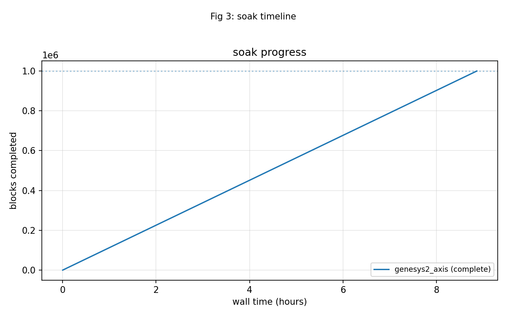

# Soak Results

## One million blocks on the AXIS image

The 2026-10-05 soak ran the `genesys2_axis` image on board serial
`200300B818A0`. Final counters from `stable/results/2026-10-05_soak/battery.json`:

| Metric | Value |
|--------|-------|
| blocks_final | 1,000,000 |
| wall_s | 31,910 |
| blk_per_s | 31.0 |
| clean | 111,957 |
| corrected | 768,922 |
| uncorrectable | 119,121 |
| bits_corrected | 3,119,679 |
| failing_runs | 0 |
| over_t_blocks | 74,560 |
| misdecoded | 0 |
| misdecode_rate | 0.00e+00 (1 in 74,560) |

: Table 4.1: BCH soak final counters.

The confidence statement is:

> 1,000,000 blocks, 0 mis-decodes, 74,560 over-t blocks all flagged,
> 3,119,679 bits corrected, 8h52m at 31 blk/s UART-bound.

## Soak timeline

### Figure 4.1: BCH soak timeline over one million blocks.

## What 31 blk/s means

The codec itself can run at roughly 500k blocks per second at 100 MHz. The
soak measured 31 blocks per second because the host poll loop, running over a
115200-baud UART, is the bottleneck. That is not a hardware limit; it is a
fixture limit. Any future soak that wants to go deeper or faster should size
the host interaction accordingly, or move to a faster host interface, rather
than inferring decoder throughput from the soak rate.
